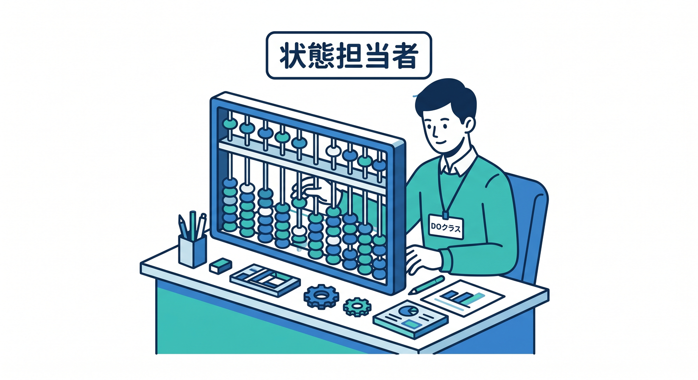
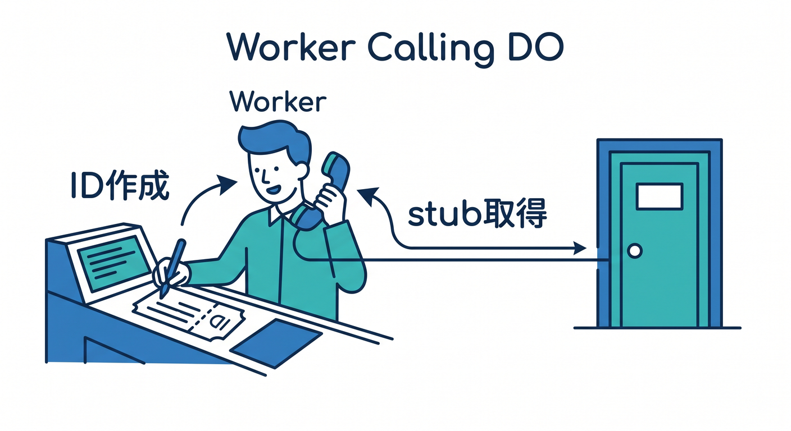
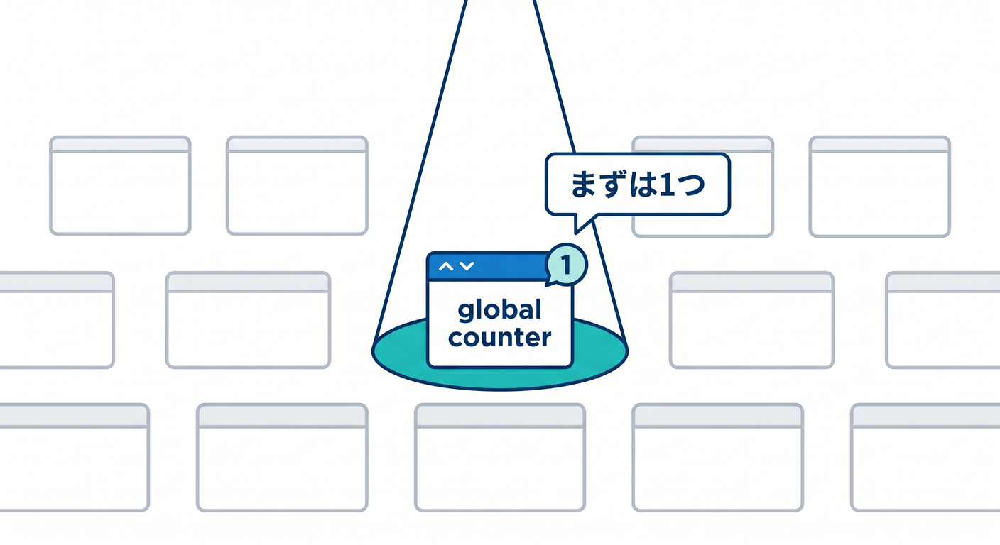
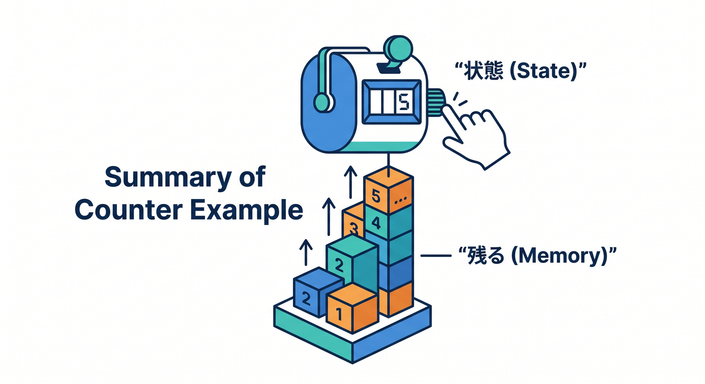

# 第05章：最初のCounter Durable Object 🔢

最初は小さく、アクセスするたびに数字が増えるCounterを作ります。  
状態が1か所に集まる感覚をつかむには、Counterがとても分かりやすいです 😊

---

## 1. Counterクラスを作る 🧵

Durable Objectクラスは、状態を持つ担当者です。



```ts
export class Counter extends DurableObject<Env> {
  async increment(): Promise<number> {
    this.ctx.storage.sql.exec(
      "CREATE TABLE IF NOT EXISTS counter (id INTEGER PRIMARY KEY, value INTEGER)",
    );

    const row = this.ctx.storage.sql
      .exec<{ value: number }>("SELECT value FROM counter WHERE id = 1")
      .one();

    const next = (row?.value ?? 0) + 1;

    this.ctx.storage.sql.exec(
      "INSERT OR REPLACE INTO counter (id, value) VALUES (1, ?)",
      next,
    );

    return next;
  }
}
```

先にテーブルを作ってから読むので、初回アクセスでもエラーになりにくいです。

---

## 2. Workerから呼び出す 🚪

Worker側ではIDを作り、stubを取得します。



```ts
export default {
  async fetch(request, env): Promise<Response> {
    const id = env.COUNTER.idFromName("global");
    const counter = env.COUNTER.get(id);
    const value = await counter.increment();

    return Response.json({ value });
  },
} satisfies ExportedHandler<Env>;
```

`global` という名前にしたので、同じCounterへアクセスします。

---

## 3. 最初は1つのIDでよい ✅

学習では、まず1つのIDで動かします。



```text
/api/count → global counter
```

慣れてきたら、ユーザーIDや部屋IDごとに分けます。

---

## 4. Copilotに聞く例 🤖

VS Codeで迷ったら、Copilotにこう聞けます。


```text
Cloudflare Durable ObjectsでSQLite-backedのCounterを作っています。
初回アクセス時にテーブルを作り、incrementメソッドで値を増やすTypeScript例に直してください。
```

答えをそのまま信じず、公式ドキュメントと型エラーで確認します。

---

## 5. 章末チェック ✅

- DOクラスに状態操作を書くと分かる
- WorkerからIDとstubでDOを呼ぶと分かる
- 同じ名前なら同じCounterへつながると分かる
- 小さなCounterで状態管理を体験できる
- Copilotへ具体的に質問できる

この章で覚える一言はこれです。  
**Counterは、Durable Objectsの“状態が残る”感覚をつかむ最初の題材です 🔢**


