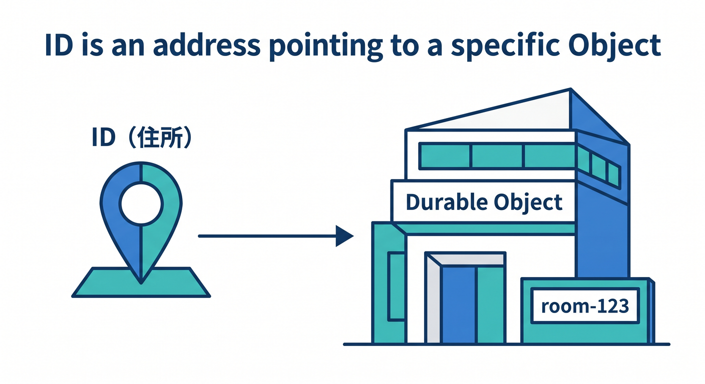
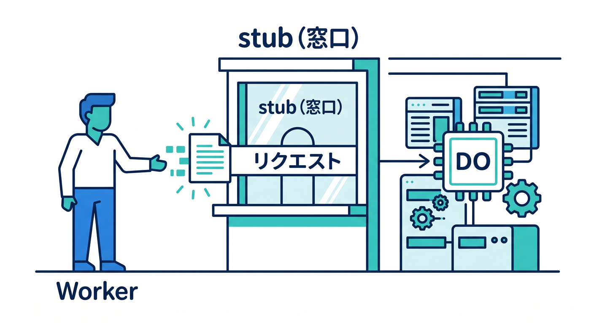
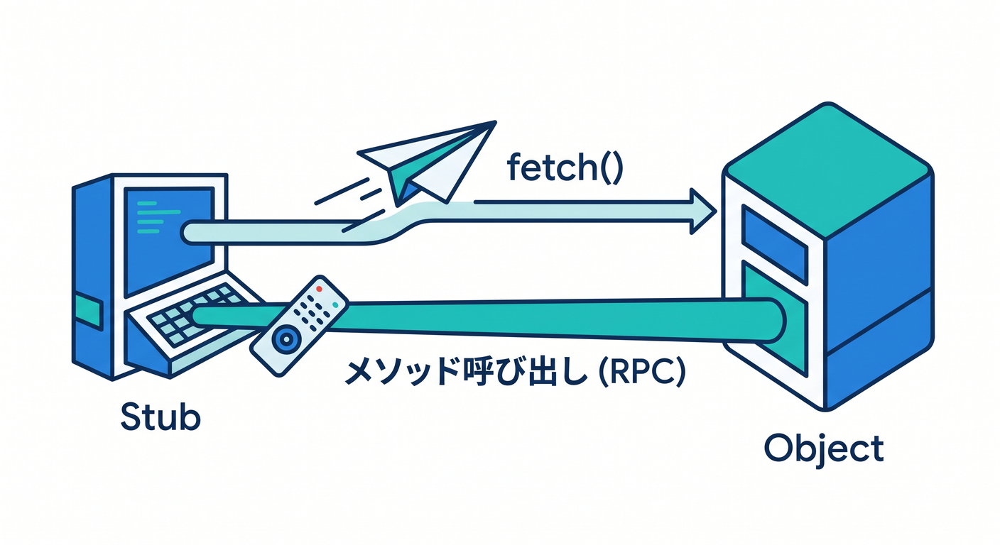
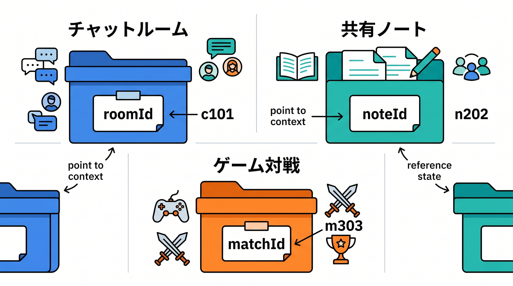
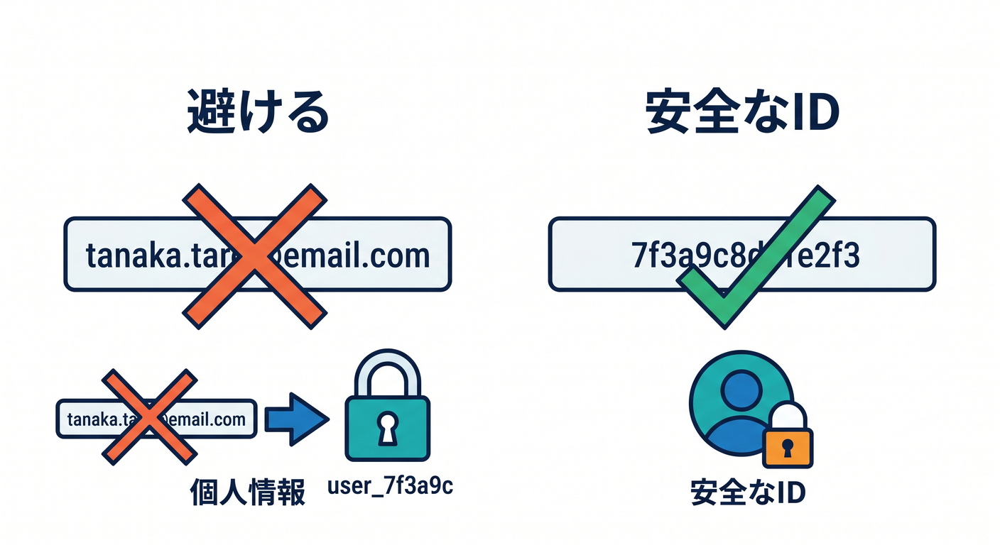

# 第06章：IDとstubを理解しよう 🪪

Durable Objectsでは、IDとstubがとても大切です。  
この2つが分かると、「どの状態をどこへ集めるか」を設計できるようになります。

---

## 1. IDはObjectの住所 🏷️

IDは、どのDurable Objectへつなぐかを決める住所のようなものです。

```ts
const id = env.CHAT_ROOM.idFromName("room-123");
```



`room-123` という名前から、安定したIDを作ります。  
同じ名前なら同じObjectへつながります。

---

## 2. stubは窓口 📞

IDだけでは呼び出せません。  
`get(id)` でstubを取ります。

```ts
const stub = env.CHAT_ROOM.get(id);
```



このstubを通して、DOへリクエストやRPCを送ります。

```ts
const result = await stub.fetch("https://room/messages");
```



RPCを使う場合は、public methodを直接呼ぶ形にもできます。

---

## 3. ID名の決め方 🧭

ID名はアプリの設計そのものです。

```text
chat room → roomId
shared note → noteId
game match → matchId
AI job → jobId
user session → sessionId
```



同じ状態を共有したいものを、同じIDに集めます。

---

## 4. 個人情報に注意 🔐

メールアドレスや本名を、そのままID名にするのは避けます。

```text
避けたい: user-taro@example.com
よい例: user_7f3a9c
```



ログや設定に残る可能性も考えて、扱いやすく安全なID名にします。

---

## 5. 章末チェック ✅

- IDはObjectを選ぶ住所だと分かる
- `idFromName()` で安定したIDを作れる
- `get(id)` でstubを取得すると分かる
- ID設計がアプリ設計に直結すると分かる
- 個人情報をID名にしない意識を持てる

この章で覚える一言はこれです。  
**IDで担当Objectを選び、stubで話しかけます 🪪**
