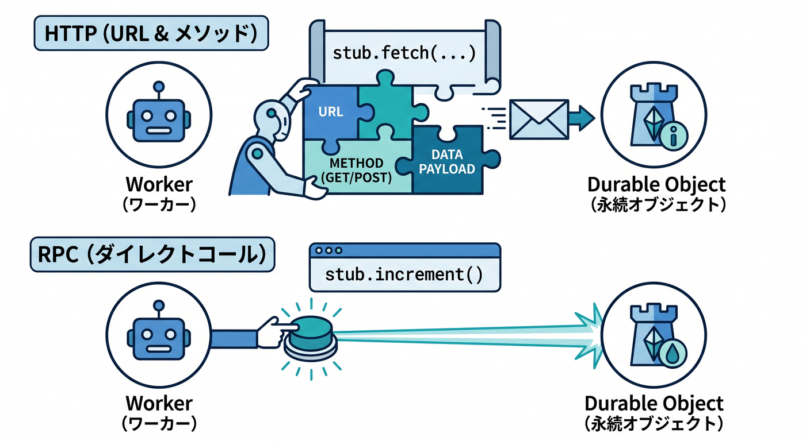
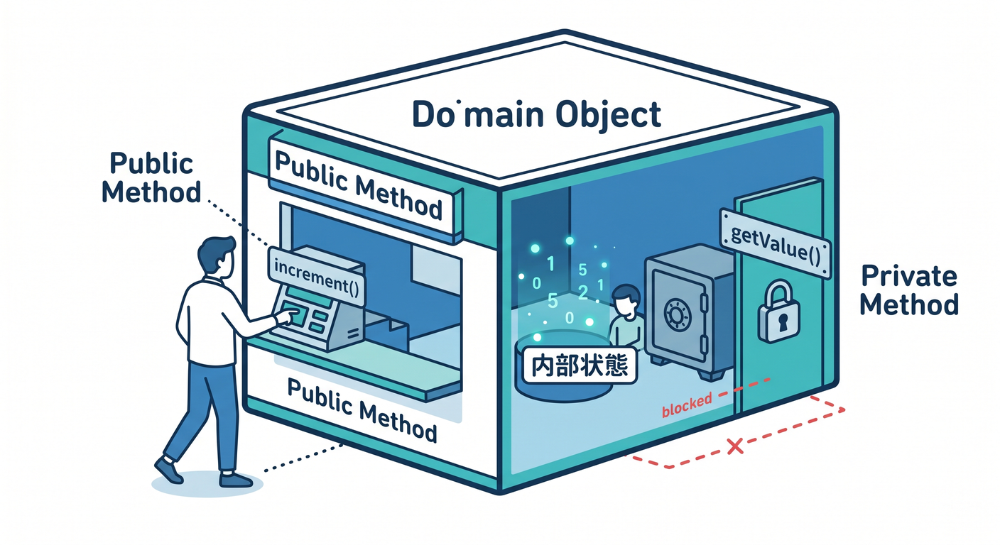
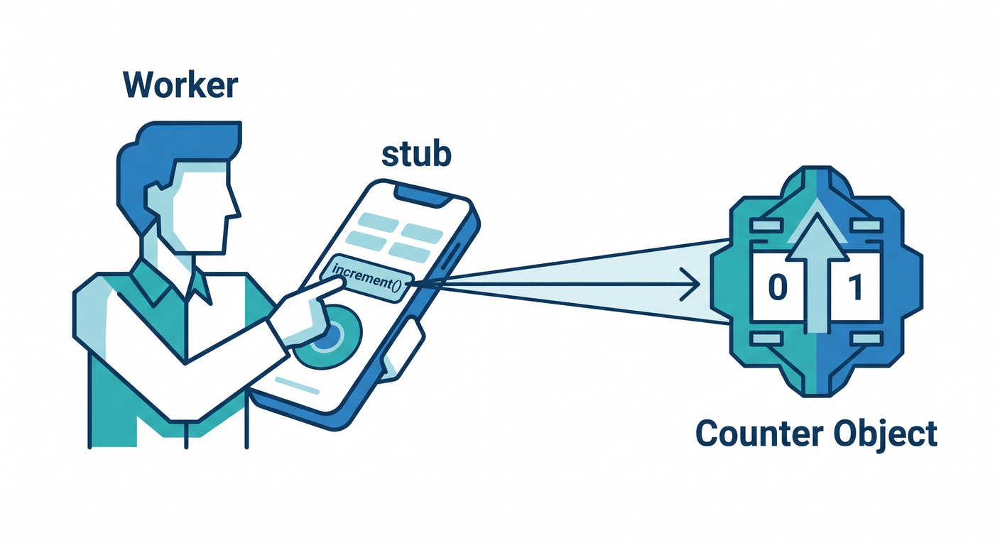
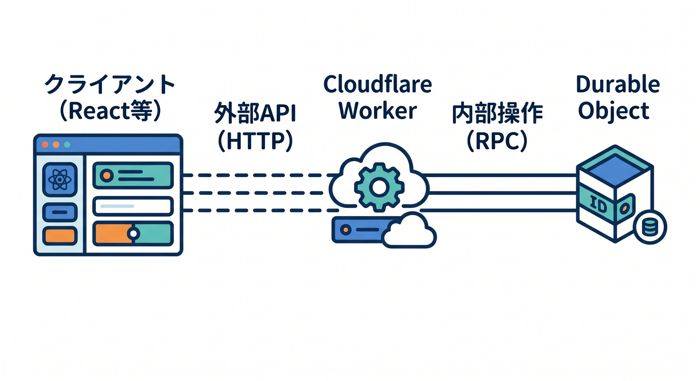
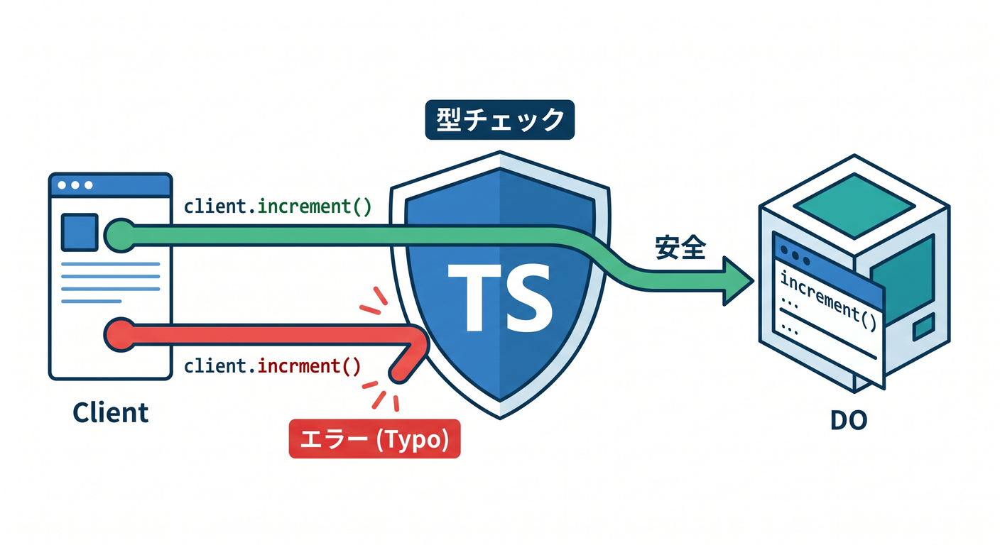

# 第07章：RPCでメソッドを呼び出そう 📞

Durable Objectsは、HTTPの `fetch()` だけでなくRPCでも呼び出せます。  
RPCを使うと、WorkerからDOのメソッドを自然に呼べます。

---

## 1. RPCのイメージ 🧩

HTTPだと、URLやメソッドを組み立てます。

```ts
await stub.fetch("https://room/increment", { method: "POST" });
```

RPCでは、public methodを呼ぶように書けます。

```ts
const value = await stub.increment();
```



内部処理としては、WorkerからDOへ処理をお願いしています。

---

## 2. DO側のメソッド 🧵

DOクラスにpublic methodを書きます。

```ts
export class Counter extends DurableObject<Env> {
  async increment(): Promise<number> {
    const current = await this.getValue();
    const next = current + 1;
    await this.setValue(next);
    return next;
  }

  private async getValue(): Promise<number> {
    return 0;
  }
}
```



外から呼びたいものだけをpublicにし、内部処理はprivateに寄せます。

---

## 3. Worker側の呼び出し 🚪

Worker側では、stubからメソッドを呼びます。

```ts
const id = env.COUNTER.idFromName("global");
const counter = env.COUNTER.get(id);
const value = await counter.increment();

return Response.json({ value });
```



TypeScriptの型が効くので、メソッド名の間違いにも気づきやすいです。

---

## 4. HTTPとRPCの使い分け 🧭

ざっくり分けるとこうです。

```text
外部公開API → WorkerのHTTP
Worker内部からDO操作 → RPC
WebSocket接続 → DOのfetchやWebSocket API
```



Reactから直接RPCを使うのではなく、ReactはWorker APIを呼ぶ形にします。

---

## 5. 章末チェック ✅

- RPCはDOのメソッドを呼ぶ感覚だと分かる
- public methodだけを外から呼べると分かる
- Workerからstub経由でRPCを使える
- 外部APIと内部DO操作を分けて考えられる
- TypeScriptの型が助けになると分かる



この章で覚える一言はこれです。  
**RPCは、WorkerからDurable Objectへ型付きでお願いする方法です 📞**
