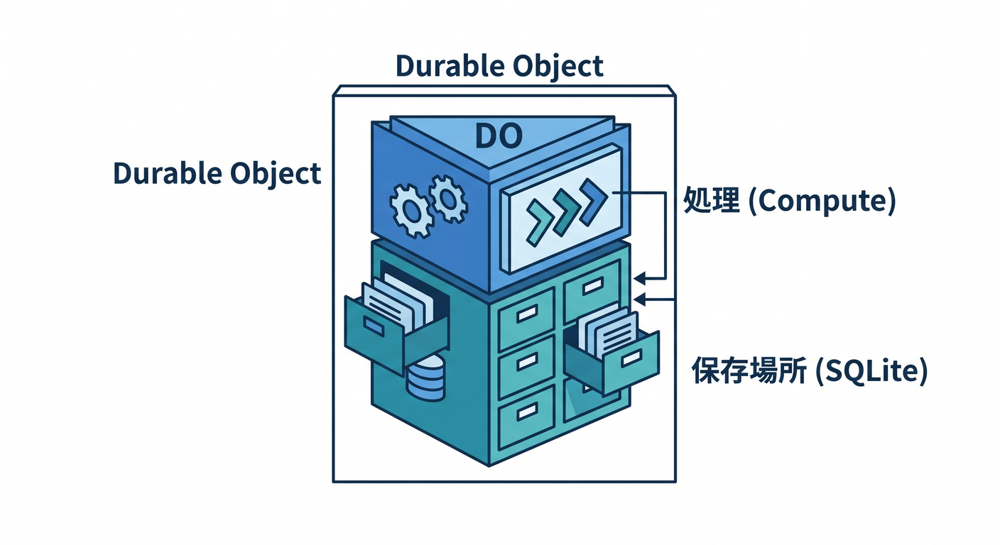
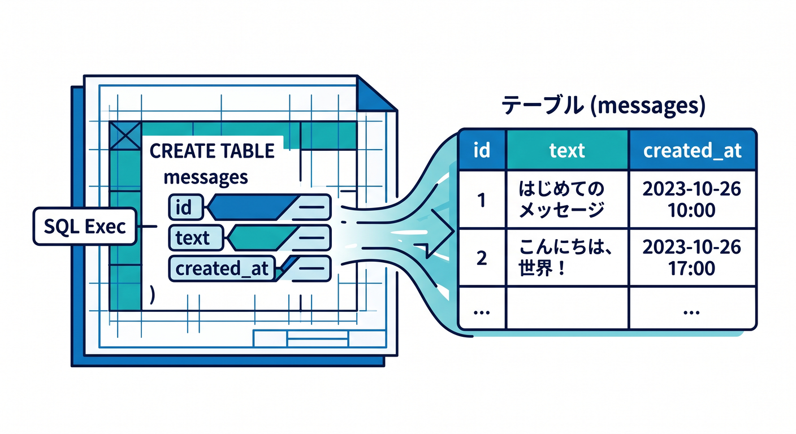
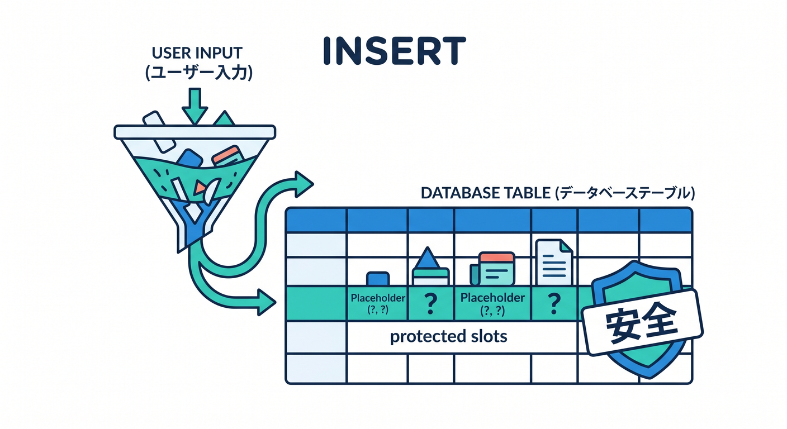
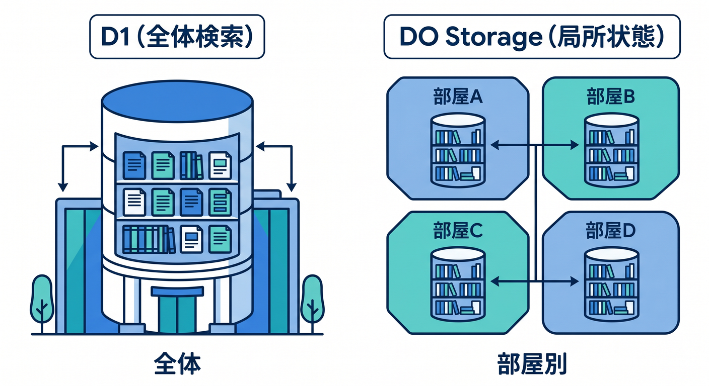
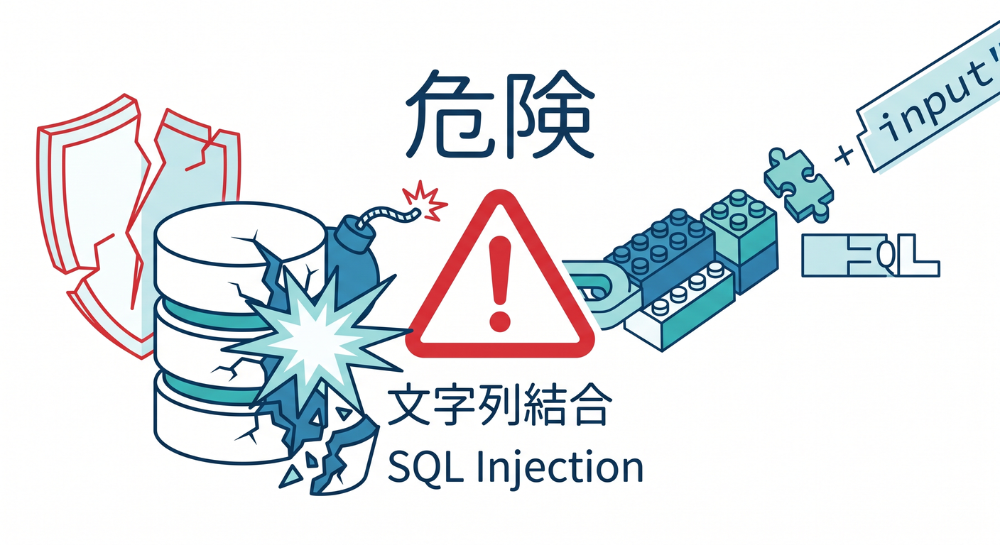

# 第08章：SQLite-backed Storageを使おう 🗄️

Durable Objectsは、状態をメモリだけでなくstorageにも保存できます。  
2026-04-24時点の公式ドキュメントでは、新しいDurable ObjectクラスにはSQLite-backed storageが推奨されています。

---

## 1. DOのstorageとは 🧠

DOのstorageは、そのObjectに近い保存場所です。  
部屋ごとの設定や、短い履歴、現在の状態を保存できます。

```text
room-123 Durable Object
  ├─ 処理
  └─ storage
```



「処理する場所」と「保存する場所」が近いのが特徴です。

---

## 2. SQLiteを使う 🗄️

SQLite-backed DOでは、SQLで保存できます。

```ts
this.ctx.storage.sql.exec(`
  CREATE TABLE IF NOT EXISTS messages (
    id INTEGER PRIMARY KEY AUTOINCREMENT,
    text TEXT NOT NULL,
    created_at TEXT NOT NULL
  )
`);
```



小さな表をObjectごとに持てるイメージです。

---

## 3. データを追加する ✍️

メッセージを保存する例です。

```ts
async addMessage(text: string): Promise<void> {
  this.ctx.storage.sql.exec(
    "INSERT INTO messages (text, created_at) VALUES (?, ?)",
    text,
    new Date().toISOString()
  );
}
```



ユーザー入力はSQL文字列へ直接つなげず、placeholderを使います 🔐

---

## 4. D1との違い 🗺️

D1とDO内SQLiteは、使いどころが違います。

```text
D1 → アプリ全体で検索・集計したい表データ
DO storage → そのObjectに近い状態や履歴
```



チャットなら、今の部屋状態はDO、全体検索や管理画面はD1、という分け方もあります。

---

## 5. 章末チェック ✅

- DOにstorageがあると分かる
- 新しいDOではSQLite-backed storageが推奨だと分かる
- `ctx.storage.sql.exec()` の基本が分かる
- placeholderでSQL injectionを避けると分かる
- D1とDO storageを分けて考えられる



この章で覚える一言はこれです。  
**DOのSQLite storageは、そのObjectの近くにある小さな状態保存場所です 🗄️**
