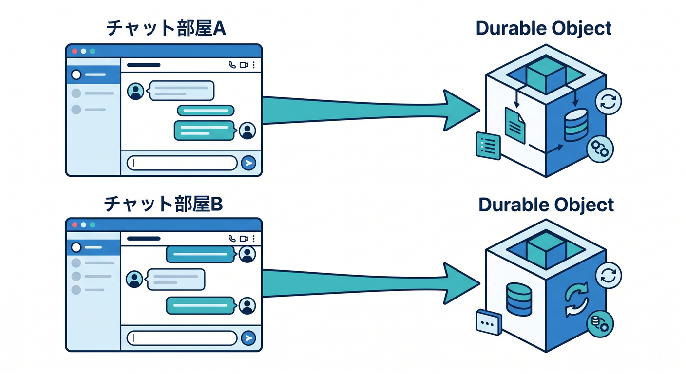
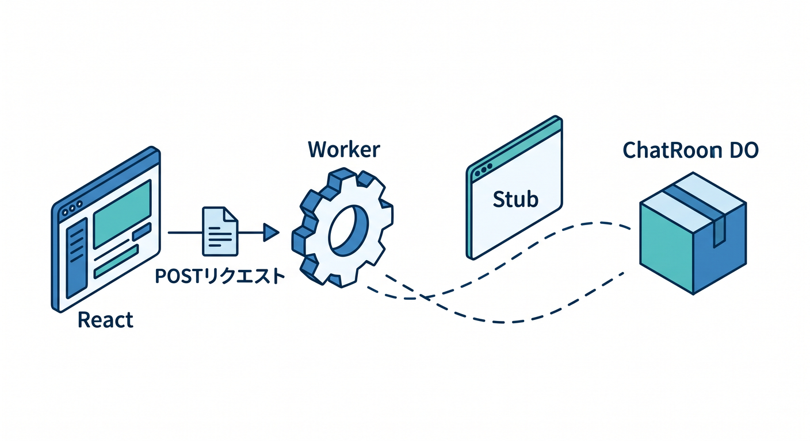
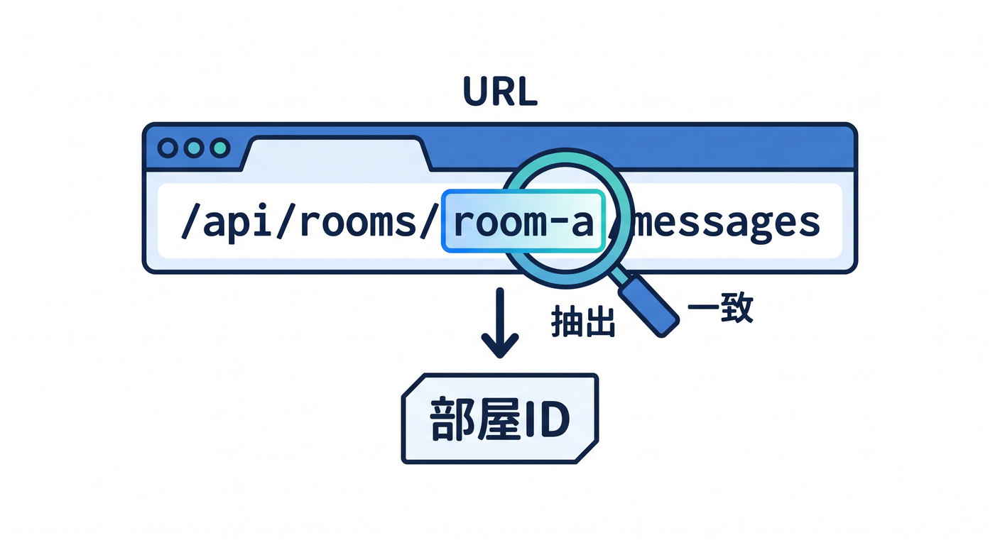
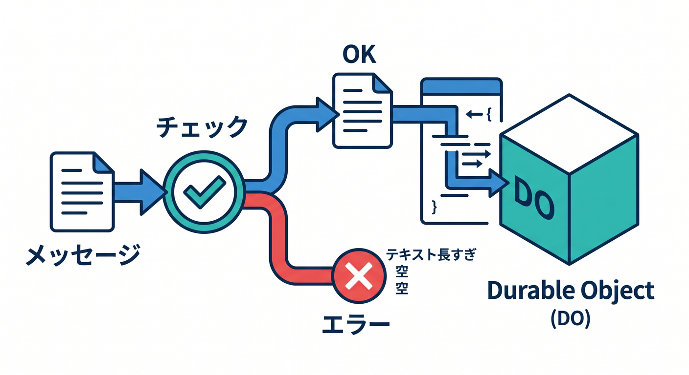
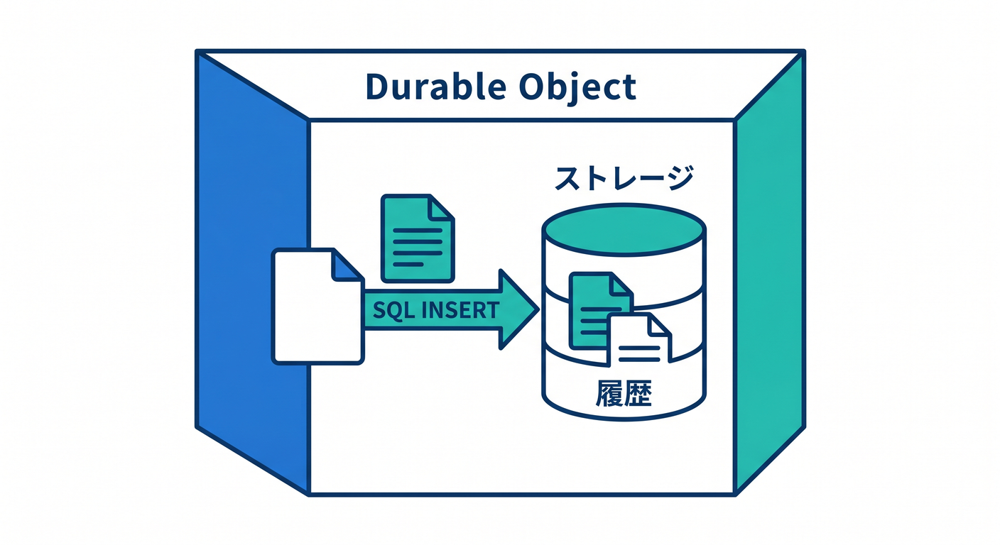

# 第09章：チャット部屋を作ってみよう 💬

Durable Objectsの代表的な題材がチャットです。  
部屋IDごとに状態を分けるので、DOの考え方と相性がよいです。



---

## 1. 全体構成 🧭

まずはHTTP APIで作ります。

```text
React
  ↓ POST /api/rooms/room-a/messages
Worker
  ↓ room-aのstub
ChatRoom Durable Object
```



WebSocketは次の段階で足します。  
最初は投稿と一覧取得だけで十分です。

---

## 2. Workerで部屋IDを読む 🚪

URLから部屋IDを取り出します。

```ts
const url = new URL(request.url);
const match = url.pathname.match(/^\/api\/rooms\/([^/]+)\/messages$/);

if (!match) {
  return new Response("Not found", { status: 404 });
}

const roomId = match[1];
const id = env.CHAT_ROOM.idFromName(roomId);
const room = env.CHAT_ROOM.get(id);
```



実際には、部屋IDに使える文字を制限します。

---

## 3. メッセージ投稿 ✍️

Workerで入力を確認して、DOへ渡します。

```ts
const body = await request.json<{ text?: string }>();

if (!body.text || body.text.length > 500) {
  return Response.json({ error: "Invalid text" }, { status: 400 });
}

await room.addMessage(body.text);
return Response.json({ ok: true });
```



長すぎる文章や空文字は受け付けないようにします。

---

## 4. DOで保存する 🗄️

DO側では、その部屋のstorageへ保存します。

```ts
async addMessage(text: string): Promise<void> {
  this.ctx.storage.sql.exec(
    "INSERT INTO messages (text, created_at) VALUES (?, ?)",
    text,
    new Date().toISOString()
  );
}
```



部屋ごとにObjectが分かれるので、`room-a` の履歴は `room-a` のDOが扱います。

---

## 5. 章末チェック ✅

- チャット部屋とDOの相性が分かる
- URLから部屋IDを取り出す流れが分かる
- Workerで入力チェックをする理由が分かる
- DOへメッセージ保存を任せる構成が分かる
- 最初はHTTP APIだけでも学習できると分かる


この章で覚える一言はこれです。  
**チャット部屋は、部屋IDごとのDurable Objectで考えると自然です 💬**
