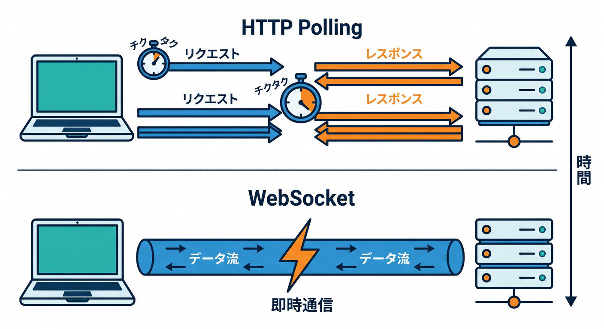
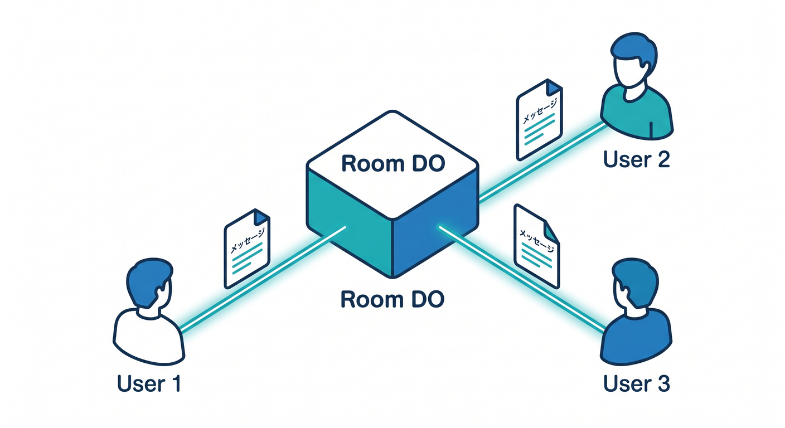
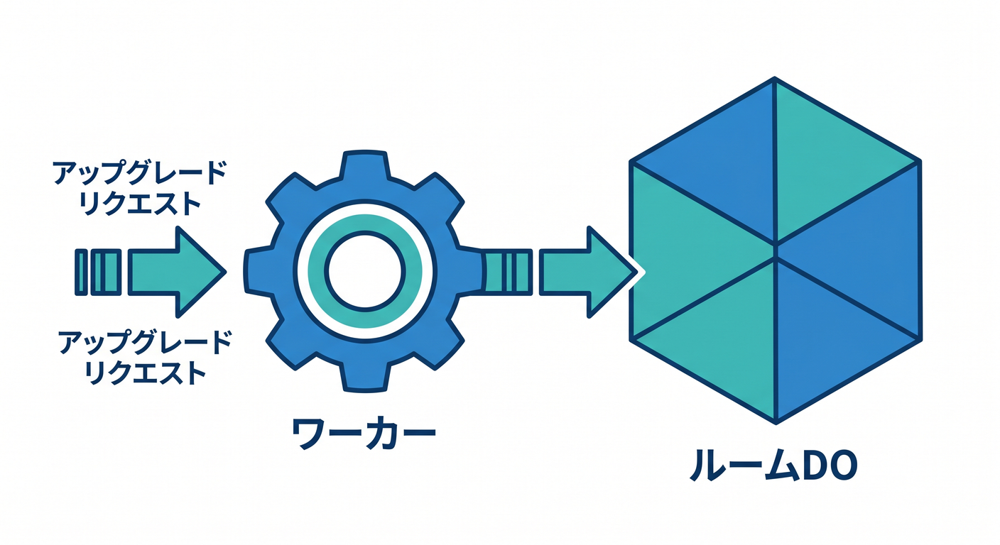
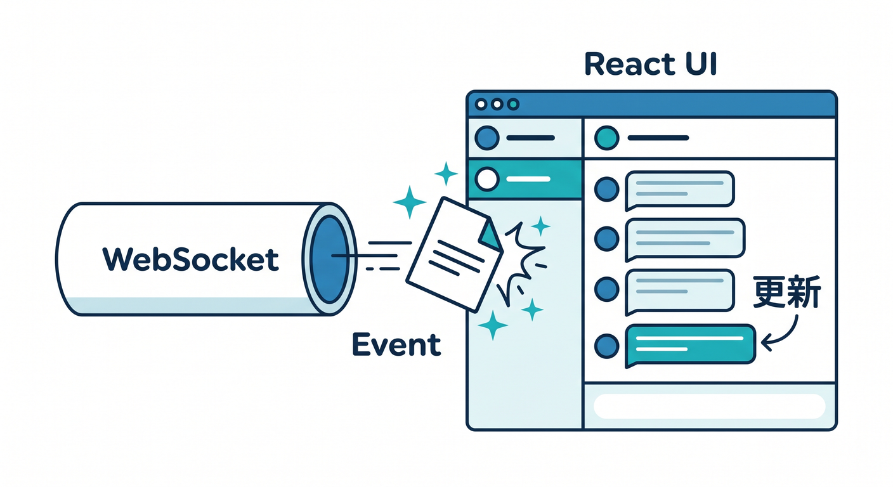
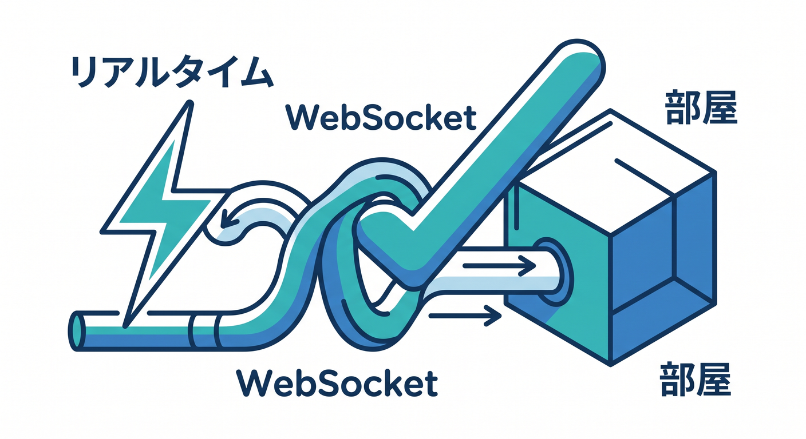

# 第10章：WebSocketでリアルタイム更新しよう ⚡

チャットや共同編集では、画面を自動で更新したくなります。  
そのときに使う代表的な仕組みがWebSocketです。

---

## 1. HTTPだけだと何が困る？ 🐢

HTTPだけでも、数秒ごとに取りに行けば更新できます。

```text
3秒ごとに /messages を fetch
```



でもこれは無駄な通信が増えます。  
新しいメッセージが来た瞬間に届けたいなら、WebSocketが向いています。

---

## 2. DOが接続を管理する 🧵

Durable Objectは、同じ部屋のWebSocket接続を管理できます。

```text
room-a Durable Object
  ├─ user1 socket
  ├─ user2 socket
  └─ user3 socket
```



誰かがメッセージを送ったら、同じ部屋の接続へ配信します。

---

## 3. WorkerでWebSocketを渡す 🌉

Workerで部屋IDを選び、DOへWebSocketリクエストを渡します。

```ts
if (request.headers.get("Upgrade") !== "websocket") {
  return new Response("Expected WebSocket", { status: 400 });
}

const id = env.CHAT_ROOM.idFromName(roomId);
const room = env.CHAT_ROOM.get(id);
return room.fetch(request);
```



WebSocketの細かい処理はDO側に寄せます。

---

## 4. React側のイメージ ⚛️

ReactではWebSocketを作り、受信したらstateを更新します。

```ts
const socket = new WebSocket("wss://example.com/api/rooms/room-a/live");

socket.addEventListener("message", (event) => {
  const message = JSON.parse(event.data);
  setMessages((current) => [...current, message]);
});
```



切断や再接続も後で考える必要があります。

---

## 5. 章末チェック ✅

- HTTP pollingの弱点が分かる
- WebSocketでリアルタイム更新できると分かる
- 部屋ごとの接続をDOが管理できると分かる
- WorkerからDOへWebSocketリクエストを渡せる
- React側で受信して画面更新する流れが分かる



この章で覚える一言はこれです。  
**WebSocketとDurable Objectsを組み合わせると、部屋ごとのリアルタイム更新を作れます ⚡**
