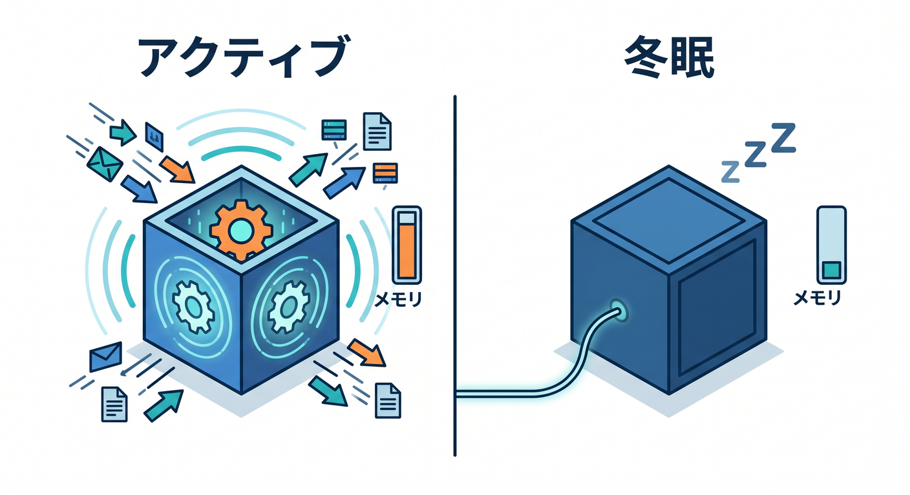
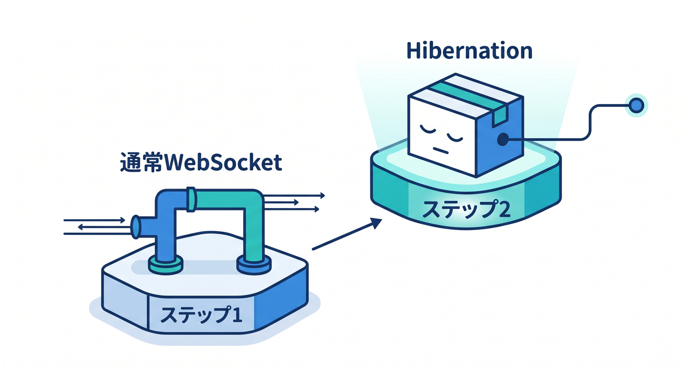
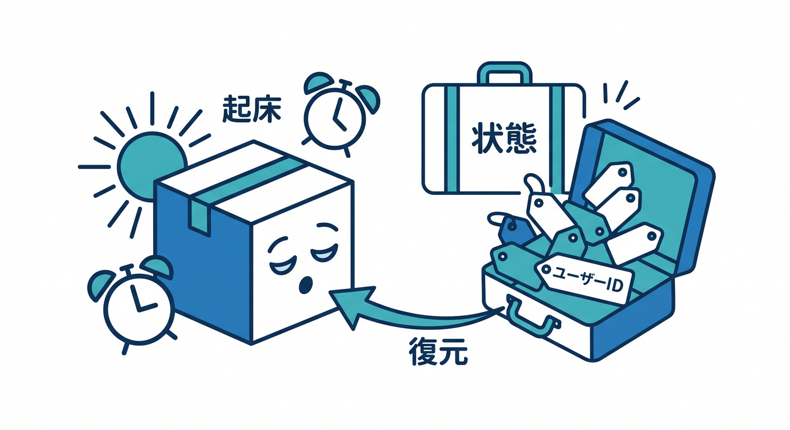
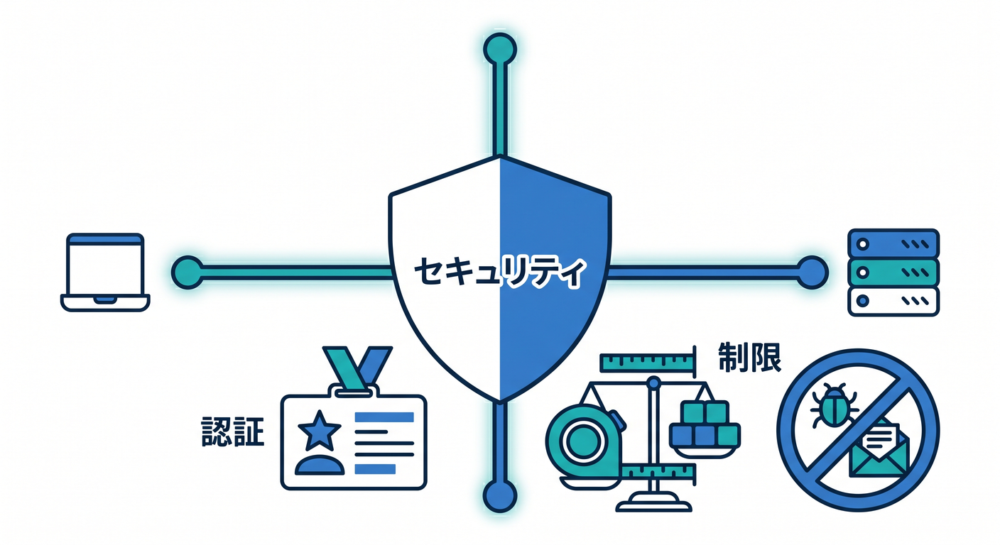
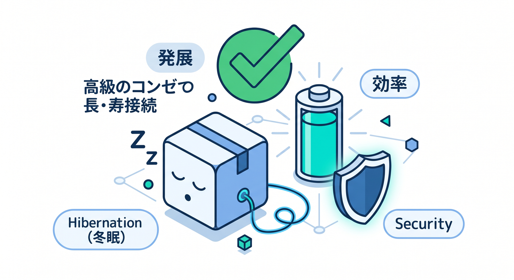

# 第11章：WebSocket Hibernationを知ろう 😴

WebSocketは便利ですが、長時間つなぎっぱなしの設計では効率も気になります。  
Cloudflare Durable Objectsには、WebSocket Hibernation APIがあります。

---

## 1. Hibernationとは 💤

hibernationは「冬眠」という意味です。  
WebSocket接続は残しつつ、イベントがない間はDOを休ませるようなイメージです。

```text
接続はある
でも何も起きていない
  ↓
DOを効率よく休ませる
```



チャットや通知のような長時間接続と相性があります。

---

## 2. 通常WebSocketとの違い 🧭

最初の学習では、通常のWebSocketで十分です。  
そのあと、接続数や運用コストを考える段階でhibernationを見ます。

```text
学習初期 → 通常WebSocket
本番設計・長時間接続 → Hibernationも検討
```



いきなり全部を理解しようとしなくて大丈夫です 😊

---

## 3. 何を保存しておく？ 🧳

休んでいるDOが起きたときに、必要な情報を復元できる設計が大切です。

- socketごとのユーザーID
- 部屋ID
- 権限
- 表示名
- 最終活動時刻



接続に関する情報をどう扱うかを決めます。

---

## 4. 注意すること 🔐

長時間接続では、安全面も大切です。

- 接続時に認証する
- 権限がない部屋へ入れない
- メッセージサイズを制限する
- 荒らし対策を入れる
- 切断時の後始末を考える



リアルタイム機能は楽しいですが、入口を広げすぎないようにします。

---

## 5. 章末チェック ✅

- WebSocket Hibernationの大まかな意味が分かる
- 通常WebSocketから学べばよいと分かる
- 長時間接続では効率が大切だと分かる
- 接続情報の扱いを考える必要があると分かる
- 認証やサイズ制限も必要だと分かる



この章で覚える一言はこれです。  
**Hibernationは、長時間WebSocketを効率よく扱うための発展機能です 😴**
