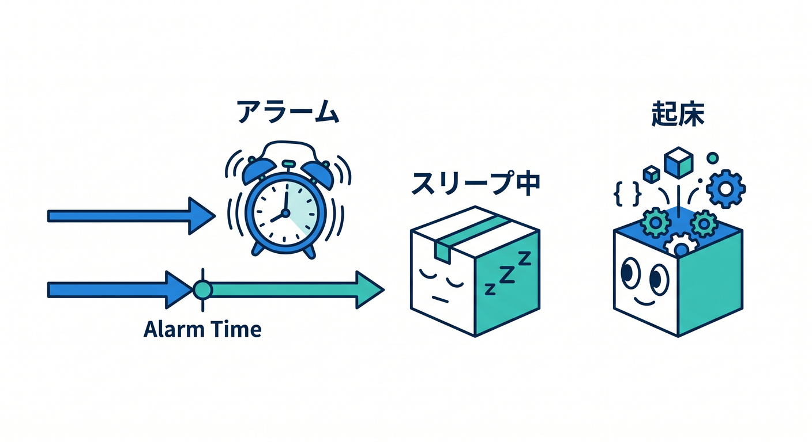
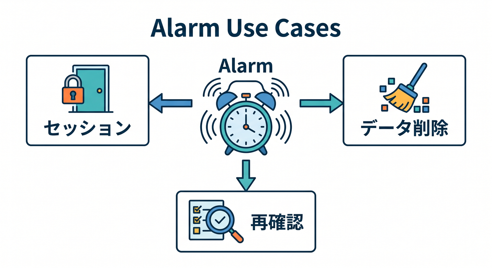
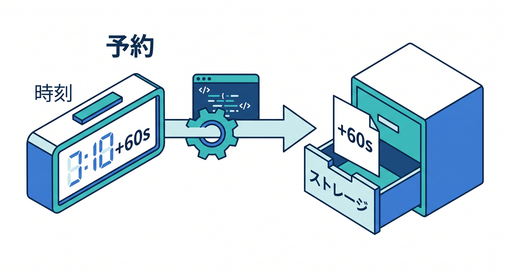
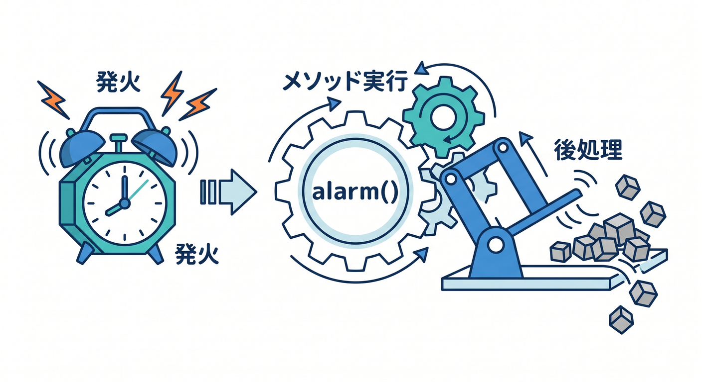
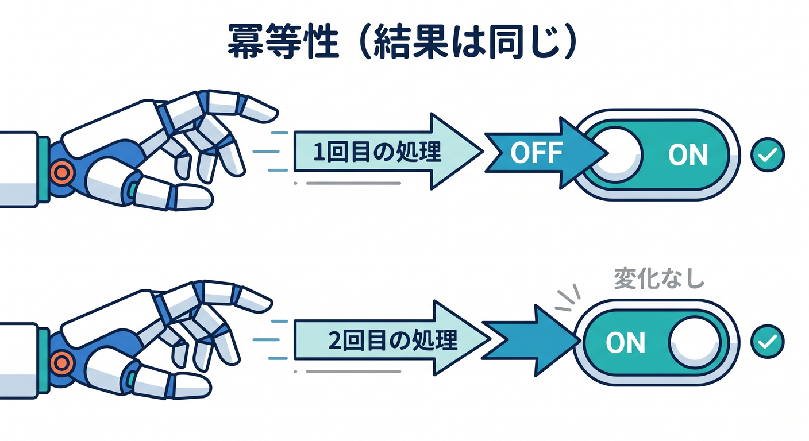
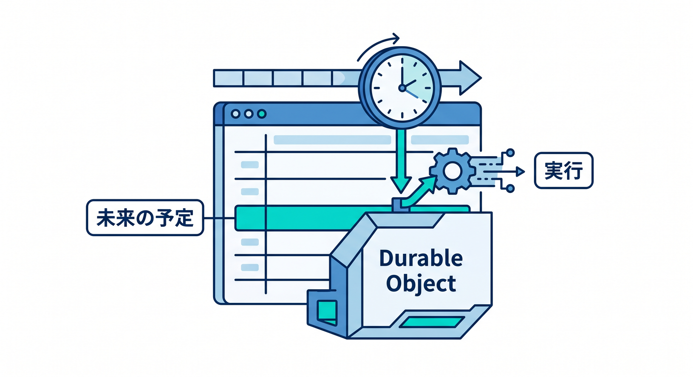

# 第12章：Alarmsであとから処理しよう ⏰

Durable ObjectsにはAlarmsという仕組みがあります。  
これは、指定した時刻にそのDurable Objectを起こして処理する機能です。



---

## 1. Alarmでできること 🔔

Alarmは、状態に近い小さな予約処理に向いています。

- 一定時間後に部屋を閉じる
- 古い一時データを消す
- AIジョブの状態を再確認する
- 期限切れセッションを整理する
- リマインダーを送る準備をする

「このObjectに関係する後処理」と考えると分かりやすいです。



---

## 2. Alarmをセットする ⏱️

DOのstorageからAlarmを設定できます。

```ts
const runAt = Date.now() + 60_000;
await this.ctx.storage.setAlarm(runAt);
```

この例では、約1分後にAlarmが起きます。



---

## 3. alarmメソッドで受ける 🧵

Durable Objectクラスに `alarm()` を書きます。

```ts
async alarm(): Promise<void> {
  await this.cleanupExpiredItems();
}
```

Alarmが来たら、必要な後処理を行います。



---

## 4. 冪等性を意識する 🧯

あとから実行される処理では、同じ処理がもう一度走っても壊れない設計が大切です。

```text
削除済みなら何もしない
送信済みなら再送しない
状態が変わっていたら処理をやめる
```

こういう設計を冪等性と呼びます。



---

## 5. 章末チェック ✅

- AlarmはDOを後で起こす機能だと分かる
- `setAlarm()` の基本が分かる
- `alarm()` メソッドで処理を受けると分かる
- 状態に近い予約処理に向くと分かる
- 冪等性が大事だと分かる

この章で覚える一言はこれです。  
**Alarmは、Durable Objectに“あとで自分の仕事をする”予定を入れる仕組みです ⏰**


