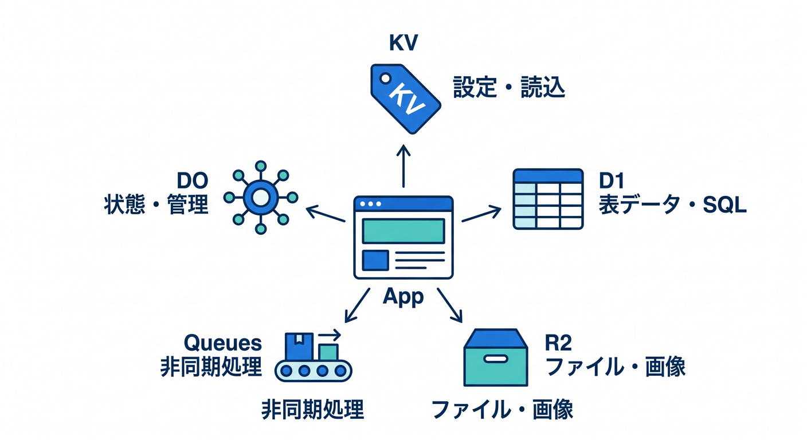
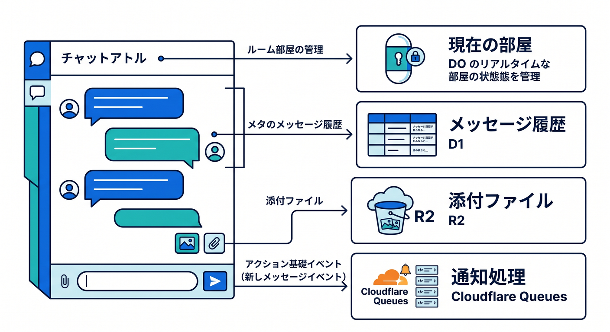
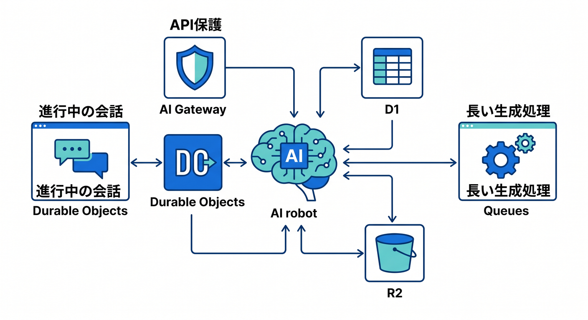
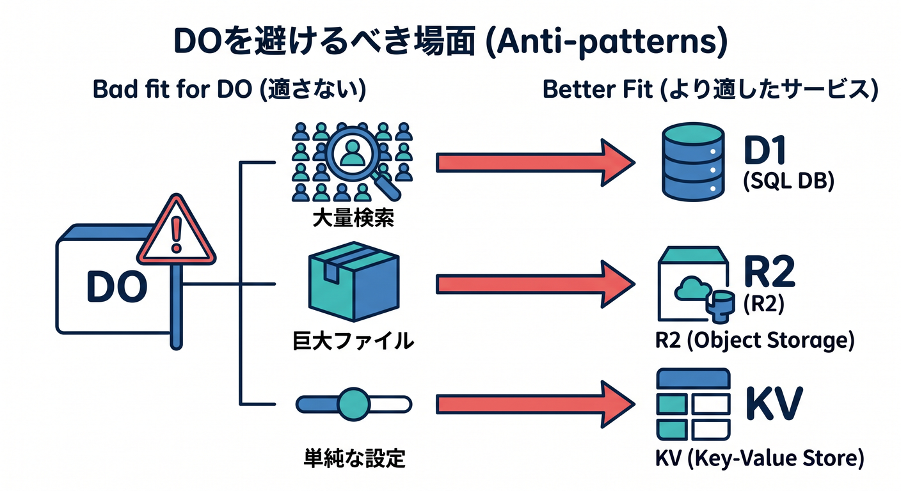
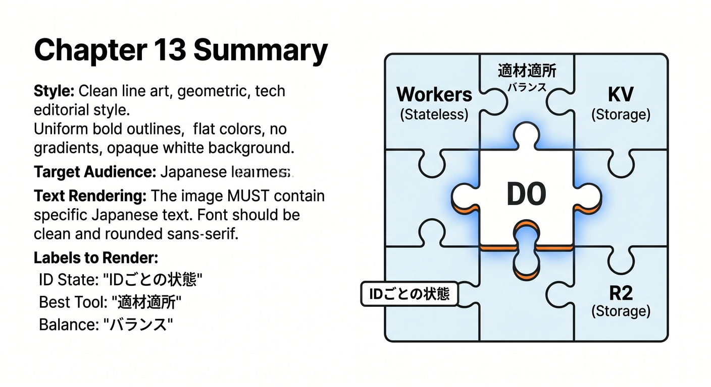

# 第13章：D1・KV・R2・Queuesとの使い分け 🗺️

Durable Objectsを覚えると、何でもDOで作りたくなるかもしれません。  
でもCloudflareには、それぞれ得意分野が違う保存先や処理基盤があります。

---

## 1. ざっくり地図 🧭

まずは使い分けを表で見ます。

```text
KV  → 軽い設定、読み取りが多いデータ
D1  → SQLで扱う表データ
R2  → 画像、PDF、ログなどのファイル本体
Queues → あとで処理する仕事
DO  → 同じIDの状態を1か所で管理したい処理
```

DOは万能箱ではなく、状態管理の担当です。



---

## 2. チャットの場合 💬

チャットなら、こう分けられます。

```text
現在の部屋状態 → Durable Object
長期保存するメッセージ検索 → D1
添付画像 → R2
通知送信 → Queues
機能フラグ → KV
```

1つのサービスに全部詰め込まないのがコツです。



---

## 3. AIアプリの場合 🤖

AIチャットや生成アプリでも、分けて考えます。

```text
進行中の会話ルーム → Durable Object
会話履歴の検索 → D1
生成した画像やPDF → R2
長い生成処理 → Queues
外部AI API保護 → AI Gateway
```

DOは「今この会話で何が起きているか」を扱う場所として使えます。



---

## 4. DOを避ける場面 🛑

次のような用途では、別サービスを先に考えます。

- 全ユーザー横断で大量検索したい
- 大きなファイルを保存したい
- 単純な設定値を読むだけ
- 長いバッチ処理を安定して流したい

こうした場合はD1、R2、KV、Queuesのほうが自然です。



---

## 5. 章末チェック ✅

- DOは万能ではないと分かる
- KV、D1、R2、Queuesとの違いが分かる
- チャットでの分担を説明できる
- AIアプリでの分担を説明できる
- 状態管理が必要な場所だけDOを使える

この章で覚える一言はこれです。  
**Durable Objectsは、“同じIDの状態をまとめたい場所”に使います 🗺️**


