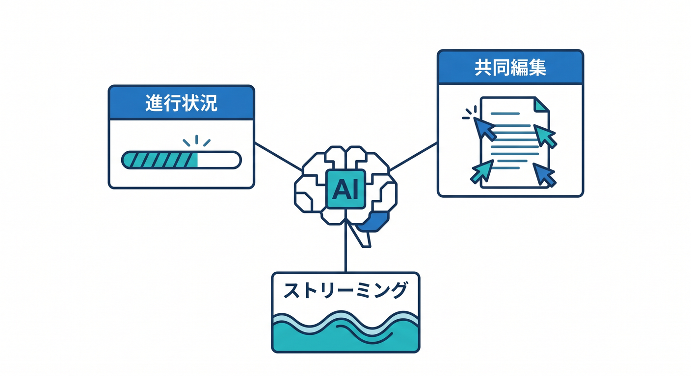
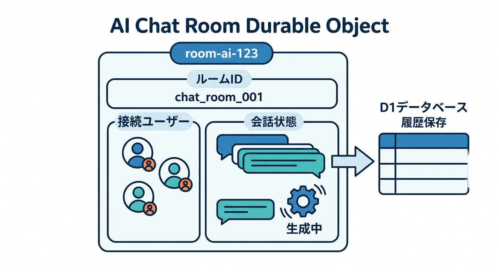
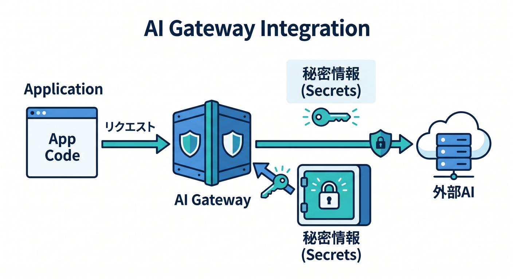
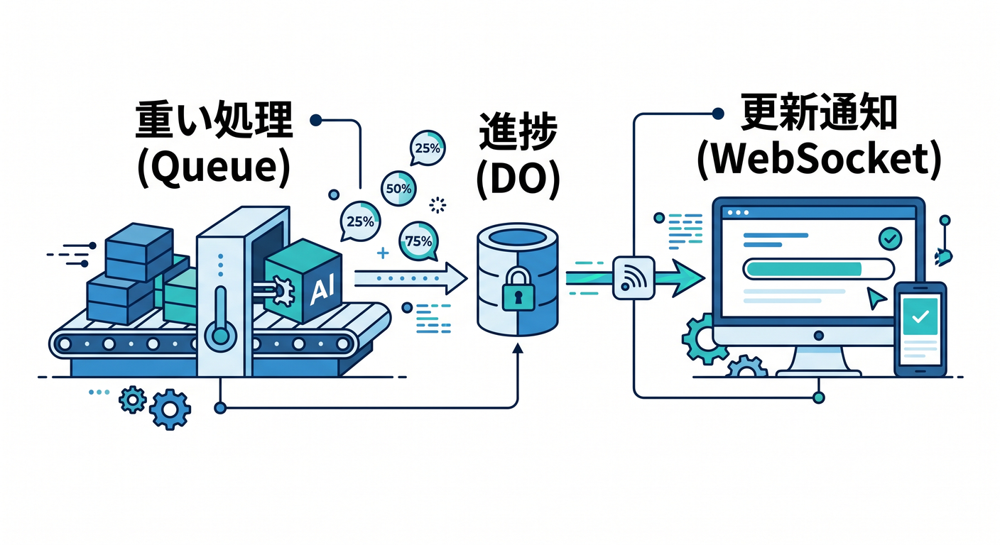
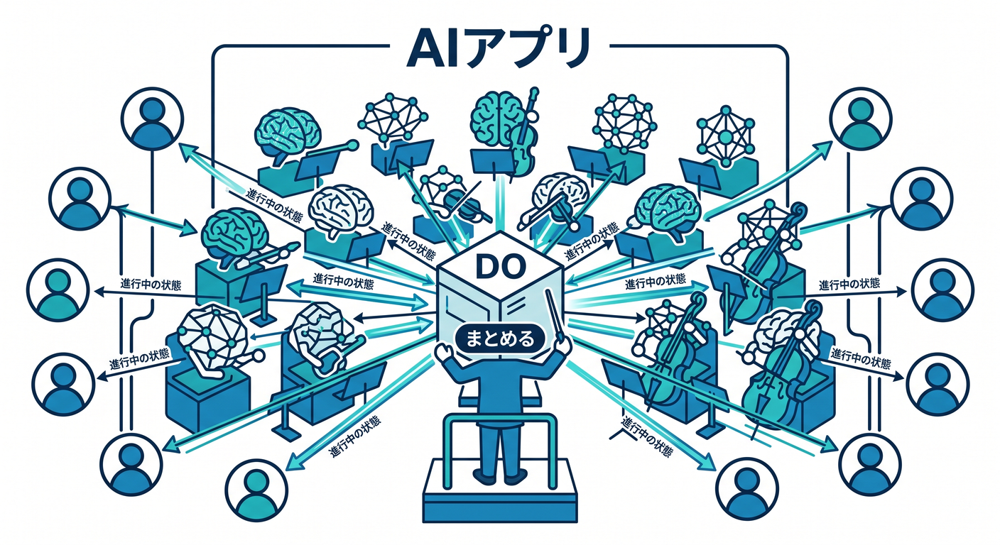

# 第14章：AIアプリとDurable Objects 🤖

Durable Objectsは、AIアプリでも役に立ちます。  
特に「今進んでいる処理」や「同じ部屋の会話状態」を扱う場面と相性があります。

---

## 1. AIアプリで状態が必要な場面 🧵

AIアプリでは、次のような状態が出てきます。

- チャットルームの現在の会話
- 生成ジョブの進行状況
- 共同プロンプト編集
- 複数人で見るAI回答
- ストリーミング中の一時状態

これらは「今どうなっているか」が大切です。



---

## 2. AIチャット部屋 💬

AIチャットを部屋単位にすると、DOで管理しやすくなります。

```text
room-ai-123 Durable Object
  ├─ 接続中ユーザー
  ├─ 現在の会話状態
  └─ 生成中フラグ
```

長期保存や検索が必要な会話履歴は、D1へ保存する設計も考えます。



---

## 3. AI Gatewayと組み合わせる 🔐

外部AI APIを使う場合は、AI Gatewayを入口にすると観測や制御がしやすくなります。  
ただし、APIキーはSecretsへ置きます。

```text
Worker / DO
  ↓
AI Gateway
  ↓
AI provider
```

DO storageへ秘密情報を保存しないようにします。



---

## 4. 進行状況をリアルタイム表示 ⚡

画像生成や長めのAI処理では、ユーザーに進行状況を見せたくなります。

```text
Queuesで重い処理
  ↓
DOへ進行状況を反映
  ↓
WebSocketでReactへ通知
```

DOは「今の状態を画面へ届ける」役にできます。



---

## 5. 章末チェック ✅

- AIアプリにも状態管理が必要だと分かる
- 会話ルームや生成ジョブにDOを使えると分かる
- APIキーはSecretsに置くと分かる
- AI Gatewayと組み合わせる発想が分かる
- WebSocketで進行状況を届ける設計が分かる

この章で覚える一言はこれです。  
**AIアプリでは、Durable Objectsを“進行中の状態をまとめる場所”として使えます 🤖**


