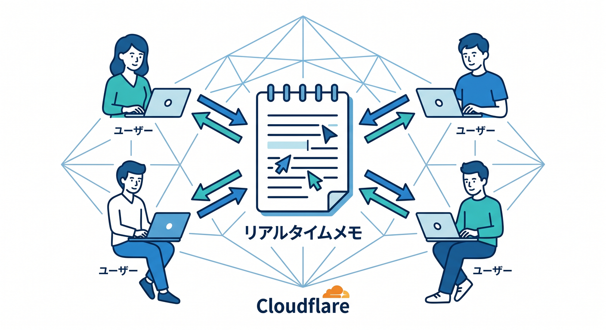
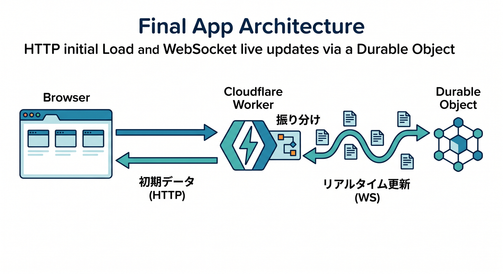
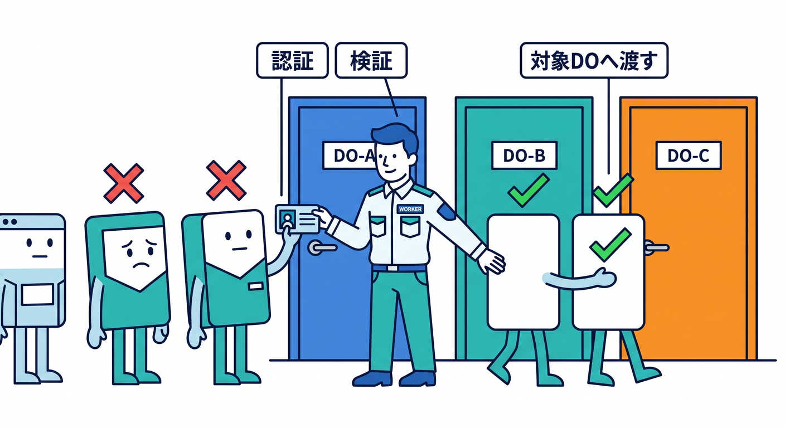
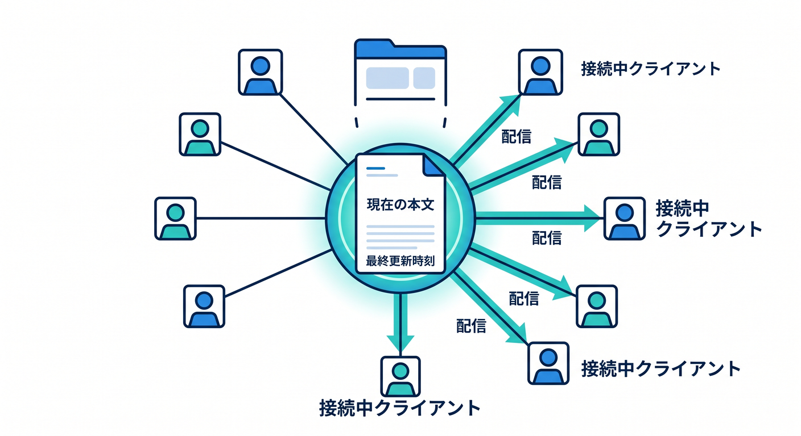
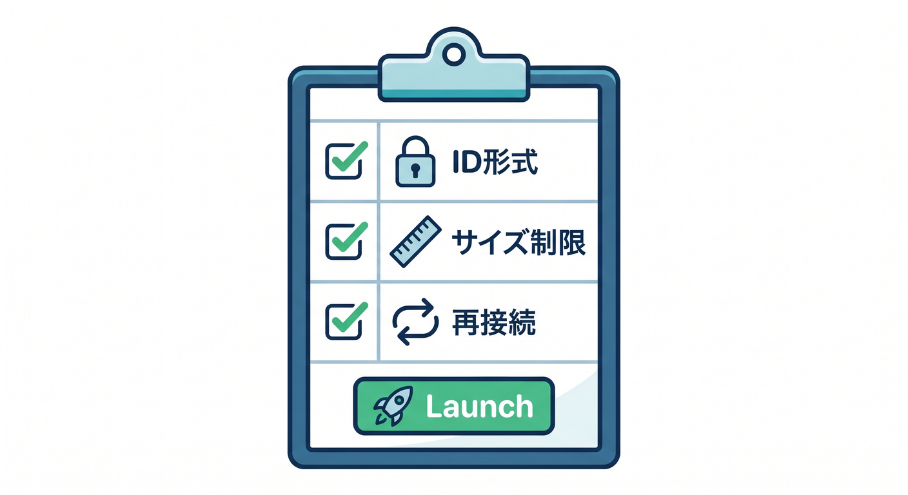

# 第15章：小さなリアルタイムメモアプリを完成させよう 📝

最後は、ここまで学んだ内容を小さなアプリにまとめます。  
題材は、同じURLを開いた人が同じメモを編集できるリアルタイムメモです。



---

## 1. 完成イメージ 🧭

構成はこうです。

```text
React
  ↓ HTTPで初期メモ取得
Worker
  ↓ noteIdでDOを選ぶ
LiveNote Durable Object
  ↓ WebSocketで更新配信
React
```

メモIDごとに1つのDOを使います。



---

## 2. Workerの役割 🚪

Workerは外向きの入口です。

- `/api/notes/:id` で初期データを返す
- `/api/notes/:id/live` でWebSocket接続を受ける
- note IDの形式をチェックする
- 認証やRate Limitingを入れる
- 対応するDOへ処理を渡す

外から来るリクエストはWorkerで必ず確認します。



---

## 3. Durable Objectの役割 🧵

LiveNote DOは、そのメモの状態を管理します。

- 現在の本文
- 最終更新時刻
- 接続中socket
- 更新イベントの配信
- 必要ならstorageへの保存

同じメモIDの操作が1つのDOへ集まるので、整理しやすくなります。



---

## 4. 本番前チェック 🔐

公開前には、次を確認します。

- note IDに使える文字を制限したか
- 認証が必要なメモを誰でも見られないか
- WebSocketの再接続を考えたか
- 入力サイズ制限を入れたか
- Durable Objectsのlimitsと料金を確認したか
- ログに個人情報や秘密情報を出していないか

リアルタイム機能は便利なぶん、入口の管理が大切です。



---

## 5. Copilotレビュー例 🤖

実装後、Copilotにこう聞いてレビューできます。

```text
Cloudflare Workers + Durable Objects + WebSocketでリアルタイムメモを作りました。
入力チェック、認証、接続管理、storage保存、例外処理の観点で危ない点をレビューしてください。
```

AIの指摘は参考にしつつ、公式ドキュメントと自分のコードで確認します。


---

## 6. 章末チェック ✅

- React + Worker + DOの全体構成を説明できる
- メモIDごとにDOを分ける理由が分かる
- HTTPとWebSocketの役割を分けられる
- 本番前に確認すべき安全面が分かる
- Durable Objectsで状態のあるアプリを作る流れが分かる

この章で覚える一言はこれです。  
**Durable Objectsを使うと、リアルタイムで状態を持つ小さなアプリをWorkers上に作れます 📝**


