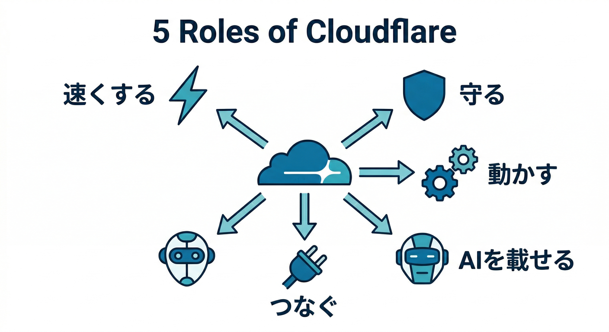
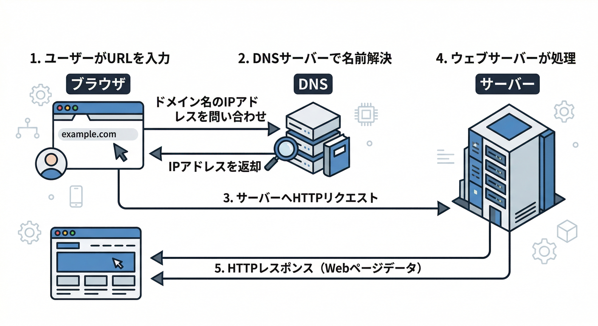
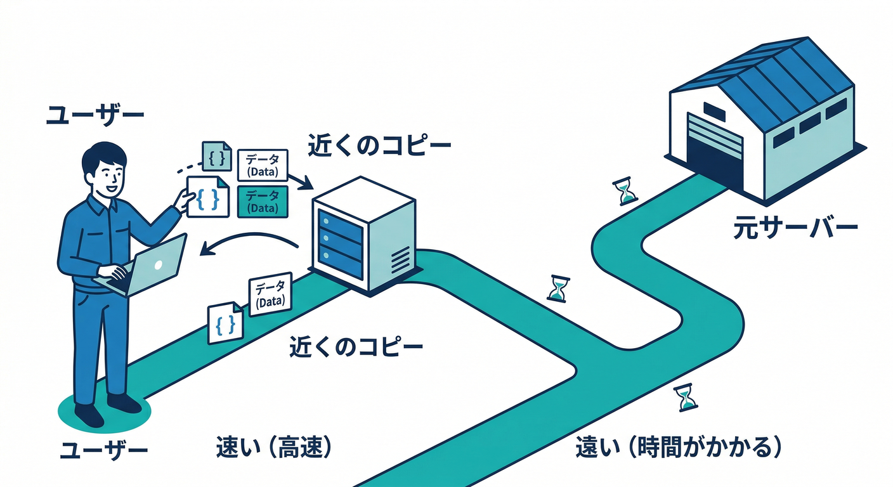
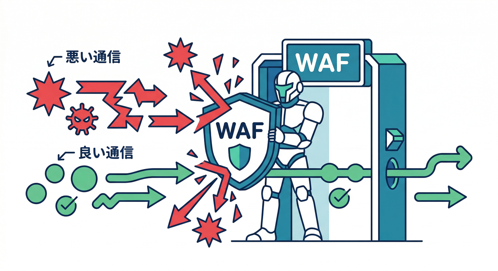
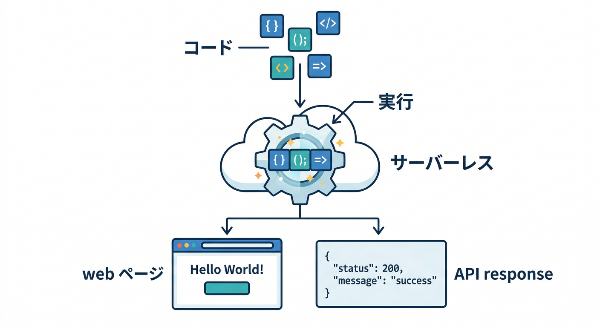
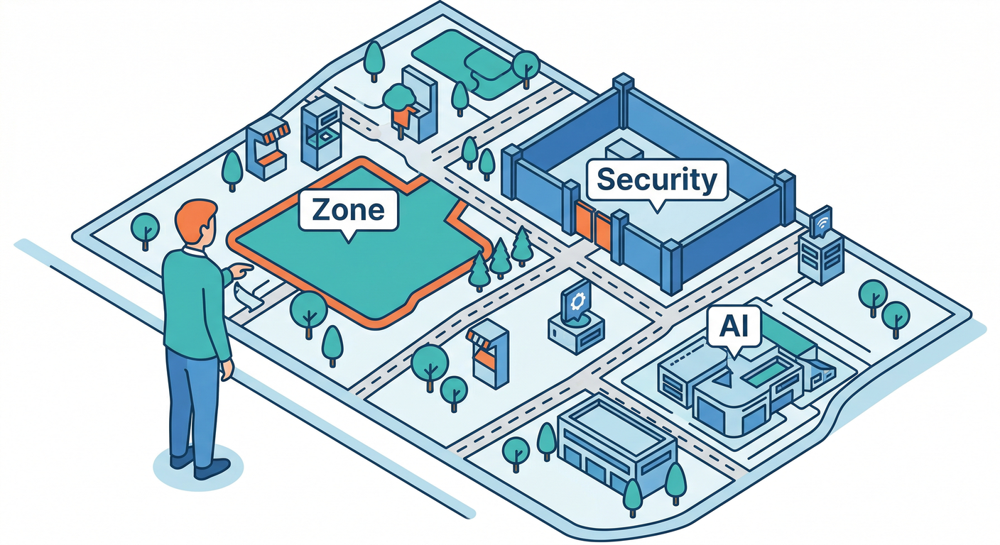
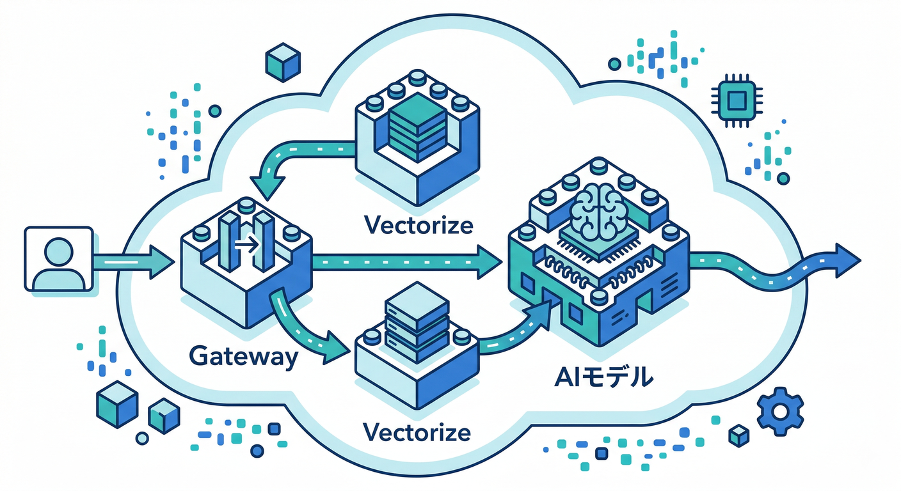

# cloudflareとは？ 15章アウトライン ☁️📘✨

## 第01章：Cloudflareをひとことで言うと？☁️

最初の章では、Cloudflareを「速くする会社」だけで終わらせません。
**速くする・守る・動かす・つなぐ・AIを載せる**という5つの役を、まず1枚の地図で見ます。

ここでのゴールは、細かい設定を覚えることではなく、**Cloudflare全体の役割を口で説明できること**です。
あとでWorkersやAIに入っても迷子にならない、最初の見取り図を作る章です。 ([Cloudflare Docs][1])

## 第02章：Webサイトはどうやって表示されるの？🌐

ここでは、ブラウザでURLを開いたときに裏側で何が起きているのかを、やさしく整理します。
ドメイン、DNS、IPアドレス、HTTPS、サーバーという言葉を、専門用語っぽくしすぎずに学びます。

Cloudflareの説明は、この流れが少し見えるだけで一気に楽になります。
「Webの道案内」を先に理解しておく、やさしい準備章です。 ([Cloudflare Docs][4])

## 第03章：DNSって何？ なんでCloudflareで触るの？📍

DNSを「インターネットの住所録」くらいの感覚から始めます。
A、AAAA、CNAME などを全部暗記するのではなく、**まず何のために必要なのか**をつかみます。
そのうえで、Cloudflare DNS は権威DNSとしてドメインを安定して届ける役がある、と理解します。
「Cloudflareにドメインを入れる意味」が、ここで腑に落ちるようにします。 ([Cloudflare Docs][2])

## 第04章：CDNって何？ なぜ速くなるの？⚡

この章では、CDNを「近くにコピーを置いておく仕組み」として直感的に理解します。
キャッシュがあると、なぜ表示が速くなるのか、なぜ元サーバーが楽になるのかを学びます。

Cloudflare Cache が、地理的に分散した拠点でコンテンツを近くから返す役を持つこともここで押さえます。
「Cloudflareって速いらしい」を、ふわっとで終わらせない章です。 ([Cloudflare Docs][5])

## 第05章：Cloudflareは“間に入る”ことで何をしているの？🛡️

Cloudflareは、ただの管理画面ではなく、**通信の通り道に入る存在**です。
DNSとCDNを組み合わせて、リクエストを受け止め、見て、選んで、必要なら止める、という流れを学びます。
ここで「リバースプロキシっぽく働く」という考え方を、むずかしくしすぎずに整理します。
この章がわかると、Cloudflareの機能がバラバラに見えにくくなります。 ([Cloudflare Docs][4])

## 第06章：Cloudflareの“守る力”を地図で見る 🔐

ここでは、**WAF・Rate Limiting・Bot対策**の位置づけをざっくり見ます。
「悪い通信を止める」「変なアクセスを減らす」「ログインやAPIを守る」という、守りの基本をまとめます。

WAF はルールでリクエストを見て、Rate Limiting は一定回数を超えたアクセスを抑える、という違いもここで整理します。
セキュリティを怖い話ではなく、**公開前の当たり前の支度**として教える章です。 ([Cloudflare Docs][6])

## 第07章：フォームやログインを守るTurnstile入門 🤖

この章では、CloudflareのやさしいCAPTCHA代替である Turnstile を紹介します。
「画像を選ばされる」感じを減らしつつ、フォーム保護をどう実現するのかを理解します。
そして大事なのは、**表示しただけでは終わらず、サーバー側で検証が必要**だという点です。
セキュリティは見た目より、裏側の確認が大事だと学ぶ章です。 ([Cloudflare Docs][7])

## 第08章：Cloudflareで“コードが動く”ってどういうこと？⚙️

ここから、Cloudflareをインフラ会社ではなく**実行基盤**として見ていきます。
Workers が、サーバーを自分で管理しなくてもアプリを動かせる仕組みだと理解します。
「HTMLを配るだけ」で終わらず、APIを返したり、処理を書いたりできるのがCloudflareの今っぽさです。

この章で、Cloudflareが“開発プラットフォーム”に見え始めます。 ([Cloudflare Docs][1])

## 第09章：ダッシュボードを散歩して全体配置を覚えよう 👀

Cloudflareの管理画面は、最初は項目が多くて圧倒されがちです。
だからこの章では、全部を理解するのでなく、**どこに何があるか**だけをつかみます。
Zone、Workers & Pages、Security、AI、Zero Trust などの位置関係をざっくり覚えます。

「見たことがある」だけで、次の学習の心理的ハードルがかなり下がります。 ([Cloudflare Docs][8])

## 第10章：VS Codeから見るCloudflare開発の入口 🛠️

この章では、Cloudflare開発を**VS Code中心の体験**として眺めます。
Wrangler、Vite plugin、設定ファイル、プレビュー、デプロイという流れをざっくり見ます。
Cloudflare公式は新規では **`wrangler.jsonc` を推奨**していて、Vite plugin は設定少なめでこれらを拾います。
「CLIが怖そう」を減らして、開発体験の入口をやわらかくする章です。 ([Cloudflare Docs][9])

## 第11章：AI入りの開発体験：CopilotとCloudflareの相性 ✨🤝

この章では、AIを“答えを丸投げする道具”ではなく、**理解を助ける相棒**として扱います。
Cloudflareは Workers プロジェクト向けに、AIツールへベストプラクティスを伝えるガイドも出しています。
GitHub Copilot では **`.github/copilot-instructions.md`** を使う案内があり、学習教材にも自然に組み込みやすいです。
「AI込みで学ぶのが普通」という、2026年らしい入口を作る章です。 ([Cloudflare Docs][10])

## 第12章：ReactやNext.jsから見たCloudflare ☁️⚛️

ここでは、CloudflareをReact系開発の文脈でやさしく位置づけます。
Reactの小さな画面、静的配信、API、SSRっぽい動きが、Cloudflare上でどう並ぶかを整理します。
2026年時点では、**Workers はフルスタックの主導線**で、**Next.js は Workers + OpenNext adapter**、一方で **Pages は静的公開やGit連携の入口としてまだ十分使いやすい**、という見方が自然です。
Next.jsに深く潜らず、Cloudflare主役のまま全体像をつかむ章にします。 ([Cloudflare Docs][1])

## 第13章：保存先の地図を先に作ろう 🗂️

Cloudflareには、KV、D1、R2、Durable Objects、Queues など、置き場がいくつもあります。
この章では細かい使い方には入らず、**何をどこに置くのかの感覚**だけ先に作ります。
「軽い設定」「SQLっぽい表」「ファイル」「状態」「あとでやる処理」という役割分担で見ると、かなりわかりやすいです。
後半の本格学習で混乱しないための、地図づくり章です。 ([Cloudflare Docs][11])

## 第14章：CloudflareのAI地図を描こう 🤖🧠

ここでは、CloudflareのAI系サービスを**ひとつの流れ**として整理します。
Workers AI がモデルを動かし、Vectorize が埋め込み検索を支え、AI Gateway が呼び出しを観測・制御し、AI Search が自然言語検索を受け持つ、という地図を作ります。
「CloudflareでもAIできる」ではなく、**Cloudflareの中でAIアプリを組み立てる**感覚を育てます。

この章があると、Cloudflare学習が一気に2026年っぽくなります。 ([Cloudflare Docs][3])

## 第15章：エージェント時代のCloudflareと、次の学習ルート 🚀

最後は、MCP、Browser Rendering、Zero Trust、Tunnel などを「発展マップ」として見せます。
Cloudflareは自前の remote MCP servers を持ち、Browser Rendering は MCP クライアントからの利用も案内しています。
つまりCloudflareは、Web配信やAPIだけでなく、**AIエージェントが外界に触るための土台**にも広がっています。
締めとして、「次にWorkersへ進む」「次にセキュリティへ進む」「次にAIへ進む」という3本の学習ルートを示して終えます。 ([Cloudflare Docs][12])

---

## この15章のねらい 🎯

この構成は、
**「Cloudflareって結局なに者なの？」を、最初の1本で気持ちよく説明できるようにする**ための設計です。

特に大事なのは、最初から

* CDNだけで終わらせないこと
* Workersだけに寄りすぎないこと
* AIだけを別世界にしないこと
* セキュリティを後回しにしないこと

の4つです。
この4つを最初の地図に入れておくと、あとで各章を掘っても迷いにくくなります。 ([Cloudflare Docs][1])

[1]: https://developers.cloudflare.com/workers/ "Overview · Cloudflare Workers docs"
[2]: https://developers.cloudflare.com/dns/ "Cloudflare DNS · Cloudflare DNS docs"
[3]: https://developers.cloudflare.com/workers-ai/ "Overview · Cloudflare Workers AI docs"
[4]: https://developers.cloudflare.com/fundamentals/concepts/how-cloudflare-works/ "How Cloudflare DNS works · Cloudflare Fundamentals docs"
[5]: https://developers.cloudflare.com/cache/ "Cloudflare Cache · Cloudflare Cache (CDN) docs"
[6]: https://developers.cloudflare.com/waf/ "Overview · Cloudflare Web Application Firewall (WAF) docs"
[7]: https://developers.cloudflare.com/turnstile/ "Overview · Cloudflare Turnstile docs"
[8]: https://developers.cloudflare.com/pages/ "Overview · Cloudflare Pages docs"
[9]: https://developers.cloudflare.com/workers/wrangler/configuration/ "Configuration - Wrangler · Cloudflare Workers docs"
[10]: https://developers.cloudflare.com/workers/get-started/prompting/ "Prompting · Cloudflare Workers docs"
[11]: https://developers.cloudflare.com/workers/platform/storage-options/?utm_source=chatgpt.com "Choosing a data or storage product. · Cloudflare Workers ..."
[12]: https://developers.cloudflare.com/agents/model-context-protocol/mcp-servers-for-cloudflare/ "Cloudflare's own MCP servers · Cloudflare Agents docs"
