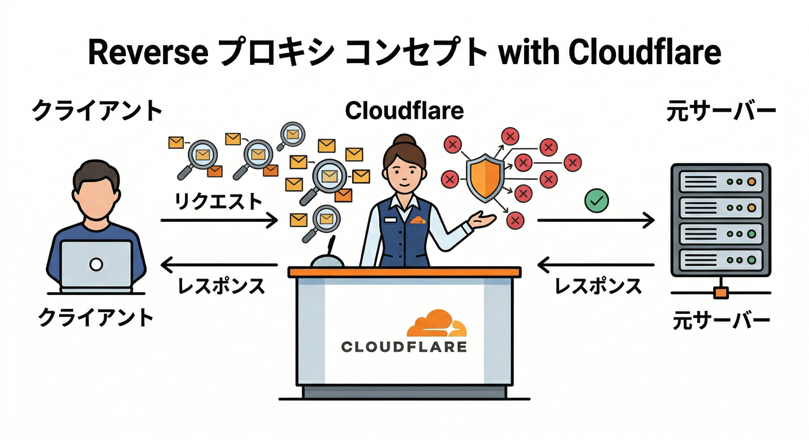
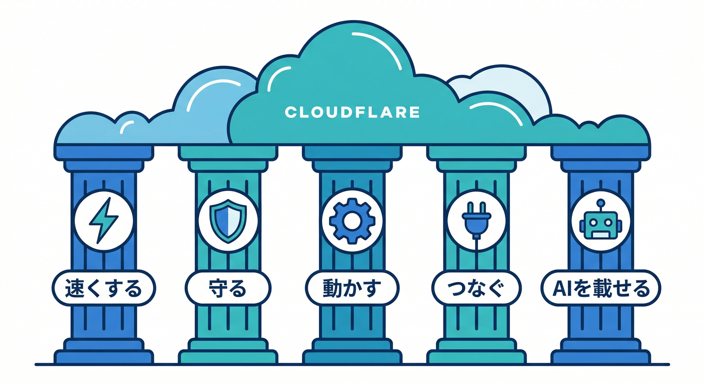
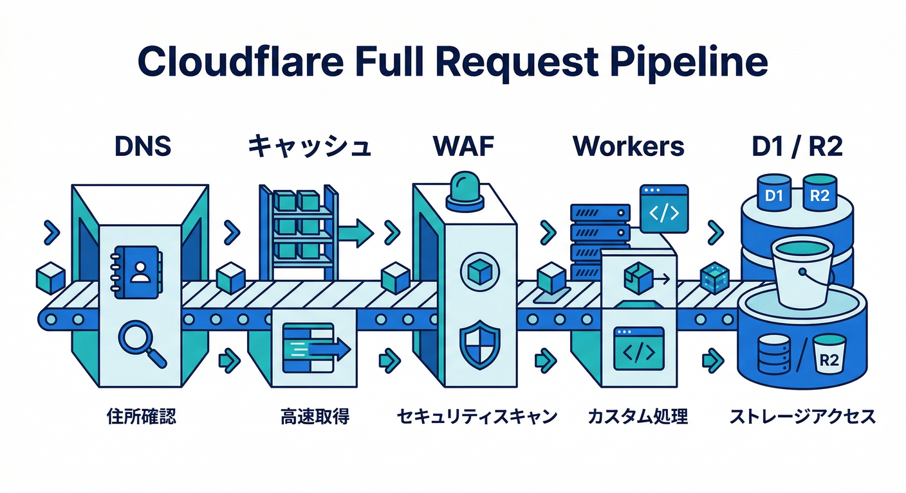
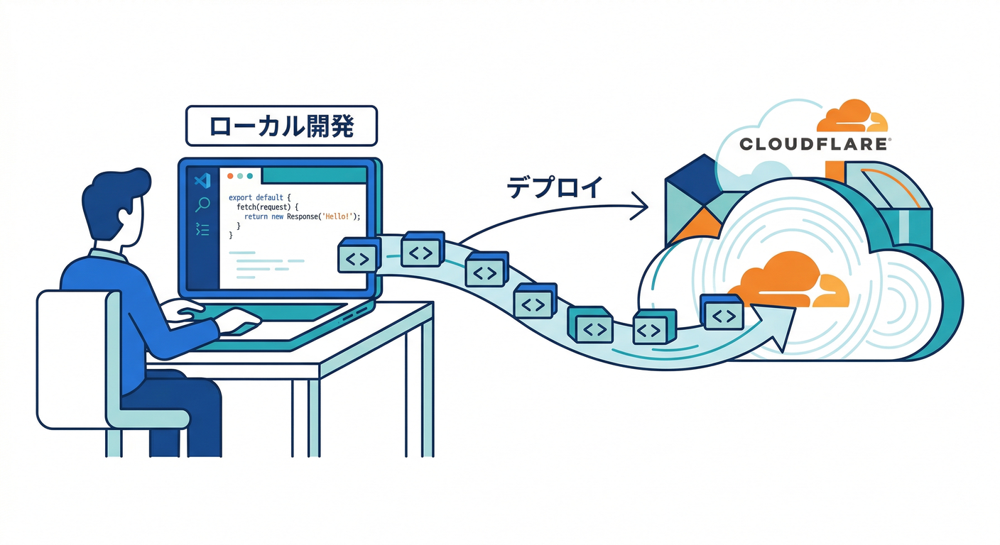
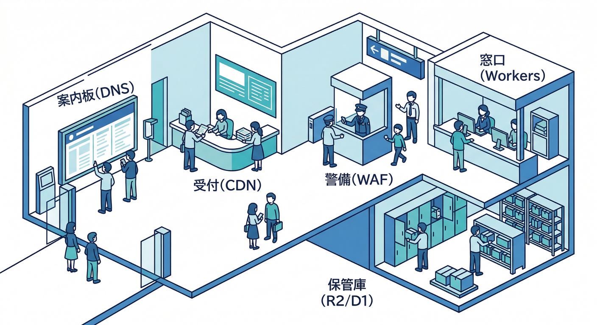

# 第01章：Cloudflareをひとことで言うと？☁️

この章では、Cloudflareを「なんかサイトを速くするやつ」から一歩進めて、**Webの入口に立ちながら、守って、動かして、つないで、AIまで載せられる基盤**として見ていきます。
Cloudflareの公式ドキュメントを本日確認すると、Cloudflareは DNS と CDN によってドメインの通信を受け止めるだけでなく、Workers でアプリを実行し、Workers AI・AI Gateway・Vectorize・AI Search などで AI アプリまで組み立てられる形に整理されています。 ([Cloudflare Docs][1])

## この章のゴール 🎯

この章のゴールは3つです。

* Cloudflareを自分の言葉でひとこと説明できるようになること
* 「速くする」「守る」「動かす」「つなぐ」「AIを載せる」の5役を区別できること
* 次の章で DNS や Workers や AI を学ぶときに、迷子にならない地図を頭に入れること

---

## 1. Cloudflareをひとことで言うと？ ☁️

いちばんやさしく言うなら、Cloudflareは
**「あなたのWebサイトやアプリの前に立って、通信をさばきながら、必要ならその場で処理も実行できる世界規模の中継＆実行基盤」**
です。Cloudflareは、サイトをCloudflareにのせると DNS と CDN を提供し、ドメインへの通信をリバースプロキシとして受け止めます。さらに Workers は Cloudflareのグローバルネットワーク上でアプリを動かすサーバーレス基盤として案内されています。 ([Cloudflare Docs][1])

ここで大事なのは、Cloudflareが「レンタルサーバーそのもの」ではないことです。
もちろん裏にある元サーバーやストレージは必要になることがありますが、Cloudflareはその手前に立って、**どこに届けるか、どう守るか、何をキャッシュするか、どこでコードを動かすか**を担当できます。だから Cloudflare を学ぶときは、「サーバー会社」よりも **交通整理・警備・受付・実行環境が合体した場所** と考えるとかなりわかりやすいです。 ([Cloudflare Docs][1])

---

## 2. まずは5つの役で見るとわかりやすいよ 🗺️✨

Cloudflareは機能名が多いので、最初から製品名を丸暗記しようとするとしんどいです 😵
なので最初は、次の5つの役で見ます。

### ① 速くする ⚡

Cloudflare Cache は、画像・動画・Webページなどのコピーを、ユーザーに近い地理的に分散したデータセンターへ置いて返す仕組みです。これによって元サーバーの負荷を下げつつ、表示を速くできます。DNS も Cloudflare 側で権威DNSとして応答できるため、まず「どこへ行くか」を安定して案内し、そのあと近くからコンテンツを返す流れが作れます。 ([Cloudflare Docs][2])

たとえるなら、毎回本店まで取りに行くのではなく、**家の近くの受け取り拠点に人気商品を置いておく感じ**です 📦🚚

### ② 守る 🛡️

Cloudflare WAF は、入ってくるWebやAPIのリクエストをルールセットでチェックし、不要な通信をフィルタできます。さらに Rate limiting で回数の多すぎるアクセスを抑えたり、Turnstile でフォームをボットから守ったりできます。Turnstile は Cloudflare CDN を使っていないサイトにも埋め込めて、露骨な CAPTCHA を見せずに使える仕組みとして案内されています。 ([Cloudflare Docs][3])

つまり Cloudflare は、**サイトの前に立つ警備員さん**でもあります 👮‍♂️✨

### ③ 動かす ⚙️

Cloudflare Workers は、Cloudflare のグローバルネットワーク上でアプリをビルド・デプロイ・スケールできるサーバーレス実行環境です。公式の Overview では、React、Vue、Svelte、Next、Astro、React Router などのフレームワークや、JavaScript、TypeScript、Python、Rust などの言語に対応する形で説明されています。つまり今の Cloudflare は、「静的サイトを配るだけ」ではなく、**APIやフルスタックアプリも動かせる場所**です。 ([Cloudflare Docs][4])

たとえるなら、Cloudflareは**門番だけでなく、受付カウンターの裏でその場で仕事してくれるスタッフ**でもある、という感じです 🧑‍💻☁️

### ④ つなぐ 🔌

Cloudflare Tunnel は、元サーバーやAPIを Cloudflare へ **外向きの接続だけ** でつなぎ、公開IPを直接さらさずに済む仕組みです。Cloudflare docs では、cloudflared が Cloudflare へ継続的な outbound-only 接続を作り、CDN・WAF・DDoS 保護を自動適用できると説明されています。Zero Trust 側では、「一度ログインしたら全部信頼」ではなく、**毎回の要求を身份と文脈で確認する**考え方が基本です。 ([Cloudflare Docs][5])

つまり Cloudflare は、公開サイトだけでなく、**社内アプリや自宅サーバーやAPIの安全な出入口**にもなれます 🚪🔐

### ⑤ AIを載せる 🤖🧠

Workers AI は、Cloudflare のネットワーク上でサーバーレスGPUを使ってAIモデルを実行できる仕組みです。AI Gateway は AI アプリのログ・分析・キャッシュ・レート制御・リトライ・モデルフォールバックをまとめて扱うための入口で、Vectorize は埋め込み検索向けのベクトルDB、AI Search は自然言語で問い合わせられる管理型検索サービスです。Cloudflare は公式に、Workers AI・AI Gateway・Vectorize を組み合わせた RAG っぽい構成も案内しています。 ([Cloudflare Docs][6])

ここは2026年らしいポイントで、Cloudflareは「Webを速くする会社」だけでなく、**AIアプリを世界に近い場所で動かす土台**にもなっています 🚀🤖

---

## 3. じゃあ、Cloudflareは何者なの？を1枚で言い直すとこうなる 🖼️

Webサイトやアプリにアクセスが来ると、

**① DNSで行き先を案内する → ② Cloudflareの前段で受ける → ③ キャッシュできるものは近くから返す → ④ 危ない通信は止める → ⑤ 必要なら Workers で処理する → ⑥ その先で D1 や R2 や Durable Objects や AI に触る**

という流れで見ると、かなり整理しやすいです。Cloudflare docs でも、Cloudflare が DNS/CDN によって通信を受け止め、Workers でアプリを動かし、D1・R2・Durable Objects などの保存先や、Workers AI・Vectorize などのAI系機能とつながる構図が見えるようになっています。 ([Cloudflare Docs][1])

ここでのコツは、製品名を全部覚えることではありません。
**Cloudflareは「入口」と「実行場所」と「安全装置」をまとめて持っている**。まずはこの感覚だけつかめれば十分です 😊

---

## 4. 2026年のCloudflareは「ただのCDN」より、かなり開発寄り 🛠️✨

本日時点の公式情報では、Cloudflare Workers はフルスタックアプリの基盤としてかなり前に出ています。Workers の Overview では React や Next を含む複数フレームワークが明記され、Best Practices では **新規プロジェクトは Pages より Workers を使うのが推奨** とされ、静的サイト・SPA・フルスタックアプリには Workers Static Assets がすすめられています。Pages も引き続き使えますが、新機能や最適化は Workers 側に寄っている、というのが現在の見え方です。 ([Cloudflare Docs][4])

Next.js についても、Cloudflare公式は Workers 上へのデプロイを OpenNext adapter 経由で案内していて、多くの Next.js 機能がサポート対象として並んでいます。とはいえ、この教材では Next.js を主役にはしません。あくまで「Cloudflareが中心で、その上に React系も載る」という理解で十分です。 ([Cloudflare Docs][7])

---

## 5. 今どきの開発体験で見ると、Cloudflareはかなり親切です 🧰🌈

Cloudflareは CLI とローカル開発体験もかなり整っています。Wrangler の設定ファイルは、現在の公式では新規プロジェクトに wrangler.jsonc が推奨されています。さらに Cloudflare Vite plugin は Vite と Workers runtime をつなぐ公式統合で、ローカルでも本番に近い workerd 上で動かしながら、静的サイト、SPA、フルスタックアプリまで扱えるように整理されています。既存プロジェクトでも、Wrangler はフレームワークを自動検出し、必要な設定やスクリプトを生成してくれます。 ([Cloudflare Docs][8])

つまり学習の入り口としては、
「Cloudflareってインフラが難しそう…😰」
ではなく、
**「VS Codeで作って、Wranglerでつなげて、Cloudflare上で確認する」**
くらいの感覚で入っていける土台がかなりできています。 ([Cloudflare Docs][8])

---

## 6. AI込みの学び方とも相性がいいです 🤝🤖

ここも2026年っぽいところです。Cloudflare公式は、AIエージェントに Workers を教える方法として、cloudflare-docs の MCP サーバーや observability の MCP サーバーを案内しています。さらに docs 側では、Markdown 化しやすいページ提供、llms.txt / llms-full.txt、VSCode への MCP 接続、そして GitHub Copilot 向けに .github/copilot-instructions.md を使う案内まで出しています。 ([Cloudflare Docs][9])

つまり、AIを使った学習や開発は「裏ワザ」ではなく、**Cloudflare公式もかなり前向きに整備している普通の学び方**です ✨
この教材でも、AIに丸投げするのではなく、**「Cloudflareの公式情報を読みやすくし、コードのたたき台や確認役に使う」** という相棒ポジションで使うのがいちばんおすすめです。 ([Cloudflare Docs][10])

---

## 7. Cloudflareを超入門向けにたとえるとこうなります 🏢🌐

Cloudflareを「巨大なネットの駅ビル」みたいに考えてみてください。

* DNS は、行き先を教える案内板 📍
* CDN/Cache は、近くの受け取り窓口 📦
* WAF や Turnstile は、入口の警備と本人確認 🛡️
* Workers は、その場で書類処理してくれる窓口スタッフ ⚙️
* D1 や R2 は、館内の保管庫 🗂️
* Tunnel や Zero Trust は、関係者専用の安全な通路 🔐
* Workers AI や Vectorize や AI Search は、館内のAI相談カウンター 🤖

こう考えると、Cloudflareは1つの単機能サービスではなく、**Webサービスを前で受けて、途中で守って、必要なら処理し、後ろのデータやAIにつなぐ総合基盤**だと見えてきます。 ([Cloudflare Docs][1])

---

## 8. この章の時点で覚えておくとラクな言葉たち 📚✨

ここでは厳密さより、意味の雰囲気をつかめればOKです。

**DNS**
ドメイン名を、正しい行き先につなぐための仕組みです。Cloudflare DNS は権威DNSとして動けます。 ([Cloudflare Docs][11])

**CDN / Cache**
よく使うコンテンツのコピーを、利用者に近い場所から返す仕組みです。速くなり、元サーバーも楽になります。 ([Cloudflare Docs][2])

**WAF**
危ない通信や不要な通信を、ルールに基づいて見分ける仕組みです。APIも含めて守れます。 ([Cloudflare Docs][3])

**Workers**
Cloudflare上でコードを動かすサーバーレス実行環境です。TypeScript系の学習と相性がいい入口です。 ([Cloudflare Docs][4])

**Tunnel**
元サーバーを公開IPで丸出しにせず、Cloudflareへ安全につなぐ通路です。 ([Cloudflare Docs][5])

**Workers AI**
Cloudflare上でAIモデルを呼び出す実行基盤です。アプリから使いやすい形に整理されています。 ([Cloudflare Docs][6])

**Vectorize / AI Search**
埋め込み検索や自然言語検索を支える、AIアプリ向けの検索まわりです。 ([Cloudflare Docs][12])

---

## 9. ここでありがちな勘違いも先につぶしておこう 🙋‍♂️💡

**勘違い1：CloudflareはCDNだけ**
今はそれだけではありません。Workers でアプリを動かし、D1・R2・Durable Objects などの保存先を使い、Workers AI や Vectorize で AI 機能も組めます。 ([Cloudflare Docs][4])

**勘違い2：Cloudflareを使うには大げさなサーバー知識が必要**
もちろん深くやれば深いですが、今の公式導線はかなりやさしく、Wrangler や create-cloudflare、Vite plugin、自動設定などで入門しやすくなっています。 ([Cloudflare Docs][13])

**勘違い3：AIはCloudflareの外でやるもの**
Cloudflare自身が Workers AI、AI Gateway、Vectorize、AI Search を並べてAIアプリ構築の流れを案内しています。 ([Cloudflare Docs][14])

**勘違い4：TurnstileやAI GatewayはCloudflareにフル移行しないと使えない**
Turnstile は Cloudflare CDN を使っていないサイトにも埋め込めますし、AI Gateway は既存のAIプロバイダの前段として使えると公式に案内されています。 ([Cloudflare Docs][15])

---

## 10. ミニチェック問題 ✍️🌟

ここで軽く確認です。

**Q1. Cloudflareは何をする会社？**
A. ひとことで言うなら、**Webやアプリの前に立って、速くし、守り、必要ならその場でコードを動かし、AIまで載せられる基盤**です。 ([Cloudflare Docs][1])

**Q2. 速くする役は主に何？**
A. DNS と CDN/Cache です。DNS が行き先を案内し、Cache が近い場所からコンテンツを返します。 ([Cloudflare Docs][11])

**Q3. 守る役は主に何？**
A. WAF、Rate limiting、Turnstile、Zero Trust です。 ([Cloudflare Docs][3])

**Q4. 動かす役は主に何？**
A. Workers です。React や Next を含むフレームワークの土台として使えます。 ([Cloudflare Docs][4])

**Q5. AIを載せる役は主に何？**
A. Workers AI、AI Gateway、Vectorize、AI Search です。 ([Cloudflare Docs][6])

---

## この章のまとめ 🌈☁️

第1章でいちばん大事なのは、
**Cloudflare ＝ CDNだけ**
という見方を卒業することです。

今の Cloudflare は、

* **速くする**：DNS / Cache
* **守る**：WAF / Turnstile / Zero Trust
* **動かす**：Workers
* **つなぐ**：Tunnel
* **AIを載せる**：Workers AI / AI Gateway / Vectorize / AI Search

という5つの顔を持つ、かなり広いプラットフォームです。 ([Cloudflare Docs][11])

だから次の章から個別機能を学ぶときも、
「これは Cloudflare のどの役の話かな？ 🤔」
と考えながら読むと、すごく迷いにくくなります。

次章では、この地図の中でも特に土台になる
**「Webサイトはどうやって表示されるの？」**
に進むと、Cloudflareの話がさらにスッと入ってきます。

[1]: https://developers.cloudflare.com/fundamentals/concepts/how-cloudflare-works/ "How Cloudflare DNS works · Cloudflare Fundamentals docs"
[2]: https://developers.cloudflare.com/cache/ "Cloudflare Cache · Cloudflare Cache (CDN) docs"
[3]: https://developers.cloudflare.com/waf/ "Overview · Cloudflare Web Application Firewall (WAF) docs"
[4]: https://developers.cloudflare.com/workers/ "Overview · Cloudflare Workers docs"
[5]: https://developers.cloudflare.com/tunnel/ "Cloudflare Tunnel · Cloudflare Docs"
[6]: https://developers.cloudflare.com/workers-ai/ "Overview · Cloudflare Workers AI docs"
[7]: https://developers.cloudflare.com/workers/framework-guides/web-apps/nextjs/ "Next.js · Cloudflare Workers docs"
[8]: https://developers.cloudflare.com/workers/wrangler/configuration/ "Configuration - Wrangler · Cloudflare Workers docs"
[9]: https://developers.cloudflare.com/workers/get-started/prompting/ "Prompting · Cloudflare Workers docs"
[10]: https://developers.cloudflare.com/style-guide/ai-tooling/ "AI tooling · Cloudflare Style Guide"
[11]: https://developers.cloudflare.com/dns/ "Cloudflare DNS · Cloudflare DNS docs"
[12]: https://developers.cloudflare.com/vectorize/ "Overview · Cloudflare Vectorize docs"
[13]: https://developers.cloudflare.com/workers/framework-guides/automatic-configuration/ "Deploy an existing project · Cloudflare Workers docs"
[14]: https://developers.cloudflare.com/use-cases/ai/ "AI applications · Use cases · Cloudflare use cases"
[15]: https://developers.cloudflare.com/turnstile/ "Overview · Cloudflare Turnstile docs"
