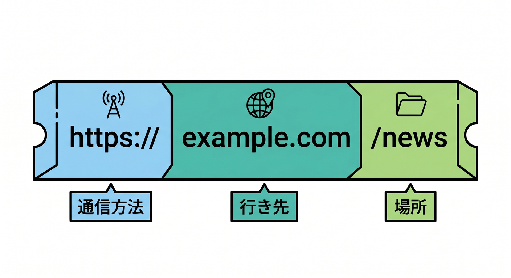
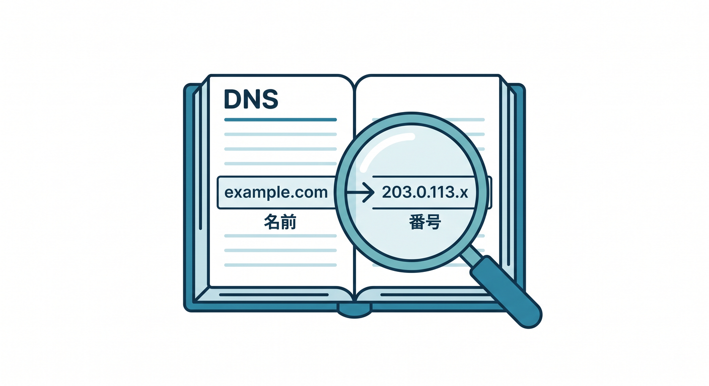
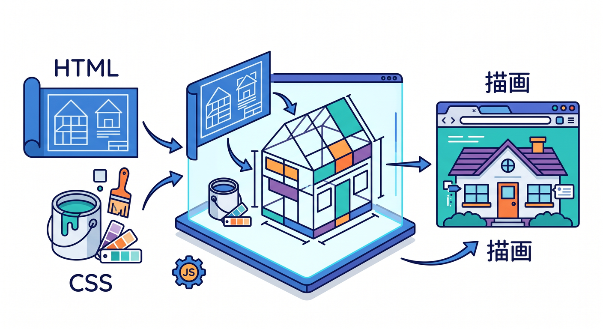
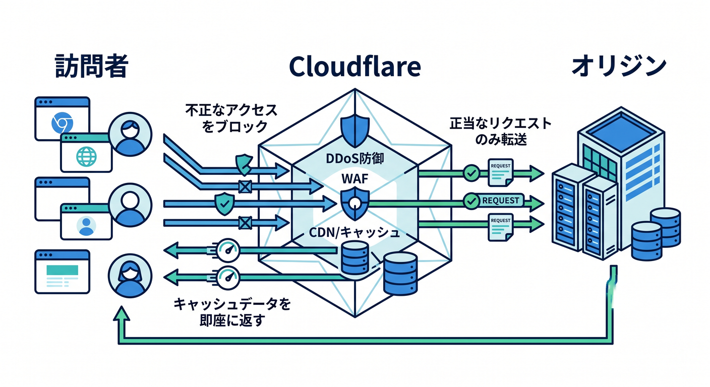

# 第02章：Webサイトはどうやって表示されるの？🌐

この章では、ブラウザでURLを開いたときに、裏側で何が起きているのかを「1本の道」として見ていきます😊
URLはリソースの住所で、DNSはドメイン名をIPアドレスに結びつけ、HTTPSはHTTP通信をTLSで暗号化し、ブラウザは受け取ったHTML・CSS・JavaScriptを解析して画面を描きます。まずこの流れが見えるようになると、Cloudflareの役割もかなり理解しやすくなります。 ([MDN Web Docs][1])

Cloudflareの説明が途中で急に難しく感じやすいのは、Cloudflareがこの流れの「途中」に入ってくるからです。Cloudflare公式Docsでも、CloudflareはDNSとCDNを提供し、ドメインへのWebトラフィックをリバースプロキシできる存在として説明されています。 ([Cloudflare Docs][2])

## この章のゴール 🎯

この章を終えるころには、次の3つを自分の言葉で言えるようになるのが目標です ✍️

* URLを開いたとき、ブラウザが最初に何をするのか
* DNS、IPアドレス、HTTPS、サーバーがどうつながるのか
* Cloudflareがその流れのどこに入って、何を助けているのか  ([Cloudflare Docs][2])


---

## 1. まずは超ざっくり一文で 🌈

Webサイト表示は、ひとことで言うとこうです。

**「ブラウザがURLを手がかりに行き先を調べ、通信を安全につなぎ、データを受け取り、画面に組み立てる」** です。 ([MDN Web Docs][1])

たとえば `https://example.com/news` を開くと、ブラウザはまずURLを読み取り、`example.com` というドメイン名を見つけます。その後、そのドメインがどのIPアドレスに対応しているかをDNSで調べ、通信相手に接続し、HTTP/HTTPSでHTMLなどを受け取り、最後にそれを画面に描きます。 ([MDN Web Docs][1])

---

## 2. 先に用語をやわらかく整理しよう 🧩

**URL** は、インターネット上のリソースの住所です。ブラウザはURLを使って、HTMLページ、画像、CSS、APIなどを取りにいきます。 ([MDN Web Docs][1])



**ドメイン名** は、人が覚えやすい名前です。
**IPアドレス** は、ネットワーク上で相手を見つけるための番号です。
**DNS** は、その「名前」と「番号」を結びつける仕組みです。つまり、`example.com` を `203.0.113.x` のような行き先に翻訳する係です。 ([MDN Web Docs][3])



**HTTP** は、ブラウザとサーバーがデータをやり取りするためのルールです。
**HTTPS** は、そのHTTPをTLSで暗号化して、安全に通信できるようにしたものです。ログインや買い物だけでなく、いまのWebではほぼ標準です。 ([MDN Web Docs][4])


**サーバー** は、要求されたファイルやデータを返す側です。
Cloudflareの文脈では、元のアプリやコンテンツを載せている本体を **origin server（オリジンサーバー）** と呼びます。Cloudflareはその手前に立つことが多いので、この言い方がとても大事です。 ([Cloudflare Docs][5])

---

## 3. URLを開いてから画面が出るまでの7ステップ 🚶‍♀️🚶‍♂️💨

### ステップ1：ブラウザがURLを読む 🔍

ブラウザは、URLの中から「通信方法は何か」「どのドメインに行くか」「どのパスを見にいくか」を読み取ります。
たとえば `https://example.com/news?id=10` なら、`https` が通信方法、`example.com` が行き先、`/news` がページの場所、`?id=10` が追加情報です。 ([MDN Web Docs][1])

### ステップ2：DNSで行き先を調べる 📍

ブラウザは `example.com` の場所そのものを知っているわけではありません。そこでDNSを使って、「この名前はどのIPアドレス？」と問い合わせます。Cloudflare公式Docsでも、DNSはドメイン名を数値のIPアドレスへ翻訳する仕組みとして説明されています。 ([MDN Web Docs][3])

Cloudflareを通常のフルセットアップで使うと、Cloudflareがそのドメインの**権威DNS**になります。つまり、あなたのドメインについて「正しい答えを返す側」をCloudflareが担当する形です。 ([Cloudflare Docs][2])

### ステップ3：相手に接続する 🔌

DNSでIPアドレスがわかったら、ブラウザはその相手に接続します。HTTPはブラウザとサーバーの通信を目的としたアプリケーション層のプロトコルで、クライアントがリクエストを送り、サーバーがレスポンスを返します。 ([MDN Web Docs][4])

### ステップ4：HTTPSなら安全な通信を作る 🔐

URLが `https://` で始まっているときは、HTTPをそのまま流すのではなく、TLSを使って暗号化された通信を作ります。これで、途中で内容をのぞかれたり改ざんされたりしにくくなります。 ([MDN Web Docs][6])

Cloudflareを使うと、ここは実は2区間で考えるとわかりやすいです。
**ブラウザ ↔ Cloudflare** と **Cloudflare ↔ オリジンサーバー** の2本です。Cloudflare公式Docsでも、SSL/TLSの暗号化モードはこの2つの接続をどう扱うかを制御すると説明されています。 ([Cloudflare Docs][7])

### ステップ5：HTTPリクエストを送る 📩

安全な接続ができたら、ブラウザは「このページをください」とHTTPリクエストを送ります。
するとサーバー側は、HTMLやJSONや画像などをHTTPレスポンスとして返します。ページ表示の最初の入り口は、だいたいHTMLです。 ([MDN Web Docs][4])

### ステップ6：ブラウザが画面を組み立てる 🖼️

HTMLが届くと、ブラウザはそれを解析してDOMを作り、CSSを読んでCSSOMを作り、それらを合わせてレンダーツリーを組み立て、レイアウトを計算し、最後に画面へ描画します。さらに、HTML内で見つけたCSS、JavaScript、画像、フォントなども追加で取りにいきます。 ([MDN Web Docs][8])



ここで大事なのは、**「最初に1回通信して終わり」ではない**ことです。
Webページは、HTML 1枚だけでできていることは少なく、CSS・JS・画像・APIレスポンスが何本も続いて初めて完成します。だから表示速度は、サーバーだけでなく、ファイル数、サイズ、キャッシュ、描画のされ方にも影響されます。 ([MDN Web Docs][8])

### ステップ7：Cloudflareが途中で助ける ☁️⚡🛡️

Cloudflareが入っていないと、ブラウザはそのままオリジンサーバーへ向かいます。
Cloudflareが入っていると、CloudflareがDNSの返答やリバースプロキシの入口を担当し、近い場所のキャッシュから返したり、通信を保護したり、必要に応じてオリジンへ取りにいったりできます。Cloudflareのキャッシュはエンドユーザーに近いデータセンターにコンテンツのコピーを置き、サーバー負荷を減らしながら性能を上げます。 ([Cloudflare Docs][2])

---

## 4. Cloudflareを入れると、どこが変わるの？☁️

一番大きい変化は、**「ブラウザが最初に会いに行く相手が、毎回オリジンサーバーとは限らなくなる」**ことです。 proxied なDNSレコードでは、トラフィックはCloudflareを通過し、オリジン側は個々の訪問者IPではなくCloudflareのIPからのアクセスとして受けるようになります。 ([Cloudflare Docs][9])



そのおかげで、Cloudflareは途中でこんなことができます 😊

* 近い場所のキャッシュから返して速くする
* 怪しい通信を手前で見て守る
* HTTPSや証明書まわりを助ける
* Workersで途中の処理そのものを書き換える  ([Cloudflare Docs][10])

「Cloudflareはただの設定サイト」ではなく、**Webの通り道にいる実働メンバー**なんだ、とここでつかめると後の章がすごく楽になります 😎 ([Cloudflare Docs][2])

---

## 5. React・Next.js・APIでも、この基本は同じ ⚛️

Reactアプリでも、Next.jsでも、最初の入口は結局この流れです。
ブラウザがURLを開き、DNSで行き先を調べ、HTTPSでつながり、HTMLやJSやデータを受け取り、画面を作ります。違うのは「どこでHTMLを作るか」「どこでAPIを返すか」「どこでキャッシュするか」です。 ([MDN Web Docs][8])

Cloudflare WorkersのCustom Domainsでは、CloudflareがDNSレコードや必要な証明書の発行を肩代わりし、Workerそのものをオリジンとして動かせます。つまり、従来の「別のアプリサーバー本体」がなくても、Cloudflare側でその役を持てる場面があります。 ([Cloudflare Docs][11])

これはすごく2026年っぽい感覚で、
**「Webサーバーに取りにいく」だけでなく、Cloudflareそのものがアプリの実行場所にもなる**、ということです。 ([Cloudflare Docs][11])

---

## 6. AIアプリでも、実は同じ流れ 🤖✨

AIを使うと急に別世界に見えますが、入口はやっぱりWebです。
ブラウザやアプリがリクエストを送り、どこかのエンドポイントが受け、結果を返します。その途中にCloudflareを置くと、AIの呼び出しにもキャッシュ、ログ、レート制限、リトライ、モデル切り替えなどを入れられます。Cloudflare AI Gateway は、まさにその「AI向けの通り道の管理役」です。 ([Cloudflare Docs][12])

さらに Workers AI は、Cloudflareのグローバルネットワーク上でサーバーレスにモデルを実行できます。つまり、Webの入口からそのままCloudflare上でAI推論までつなげやすい構成です。 ([Cloudflare Docs][13])

AI Search も、Webサイトや非構造データをつないで継続的にインデックスを作り、自然言語で検索できるようにするサービスです。これも結局、Webのリクエスト、データ取得、検索、応答という流れの上に載っています。 ([Cloudflare Docs][14])

なので、この第2章で学ぶ「URL → DNS → HTTPS → 応答 → 表示」は、普通のWebだけでなく、**Cloudflare上で動くAIアプリの土台**でもあります 🌟 ([Cloudflare Docs][13])

---

## 7. ここは先に知っておくと得するポイント 🔐

Cloudflare公式Docsの現行情報では、SSL/TLSの考え方は **訪問者とCloudflareの接続**、**Cloudflareとオリジンの接続** の2本で整理され、可能なら **Full** または **Full (strict)** が強く推奨されています。さらに、新しい **Automatic SSL/TLS** のロールアウトも進んでいます。 ([Cloudflare Docs][7])

また、オリジンがCloudflare経由の通信だけを受けるなら、Cloudflare Origin CA を使って Cloudflare ↔ オリジン間を暗号化できます。これは Strict モードとも組み合わせられます。 ([Cloudflare Docs][15])

ここは今すぐ設定暗記をする場所ではありませんが、**HTTPSは“ブラウザだけ見れば終わり”ではない**、という感覚だけ持っておくとかなり強いです 💪 ([Cloudflare Docs][7])

---

## 8. 小さな体験：URLを分解してみよう 🧪

VS Code で TypeScript ファイルを1つ作って、こんなコードを見るだけでも、URLの見え方がかなりクリアになります 😊

```ts
const url = new URL("https://example.com/news?id=10#top");

console.log("protocol:", url.protocol);
console.log("hostname:", url.hostname);
console.log("pathname:", url.pathname);
console.log("search:", url.search);
console.log("hash:", url.hash);
```

このコードで見ているのは、「ブラウザがURLのどこを見ているか」の縮小版です。
URLはただの文字列ではなく、通信方法・行き先・ページ位置・クエリ・アンカーに分けて扱える情報のかたまりです。 ([MDN Web Docs][16])

---

## 9. Copilot活用メモ ✨🤝

この章は、GitHub Copilot やチャットAIと相性がいいです。たとえば、こんな聞き方が学習向きです 😊

* 「URLとドメインとDNSの違いを、引っ越しに例えて説明して」
* 「HTTPSとHTTPの違いを、通信の安全性の観点で初心者向けに整理して」
* 「CloudflareがDNSとCDNの間で何をしているか図解っぽく説明して」

コツは、**答えを受け取ったら、ブラウザの開発者ツールの Network タブで実物を見ること**です。
AIで理解を速めて、ブラウザで現物確認する。この流れがかなりおすすめです 🛠️✨

---

## 10. 章末チェック ✅

1. URLとドメイン名は同じものではありません。どう違うでしょうか？
2. DNSは何を何に変換する仕組みでしょうか？
3. HTTPSは、HTTPに何が加わったものだと言えるでしょうか？
4. Webページ表示が「HTML 1回取って終わり」ではないのはなぜでしょうか？
5. Cloudflareが入ると、ブラウザとオリジンの間で何が変わるでしょうか？

---

## この章のまとめ 🌟

Webサイト表示は、**URLを読む → DNSで行き先を知る → HTTPSで安全につなぐ → HTTPでデータを受け取る → ブラウザが画面を描く** という流れです。Cloudflareはその途中に入り、DNS、キャッシュ、保護、アプリ実行、AI呼び出しの制御まで担えるので、後の章で出てくる機能が全部この一本の流れにつながってきます。 ([Cloudflare Docs][2])

次の第3章では、この流れの中でも特に大事な **DNS** を、Cloudflareで触る意味まで含めて、もう少し具体的に見ていきます 📍☁️

[1]: https://developer.mozilla.org/ja/docs/Learn_web_development/Howto/Web_mechanics/What_is_a_URL "URL とは何か - ウェブ開発の学習 | MDN"
[2]: https://developers.cloudflare.com/fundamentals/concepts/how-cloudflare-works/ "How Cloudflare DNS works · Cloudflare Fundamentals docs"
[3]: https://developer.mozilla.org/ja/docs/Glossary/DNS "DNS - MDN Web Docs 用語集 | MDN"
[4]: https://developer.mozilla.org/ja/docs/Web/HTTP "HTTP | MDN"
[5]: https://developers.cloudflare.com/fundamentals/security/protect-your-origin-server/ "Protect your origin server · Cloudflare Fundamentals docs"
[6]: https://developer.mozilla.org/ja/docs/Glossary/HTTPS "HTTPS - MDN Web Docs 用語集 | MDN"
[7]: https://developers.cloudflare.com/ssl/origin-configuration/ssl-modes/ "Encryption modes · Cloudflare SSL/TLS docs"
[8]: https://developer.mozilla.org/en-US/docs/Web/Performance/Guides/Critical_rendering_path "Critical rendering path - Performance | MDN"
[9]: https://developers.cloudflare.com/fundamentals/concepts/cloudflare-ip-addresses/?utm_source=chatgpt.com "Cloudflare IP addresses"
[10]: https://developers.cloudflare.com/cache/ "Cloudflare Cache · Cloudflare Cache (CDN) docs"
[11]: https://developers.cloudflare.com/workers/configuration/routing/custom-domains/ "Custom Domains · Cloudflare Workers docs"
[12]: https://developers.cloudflare.com/ai-gateway/ "Overview · Cloudflare AI Gateway docs"
[13]: https://developers.cloudflare.com/workers-ai/ "Overview · Cloudflare Workers AI docs"
[14]: https://developers.cloudflare.com/ai-search/ "Cloudflare AI Search · Cloudflare AI Search docs"
[15]: https://developers.cloudflare.com/ssl/origin-configuration/origin-ca/ "Cloudflare origin CA · Cloudflare SSL/TLS docs"
[16]: https://developer.mozilla.org/ja/docs/Web/API/URL/URL?utm_source=chatgpt.com "URL: URL() コンストラクター - Web API - MDN Web Docs"
