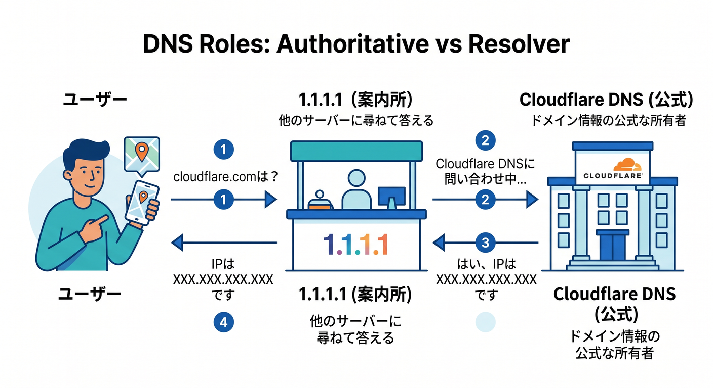
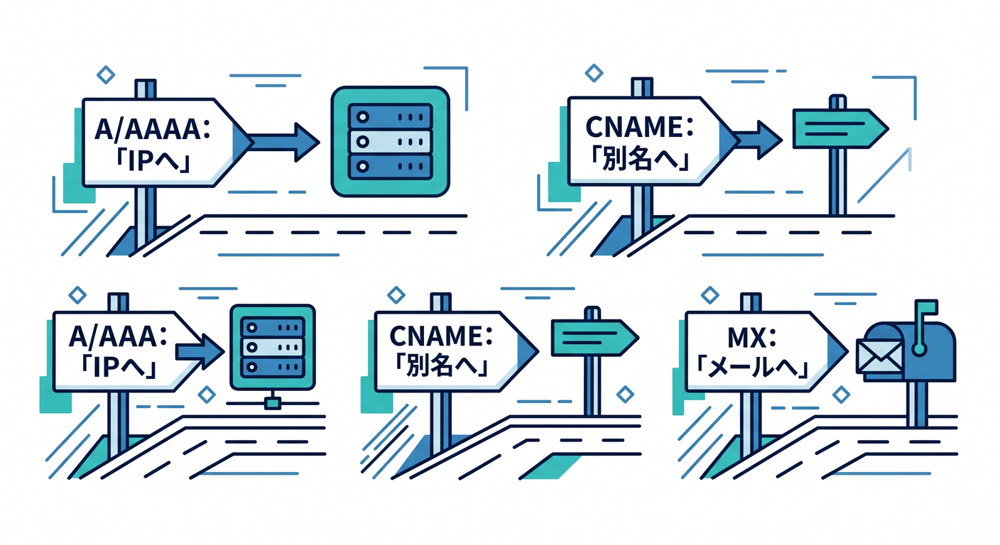
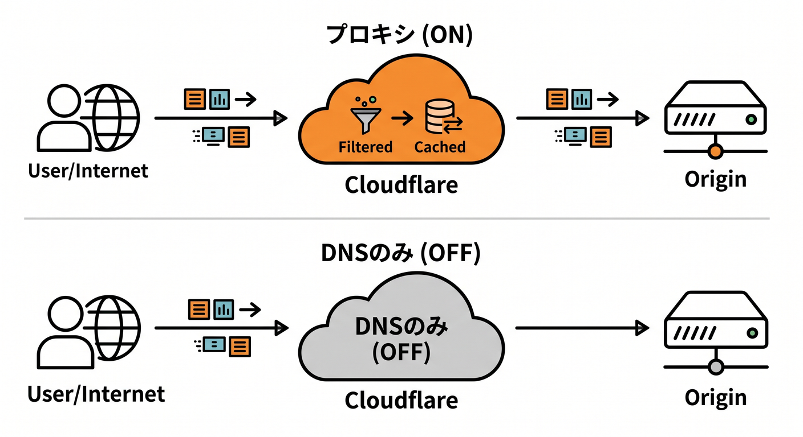
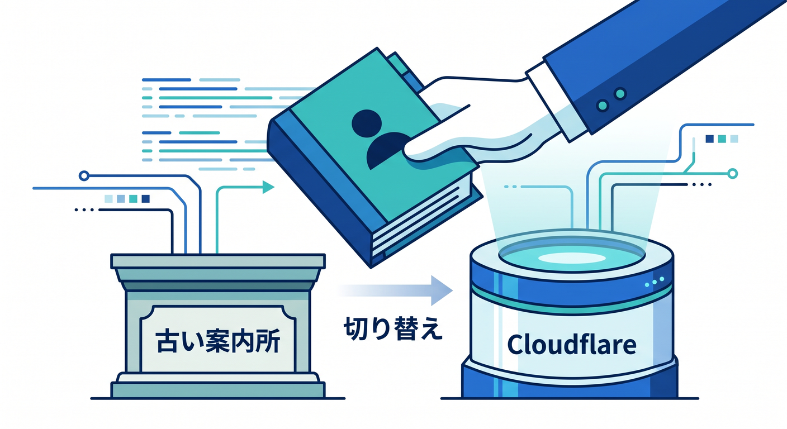
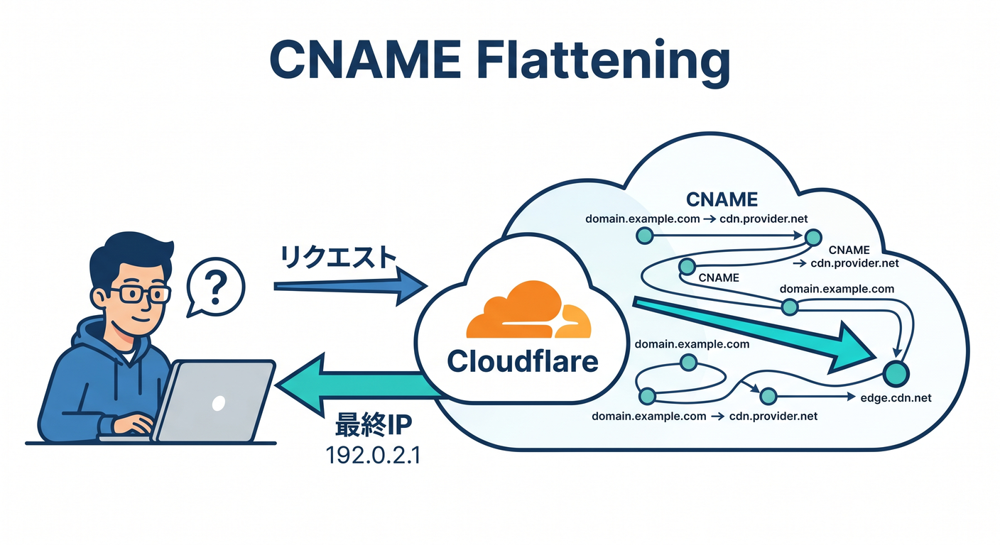

# 第03章：DNSって何？ なんでCloudflareで触るの？📍

この章では、DNSを「なんとなく名前をIPに変えるもの」で終わらせず、**Cloudflareでなぜ最初にDNSを触るのか**までつなげて理解します😊
Cloudflare DNS は、単なる設定置き場ではなく、**あなたのドメインの“公式な答え役”になる権威DNS**です。ここがわかると、次のCDN・WAF・Workers・AI公開まで、ぜんぶが一本の線でつながって見えてきます。 ([Cloudflare Docs][1])

---

## この章のゴール 🎯

この章を読み終えるころには、次の3つができれば十分です✨

* DNSを「インターネットの住所録」よりもう少し正確に、**行き先案内の仕組み**として説明できる
* CloudflareでDNSを管理する意味を、**速さ・安全・公開の入口**という視点で説明できる
* **A / AAAA / CNAME / MX / TXT / DNSSEC / オレンジ雲 / グレー雲**が、実務でどう使い分けられるかイメージできる  ([Cloudflare Docs][2])

---

## 1. DNSって、そもそも何をしているの？ 🧭

たとえばブラウザで「example.com」を開くとき、PCはいきなりWebサーバーへ飛んでいるわけではありません。まずは「この名前は、どこへ行けばいいの？」をDNSに問い合わせます。Cloudflareの公式ドキュメントでも、権威ネームサーバーはDNS解決の“最後の答え役”として説明されています。 ([Cloudflare Docs][3])

ここで大事なのが、**DNSには役割の違う登場人物がいる**ことです。
サイト運営者がCloudflareで触るのは主に**権威DNS**です。Cloudflareを通常のフルセットアップで使うと、Cloudflareがあなたのドメインの**主たる権威DNS**になります。つまり、「このドメインの正しい設定はこれです」と公式回答する立場になるわけです。 ([Cloudflare Docs][4])

一方で、Cloudflareの「1.1.1.1」は**公開DNSリゾルバ（再帰リゾルバ）**です。こちらは利用者側の問い合わせを受けて、各ドメインの権威DNSに聞きに行く役です。つまり、**Cloudflare DNS と 1.1.1.1 は、同じ“DNS”でも立場が違う**んですね🙂 ここは初学者がかなり混乱しやすいポイントです。 ([Cloudflare Docs][5])

---

## 2. なんでCloudflareでDNSを触るの？ ☁️🔑

理由はとてもシンプルで、**Cloudflareの多くの機能がDNSを入口にして始まる**からです。
Cloudflare DNS のフルセットアップでは、ドメインを追加し、レコードを確認し、ネームサーバーをCloudflareに向けることで、Cloudflareがそのドメインの権威DNSになります。その後はCloudflareダッシュボードやAPIでDNSを管理し、Cloudflareがそのホスト名へのDNS問い合わせに応答する形になります。 ([Cloudflare Docs][6])

さらにCloudflareでは、A / AAAA / CNAME レコードを**Proxied（オレンジ雲）**にすると、HTTP/HTTPS通信がCloudflare経由になり、DDoS保護、キャッシュ、最適化、各種ルール適用などが効くようになります。つまりDNSは、ただの名前解決ではなく、**Cloudflareの守る力・速くする力をONにするスイッチ**でもあります。 ([Cloudflare Docs][7])

---

## 3. DNSレコード、最初はこれだけ押さえればOK ✍️📚

全部暗記しなくて大丈夫です🙆
最初は次だけわかればかなり戦えます。

* **A レコード**：ドメイン名をIPv4アドレスへ向ける基本レコードです。CloudflareではA / AAAA / CNAME が、Cloudflareプロキシの対象になれる主役レコードです。 ([Cloudflare Docs][2])
* **AAAA レコード**：IPv6版のAレコードです。考え方はほぼ同じです。 ([Cloudflare Docs][2])
* **CNAME レコード**：ある名前を別のホスト名へ向けます。たとえば「www を app.example-host.com へ向ける」みたいなときに便利です。Cloudflareではこれもプロキシ対象になります。 ([Cloudflare Docs][2])
* **MX レコード**：メール配送先を示します。Webサイト用ではなく、メール用の行き先案内です。 ([Cloudflare Docs][2])
* **TXT レコード**：汎用メモのような器で、SPF / DKIM / DMARC などメール認証や各種ドメイン確認によく使われます。 ([Cloudflare Docs][2])
* **CAA レコード**：どの認証局が証明書を発行できるかを制御するためのレコードです。少し先の知識ですが、SSL/TLS運用で意味が出てきます。 ([Cloudflare Docs][2])

最初の実務感覚としては、
**Web公開なら A / AAAA / CNAME**、
**メールなら MX + TXT**、
**証明書の制御なら CAA**、
このくらいの整理で十分です😊

---

## 4. Cloudflareで超大事な「オレンジ雲」と「グレー雲」 ☁️🟧⚪

ここはCloudflare DNSの核心です🔥

## オレンジ雲（Proxied）

A / AAAA / CNAME でWebトラフィックを流すときにプロキシをONにすると、Cloudflareはその通信を受け止めて、**保護・最適化・キャッシュ・各種Cloudflare製品の適用**を行えます。Cloudflare公式でも、Webトラフィックに使う A / AAAA / CNAME は proxied を推奨しています。 ([Cloudflare Docs][7])

## グレー雲（DNS only）

DNSの答えだけ返して、通信そのものはCloudflareを通しません。Cloudflare公式では、DNS only だとオリジンサーバーのIPが見えやすくなり、Cloudflareの最適化・キャッシュ・保護・リクエスト分析も効かないと案内しています。 ([Cloudflare Docs][8])

## 重要な制限

Cloudflareでプロキシできるのは、**A / AAAA / CNAME のうち、HTTP/HTTPSトラフィックを運ぶもの**だけです。その他のレコード種別は基本的にプロキシ対象ではありません。 ([Cloudflare Docs][9])

## よくある例外

* **ドメイン確認用CNAME**は、Web配信ではなく所有確認に使うことが多いので、Cloudflareも「プロキシしない方がよい例」として挙げています。 ([Cloudflare Docs][7])
* **メール系のホスト名**は DNS only が基本です。Cloudflareは通常SMTPをプロキシしないので、メールに使うDNSレコードはCloudflareネットワークをバイパスする必要があります。 ([Cloudflare Docs][10])

この章の時点では、次のルールで覚えるとかなり安全です🧠

* **WebサイトやAPIを見せる名前 → まずはオレンジ雲を検討**
* **メール、確認用レコード、特殊用途 → まずはグレー雲を疑う**  ([Cloudflare Docs][7])

---

## 5. ネームサーバーをCloudflareへ変えるって、何が起きるの？ 🔄📡

Cloudflareを本格的に使うときは、Cloudflareが割り当てる**2つの権威ネームサーバー**へ切り替えるのが基本です。これにより、DNSリゾルバは「このドメインの正式な答えはCloudflareに聞こう」と判断するようになります。 ([Cloudflare Docs][11])

ただし、切り替える前にDNSレコードの確認はかなり大事です。Cloudflare公式でも、正しいレコードをそろえずに有効化すると、ドメインが到達不能になったり、NXDOMAIN系のエラーが出る可能性があると注意しています。 ([Cloudflare Docs][6])

初心者向けに言い換えると、
**ネームサーバー変更 = 住所録の保管場所をCloudflareへ引っ越す作業**
です🏠

引っ越し先に必要な情報が入っていないと、郵便が届かなくなるイメージです📮

---

## 6. CNAME flattening って何？ なんで便利なの？ 🪄

Cloudflare DNSには**CNAME flattening**という機能があります。これは、CNAMEが指している先をCloudflareがたどって、最終的なIPアドレスを返す仕組みです。Cloudflare公式では、これによって**CNAME解決を高速化**し、さらに**ルートドメイン（zone apex、たとえば example.com）にCNAMEを使えるようにする**と説明しています。 ([Cloudflare Docs][12])

これが便利なのは、たとえば「www じゃない素のドメインを、別ホスト名ベースの配信先へ向けたい」ときです。Cloudflare Pages のルートカスタムドメインにも、この仕組みが関わっています。 ([Cloudflare Docs][12])

ただし注意点もあります⚠️
Cloudflare公式では、**“すべてのCNAMEをflattenする”設定**を使うと、ドメイン所有確認などで「CNAMEそのものが返ってきてほしい」ケースで失敗する可能性があると案内しています。メール系トラブルの説明でも、flattening が原因で期待どおりにCNAMEが返らないことがあるとされています。 ([Cloudflare Docs][12])

---

## 7. DNSSECは「DNSの改ざん防止シール」みたいなもの 🔐

DNSSEC は、DNS応答に**暗号学的な署名**を付けて、「この答えは本物です」と確認しやすくする仕組みです。Cloudflare公式でも、**リクエストが偽のドメインへ誘導されないようにする追加の認証レイヤー**として説明されています。 ([Cloudflare Docs][13])

ここでの理解はシンプルで大丈夫です🙂

* DNSSECは**速くする機能**ではない
* DNSSECは**見た目を変える機能**でもない
* DNSSECは**DNSの信頼性を上げる安全機能**  ([Cloudflare Docs][13])

Cloudflareにネームサーバーを切り替えるとき、もともとDNSSECを使っていたドメインでは再有効化の手順が必要になることがあります。Cloudflareのフルセットアップ手順でも、その流れが案内されています。 ([Cloudflare Docs][14])

---

## 8. Cloudflareダッシュボードでは、どこを見ればいいの？ 🖥️👀

DNS学習の最初は、全部の設定を追わなくて大丈夫です。まずは次の3か所で十分です✨

## ① Overview

ここでは、Cloudflareが割り当てたネームサーバーを確認します。ネームサーバー切り替え作業の起点です。 ([Cloudflare Docs][11])

## ② DNS → Records

ここが実務の中心です。
Cloudflare公式でも、レコードの作成・編集・削除はこの Records 画面から行う流れが案内されています。A / AAAA / CNAME の proxy status、TTL、コメント、タグなどを見る場所でもあります。 ([Cloudflare Docs][15])

## ③ DNS Analytics

Cloudflare DNS にはDNSクエリの分析機能があり、ダッシュボードやGraphQL APIで確認できます。初心者のうちは「どの名前に問い合わせが来ているか」を見るだけでもかなり勉強になります。 ([Cloudflare Docs][16])

---

## 9. 初心者がやりがちなDNS事故 😵‍💫💥

ここは実務でかなり大事です。先に知っておくと事故率が下がります。

## 事故1：必要なレコードを入れ忘れた

Cloudflare有効化前にレコード確認が不十分だと、サイトやサブドメインが開かなくなることがあります。Cloudflare公式も、切り替え前のレビューを強く勧めています。 ([Cloudflare Docs][6])

## 事故2：メール用ホスト名をオレンジ雲にしてしまった

メール系は原則DNS onlyです。SMTPは通常Cloudflareを通らないため、メール配送に使う名前をプロキシすると壊れやすいです。 ([Cloudflare Docs][10])

## 事故3：確認用CNAMEまでオレンジ雲にした

外部サービスの所有確認や証明用CNAMEは、Cloudflareも「プロキシしない方がよい例」としています。 ([Cloudflare Docs][7])

## 事故4：SSLのつもりが、実はCloudflare証明書が出ない

CloudflareのUniversal SSLは、**レコードがProxiedのときにCloudflare側証明書を提示**します。DNS only のときは、接続先オリジン側が証明書対応を担います。さらにフルセットアップでUniversal SSLだけを使う場合、標準カバー範囲はルートドメインと第1階層サブドメインまでです。 ([Cloudflare Docs][17])

---

## 10. AI時代の学び方としてのDNS学習 🤖📘✨

DNSは地味に見えますが、**CloudflareでAIアプリを公開する入口**でもあります。
Cloudflareの Workers AI はCloudflareネットワーク上でサーバーレスにAIモデルを動かせる仕組みで、AI Gateway はAIアプリに対して分析、ログ、キャッシュ、レート制限、リトライ、モデルフォールバックなどを提供します。そうしたAIアプリも、外から見れば結局は**ドメイン名で公開されるサービス**なので、最初の入口づくりはDNSです。 ([Cloudflare Docs][18])

AIを学習補助に使うなら、いまのCloudflareはかなり相性がよいです。
Cloudflare公式は、Workersアプリを **VS Code を含む各種エディタやエージェントからプロンプトで作れる**ことを案内しています。またCloudflare docs には **llms.txt / llms-full.txt** と **Documentation MCP Server** が用意されていて、VS Code向けの導入案内もあります。つまり、**最新ドキュメントをAIに読ませながら学ぶ**という流れが、かなり公式寄りになってきています。 ([Cloudflare Docs][19])

GitHub Copilot 側も、リポジトリ直下の **.github/copilot-instructions.md** でリポジトリ全体の指示を書けますし、**.github/instructions** 配下でパス別の指示も設定できます。なので、Cloudflare学習用のリポジトリでは「DNSの変更は comments を必ず付ける」「A / AAAA / CNAME の違いを説明しながら提案する」みたいなルールを持たせると、かなり学びやすくなります。 ([GitHub Docs][20])

---

## 11. この章でおすすめの学習アクション 🛠️🌟

## 小さな実践 1

CloudflareのDNS Records画面を開いて、次を声に出して確認してみましょう。

* これは **Web用の名前** か
* これは **メール用の名前** か
* これは **確認用の名前** か
* このレコードは **オレンジ雲にしてよいか** か

この4問だけでも、かなり実践的です。判断の基本は、Cloudflareが推奨する「Webは proxied、確認系やメール系は要注意」という考え方です。 ([Cloudflare Docs][7])

## 小さな実践 2

自分の理解を試すために、Copilot や任意のAIにこんな感じで聞くと効果的です💡

* 「A / AAAA / CNAME の違いを、Cloudflare運用目線で説明して」
* 「このホスト名は proxied と DNS only のどちらが向いている？」
* 「メールがあるドメインでやってはいけないDNS設定は？」

ただし、**最終確認は必ずCloudflare公式ドキュメント**で行うクセをつけるのが大事です。Cloudflare自身もAI向けのドキュメント供給やMCPサーバーを用意しているので、最新情報の参照先はかなり整っています。 ([Cloudflare Docs][21])

---

## 12. 理解チェック ✅🎓

次の問いに自分の言葉で答えられたら、この章はかなりOKです🙌

1. DNSは「何をどこへ案内する仕組み」なのか？
2. Cloudflare DNS と 1.1.1.1 は、何が違うのか？
3. A / AAAA / CNAME のうち、Cloudflareでプロキシできるものはどれか？
4. メール用のホスト名をオレンジ雲にしない方がよいのはなぜか？
5. DNSSEC は速さの機能か、安全の機能か？
6. CNAME flattening は何を便利にするのか？  ([Cloudflare Docs][3])

---

## まとめ 🌈

この章でいちばん大事なのは、
**DNSは単なる下準備ではなく、Cloudflareの入口そのもの**だとわかることです。

CloudflareでDNSを触るというのは、

* ドメインの正式な答え役をCloudflareに任せる
* 必要なレコードをCloudflareで管理する
* WebトラフィックだけCloudflareに通すかどうかを決める
* その結果として、CDN・保護・証明書・分析・ルール・AI公開の土台を作る

ということです。 ([Cloudflare Docs][4])

次の章でCDNに入ると、
「なぜCloudflareが速くできるのか」が、今回の**オレンジ雲**の理解ときれいにつながります⚡

必要なら次に、このまま続けて
**「第3章のあとに置く、章末課題・小テスト・用語集つき完全版」**として整形して渡します。

[1]: https://developers.cloudflare.com/dns/ "https://developers.cloudflare.com/dns/"
[2]: https://developers.cloudflare.com/dns/manage-dns-records/reference/dns-record-types/ "https://developers.cloudflare.com/dns/manage-dns-records/reference/dns-record-types/"
[3]: https://developers.cloudflare.com/dns/nameservers/ "https://developers.cloudflare.com/dns/nameservers/"
[4]: https://developers.cloudflare.com/fundamentals/concepts/how-cloudflare-works/ "https://developers.cloudflare.com/fundamentals/concepts/how-cloudflare-works/"
[5]: https://developers.cloudflare.com/1.1.1.1/privacy/public-dns-resolver/ "https://developers.cloudflare.com/1.1.1.1/privacy/public-dns-resolver/"
[6]: https://developers.cloudflare.com/dns/get-started/ "https://developers.cloudflare.com/dns/get-started/"
[7]: https://developers.cloudflare.com/dns/proxy-status/ "https://developers.cloudflare.com/dns/proxy-status/"
[8]: https://developers.cloudflare.com/dns/proxy-status/?utm_source=chatgpt.com "Proxy status - DNS"
[9]: https://developers.cloudflare.com/dns/proxy-status/limitations/ "https://developers.cloudflare.com/dns/proxy-status/limitations/"
[10]: https://developers.cloudflare.com/dns/troubleshooting/email-issues/ "https://developers.cloudflare.com/dns/troubleshooting/email-issues/"
[11]: https://developers.cloudflare.com/dns/zone-setups/full-setup/setup/ "https://developers.cloudflare.com/dns/zone-setups/full-setup/setup/"
[12]: https://developers.cloudflare.com/dns/cname-flattening/ "https://developers.cloudflare.com/dns/cname-flattening/"
[13]: https://developers.cloudflare.com/dns/dnssec/ "https://developers.cloudflare.com/dns/dnssec/"
[14]: https://developers.cloudflare.com/dns/zone-setups/full-setup/setup/?utm_source=chatgpt.com "Change your nameservers (Full setup) · Cloudflare DNS docs"
[15]: https://developers.cloudflare.com/dns/manage-dns-records/how-to/create-dns-records/ "https://developers.cloudflare.com/dns/manage-dns-records/how-to/create-dns-records/"
[16]: https://developers.cloudflare.com/dns/additional-options/analytics/ "https://developers.cloudflare.com/dns/additional-options/analytics/"
[17]: https://developers.cloudflare.com/ssl/edge-certificates/universal-ssl/limitations/ "https://developers.cloudflare.com/ssl/edge-certificates/universal-ssl/limitations/"
[18]: https://developers.cloudflare.com/workers-ai/ "https://developers.cloudflare.com/workers-ai/"
[19]: https://developers.cloudflare.com/workers/get-started/prompting/ "https://developers.cloudflare.com/workers/get-started/prompting/"
[20]: https://docs.github.com/copilot/customizing-copilot/adding-custom-instructions-for-github-copilot "https://docs.github.com/copilot/customizing-copilot/adding-custom-instructions-for-github-copilot"
[21]: https://developers.cloudflare.com/style-guide/ai-tooling/ "https://developers.cloudflare.com/style-guide/ai-tooling/"
