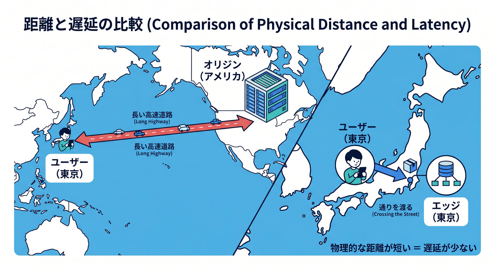
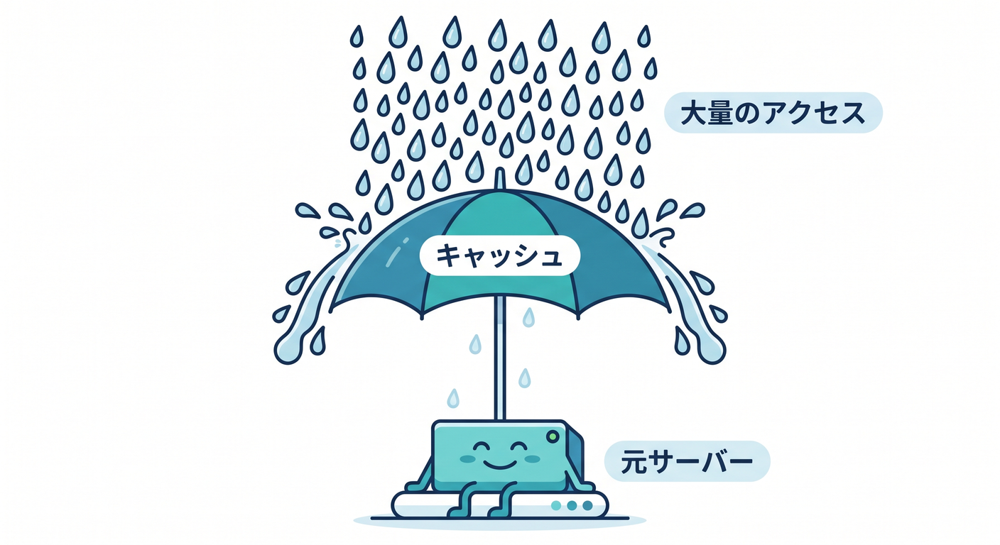
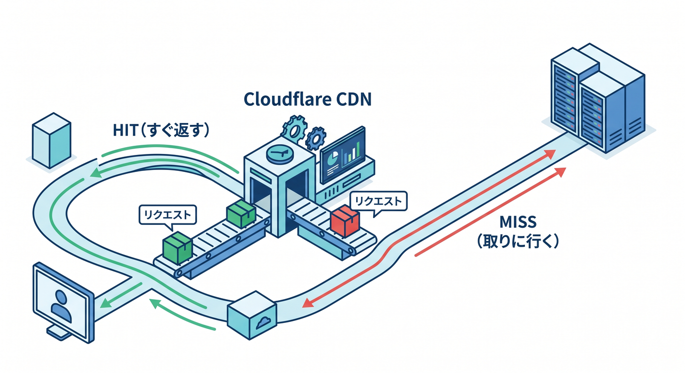
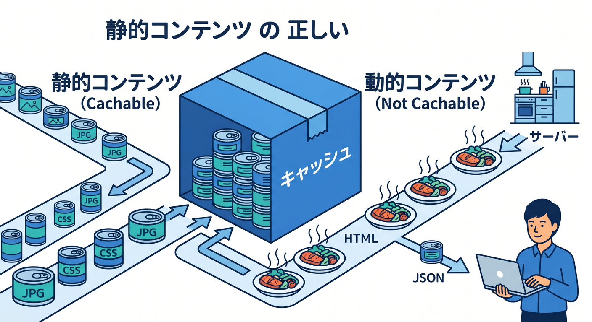
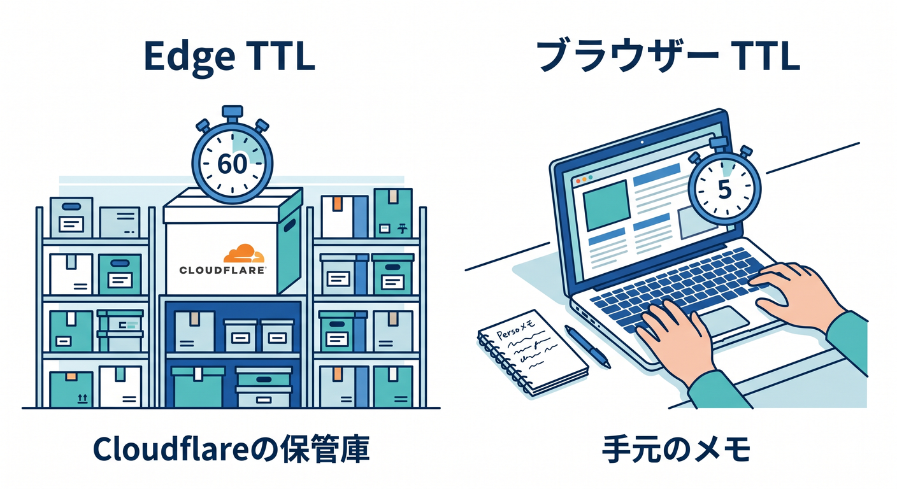

# 第04章：CDNって何？ なぜ速くなるの？⚡

この章では、Cloudflareの「速さ」の中心にある CDN とキャッシュを、ふわっとではなくちゃんと理解していきます 😊
ここで大事なのは、「CDN ＝ なんとなく速くなる仕組み」で終わらせないことです。Cloudflareは、世界中の拠点にコンテンツを近づけて返すことで待ち時間を減らし、さらにオリジンサーバーへの負担も軽くします。Cloudflareがプロキシされた DNS レコードの HTTP/HTTPS 通信を自社ネットワークに通し、その途中でキャッシュできるからこそ、この速さが生まれます。 ([Cloudflare Docs][1])

---

## この章のゴール 🎯✨

この章を読み終えるころには、次の3つを自分の言葉で説明できるようになるのが目標です。

1. CDN は「近くにコピーを置いて返す仕組み」だと言えること
2. Cloudflare Cache が「どんな時に効き、どんな時に効きにくいか」がわかること
3. 「速くしたいときに、Cloudflareのどこを触ればよいか」の入口が見えること

---

## 4-1. まず、CDNを超ざっくり言うと？ 📦🌐

CDN は「Content Delivery Network」の略で、コンテンツをユーザーの近くから届けるための仕組みです。Cloudflareの説明では、CDNのコア目標はレイテンシを下げて性能を上げることで、そのために世界中のデータセンターにオリジンのコンテンツをキャッシュし、できるだけエンドユーザーに近い場所から返します。 ([Cloudflare Docs][1])

たとえば、東京の人が見る画像を、毎回アメリカのオリジンサーバーまで取りに行っていたら、どうしても遠回りになります 😵
でも Cloudflare のエッジにその画像のコピーがあれば、東京に近い拠点から返せるので、移動距離が短くなり、体感も軽くなります。これはCloudflare Fundamentalsでも、リバースプロキシが近くでキャッシュを返すことでパフォーマンス向上につながる、と説明されています。 ([Cloudflare Docs][2])



---

## 4-2. なぜ速くなるの？ 理由は1つではないよ ⚡🧠

CDNで速くなる理由は、主に3つあります。

まず1つ目は、**距離が短くなること**です。遠いサーバーまで毎回往復するより、近い拠点から返したほうが待ち時間が減ります。CloudflareのCDNリファレンスでも、「ローカルサーバーがキャッシュ済みコンテンツを返すことでレイテンシが下がり、全体の表示速度が上がる」と説明されています。 ([Cloudflare Docs][1])

2つ目は、**同じものを毎回作り直さなくてよくなること**です。Cloudflare Cache の入門ページでも、キャッシュされたコピーはユーザーに物理的に近く、しかも再計算を必要としないため高速だと説明されています。画像、CSS、JavaScript のような静的アセットは特にこの恩恵を受けやすいです。 ([Cloudflare Docs][3])

3つ目は、**元サーバーが楽になること**です。リクエストのたびにオリジンが全部応答しなくて済むので、CPU、メモリ、回線、接続数の負担が減ります。Cloudflareは Tiered Cache の説明でも、上位層だけがオリジンに問い合わせることで、オリジン負荷や接続数を減らせると説明しています。 ([Cloudflare Docs][4])



---

## 4-3. Cloudflareの中で、実際にはどう流れるの？ 🧭☁️

Cloudflareは、DNS と CDN を使って通信の前に立つ「リバースプロキシ」として動きます。公式ドキュメントでは、プロキシされた DNS レコードの HTTP/HTTPS 通信は Cloudflare を経由し、その先でオリジンサーバーへ転送される、と説明されています。つまり、Cloudflareは単なる管理画面ではなく、実際の通信経路に入って処理しているんですね。 ([Cloudflare Docs][2])

この流れをざっくり書くと、こんな感じです ✨

ブラウザ → Cloudflare の近い拠点 → そこでキャッシュがあれば即返す
キャッシュがなければ → オリジンへ取りに行く → 返しつつキャッシュする



ここで大事なのは、**Cloudflareに通っているからこそ、守る・速くする・振り分けるができる**ということです。第5章の「間に入ることで何をしているの？」へつながる大事な橋渡しになります。 ([Cloudflare Docs][2])

---

## 4-4. 「キャッシュされるもの」と「そのまま通るもの」📁🚦

ここは初心者さんが最初につまずきやすいポイントです 👀
Cloudflare は何でも自動でキャッシュするわけではありません。

Cloudflareのデフォルト挙動では、ファイル拡張子ベースでキャッシュを判断し、HTML や JSON はデフォルトではキャッシュされません。逆に、CSS、JS、画像、PDF、フォントなどは標準でキャッシュ対象になりやすいです。しかも MIME type ではなく、拡張子ベースで見ている点がポイントです。 ([Cloudflare Docs][5])

さらに、Cloudflare は次のような条件ではキャッシュしません。
「Cache-Control」が「private / no-store / no-cache / max-age=0」のとき、レスポンスに「Set-Cookie」があるとき、そして GET 以外のメソッドのときです。逆に、「public かつ max-age > 0」や、未来日付の「Expires」があるとキャッシュしやすくなります。 ([Cloudflare Docs][5])

つまり、初心者向けに一言でいうとこうです 💡

**画像やCSSはキャッシュしやすい。ログイン後の個人ページやAPIレスポンスは、そのままだとキャッシュされないことが多い。**



この感覚を持っておくだけで、あとで「なぜ HIT しないの？」と悩みにくくなります。 ([Cloudflare Docs][5])

---

## 4-5. Cloudflareは“1回目”も賢いの？ 🧠📬

はい、ある程度は賢いです。
Cloudflareは同じデータセンターに同時に同じアセットへのリクエストが大量に来たとき、オリジンへ重複した問い合わせを何本も投げないように、キャッシュロックの仕組みで最初の1本だけをオリジンに送る動きをします。残りは待機し、最初の応答が返ってきたあとに流されます。 ([Cloudflare Docs][5])

これは地味ですがかなり大事です 🙌
「キャッシュがない最初の瞬間」にアクセスが集中しても、オリジンが無駄に何十回・何百回も同じファイルを返さなくて済むからです。CDNは単に“近いコピー置き場”というだけでなく、**混雑させない交通整理役**でもあります。 ([Cloudflare Docs][5])


---

## 4-6. 「HIT」「MISS」って何？ ここが読めると急に強くなる 🔍📈

Cloudflareでは、レスポンスヘッダーの「CF-Cache-Status」を見ると、そのリクエストがキャッシュ的にどう扱われたかがわかります。さらに「Age」は、そのアセットが何秒キャッシュに置かれていたかを表します。 ([Cloudflare Docs][6])

まず覚えたいのはこの5つです ✨

* **HIT**：キャッシュから返せた
* **MISS**：キャッシュになかったのでオリジンから取った
* **EXPIRED**：キャッシュはあったけど期限切れで取り直した
* **BYPASS**：キャッシュしない指示があって素通りした
* **UPDATING**：古いキャッシュを返しつつ、裏で更新中

これらは Cloudflare 公式の cache responses にそのまま整理されています。特に 2026 年時点では、stale-while-revalidate が効くと、期限切れ後の再検証中に「UPDATING」や「HIT」で返す非同期再検証の説明がかなり重要です。 ([Cloudflare Docs][6])

初心者さんはまず、ブラウザの開発者ツールの Network タブで画像や CSS を開き、「CF-Cache-Status」を見るクセをつけるとかなり理解が早いです 😊
「速い気がする」ではなく、「いま本当に HIT しているのか」を観察できるようになります。 ([Cloudflare Docs][6])

---

## 4-7. Cache Rules って何？ どこを触るの？ 🎛️🛠️

Cloudflareでキャッシュを本気で調整するときの主役が Cache Rules です。公式には、Cache Rules で「何をキャッシュ対象にするか」「どこでどのくらいの時間キャッシュするか」「他のルール製品とどう連携するか」を調整できると説明されています。なお、Cache Rules は、そのドメインやサブドメインが Cloudflare でプロキシされていることが前提です。 ([Cloudflare Docs][7])

初心者目線では、まず次の3つを覚えれば十分です 🌟

1. **どのURLをキャッシュするか決める**
2. **Cloudflare側で何秒〜何時間保持するか決める**
3. **ブラウザ側に何秒持たせるか決める**

ここで混ざりやすいのが「Edge Cache TTL」と「Browser Cache TTL」です。
Edge Cache TTL は Cloudflare ネットワーク内でどれだけ保持するか、Browser Cache TTL はユーザーのブラウザでどれだけ保持するかです。しかもブラウザ側は、Cloudflareをパージしてもすぐには消えないことがあります。 ([Cloudflare Docs][8])

この違いをすごく雑にいうと、こうです 😄

* **Edge Cache TTL** ＝ Cloudflare倉庫の保存時間
* **Browser Cache TTL** ＝ お客さんの手元メモの保存時間



サイト修正直後に「更新したのに見た目が変わらない！」となるときは、Cloudflare側ではなくブラウザ側のキャッシュが残っていることも多いです。 ([Cloudflare Docs][8])

---

## 4-8. 2026年時点で覚えておくとお得な話 🌟📦

Cloudflareのキャッシュは、ただの「端っこキャッシュ」だけではありません。
Tiered Cache では、近いエッジ拠点が持っていない場合でも、上位ティアの拠点に問い合わせ、そこにもなければ上位だけがオリジンに行きます。これによりキャッシュヒット率が上がり、オリジンへの接続も減らせます。Smart Tiered Cache は、オリジンに最も近い上位拠点を Cloudflare が動的に選ぶ仕組みです。 ([Cloudflare Docs][4])

さらに Cache Reserve は、「究極の上位キャッシュ」のような立ち位置で、長くコンテンツを保持し、オリジンからの無駄な再取得を減らす仕組みです。大きめの静的アセットや、長期間あまり変わらない配布物と相性がよい考え方です。 ([Cloudflare Docs][9])

そして本日時点で比較的新しい話として、2026年3月には Cache Response Rules が追加され、オリジンを変えずに「Cache-Control」の調整や、キャッシュ前のレスポンス制御ができるようになっています。つまり最近の Cloudflare は、**リクエスト側だけでなくレスポンス側のキャッシュ制御もより細かくなってきた**、という理解でOKです。 ([Cloudflare Docs][10])

---

## 4-9. TypeScriptで、キャッシュの気持ちをつかむミニ例 💻⚛️

ここでは「Worker がオリジンから取ったものを、Cloudflare側のキャッシュにも載せる」イメージだけつかみましょう。
Cloudflare Workers では「caches.default」を使って、通常の fetch と共有されるデフォルトキャッシュにアクセスできます。公式 docs でも、オリジン側のヘッダーを変えにくいときにレスポンスを調整して Cache API へ保存する使い方が案内されています。 ([Cloudflare Docs][11])

```ts
export interface Env {}

export default {
  async fetch(request: Request, env: Env, ctx: ExecutionContext): Promise<Response> {
    const cache = caches.default;
    const cacheKey = new Request(request.url, request);

    let response = await cache.match(cacheKey);
    if (response) {
      return response;
    }

    const originResponse = await fetch(request);

    response = new Response(originResponse.body, originResponse);
    response.headers.set("Cache-Control", "public, s-maxage=60");

    ctx.waitUntil(cache.put(cacheKey, response.clone()));
    return response;
  },
};
```

このコードの気持ちはシンプルです 😊
最初の1回はオリジンへ行って、次から60秒は Cloudflare のキャッシュから返したい、という考え方です。Cloudflare docs でも、Workers では「caches.default」が fetch と共有されるデフォルトキャッシュであり、レスポンスヘッダーを調整して保存する使い方が紹介されています。なお、Worker 自身がその場で作ったレスポンスは、何もしないと「none/unknown」になりうるため、Workers とキャッシュの関係は「ちょっと前に1枚レイヤーがある」と思っておくとわかりやすいです。 ([Cloudflare Docs][11])

---

## 4-10. ReactやNext.jsの人は、ここをどう考える？ ⚛️🌈

React や Next.js の学習中でも、CDN の考え方はすごく大事です。
画面の中身全部を難しく考える前に、まずは「画像・CSS・JS・フォント・配布ファイルは CDN と超相性がよい」と覚えておくとよいです。Cloudflareのデフォルトキャッシュ対象にも、こうした静的アセットが多く含まれています。 ([Cloudflare Docs][5])

一方で、個人ごとに変わる HTML、ログイン後の画面、API の JSON は、そのままだとキャッシュされにくいです。だから現実の設計では、**静的なものは思い切って強くキャッシュし、個別のデータは慎重に扱う**、という分け方がかなり重要です。 ([Cloudflare Docs][5])

---

## 4-11. AI時代のCloudflareらしい見方 🤖☁️✨

ここ、2026年っぽくてとても大事です。
Cloudflareでは、普通の Web コンテンツだけでなく、Workers AI 側にも「prompt caching」という性能最適化があります。これは、同じ前半プロンプトを何度も再計算せず、既に処理した入力を再利用して、TTFT を下げ、TPS を上げる仕組みです。 ([Cloudflare Docs][12])

つまり発想としては、CDNのキャッシュとかなり似ています 😎
「毎回いちから全部やり直さないで、近くにある再利用可能な結果を使う」という考え方が、Web配信でもAI推論でも効いているわけです。Cloudflare Workers AI は Cloudflare のグローバルネットワーク上のサーバレスGPUで動き、Workers や Pages、API から呼び出せます。 ([Cloudflare Docs][13])

さらに AI Search も Workers や Pages の AI binding から使えます。だから Cloudflare は「画像や CSS を速く配る会社」だけではなく、**静的配信・アプリ実行・AI実行を1つの地図の上で考えやすい会社**になっています。 ([Cloudflare Docs][14])

---

## 4-12. VS Code と Copilot で、この章をどう学ぶ？ 🧑‍💻✨

Cloudflare公式は、Workers アプリを VS Code などのエディタやエージェントからプロンプトで作れる案内を出していて、Cloudflare Docs 用の MCP サーバー「docs.mcp.cloudflare.com/mcp」や observability 用 MCP も案内しています。つまり Cloudflare 自身が、**AI込みの学習と実装**をかなり前提にし始めています。 ([Cloudflare Docs][15])

GitHub Copilot 側でも、リポジトリ直下に「.github/copilot-instructions.md」を置いて自然言語でルールを書けることが公式 docs に明記されています。Cloudflareの prompting docs でも、GitHub Copilot を使う場合はそのファイルに Cloudflare 向けの指示を入れる案内があります。 ([GitHub Docs][16])

この第4章を学ぶときに、Copilot や Chat を相棒にするなら、こんな聞き方がかなり相性いいです 💬

* 「このURL群のうち、どれを強くキャッシュするべきか整理して」
* 「HTML と JSON が Cloudflare でデフォルトキャッシュされにくい理由を初心者向けに説明して」
* 「CF-Cache-Status が MISS のままになる原因候補を5つ挙げて」
* 「Cache Rules と Browser Cache TTL の違いを図なしで説明して」

こういう問い方をすると、“コード生成AI”が“教材の家庭教師”として機能しやすいです。Cloudflare docs は Workers 用のベースプロンプトや、エディタで docs を与える方法まで案内しています。 ([Cloudflare Docs][15])

---

## 4-13. ミニ演習 📝🎮

### 演習1：キャッシュされそうなものを分けよう

次のうち、デフォルトでキャッシュされやすいものはどれでしょう？

* 「/images/logo.png」
* 「/styles/app.css」
* 「/api/user-profile.json」
* 「/dashboard」
* 「/manual.pdf」

答えの感覚としては、「png」「css」「pdf」はかなりキャッシュ向き、「json」やHTML系はそのままだと非キャッシュ寄りです。Cloudflareのデフォルト挙動では HTML と JSON はキャッシュされず、拡張子ベースで多くの静的ファイルが対象になります。 ([Cloudflare Docs][5])

### 演習2：「遅い」の原因を想像しよう

画像が重いとき、原因は1つとは限りません。

* そもそもキャッシュされていない
* 毎回 MISS している
* Browser Cache TTL が短い
* オリジンが遠い
* キャッシュ削除後で再び温まっていない

Cache Analytics では、どのURLが MISS なのか、expired なのか、そもそも cache 対象外なのかを確認できます。Pro 以上で利用でき、ホスト名やパスなどで絞り込めます。 ([Cloudflare Docs][17])

---

## 4-14. この章のまとめ 🌈📦

CDN とは、**近くの拠点から返して速くする仕組み**です。Cloudflareはそれを世界中のデータセンターとリバースプロキシで実現しています。 ([Cloudflare Docs][1])

Cloudflare Cache が効くと、表示が速くなるだけでなく、オリジンサーバーの負担も減ります。さらに Tiered Cache や Cache Reserve まで視野を広げると、「ただ保存する」以上に、オリジン保護や運用コストの話にもつながっていきます。 ([Cloudflare Docs][4])

そして 2026 年の Cloudflareらしいポイントは、**Web のキャッシュ発想が AI にも広がっていること**です。Workers AI の prompt caching まで含めて見ると、「Cloudflareは速くする会社」という言葉が、かなり立体的に見えてきます。 ([Cloudflare Docs][12])

---

## 次の章へのつなぎ 🚪➡️

次の第5章では、
**「Cloudflareは“間に入る”ことで何をしているの？」**
という話に進むのが自然です 😊

この第4章で「近くから返して速い」が見えたので、次は一段深く、
**なぜ Cloudflare が守ったり振り分けたり書き換えたりできるのか**
を理解しに行く流れになります。

必要なら次に、この調子で **第5章の詳細教材** もそのまま続けて作れます。

[1]: https://developers.cloudflare.com/reference-architecture/architectures/cdn/ "Content Delivery Network (CDN) Reference Architecture · Cloudflare Reference Architecture docs"
[2]: https://developers.cloudflare.com/fundamentals/concepts/how-cloudflare-works/ "How Cloudflare DNS works · Cloudflare Fundamentals docs"
[3]: https://developers.cloudflare.com/cache/get-started/ "Get started with Cache · Cloudflare Cache (CDN) docs"
[4]: https://developers.cloudflare.com/cache/how-to/tiered-cache/ "Tiered Cache · Cloudflare Cache (CDN) docs"
[5]: https://developers.cloudflare.com/cache/concepts/default-cache-behavior/ "Default Cache Behavior · Cloudflare Cache (CDN) docs"
[6]: https://developers.cloudflare.com/cache/concepts/cache-responses/ "Cloudflare cache responses · Cloudflare Cache (CDN) docs"
[7]: https://developers.cloudflare.com/cache/how-to/cache-rules/ "Cache Rules · Cloudflare Cache (CDN) docs"
[8]: https://developers.cloudflare.com/cache/how-to/edge-browser-cache-ttl/ "Edge and Browser Cache TTL · Cloudflare Cache (CDN) docs"
[9]: https://developers.cloudflare.com/cache/advanced-configuration/cache-reserve/?utm_source=chatgpt.com "Cache Reserve"
[10]: https://developers.cloudflare.com/cache/changelog/ "Changelog · Cloudflare Cache (CDN) docs"
[11]: https://developers.cloudflare.com/workers/reference/how-the-cache-works/ "How the Cache works · Cloudflare Workers docs"
[12]: https://developers.cloudflare.com/workers-ai/features/prompt-caching/ "Prompt caching · Cloudflare Workers AI docs"
[13]: https://developers.cloudflare.com/workers-ai/ "Overview · Cloudflare Workers AI docs"
[14]: https://developers.cloudflare.com/ai-search/usage/workers-binding/ "Workers Binding · Cloudflare AI Search docs"
[15]: https://developers.cloudflare.com/workers/get-started/prompting/ "Prompting · Cloudflare Workers docs"
[16]: https://docs.github.com/copilot/customizing-copilot/adding-custom-instructions-for-github-copilot "Adding repository custom instructions for GitHub Copilot - GitHub Docs"
[17]: https://developers.cloudflare.com/cache/performance-review/cache-analytics/ "Cache Analytics · Cloudflare Cache (CDN) docs"
