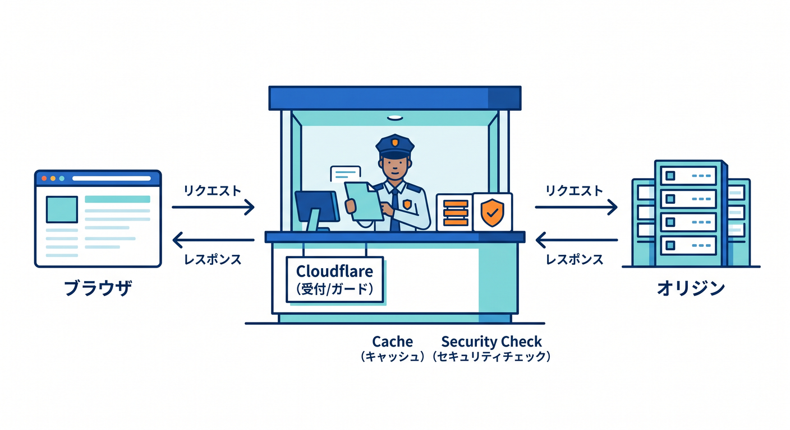
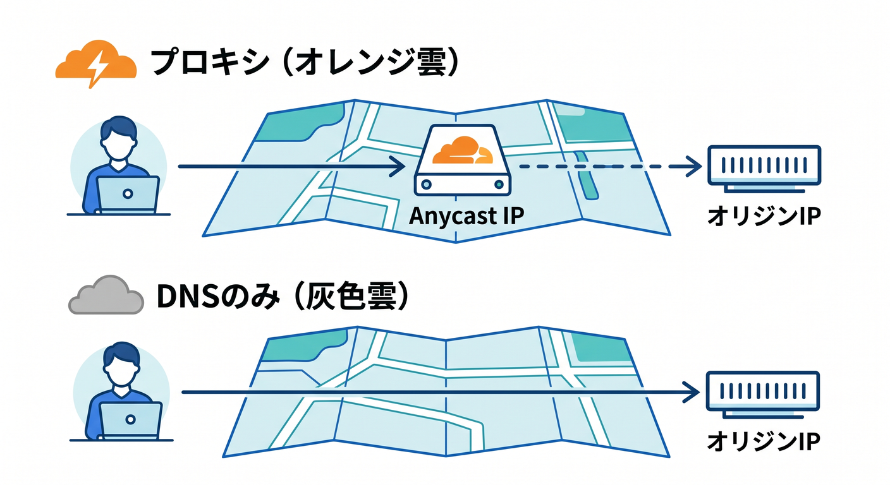
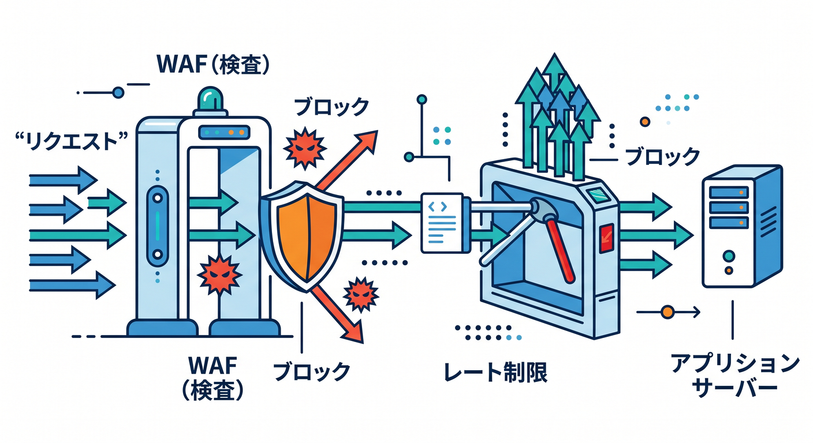
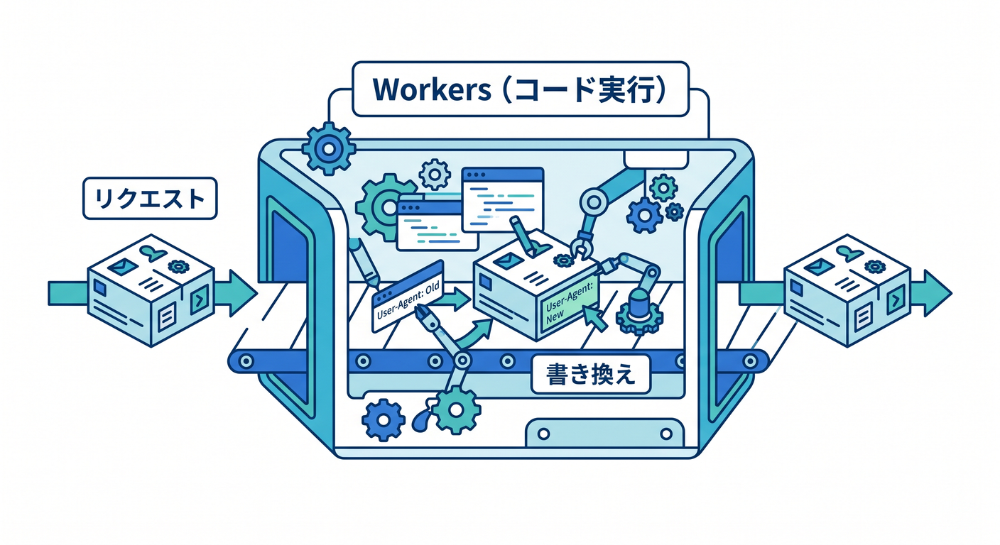
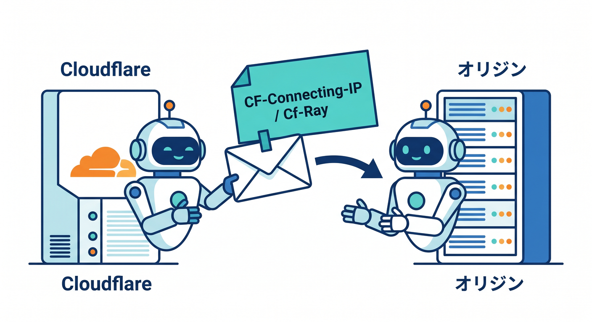
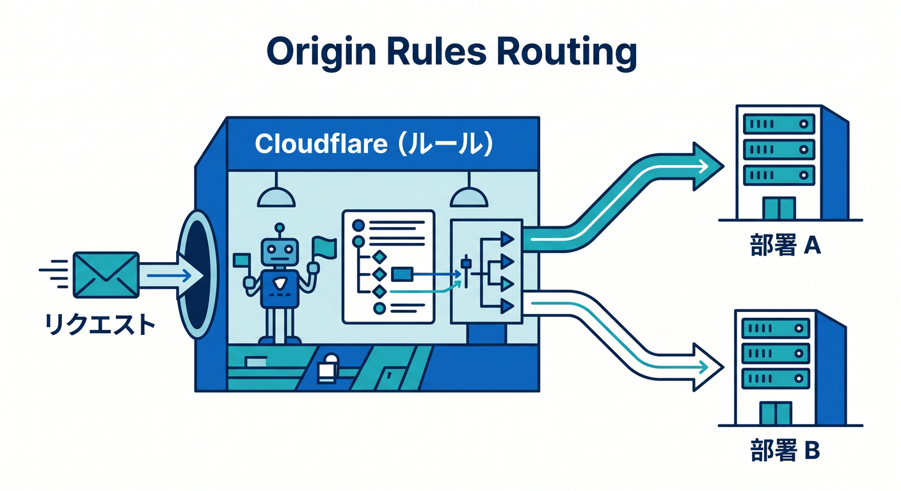
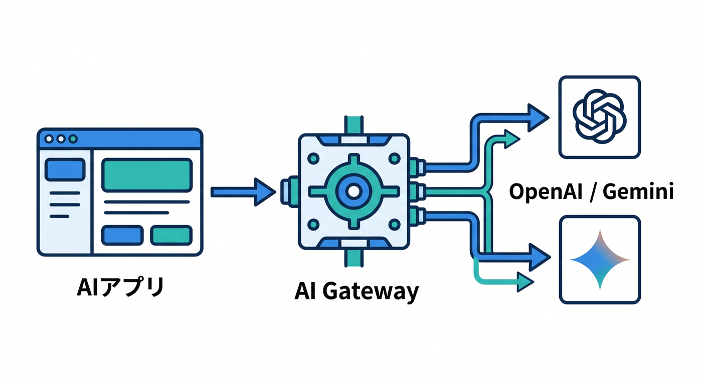

# 第05章：Cloudflareは“間に入る”ことで何をしているの？🛡️

この章では、Cloudflareを「便利な管理画面」ではなく、**通信の通り道に実際に入って働く存在**としてつかみます😊
ここが見えると、CDN、WAF、Workers、AI Gateway などがバラバラな機能ではなく、**“同じ通り道の上で動いている仲間たち”**に見えてきます。Cloudflareは、ドメインを載せたあとに DNS プロバイダとしてだけでなく、**リバースプロキシ**としても振る舞います。([Cloudflare Docs][1])

## この章のゴール 🎯📘

この章のゴールは3つです😊
1つ目は、「Cloudflareがどこに立っているのか」を頭の中で図にできること。2つ目は、「なぜ速くしたり守ったりできるのか」を説明できること。3つ目は、「この“間に入る”考え方が、いまはWebだけでなくAIにも広がっている」とわかることです。Cloudflareは、プロキシされた DNS レコードの HTTP/HTTPS 通信を自分のネットワークに通し、その途中で最適化・保護・制御を行えるようにしています。([Cloudflare Docs][2])

## まずは超ざっくり図で理解しよう 🗺️✨

Cloudflareが入っていないときは、ブラウザがDNSでサーバーの住所を調べて、そのままオリジンサーバーへ話しかけます。
Cloudflareが入ると、ブラウザはまずCloudflare側へつながり、Cloudflareが必要に応じて**キャッシュから返す・Workersで処理する・安全チェックする・最後にオリジンへ渡す**、という流れになります。つまりCloudflareは、ただ横で見ているのではなく、**入口の受付兼ガード兼高速レーン兼実行基盤**みたいな場所に立っています。([Cloudflare Docs][3])

## 「間に入る」って、具体的にはどこに入るの？ 🧭🟠

Cloudflareでは DNS レコードごとに Proxy status を設定できます。A、AAAA、CNAME レコードは Cloudflare でプロキシでき、**Proxied（オレンジ雲）**にすると、その名前へのDNS応答はオリジンIPではなく **Cloudflare の anycast IP** を返します。すると、そのホスト名への HTTP/HTTPS リクエストは Cloudflare のネットワークへ入り、Cloudflare の機能を適用できるようになります。([Cloudflare Docs][4])

ここが超大事です💡
Cloudflareを使っていても、**全部の通信が勝手にCloudflareを通るわけではありません。** あくまで「そのDNSレコードがプロキシされているか」がカギです。しかも基本はHTTP/HTTPS向けで、Cloudflareの通常プロキシが扱うのは既定の対応ポート群です。たとえば SSH の 22 番ポートのようなケースでは、灰色雲で直結するか、別製品の Spectrum を使う、という考え方になります。([Cloudflare Docs][4])

## リバースプロキシって、むずかしい言葉に見えるけど… 🤝🏢

リバースプロキシをやさしく言うと、**お店の奥にいる本体スタッフの前に立つ“受付カウンター”**です😊
お客さんはまず受付に話しかけ、受付が「これはそのまま通してよいか」「キャッシュで済むか」「怪しくないか」「別の窓口へ回すか」を判断してから奥へ渡します。Cloudflare の公式説明でも、リバースプロキシはWebサーバーの前に座り、リクエストを転送したり、場合によってはサーバーの代わりに応答したりする仕組みで、**セキュリティ・性能・信頼性を高めるために使われる**と整理されています。([Cloudflare Docs][2])

## リクエストはどう流れるの？ 6ステップで見よう 🚶‍♂️➡️☁️➡️🖥️

### 1. ブラウザがDNSを引く 🔎

まずブラウザは「このドメインはどこへ行けばいいの？」とDNSで尋ねます。プロキシされたレコードなら、返ってくるのはCloudflareの anycast IP です。ここで最初から「Cloudflare経由の道」に乗ります。([Cloudflare Docs][4])

### 2. いちばん近いCloudflare拠点へ届く 🌍⚡

Cloudflareのグローバルネットワークは、世界 330 以上の都市に展開され、すべてのデータセンターで各種サービスを動かす設計です。そのため、リクエストは利用者に近い拠点で受けられ、近くで処理されやすくなります。([Cloudflare][5])

### 3. Cloudflareが“見て”“選ぶ” 👀🧠

Cloudflare WAF は入ってくるWeb/APIリクエストをルールセットでチェックし、IP、URL パス、ヘッダー、本文などの条件で不要な通信を弾けます。さらに Rate Limiting では、一定時間内のアクセス回数に上限を設け、ログイン総当たりや API 乱打のような使われ方を抑えられます。([Cloudflare Docs][6])

### 4. すでに持っていれば、その場で返す 📦✨

Cloudflareはキャッシュから返せるならオリジンへ行かずに返せますし、Workers を使っていれば**キャッシュの前後で処理**を差し込めます。公式ドキュメントでも、Workers はリクエストがキャッシュへ届く前にも、キャッシュから戻った後にも働けると説明されています。([Cloudflare Docs][7])

### 5. 必要ならWorkersでコードが動く ⚙️💡

Cloudflareでは、受付を通ったリクエストに対して Workers が独自ロジックを実行できます。URLを書き換える、認証を入れる、ヘッダーを整える、APIレスポンスを組み立てる、といった処理をサーバー手前で行えるわけです。もしアプリが Workers や Pages 上にあるなら、Cloudflare のグローバルネットワーク自体がそのままオリジンとして応答します。([Cloudflare Docs][8])

### 6. それでも必要なら、最後にオリジンへ渡す 🖥️➡️

Cloudflareは必要な場合だけオリジンサーバーへ転送します。このとき、オリジン側では `CF-Connecting-IP` で元の訪問者IPを受け取れ、`Cf-Ray` でそのリクエストの追跡もしやすくなります。つまり「Cloudflareが前に立つ」と、オリジンは完全に見えなくなるのではなく、**必要な情報を受け取りつつ、むき出しではなくなる**のです。([Cloudflare Docs][9])

## だからCloudflareは何がうれしいの？ 🌟🛡️⚡

Cloudflareが通り道に入る最大の利点は、**オリジンサーバーの前に“判断レイヤー”を置けること**です。
オリジンIPを直接見せにくくできるので、狙い撃ちのDDoS攻撃を受けにくくなりますし、途中でキャッシュやWAFやルール処理を入れられます。Cloudflareの公式説明でも、リバースプロキシの利点として、オリジンIPを隠しやすいこと、攻撃対策、性能向上、負荷分散などが挙げられています。([Cloudflare Docs][2])

さらに、Cloudflareのプロキシは**完全なHTTPリクエストを受け取ってから**必要な処理をするので、低速でじわじわ接続を食いつぶすタイプの攻撃に対しても盾として働きます。Cloudflareは、フルリクエストを受けてから転送・キャッシュ応答・設定に基づく処理を行う、と明記しています。([Cloudflare Docs][10])

## 「途中で道を変える」こともできる 🌈🛣️

Cloudflareが前に立っていると、単に守るだけでなく、**どこへ送るか**も変えられます。
たとえば Origin Rules では、条件に応じて送信先オリジン、Host ヘッダー、SNI、宛先ポートなどを変えられます。これは「受付カウンター」が、案件によって裏の部署を振り分けるイメージです。こうした制御は、プロキシされたDNSレコードであることが前提です。([Cloudflare Docs][11])

## ここでAIの話につなげよう 🤖☁️✨

この「間に入る」考え方は、いまはWebだけでなく**AIアプリの通り道**にも広がっています。
AI Gateway は、OpenAI、Anthropic、Gemini、Workers AI などへのAIリクエストを**1つの入口**で受け、ログ、分析、キャッシュ、レート制限、リトライ、モデルフォールバックなどをまとめて扱えます。つまりAI Gatewayは、AI版の“Cloudflareが間に入る”をかなりわかりやすく体現したサービスです。([Cloudflare Docs][12])

そして Workers AI は、Cloudflareのグローバルネットワーク上でサーバーレスGPUを使ってモデル推論を実行できます。つまり、**アプリ本体は Workers、モデル実行は Workers AI、外部モデル呼び出しの整理は AI Gateway** というふうに、Cloudflareの中だけでもかなり自然なAI構成が組めます。([Cloudflare Docs][13])

## 初学者がハマりやすい誤解 🚧😵

**誤解その1：Cloudflareを入れたらサーバーはいらない。**
これは半分だけ正解です。従来のサイトなら、Cloudflareは多くの場合オリジンの前に立つ存在です。ただし、Workers や Pages に載せた場合は Cloudflare のネットワーク自体がオリジンとして働くので、そのときは「Cloudflareが前」でもあり「Cloudflareが本体」でもあります。([Cloudflare Docs][2])

**誤解その2：Cloudflareを使えば全部の通信を守れる。**
これもそのままでは違います。通常プロキシできるのはプロキシ対象の A/AAAA/CNAME レコードで、しかも基本は対応する HTTP/HTTPS ポートの通信です。Webの前に立つのは得意ですが、何でもそのまま同じ形で受けるわけではありません。([Cloudflare Docs][4])

**誤解その3：Cloudflareは“見るだけ”で、実行はしない。**
これも違います。CloudflareはWorkersでコードを動かせますし、Workers AIで推論もでき、AI GatewayでAI通信そのものの制御もできます。2026年のCloudflareは、保護や配信だけの場所ではなく、**通り道の上で実際に処理までやる場所**です。([Cloudflare Docs][14])

## この章のミニ実践イメージ 🧪🖱️

学習用に頭の中でこう想像してみてください😊
`www.example.com` をオレンジ雲にすると、ブラウザは Cloudflare の anycast IP へ向かいます。そこでWAFやRate Limitingを通り、キャッシュにあればその場で返り、必要なら Workers が動き、それでも必要な分だけオリジンへ行きます。返ってくる途中でも、Workers はレスポンスに手を入れられます。これがわかると、Cloudflareダッシュボードにある Security、Cache、Workers、Rules が「別々の箱」ではなく、**同じリクエストに対する別の関わり方**だと見えてきます。([Cloudflare Docs][4])

## GitHub Copilotを使って、この章をどう学ぶ？ ✍️🤝🧠

Cloudflareは、Workers向けのベストプラクティスをAIツールへ渡すための**公式プロンプト**を案内していて、GitHub Copilot では `.github/copilot-instructions.md` に入れる方法を紹介しています。また、AI対応エディタ向けに `llms.txt` / `llms-full.txt` を使ってドキュメント文脈を渡す方法も案内しています。つまり、「CloudflareをAIに雑に聞く」のではなく、**公式ドキュメント文脈つきでCopilotに考えさせる**のが、かなり相性のよい学び方です。([Cloudflare Docs][15])

実際の開発では、Cloudflare Vite plugin が Vite と Workers runtime をフル機能でつなぎ、ローカルでの挙動を本番に近づけやすくしています。さらに Workers Playground はセットアップ不要でブラウザから即試せるので、「まず通り道の理解を深めたい」という段階でも使いやすいです。([Cloudflare Docs][16])

## まとめ 🌟📦

この章のいちばん大事な一文はこれです👇
**Cloudflareは、DNSで入口を握り、プロキシで通信の通り道に入り、その場所で“速くする・守る・動かす・制御する”をまとめて行う。** です。([Cloudflare Docs][2])

だからCloudflareは、CDNだけでも、WAFだけでも、Workersだけでもありません。
**“リクエストが通る本線の上で、いろいろな役を同時にこなすプラットフォーム”** と捉えると、次の章で出てくるセキュリティ機能や、後半で学ぶWorkers・AI・ストレージがすごくつながって見えてきます。([Cloudflare Docs][2])

## 理解チェック ✅😊

1. オレンジ雲にしたDNSレコードでは、ブラウザは最初に誰へ向かいますか？ ([Cloudflare Docs][4])
2. Cloudflareが“間に入る”ことで、なぜWAFやキャッシュを適用しやすくなるのでしょうか？ ([Cloudflare Docs][2])
3. Cloudflareがオリジンへ渡す前にできることを、3つ言えますか？ ([Cloudflare Docs][6])
4. AI Gateway は、Web版の何に近い立ち位置でしょうか？ ([Cloudflare Docs][12])
5. `CF-Connecting-IP` と `Cf-Ray` は、オリジン側で何に役立ちますか？ ([Cloudflare Docs][9])

次はこの流れを土台にして、第6章の「Cloudflareの守る力」を入るとかなり理解しやすいです 🔐✨

[1]: https://developers.cloudflare.com/fundamentals/manage-domains/add-site/ "Onboard a domain · Cloudflare Fundamentals docs"
[2]: https://developers.cloudflare.com/fundamentals/concepts/how-cloudflare-works/ "How Cloudflare DNS works · Cloudflare Fundamentals docs"
[3]: https://developers.cloudflare.com/reference-architecture/design-guides/secure-application-delivery/ "Securely deliver applications with Cloudflare · Cloudflare Reference Architecture docs"
[4]: https://developers.cloudflare.com/dns/proxy-status/ "Proxy status · Cloudflare DNS docs"
[5]: https://www.cloudflare.com/network/?utm_source=chatgpt.com "Cloudflare Global Network | Data Center Locations"
[6]: https://developers.cloudflare.com/waf/?utm_source=chatgpt.com "Overview · Cloudflare Web Application Firewall (WAF) docs"
[7]: https://developers.cloudflare.com/cache/interaction-cloudflare-products/workers/ "Customize cache behavior with Workers · Cloudflare Cache (CDN) docs"
[8]: https://developers.cloudflare.com/workers/configuration/workers-with-page-rules/ "Page Rules with Workers · Cloudflare Workers docs"
[9]: https://developers.cloudflare.com/fundamentals/reference/http-headers/ "Cloudflare HTTP headers · Cloudflare Fundamentals docs"
[10]: https://developers.cloudflare.com/ddos-protection/frequently-asked-questions/ "Frequently asked questions for DDoS Protection · Cloudflare DDoS Protection docs"
[11]: https://developers.cloudflare.com/rules/origin-rules/ "Origin Rules · Cloudflare Rules docs"
[12]: https://developers.cloudflare.com/ai-gateway/ "Overview · Cloudflare AI Gateway docs"
[13]: https://developers.cloudflare.com/workers-ai/ "Overview · Cloudflare Workers AI docs"
[14]: https://developers.cloudflare.com/workers/?utm_source=chatgpt.com "Overview · Cloudflare Workers docs"
[15]: https://developers.cloudflare.com/workers/get-started/prompting/ "Prompting · Cloudflare Workers docs"
[16]: https://developers.cloudflare.com/workers/vite-plugin/ "Vite plugin · Cloudflare Workers docs"
