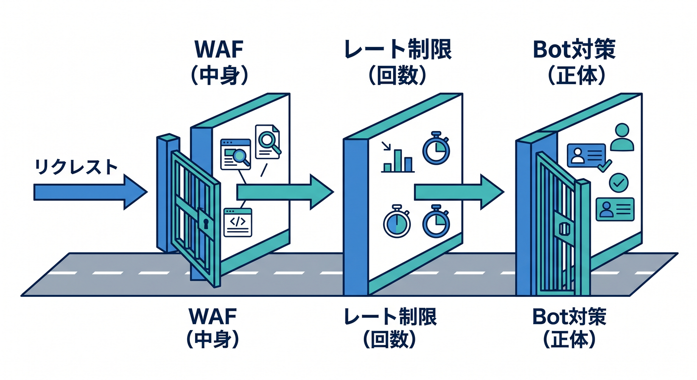
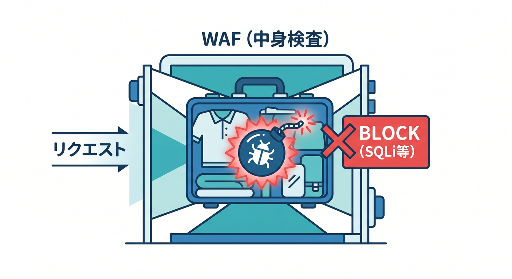
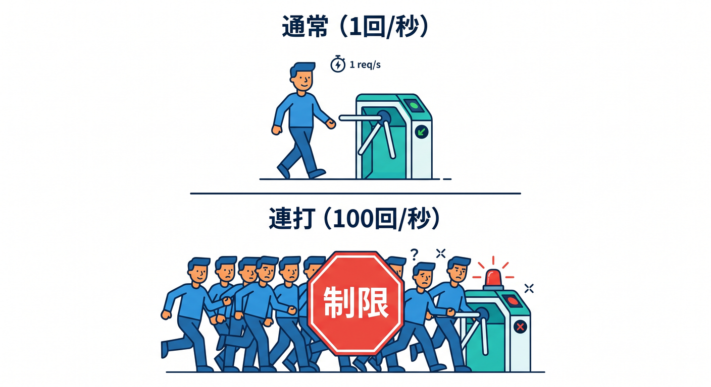
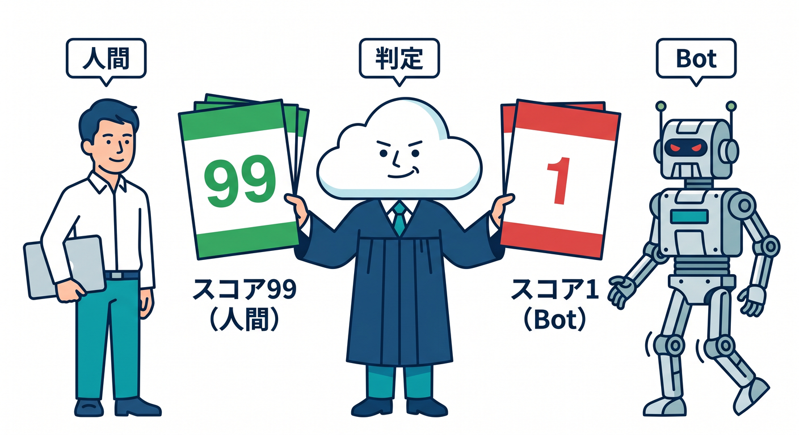
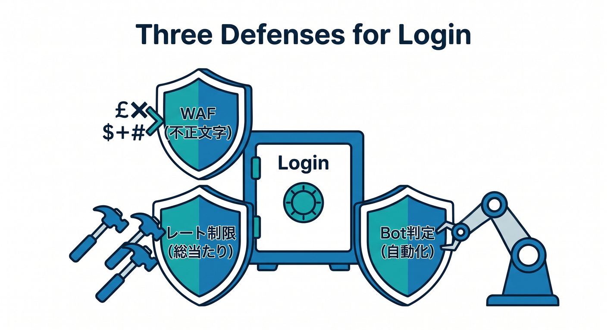
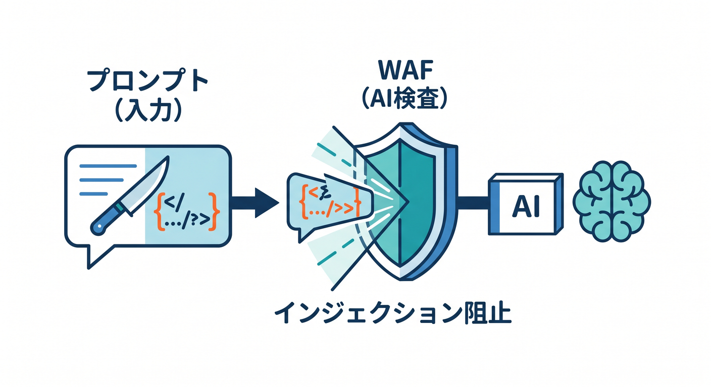
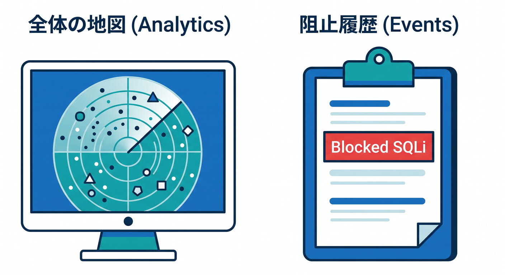

# 第06章：Cloudflareの“守る力”を地図で見る 🔐

この章では、Cloudflareの守り系機能を「なんとなく怖そうなセキュリティ機能の集まり」としてではなく、**どこを見て、何を止めるのか**で整理していきます😊
2026年4月14日時点の公式ドキュメントを見ると、Cloudflareの守りは単独の1機能ではなく、**WAF・Rate Limiting・Bot対策・DDoS対策・分析画面**などが段階的に動く設計になっています。ここを地図としてつかめると、あとでWorkersやAIアプリを作るときも迷いにくくなります。 ([Cloudflare Docs][1])

## この章のゴール 🎯

この章を読み終えるころには、次の3つができる状態を目指します✨

1. **WAF・Rate Limiting・Bot対策の違い**を、自分の言葉で説明できる
2. **ログイン、API、AIチャット、公開サイト**で、どの守りを使うべきか考えられる
3. Cloudflareダッシュボードで、**「何が止めたのか」**を追いやすくなる

---

## 1. Cloudflareの守りは「多層防御」だと思えばわかりやすいです 🧱🧱🧱

Cloudflareは、受け取ったリクエストに対して複数のセキュリティ機能を順番に適用します。Cloudflare公式は、各機能が**決まった段階**で動くと説明していて、もし途中で `Block` や `Managed Challenge` のような終了系アクションが発生すると、その先の段階まで進みません。つまり、全部が同時に雑に動くのではなく、**順番のある関所**として動いています。 ([Cloudflare Docs][1])

公式ドキュメント上の実行順の中心は、ざっくり言うと **DDoS保護 → Custom rules → Rate limiting rules → Managed Rules → Super Bot Fight Mode** です。さらに Bot Fight Mode はこの段階システムの外で動くため、Custom rules の `Skip` では飛ばせません。ここは初心者がつまずきやすいところですが、逆に言うと、**「何をどの段で効かせるか」**がCloudflareの守りの考え方そのものです。 ([Cloudflare Docs][1])

この章では、まず次のイメージで覚えるのがおすすめです 😊

* **WAF** = リクエストの**中身**を見る係
* **Rate Limiting** = 短時間の**回数**を見る係
* **Bot対策** = 相手が**人か自動か**を見る係  ([Cloudflare Docs][2])

---

## 2. WAFは「中身を見る守り」です 🔎🛡️

Cloudflare WAF は、入ってくるWebやAPIのリクエストを調べて、望ましくない通信をルールセットでフィルタする仕組みです。Cloudflare公式では、WAFは **IPアドレス、URLパス、ヘッダー、ボディ内容** などのリクエスト情報をもとに判定できると説明されています。つまりWAFは、「この人が短時間に多い」ではなく、**「このリクエストの内容が怪しい」**を見つけるのが得意です。 ([Cloudflare Docs][2])

しかもWAFには2つの顔があります😊
1つは、Cloudflareが用意してくれる**Managed Rules**です。これは既知の脆弱性や攻撃パターンに対応するための、いわば「最初から入っている防犯ルール」です。もう1つは、自分で条件を書く**Custom rules**です。たとえば「`/admin` だけ厳しくする」「特定の国やヘッダーだけ追加条件をつける」といった、自分のアプリ向けの守りを足せます。 ([Cloudflare Docs][2])

ここがCloudflareのWAFの面白いところで、**自動防御と自作ルールの両方**を同じ守りの地図の中で扱えます。初心者のうちは、まず Managed Rules を「自動の基本装備」、Custom rules を「自分のサイト事情に合わせた追加ルール」と分けて考えるとスッと入ります✨ ([Cloudflare Docs][2])

さらに本日時点の公式情報を見ると、CloudflareはWAFのManaged Rulesを継続的に更新していて、変更点はWAF changelogで確認できます。Cloudflareは新規・更新ルールを通常7日サイクルで出し、最初は `Log` だけで様子見し、その次のリリースで本来のデフォルト動作に切り替える流れを案内しています。2026年4月7日の更新でも、MCP ServerのRCEやSolarWinds関連の検知追加が掲載されています。つまりWAFは、買って終わりの静的な壁ではなく、**Cloudflare側が育て続ける防御レイヤー**です。 ([Cloudflare Docs][3])

---

## 3. Rate Limitingは「回数を見る守り」です 🚦⏱️

Rate Limiting は、**ある条件に一致する通信が、一定時間内に何回来たか**を見る仕組みです。Cloudflare公式でも、ログイン画面の総当たり防止や、APIの呼び出し回数制限などが代表例として案内されています。つまりこちらは、内容よりも**頻度や連打**に強い守りです。 ([Cloudflare Docs][4])

CloudflareのRate Limitingには、基本的に次の考え方があります😊
「どの通信を対象にするか」を式で決め、
「誰ごとに数えるか」を characteristic で決め、
「何秒の間に何回まで許すか」を period と requests per period で決め、
超えたら何秒間どうするかを duration と action で決めます。
この設計のおかげで、単なる「IPごとの秒間回数」だけではなく、ヘッダー、Cookie、ホスト名、JSONフィールドなどを軸に数える高度な守りまで可能です。 ([Cloudflare Docs][4])

公式のベストプラクティスを見ると、Rate Limiting はかなり守備範囲が広いです。**credential stuffing 対策、スクレイピング抑制、REST API保護、GraphQL保護、リソース枯渇攻撃対策**などに使えます。つまり「回数制限」と聞くと地味ですが、実際には**公開アプリの乱用対策の中心人物**です。 ([Cloudflare Docs][5])

初心者向けにひとことで言うなら、Rate Limiting は
**「普通の人ならこの短時間にそんな連打しないよね？」を機械的に止める仕組み**
だと思えばOKです 👍✨

---

## 4. Bot対策は「相手の正体を見る守り」です 🤖👀

CloudflareのBot対策は、「ボットを全部悪者扱いする」のではなく、**どれくらい自動っぽいか**を見て扱いを変える考え方です。Cloudflare公式の bot solutions では、Bot Fight Mode、Super Bot Fight Mode、Bot Management for Enterprise が整理されています。小さめのサイトならBot Fight ModeやSuper Bot Fight Mode、大規模サイトや厳密制御が必要ならEnterprise向けBot Management、という住み分けです。 ([Cloudflare Docs][6])

まず **Bot Fight Mode** は無料プランで使えるシンプルな守りです。既知のボットっぽいパターンを検出して挑戦させる方向で、**細かいカスタマイズはできず、Skipもできません**。気軽にONにしやすい代わりに、「例外をきれいに作りたい」場面には向きません。 ([Cloudflare Docs][1])

次に **Super Bot Fight Mode** は、Pro / Business / Enterprise（Bot Management add-onなし時）で使える、もう少し調整しやすい守りです。Cloudflare公式では、Definitely automated、Likely automated、Verified bots といった区分ごとに動作を分けられ、Custom rules の `Skip` で一部通信を除外できると説明されています。こちらは「決済代行や監視サービスだけ通したい」みたいな現実的な調整に向いています。 ([Cloudflare Docs][1])

さらに **Bot Management** はEnterprise向けの上位機能で、各リクエストに **1〜99の bot score** を付けます。Cloudflare公式では、**低いほど自動化された通信っぽい**と説明されていて、この点数をWAF custom rulesやWorkersで使えます。つまりEnterpriseでは、「Bot対策」が単なるON/OFFではなく、**点数ベースの柔らかい防御ロジック**に進化します。 ([Cloudflare Docs][7])

そして2026年のCloudflare公式ドキュメントで特に今っぽいのが、**Block AI bots** です。Cloudflareはこれを、AI crawler を自動更新ルールでブロックする機能として案内しており、関連ドキュメントでは GPTBot、ClaudeBot、Bytespider などを例に挙げています。bot関連の追加設定ページでは、Block AI bots は **All plans** と整理されています。公開コンテンツをAIクローラから守りたいサイトには、かなり現代的な選択肢です。 ([Cloudflare Docs][8])

---

## 5. 3つの違いを、ログイン画面で比べるとこうです 🔐

たとえば `/login` を守るとき、3者の役割はこう分かれます。

* **WAF** は、ログインリクエストの中身や条件を見て、不審な入力や怪しいリクエスト条件を止める係です。 ([Cloudflare Docs][2])
* **Rate Limiting** は、同じ相手から `/login` への試行回数が短時間に多すぎると止める係です。Cloudflare公式でも、credential stuffing対策は代表的ユースケースとして挙げられています。 ([Cloudflare Docs][4])
* **Bot対策** は、そのアクセス元が人間っぽいのか、自動ツールっぽいのかを見る係です。Enterpriseでは bot score を使って、低スコアだけ厳しくできます。 ([Cloudflare Docs][7])

この3つを混同しないことが大事です🌱
**WAFだけ入れても連打対策は弱い**し、**Rate Limitingだけでは中身の悪意までは見えない**し、**Bot対策だけでは普通のブラウザを装った攻撃を完全には片づけられない**ことがあります。だからCloudflareは、1枚の壁ではなく、**何層かで守る発想**になっています。 ([Cloudflare Docs][2])

---

## 6. React / Next + Workersの世界で考えると、すごくわかりやすいです ⚛️☁️

たとえば、ReactやNext.jsのフロントから `/api/chat` を叩き、その先でCloudflare WorkersがAIモデルや外部AI APIを呼ぶ構成を考えてみましょう😊
このとき、Cloudflareの守りはかなり素直に役割分担できます。まず、**公開エンドポイントへの通信**はWAFやBot対策の対象になります。次に、**`/api/chat` への連打**はRate Limitingで抑えられます。さらにAIまわりでは、Cloudflareの **AI Gateway** がログ・キャッシュ・Rate Limiting・複数プロバイダの単一エンドポイント化を担えます。 ([Cloudflare Docs][9])

しかも2026年のCloudflareでは、**AI Security for Apps** がWAFの中に組み込まれています。公式では、これはWAF上でAI向け検知フィールドを使える仕組みで、**prompt injection detection** が検出時にスコアを付与し、そのスコアを custom rules や rate limiting rules に使えると説明されています。つまりAIアプリでは、ただ「APIの回数を制限する」だけでなく、**プロンプト内容の危険度**までCloudflare側で扱えるようになってきています。 ([Cloudflare Docs][10])

Cloudflare公式のAI Security for Appsの例では、**prompt injectionのスコア**と**bot score**や**国情報**を組み合わせてルール化する話も出ています。これは初心者にとっても重要で、AI時代のセキュリティは「1つの信号だけで即ブロック」より、**複数の信号を重ねて誤検知を減らす**方向へ進んでいる、と理解するとかなり現代的です。 ([Cloudflare Docs][11])

要するに、AIアプリをCloudflare上で動かすときはこう考えるときれいです✨

* **WAF** で入口を守る
* **Rate Limiting** でコスト爆発や乱用を抑える
* **Bot対策** で自動アクセスを見分ける
* **AI Gateway** でAI呼び出しの観測・制御をする
* **AI Security for Apps** でAI特有の危険な入力も見る  ([Cloudflare Docs][9])

---

## 7. どこで確認するの？ ダッシュボードの見どころ 👀📊

守り機能は、入れるだけでは終わりません。Cloudflareには、**Security Analytics** と **Security Events** という見分けるための画面があります。Cloudflare公式では、Security Analytics は**Cloudflareが止めたかどうかに関係なく、全ての受信HTTPリクエストを見渡す**ための画面で、怪しい傾向の把握や適切なRate Limit値の検討にも使えると案内されています。 ([Cloudflare Docs][12])

一方の **Security Events** は、Cloudflareのセキュリティ機能が**実際に作用した・フラグを立てた**リクエストを見る画面です。Cloudflare公式では、誤検知の調整や、どの機能が止めたのかの確認に向いていると説明しています。さらにセキュリティ機能の相互作用ページでは、Eventsの **Service** フィールドを見ると、どの機能がアクションしたか判断しやすいと案内されています。 ([Cloudflare Docs][13])

初心者向けには、こう覚えるのがおすすめです😊

* **Security Analytics** = 全体の交通量を見る地図
* **Security Events** = 実際に止めた・反応した履歴を見る台帳

この2つを行き来できるようになると、「入れたら壊れた😱」から「どのルールが効いたか見に行こう🙂」へ進めます。 ([Cloudflare Docs][12])

---

## 8. VS Code と Copilot を使う学び方も、かなり相性がいいです ✨💻

Cloudflare公式の Workers ドキュメントでは、Workersアプリを **VS Code などのエディタやエージェントからプロンプトで作る**流れや、Cloudflare docs のMCP、observability系MCPをつないで、ドキュメント理解やログ確認に使う案内があります。つまりCloudflare自身が、**AI支援込みの開発体験**をかなり前提にし始めています。 ([Cloudflare Docs][14])

GitHub公式でも、VS Code の Copilot Chat は `.github/copilot-instructions.md` によるリポジトリ全体の指示、パス別指示ファイル、`AGENTS.md` などのエージェント指示をサポートしています。なので、Cloudflare学習用のリポジトリで「WAF式は読みやすく」「WorkersはTypeScriptで」「Security Eventsで確認前提」みたいな方針をCopilotに覚えさせる運用は、2026年時点ではかなり自然です。 ([GitHub Docs][15])

この章に関しては、Copilotへの頼み方としてはこんな方向が相性よしです😊

* 「`/login` 向けのRate Limiting案を3つ出して」
* 「WAFとRate Limitingの違いを、このWorker APIの文脈で説明して」
* 「このSecurity Eventsの結果から、誤検知っぽい箇所を推定して」

ただし最終判断は、**CloudflareダッシュボードのEventsとAnalyticsで確認する**のが大事です。AIはルール案を出すのは得意でも、実トラフィックの現場確認までは代行してくれません。 ([Cloudflare Docs][12])

---

## 9. 初心者向けのおすすめ導入順 🌱🚀

最初から全部盛りにしなくて大丈夫です。学習用や小規模公開なら、次の順で十分いい流れです😊

1. **まず「Cloudflareは順番に守る」と理解する**
   DDoS保護は全プランで自動、そこにCustom rules / Rate Limiting / Managed Rules / Bot系が重なる、という全体図を先に持ちます。 ([Cloudflare Docs][1])

2. **WAFを「中身を見る守り」として理解する**
   Managed Rules を基本装備、Custom rules を追加装備、と分けて覚えると混乱しにくいです。CloudflareはManaged Rulesを継続更新しています。 ([Cloudflare Docs][2])

3. **次に `/login` や `/api/` にRate Limitingを足す**
   brute-force、credential stuffing、API乱用、スクレイピング抑制など、まずは“回数で防げるもの”から抑えるのがわかりやすいです。 ([Cloudflare Docs][4])

4. **公開サイトならBot対策を入れる**
   無料ならBot Fight Mode、上位ならSuper Bot Fight ModeやBot Managementへ進めます。AIクローラ対策が必要なら Block AI bots も候補です。 ([Cloudflare Docs][6])

5. **AIアプリなら AI Gateway と AI Security for Apps を意識する**
   AI Gateway はログ・キャッシュ・Rate Limiting・複数AIプロバイダの統一窓口に向き、AI Security for Apps は prompt injection のようなAI固有の脅威をWAFの流れで扱えます。 ([Cloudflare Docs][9])

---

## 10. この章のまとめ 🎓✨

この章でいちばん大事なのは、Cloudflareの守りを**機能名の暗記**ではなく、**役割の違い**で理解することです。
**WAFは中身、Rate Limitingは回数、Bot対策は相手の自動っぽさ**を見る。そこにCloudflareの分析画面が加わることで、守りを入れて終わりではなく、**観測して育てる運用**に進めます。さらに2026年のCloudflareでは、AI Gateway や AI Security for Apps のように、AIアプリ向けの守りも同じ地図の中に入り始めています。 ([Cloudflare Docs][2])

次の第7章では、ここで出てきた「公開フォームやログインをどう守るの？」を、**Turnstile** を中心にもう一段具体化していく流れがとても自然です。Cloudflare公式でも、Turnstileはサーバー側のSiteverifyによる検証が必須だと強く案内しています。つまり、見た目のチェックだけではなく、**裏側で本当に検証する**という発想に進んでいきます。 ([Cloudflare Docs][16])

必要ならこのまま続けて、同じトーンで **「第7章　フォームやログインを守るTurnstile入門 🤖」** も詳細教材として書けます。

[1]: https://developers.cloudflare.com/waf/feature-interoperability/ "Security features interoperability · Cloudflare Web Application Firewall (WAF) docs"
[2]: https://developers.cloudflare.com/waf/ "Overview · Cloudflare Web Application Firewall (WAF) docs"
[3]: https://developers.cloudflare.com/waf/change-log/ "Overview of the WAF changelog · Cloudflare Web Application Firewall (WAF) docs"
[4]: https://developers.cloudflare.com/waf/rate-limiting-rules/ "Rate limiting rules · Cloudflare Web Application Firewall (WAF) docs"
[5]: https://developers.cloudflare.com/waf/rate-limiting-rules/best-practices/ "Rate limiting best practices · Cloudflare Web Application Firewall (WAF) docs"
[6]: https://developers.cloudflare.com/bots/ "Overview · Cloudflare bot solutions docs"
[7]: https://developers.cloudflare.com/bots/get-started/bot-management/ "Bot Management · Cloudflare bot solutions docs"
[8]: https://developers.cloudflare.com/bots/additional-configurations/block-ai-bots/?utm_source=chatgpt.com "Block AI Bots"
[9]: https://developers.cloudflare.com/ai-gateway/features/rate-limiting/ "Rate limiting · Cloudflare AI Gateway docs"
[10]: https://developers.cloudflare.com/waf/detections/ai-security-for-apps/?utm_source=chatgpt.com "AI Security for Apps - WAF"
[11]: https://developers.cloudflare.com/waf/detections/ai-security-for-apps/example-rules/?utm_source=chatgpt.com "Example mitigation rules - WAF"
[12]: https://developers.cloudflare.com/waf/analytics/security-analytics/?utm_source=chatgpt.com "Security Analytics - WAF"
[13]: https://developers.cloudflare.com/waf/analytics/security-events/?utm_source=chatgpt.com "Security Events · Cloudflare Web Application Firewall (WAF ..."
[14]: https://developers.cloudflare.com/workers/get-started/prompting/ "Prompting · Cloudflare Workers docs"
[15]: https://docs.github.com/en/copilot/reference/custom-instructions-support "Support for different types of custom instructions - GitHub Docs"
[16]: https://developers.cloudflare.com/turnstile/get-started/?utm_source=chatgpt.com "Get started · Cloudflare Turnstile docs"
