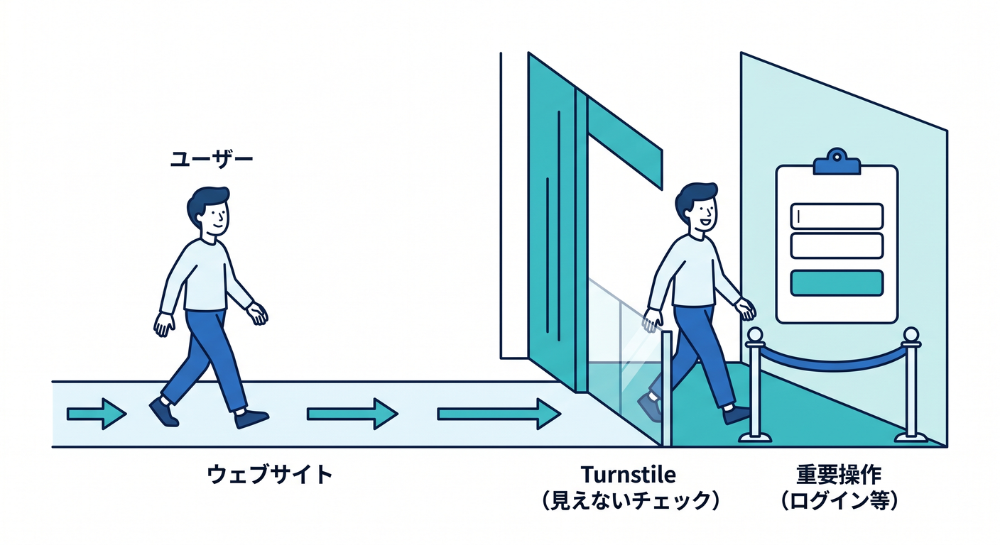
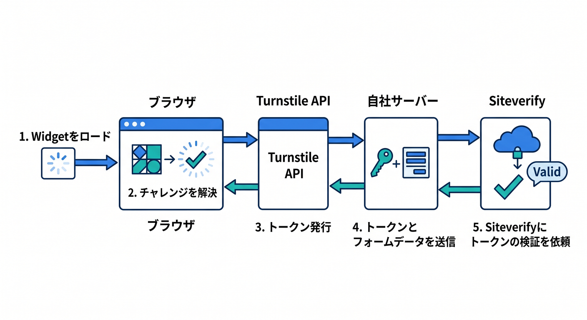
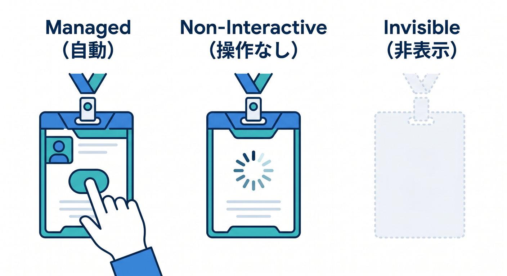
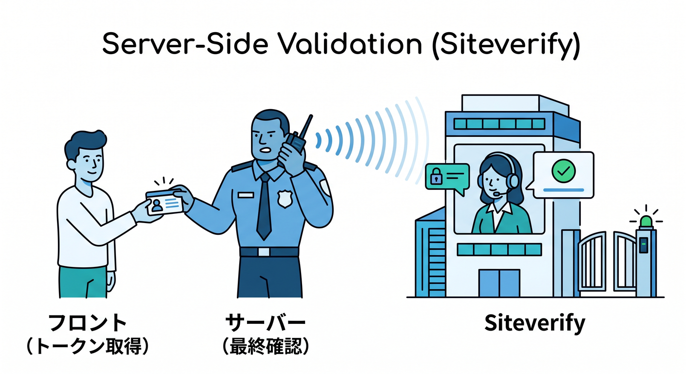
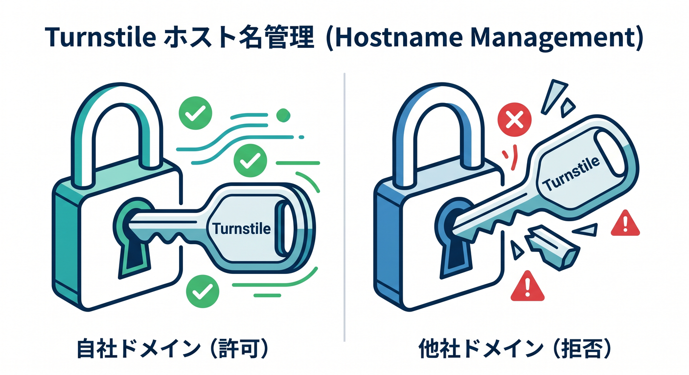
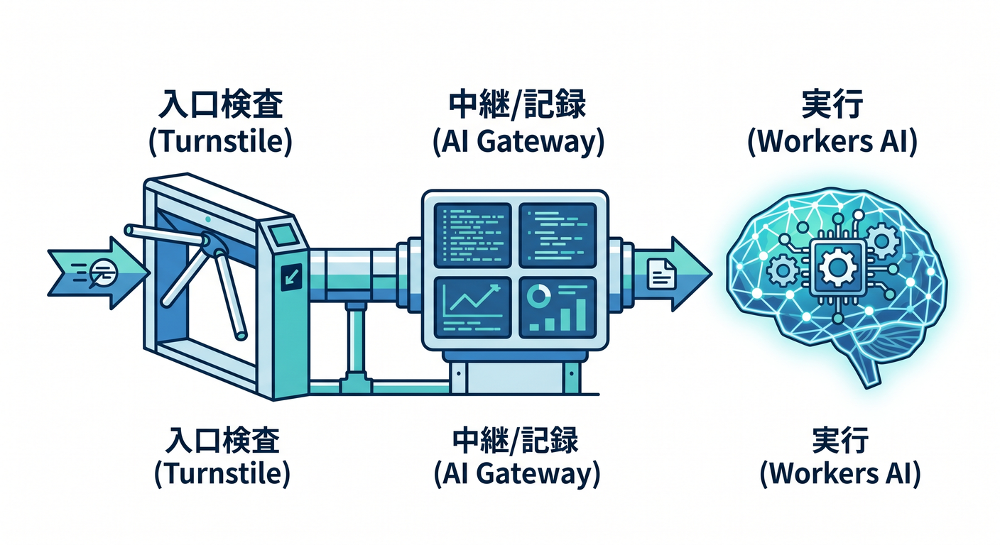
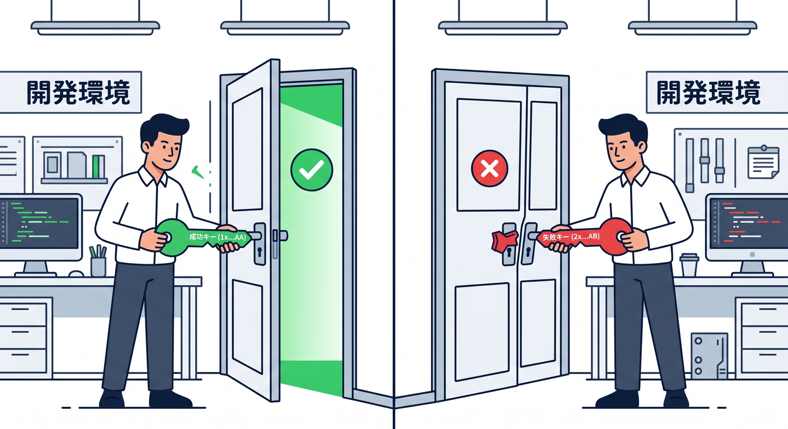

# 第07章：フォームやログインを守るTurnstile入門 🤖

この章は、2026年4月14日時点のCloudflare公式情報をもとに、Turnstileの考え方・実装・運用ポイントを、初学者向けにやさしく整理したものです。TurnstileはCloudflareのCAPTCHA代替で、CloudflareのCDNを通していないサイトにも埋め込めて、できるだけ画面上のわずらわしい認証を減らしながら、フォーム送信やログインなどの“重要な操作”を守れます。 ([Cloudflare Docs][1])

## この章のゴール 🎯

この章を終えるころには、Turnstileを「見た目の部品」ではなく、**フォームやログインの入口で人間確認を行い、その結果をサーバー側で厳密に検証する仕組み**として説明できるようになるのが目標です。特に大事なのは、**画面に表示しただけでは守れない**こと、そして**最終判断は必ずサーバー側で行う**ことです。 ([Cloudflare Docs][2])

---

## 1. まず、Turnstileって何者？ 🤔☁️

Turnstileは、いわゆる「信号機の写真を選んでください」「文字を読んでください」のような体験をなるべく減らすための仕組みです。Cloudflareのドキュメントでは、Managed・Non-Interactive・Invisibleの3モードがあり、特にManagedが推奨されています。Managedは、訪問者のリスクに応じて自動で動きを選び、必要な場合だけチェックボックス型の確認を出します。画像認証や難読文字の入力が前提ではないのが特徴です。 ([Cloudflare Docs][3])

もうひとつ大事なのは、Turnstileは**サイト全体を止める壁**ではなく、**ログイン・会員登録・お問い合わせ送信・パスワード再発行**のような“特定の操作”を守る部品だということです。ユーザーはページ自体は普通に見られますが、敏感な操作へ進むときにTurnstileが働きます。 ([Cloudflare Docs][4])



---

## 2. どんな場面で使うの？ 🧩🛡️

Turnstileが特に効くのは、**入力フォームがある場所**です。たとえば、ログイン画面、サインアップ画面、お問い合わせフォーム、コメント投稿、メール送信、パスワード忘れフォーム、クーポン取得、招待コード発行などです。攻撃者はこういう入口を自動化しやすいので、ここで人間確認を入れる意味があります。Cloudflareのチュートリアルでも、ログイン・サインアップ・お問い合わせフォームの保護が代表例として案内されています。 ([Cloudflare Docs][5])

ただし、Turnstileは**単独ですべてを解決する魔法**ではありません。Cloudflare自身も、Turnstile・WAF・Bot Managementを組み合わせると、多層防御になって回避されにくくなると説明しています。WAFやBot Managementはサーバー側・ネットワーク側、Turnstileはクライアント側・ブラウザ側のシグナルを見る、という役割分担です。 ([Cloudflare Docs][6])

---

## 3. 仕組みを5段階でつかもう 🪜✨

流れはシンプルです。
1つ目、ページにTurnstileウィジェットを置く。
2つ目、ブラウザ上でチャレンジが走る。
3つ目、成功するとトークンが発行される。
4つ目、そのトークンをフォーム送信と一緒にサーバーへ渡す。
5つ目、サーバーがSiteverify APIへ問い合わせて、本物かどうかを確かめる。Cloudflareの公式ドキュメントでも、この5段階の流れが明示されています。 ([Cloudflare Docs][7])



ここで最重要なのが、**4と5を飛ばしてはいけない**ことです。クライアント側の見た目だけでは守れません。Cloudflareは「クライアント側のウィジェットだけではフォームは保護されない」「Siteverify APIの呼び出しは必須」と明記しています。さらに、トークンは**5分で失効**し、**1回しか使えない**ので、使い回し対策にもなっています。 ([Cloudflare Docs][2])

---

## 4. まず覚えるべき3つのモード 🎛️

Turnstileには3つのモードがあります。Managedはおすすめの標準モードで、Cloudflareがリスクに応じて自動調整してくれます。Non-Interactiveは表示はされるけれど、ユーザー操作を基本的に要求しません。Invisibleは完全に見えない形で裏側実行されます。初学者はまず**Managedから始める**のが安全です。 ([Cloudflare Docs][3])



Invisibleは見た目がきれいで魅力的ですが、CloudflareはInvisibleモードを有効にする条件として、**自分のプライバシーポリシー内でCloudflareのTurnstile Privacy Addendumへの言及**を求めています。つまり、Invisibleは単に「見えなくて楽」ではなく、公開運用のときは法務・説明責任も少し意識する必要があります。 ([Cloudflare Docs][4])

---

## 5. 埋め込み方の基本：静的ページとSPAで考え方が違うよ 🧠💡

Turnstileの埋め込みには、**implicit rendering** と **explicit rendering** の2つがあります。implicitはページ読み込み時に自動でウィジェットを探して表示するので、静的ページや普通のフォーム向きです。explicitはJavaScriptで表示タイミングを制御する方式で、ReactのSPAのように、あとから画面要素が出てくる構成に向いています。 ([Cloudflare Docs][7])

また、Turnstileのスクリプトは必ず `https://challenges.cloudflare.com/turnstile/v0/api.js` から読み込む必要があります。Cloudflareは、この `api.js` を**プロキシしたりキャッシュしたりしないこと**も明示しています。さらに、CSPを使うサイトでは `challenges.cloudflare.com` への接続を許可しないと動きません。 ([Cloudflare Docs][3])

---

## 6. 最小構成のサンプルを見よう 👀🧪

まずは、考え方がいちばんわかりやすい最小例です。HTMLフォームにTurnstileを置き、送信先をCloudflare Workerにします。これは「何がどこで起きるか」を理解するためのサンプルです。実運用では見た目をReactに置き換えても、サーバー側の考え方は同じです。Cloudflareの公式フローも、クライアントでトークン生成 → サーバーでSiteverify、という形です。 ([Cloudflare Docs][7])

### フロント側の最小例（HTML）

```html
<!doctype html>
<html lang="ja">
  <head>
    <meta charset="UTF-8" />
    <title>Turnstile Login</title>
    <script
      src="https://challenges.cloudflare.com/turnstile/v0/api.js"
      async
      defer
    ></script>
  </head>
  <body>
    <form action="/login" method="POST">
      <label>
        メールアドレス
        <input type="email" name="email" required />
      </label>

      <label>
        パスワード
        <input type="password" name="password" required />
      </label>

      <div
        class="cf-turnstile"
        data-sitekey="YOUR_TURNSTILE_SITEKEY"
        data-action="login"
      ></div>

      <button type="submit">ログインする</button>
    </form>
  </body>
</html>
```

この例で注目したいのは、Turnstileが送信時に `cf-turnstile-response` をフォームに含めてくれる点です。サーバー側は、この値を取り出してSiteverifyへ送ればよい、という流れになります。Pages Functions向けには、Cloudflare公式のTurnstile Pages Pluginもあり、POSTの `cf-turnstile-response` を検証する専用ルートとして使えます。 ([Cloudflare Docs][7])

### サーバー側の最小例（Cloudflare Worker / TypeScript）

```ts
export interface Env {
  TURNSTILE_SECRET: string;
}

type TurnstileVerifyResponse = {
  success: boolean;
  hostname?: string;
  action?: string;
  challenge_ts?: string;
  ["error-codes"]?: string[];
};

export default {
  async fetch(request: Request, env: Env): Promise<Response> {
    const url = new URL(request.url);

    if (request.method === "POST" && url.pathname === "/login") {
      const formData = await request.formData();

      const email = formData.get("email");
      const password = formData.get("password");
      const token = formData.get("cf-turnstile-response");

      if (typeof email !== "string" || typeof password !== "string") {
        return new Response("入力値が不正です", { status: 400 });
      }

      if (typeof token !== "string" || token.length === 0) {
        return new Response("Turnstileトークンがありません", { status: 400 });
      }

      const verifyBody = new FormData();
      verifyBody.append("secret", env.TURNSTILE_SECRET);
      verifyBody.append("response", token);

      const remoteIp = request.headers.get("CF-Connecting-IP");
      if (remoteIp) {
        verifyBody.append("remoteip", remoteIp);
      }

      const verifyRes = await fetch(
        "https://challenges.cloudflare.com/turnstile/v0/siteverify",
        {
          method: "POST",
          body: verifyBody,
        },
      );

      const verify =
        (await verifyRes.json()) as TurnstileVerifyResponse;

      if (!verify.success) {
        return new Response("人間確認に失敗しました", { status: 403 });
      }

      if (verify.action && verify.action !== "login") {
        return new Response("action が一致しません", { status: 403 });
      }

      if (verify.hostname && verify.hostname !== url.hostname) {
        return new Response("hostname が一致しません", { status: 403 });
      }

      // ここで初めて本物のログイン処理へ進む
      return new Response("Turnstile検証OK。ログイン処理へ進めます。");
    }

    return new Response("Not found", { status: 404 });
  },
};
```

このコードのポイントは3つです。
まず、**secretはWorkerのソースコードに直書きしない**こと。CloudflareのWorkersでは、秘密情報はsecretsとして保持するのが基本です。
次に、Siteverifyは**POST**で呼ぶこと。TurnstileのSiteverifyはreCAPTCHAのようなGETクエリ方式ではなく、POSTで送ります。
最後に、`success` だけで満足せず、必要なら `action` や `hostname` もチェックすることです。Cloudflare公式ドキュメントでも、`remoteip` は任意、`idempotency_key` は安全な再試行向け、`hostname` と `action` の確認は強い検証パターンとして紹介されています。 ([Cloudflare Docs][8])



---

## 7. Reactで考えるときのコツ ⚛️✨

ReactやSPAでは、フォームが最初のHTMLにいないことが多いので、implicitより**explicit rendering**の考え方が自然です。Cloudflareも、動的コンテンツやSPAではexplicit rendering向きだと説明しています。Reactラッパーを使いたい場合、CloudflareのCommunity resourcesでは `@marsidev/react-turnstile` を推奨ライブラリとして挙げています。ただし、これはCommunity resourcesなので、Cloudflare本体が保守しているわけではない点は頭に置いておきましょう。 ([Cloudflare Docs][7])

Reactで大事なのは、**Turnstileの成否状態を画面で持つこと**より、**送信直前に得たトークンをサーバーへ渡し、サーバーが最終判定すること**です。つまり、`isHuman = true` のようなフロント側フラグを信じてはいけません。信じるべきなのは、Siteverifyの結果です。 ([Cloudflare Docs][2])

---

## 8. Hostname管理は地味だけど超大事 🏷️🔐

Turnstileのウィジェットには、**どのドメインで使ってよいか**を決める Hostname Management があります。これは、あなたのsitekeyが他人のドメインで勝手に使われるのを防ぐための重要な仕組みです。Cloudflare公式でも、Hostname Managementは**自分が管理していないドメインでの不正利用を防ぐセキュリティ対策**として説明されています。 ([Cloudflare Docs][9])



開発中は `localhost` で試したくなりますが、Cloudflareは本番用sitekeyでローカルドメインを許可しない構成を推奨しています。テストやローカル開発には、後で出てくるダミーキーを使うのが安全です。 ([Cloudflare Docs][10])

---

## 9. Cloudflare上で運用しているなら Pre-clearance も知っておこう 🍪🛡️

もしあなたのサイトがCloudflare経由で配信され、WAFルールなども使っているなら、Turnstileの**Pre-clearance**が役立つことがあります。これはTurnstileが `cf_clearance` クッキーを発行し、Cloudflare保護下のドメイン群で使えるようにする仕組みです。特にSPA向け設定としてダッシュボードから有効化できます。 ([Cloudflare Docs][11])

ただし、Pre-clearanceは「とりあえずオン」でよい機能ではありません。Cloudflareの登録済みゾーンであること、対象WAFルールがそのゾーンにあることなど、前提条件があります。設定がずれると追加チャレンジが増えることもあるので、まずは基本のTurnstile + Siteverifyを固めてから考えるのがおすすめです。 ([Cloudflare Docs][11])

---

## 10. CloudflareのAIサービスと組み合わせると何がうれしいの？ 🤖⚡🧠

ここが2026年っぽい面白さです。Turnstileは**入口防御**、Workers AIは**内容理解**、AI Gatewayは**AI呼び出しの観測と制御**、AI Searchは**自然言語検索**という役割で組み合わせやすいです。Workers AIはWorkersやPagesから呼べるサーバーレスAI実行基盤で、AI GatewayはAIリクエストの分析・ログ・キャッシュ・レート制限・リトライ・フォールバックを提供します。AI SearchはCloudflareデータ基盤と統合され、自然言語検索やRAGパターンに使えます。 ([Cloudflare Docs][12])

たとえば、お問い合わせフォームなら、**Turnstileで人間確認 → Siteverify成功 → Workers AIで本文を「通常問い合わせ / 宣伝 / 迷惑送信」などに軽く分類**、という流れが作れます。AIに送る前にTurnstileで入口を絞ると、無駄なAIコストを減らしやすいですし、AI Gatewayを挟めば、そのAI呼び出し自体のログやレート制限も管理しやすくなります。これはCloudflareの各製品の役割をそのまま素直につないだ実践パターンです。 ([Cloudflare Docs][12])



さらに、**会員向けAIチャット**の入口にもTurnstileは相性がよいです。ログイン直後の最初のAI操作だけTurnstileを通し、以後はセッション管理へつなぐ、という設計にすると、AIエンドポイントへの大量自動アクセスの入口対策として効きます。AI Searchを使うFAQ検索でも、公開APIの悪用が気になるときは、検索前段のフォームや操作トリガーにTurnstileを置く発想ができます。 ([Cloudflare Docs][13])

---

## 11. テストは“本番キー”でやらない 😌🧪

Turnstileは自動テストツールをボットとみなしやすいため、Cloudflareは**ダミーsitekey / secret key**でのテストを公式に案内しています。Selenium、Cypress、Playwrightなどで安定したE2Eテストをするなら、ここはかなり重要です。 ([Cloudflare Docs][10])

代表的には、`1x00000000000000000000AA` は「常に成功するVisibleのテストsitekey」、`2x00000000000000000000AB` は「常に失敗するVisibleのテストsitekey」です。対応するテストsecretもあり、成功系・失敗系・二重送信エラー系まで試せます。しかもダミーキーは `localhost` でも使えます。初心者ほど、最初はここを使って成功パターンと失敗パターンの両方を確認すると理解が早いです。 ([Cloudflare Docs][10])



---

## 12. reCAPTCHAからの移行も意外とやりやすい 🔁✨

もし既存サイトでreCAPTCHA v2を使っているなら、Turnstileには互換移行の案内があります。クライアント側では `?compat=recaptcha` 付きのスクリプトが使え、`g-recaptcha-response` の入力名や `grecaptcha` API互換などが提供されます。サーバー側は、Siteverify先をTurnstileのURLへ差し替える形です。 ([Cloudflare Docs][14])

つまり、「認証導線を全部作り直さないと無理」というより、まずは**既存フォームの延長線で置き換えられる可能性が高い**わけです。既存資産のあるプロジェクトではかなり助かるポイントです。 ([Cloudflare Docs][14])

---

## 13. 初学者がやりがちなミス集 🚨💦

いちばん多いミスは、**ウィジェットを表示しただけで安心すること**です。Cloudflareはこれを明確にNGとしています。Siteverifyを呼ばない実装は未完成で、Analyticsでもトークン検証がゼロ扱いになります。 ([Cloudflare Docs][15])

次に多いのは、**トークンの有効期限と使い回しを意識しないこと**です。Turnstileトークンは5分で失効し、1回しか使えません。二重送信やブラウザ戻る操作の扱い、送信失敗後の再取得などを設計しておかないと、`timeout-or-duplicate` に出会います。 ([Cloudflare Docs][2])

その次が、**secretをフロントに置いてしまうこと**です。sitekeyは公開情報ですが、secretはサーバー側だけに置くものです。Workersではsecrets bindingを使って安全に扱います。 ([Cloudflare Docs][3])

さらに、**hostnameやactionを確認しないこと**も見落とされがちです。`success: true` だけで通すより、想定ホスト名や想定アクションまで確認したほうが、意図しない通過を減らしやすいです。Cloudflareの検証例でも、`action` と `hostname` の追加確認が示されています。 ([Cloudflare Docs][2])

---

## 14. この章のおすすめ演習 📚🛠️

まずは、**ログインフォームを1つ作ってTurnstileを埋め込む**演習をしてください。見た目は地味でOKです。大事なのは、送信時にWorkerで `cf-turnstile-response` を受け取り、Siteverify成功時だけ「本物のログイン処理」へ進む分岐を書くことです。これはCloudflareが示している正式な実装の芯そのものです。 ([Cloudflare Docs][2])

次に、**テストキーで成功ケースと失敗ケースを両方試す**のがおすすめです。成功したら200、失敗したら403など、結果の違いを自分の目で見ると理解が一気に深まります。 ([Cloudflare Docs][10])

余裕があれば3つ目として、**Turnstile通過後だけWorkers AIで問い合わせ文を要約する**小さな機能を足してみると、Cloudflareの「守る」と「AI」が一気につながって見えてきます。Workers AIはWorkersからバインディング経由で呼べますし、AI Gatewayを噛ませればAI呼び出しの観測や制御もやりやすくなります。 ([Cloudflare Docs][12])

---

## まとめ 🌈

Turnstileは、単なる「CAPTCHAの置き換え」ではありません。**人間確認の体験を軽くしつつ、重要な操作の入口を守る仕組み**です。そして本当のポイントは、**見た目ではなくサーバー側検証が本体**だということです。ここを理解すると、Turnstileはただのウィジェットではなく、Cloudflare時代のフォーム防御の基本パーツとして見えてきます。 ([Cloudflare Docs][1])

さらに2026年のCloudflareらしさとしては、Turnstileを入口に置き、その後ろでWorkers・Workers AI・AI Gateway・AI Searchにつなぐことで、**“守りながらAIを使う”構成**を自然に組めることです。フォーム保護の章に見えて、実はここは、Cloudflare全体像へつながるかなり大事な分岐点です。 ([Cloudflare Docs][12])

必要なら次に、この第7章に続く形で
**「第7章の演習問題版」** か
**「第7章のハンズオン版（VS Code + Workers手順つき）」**
のどちらかの形にして、そのまま教材ページ化できる状態まで整えます。

[1]: https://developers.cloudflare.com/turnstile/ "Overview · Cloudflare Turnstile docs"
[2]: https://developers.cloudflare.com/turnstile/get-started/server-side-validation/ "Validate the token · Cloudflare Turnstile docs"
[3]: https://developers.cloudflare.com/turnstile/concepts/widget/ "Turnstile widgets · Cloudflare Turnstile docs"
[4]: https://developers.cloudflare.com/cloudflare-challenges/challenge-types/turnstile/ "Turnstile · Cloudflare challenges docs"
[5]: https://developers.cloudflare.com/turnstile/tutorials/login-pages/?utm_source=chatgpt.com "Protect your forms · Cloudflare Turnstile docs"
[6]: https://developers.cloudflare.com/turnstile/tutorials/integrating-turnstile-waf-and-bot-management/ "Integrate Turnstile, WAF, & Bot Management · Cloudflare Turnstile docs"
[7]: https://developers.cloudflare.com/turnstile/get-started/client-side-rendering/ "Embed the widget · Cloudflare Turnstile docs"
[8]: https://developers.cloudflare.com/workers/configuration/secrets/?utm_source=chatgpt.com "Secrets - Workers"
[9]: https://developers.cloudflare.com/turnstile/additional-configuration/hostname-management/ "Hostname management · Cloudflare Turnstile docs"
[10]: https://developers.cloudflare.com/turnstile/troubleshooting/testing/ "Test your Turnstile implementation · Cloudflare Turnstile docs"
[11]: https://developers.cloudflare.com/turnstile/additional-configuration/hostname-management/pre-clearance/ "Pre-clearance configuration · Cloudflare Turnstile docs"
[12]: https://developers.cloudflare.com/workers-ai/ "Overview · Cloudflare Workers AI docs"
[13]: https://developers.cloudflare.com/ai-gateway/ "Overview · Cloudflare AI Gateway docs"
[14]: https://developers.cloudflare.com/turnstile/migration/recaptcha/ "Migrate from reCAPTCHA · Cloudflare Turnstile docs"
[15]: https://developers.cloudflare.com/turnstile/get-started/?utm_source=chatgpt.com "Get started · Cloudflare Turnstile docs"
