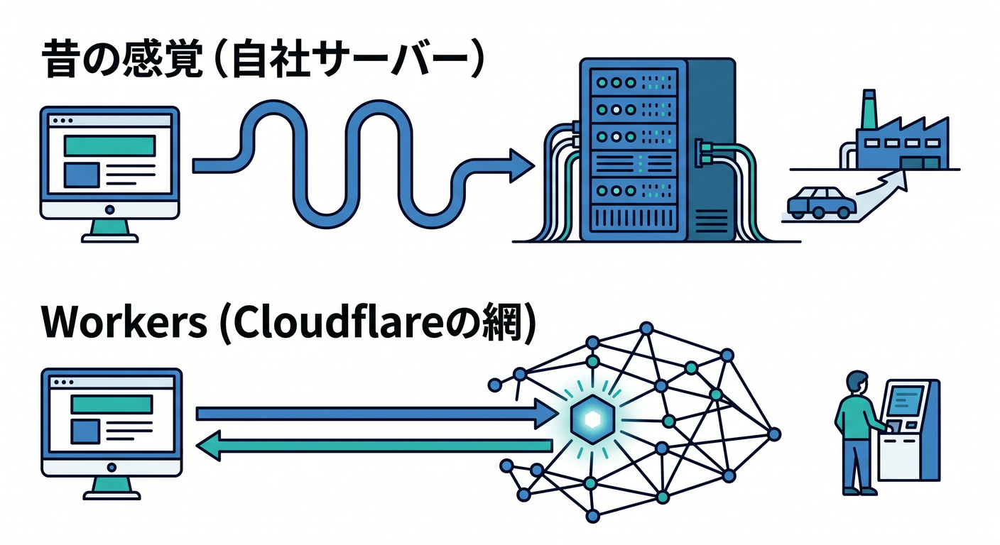
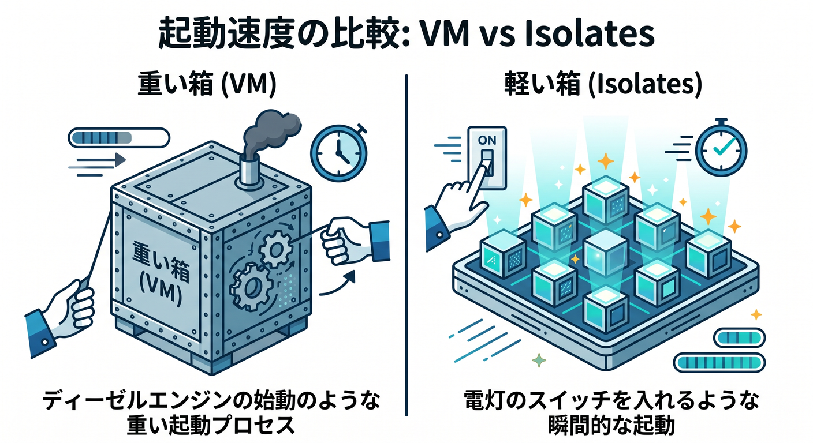
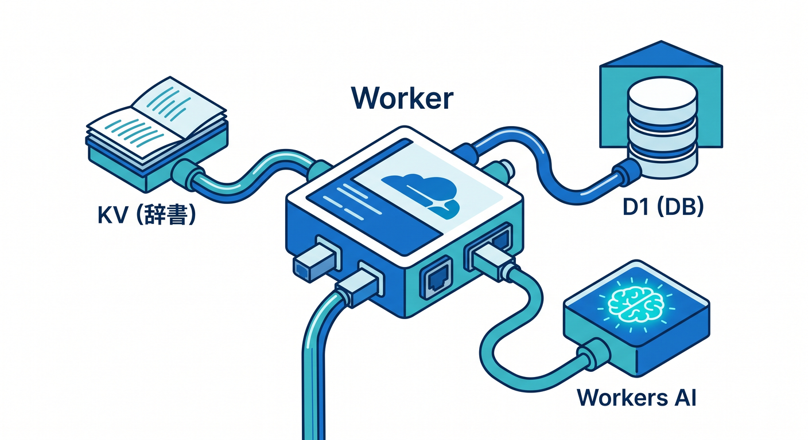
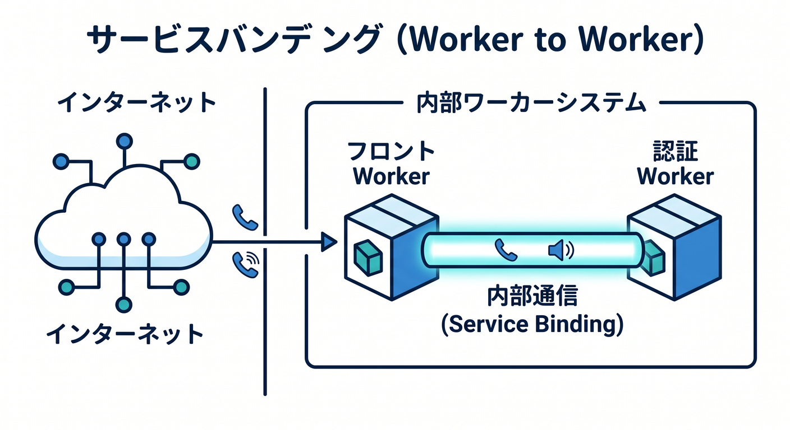
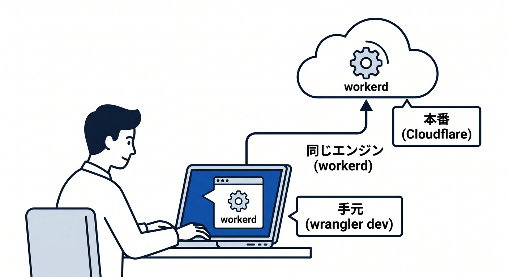
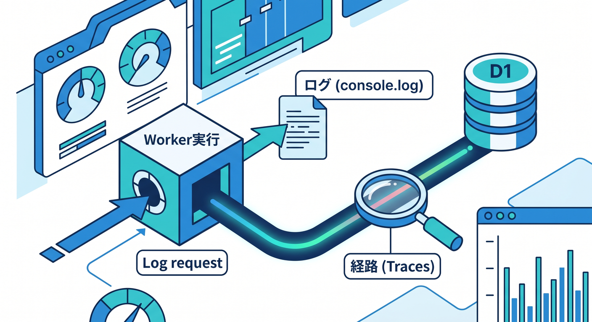

# 第08章：Cloudflareで“コードが動く”ってどういうこと？⚙️

ここからいよいよ、Cloudflareを「速くする・守るサービス」だけでなく、**自分のコードを実際に動かす場所**として見ていきます 😊
この章の主役は **Cloudflare Workers** です。Cloudflare公式はWorkersを、Cloudflareのグローバルネットワーク上でアプリを構築・デプロイ・スケールできるサーバーレス実行基盤として案内していて、ReactやNextを含む各種フレームワーク、JavaScript/TypeScriptを含む複数言語に対応すると説明しています。 ([Cloudflare Docs][1])

この章でつかみたいのは、細かいAPI暗記ではありません 🙌
大事なのは、**「Cloudflare上でコードが動く」とは何が起きていることなのか**、そして **「自分はどこに何を書けばいいのか」** を気持ちよく理解することです。ここが見えると、あとでD1、R2、KV、Queues、Workers AI、Agentsへ進んでも、全部がひとつの地図につながって見えてきます。 ([Cloudflare Docs][1])

---

## この章のゴール 🎯

* Workers が何者なのかを、ひとことで説明できる
* `fetch(request, env, ctx)` の3つの入口を理解する
* 「サーバーを借りる」のではなく「実行基盤にコードを載せる」感覚をつかむ
* AI機能もふつうのコードの延長で組み込めると理解する
* VS Codeでの開発の流れをざっくり言えるようになる

---

## 1. まず結論：「コードが動く」とは、Cloudflareの網の上で処理されること 🌍⚡

従来の感覚だと、Webアプリを動かすには「サーバーを借りる」「Nodeサーバーを起動する」「OSやプロセスの面倒を見る」という発想になりがちです。ですがWorkersでは、そうした“サーバー管理”を前面に出さず、**Cloudflareの実行環境に関数やアプリを配置して、リクエストが来たらその場で処理する**という考え方になります。Cloudflare公式も、Workersを「インフラ管理なし」で使えるサーバーレス基盤として説明しています。 ([Cloudflare Docs][1])

つまり、気分としてはこうです 😊

**昔の感覚**
ブラウザ → 自分のサーバー → 自分のアプリ

**Workersの感覚**
ブラウザ → Cloudflareネットワーク → その場でWorkerが実行される

この違いがすごく大きいです。Cloudflareはもともと通信の通り道にいるので、その通り道の途中でコードを動かせます。だから、ただの静的配信だけでなく、APIを返したり、認証チェックしたり、画像やHTMLを加工したり、AI推論を呼んだりできるようになります。 ([Cloudflare Docs][1])



---

## 2. Workerは「リクエストを受けてレスポンスを返す」小さな入口 🚪

いちばん基本のWorkerは、HTTPリクエストを受け取ってレスポンスを返します。公式ドキュメントでは、受信したHTTPリクエストは `fetch()` ハンドラに `Request` オブジェクトとして渡され、そこから `Response` を返す形になっています。 ([Cloudflare Docs][2])

まずは最小の形を見てみましょう ✨

```ts
export default {
  async fetch(request: Request) {
    return new Response("Hello Worker!");
  },
};
```

この1本だけで、もう「Cloudflareでコードが動いている」状態です。
しかもWorkersはHTTPだけではありません。Cron Triggerから呼ばれる `scheduled()` ハンドラのように、**定期実行**の入口も用意されています。つまりWorkersは「Webの返事を返すもの」にとどまらず、**イベントで動く実行基盤**でもあります。 ([Cloudflare Docs][3])

---

## 3. なんで“速そう”に見えるの？ → Isolatesという考え方 🚀

Workersが軽やかに見える理由のひとつが、Cloudflareが **isolates** ベースの実行モデルを使っていることです。公式ドキュメントでは、1つのランタイムインスタンスの中で多数のisolateを実行でき、各isolateのメモリは完全に分離され、しかも仮想マシンを毎回立ち上げる方式より高速に起動できる、と説明されています。VMモデルのようなコールドスタートを避ける発想です。 ([Cloudflare Docs][4])

初心者向けにかなり雑に言うと、**「巨大なサーバーを1台ずつ自分専用でもらう」感じではなく、軽い実行箱をすばやく安全に切り替えて使う」** イメージです 📦
このおかげで、Cloudflareは「世界の近い場所で、すばやくコードを走らせる」体験を作りやすくしています。ここはCloudflareが単なるCDNではなく、開発プラットフォームだと感じる大きなポイントです。 ([Cloudflare Docs][4])



---

## 4. `fetch(request, env, ctx)` の3つをやさしく理解しよう 🧩

Workersを書いていると、まずこの3つが出てきます。

* `request` … 今来たHTTPリクエストそのもの
* `env` … Workerに渡された各種 binding
* `ctx` … 実行の文脈。レスポンス後の処理などを扱う場所

これはCloudflare公式の基本形そのものです。 `fetch()` ハンドラは `request`, `env`, `ctx` を受け取り、`ctx` はContext APIとしてWorkerのライフサイクル管理に使われます。 ([Cloudflare Docs][2])


### `request` は「届いたもの」📨

URL、HTTPメソッド、ヘッダー、ボディなどが入っています。
つまり `request` を見れば、「どのパスに来たのか」「POSTかGETか」「認証ヘッダーはあるか」などを判断できます。これはブラウザ側の `Request` / `Response` にかなり近い感覚で扱えるので、フロントエンド寄りの人にも入りやすいです。WorkersランタイムはWeb標準寄りのAPIを重視して設計されています。 ([Cloudflare Docs][5])

### `env` は「Cloudflareの機能への入口」🔑

ここがWorkersの超重要ポイントです。
`env` には、環境変数、Secrets、KV、D1、R2、Queues、AI、Service Bindings など、Cloudflareプラットフォーム上の各種リソースが binding として渡されます。公式ドキュメントでも、BindingsはCloudflare Developer Platform上のリソースにWorkerから触るための仕組みで、REST API経由より高性能かつ制約が少ないと説明されています。 ([Cloudflare Docs][6])

### `ctx` は「今の実行をちょっと賢く扱う場所」🪄

`ctx.waitUntil()` を使うと、レスポンスを返したあとも少しだけ裏で処理を続けられます。Cloudflare公式では、`waitUntil()` はレスポンスをブロックせずにバックグラウンド処理を続けるための仕組みで、最大30秒までWorkerの寿命を延ばせるとされています。ログ送信やキャッシュ書き込みのような軽い後処理に向いています。 ([Cloudflare Docs][7])

---

## 5. `env` がわかると、Workersがただの関数ではなくなる 🌈

Workersが面白いのは、`env` を通じて **Cloudflareの機能が部品みたいにつながる** ところです。たとえば、文字列設定なら environment variables、秘密情報なら secrets、ファイルなら R2、SQLっぽいデータなら D1、キャッシュ寄りのキー・バリューなら KV、AIなら Workers AI、内部サービス分割なら Service bindings という感じで、必要なものを binding として差し込みます。 ([Cloudflare Docs][6])

ここで大事なのは、**機密情報は plaintext の `vars` に置かない** ことです。Cloudflare公式は、APIキーやトークンのような敏感な値には Secrets または Secrets Store を使うよう案内しています。ローカル開発でも `.dev.vars` や `.env` を使えますが、平文の `vars` へ秘密を入れるのは避けるべきです。 ([Cloudflare Docs][8])

つまり、Workersでは「Nodeサーバーの中で全部どうにかする」のではなく、**必要な能力を binding として注入して、その能力だけを使う** という設計になります。これがセキュリティ的にも、構造の見通しのよさ的にも、とても強いです 👍 ([Cloudflare Docs][6])



---

## 6. 1本のWorkerに全部書かなくてもいい。内部連携もできる 🧱

Cloudflare Workersは、1本の巨大なファイルに全部押し込むためのものではありません。公式の Service Bindings では、**あるWorkerから別のWorkerへ、公開URLを経由せずに内部呼び出し**ができます。しかもHTTP転送だけでなく、RPC風にメソッド呼び出しする形も用意されています。 ([Cloudflare Docs][9])

これはかなり大きな発想転換です 😊
たとえば、

* フロント用Worker
* 認証用Worker
* AI呼び出し用Worker
* 管理画面用Worker

みたいに分けてもよいわけです。CloudflareはService Bindingsを、マイクロサービス的な分割をしやすくしつつ、追加レイテンシや追加コストを生まない抽象化として説明しています。初心者のうちは1本で十分ですが、**「将来は部品分けできる」** と知っておくと安心です。 ([Cloudflare Docs][9])



---

## 7. VS Codeでの開発はどう始まるの？ 🛠️💙

今の公式導線では、最初の入口はかなり整理されています。Cloudflareは `create-cloudflare`（C3）で新規プロジェクトを作り、`wrangler dev` でローカル開発し、`wrangler deploy` で配備する流れを案内しています。作成直後のプロジェクトには `wrangler.jsonc`、`src/index.js` などが生成されます。 ([Cloudflare Docs][10])

WranglerはCloudflare開発用のCLIで、公式は**各プロジェクトにローカルインストール**する形を推奨しています。さらに、`wrangler.jsonc` は新規プロジェクト向けの推奨設定形式になっていて、新しめの機能はJSON設定前提のことがあります。 ([Cloudflare Docs][11])

さらに2026年時点では、Vite plugin の存在がかなり大きいです。Cloudflare公式によると、このプラグインはViteとWorkers Runtimeを深く統合し、**ローカルでも `workerd` 上で動くため、本番に近い挙動で開発しやすい** ことが強みです。ReactのSPAとAPIを一緒に扱うチュートリアルも公開されています。 ([Cloudflare Docs][12])

---

## 8. Nodeやnpmの世界と、どのくらい仲よくできるの？ 📦🟨

TypeScript/Node系の人が気になるのがここです。WorkersランタイムはWeb標準寄りですが、Cloudflareは **Node.js APIの一部互換** も用意しています。公式には、`nodejs_compat` という compatibility flag を設定すると、Workers Runtime に組み込みのNode APIやpolyfillが有効になり、npmパッケージの利用しやすさが上がると説明されています。 ([Cloudflare Docs][13])

ただし、ここは「Nodeそのものが完全再現される」と思わないほうが安全です 🙏
Cloudflare自身も、APIによってはフルサポートではなく、部分対応やimport用のstubがあると説明しています。なので学習の最初は、**まずWeb標準APIベースで考える**、必要に応じて `nodejs_compat` を足す、という順番がいちばんわかりやすいです。 ([Cloudflare Docs][13])

---

## 9. AIも“別世界”じゃない。Workerの中にそのまま入る 🤖✨

Cloudflareの今っぽさはここです。Workers AI は、Cloudflareのグローバルネットワーク上でサーバーレスGPUを使ってAIモデルを実行できる仕組みとして案内されています。つまり、AI機能も「外部の巨大な別システム」ではなく、**Workerから binding で呼ぶ一部品** として扱えます。 ([Cloudflare Docs][14])

Workers AI の binding を設定すると、Worker内から `env.AI.run()` の形でモデルを呼べます。Pages FunctionsでもAI機能は使えますが、Pages Functions自体がCloudflare Workers上で動いています。なので、「フロントはPages、処理はFunctions、AIはWorkers AI」という流れも、実はかなり自然です。 ([Cloudflare Docs][15])

さらに、外部AIプロバイダも含めて観測や制御をしたいなら **AI Gateway** があります。Cloudflare公式では、AI GatewayはAIアプリの可視化・制御のための製品で、分析、ログ、キャッシュ、レート制限、リトライ、モデルフォールバックなどを提供すると説明しています。つまり、Workers AIだけでなく、OpenAI系・Gemini系なども含めたAI呼び出しの交通整理役になれます。 ([Cloudflare Docs][16])

---

## 10. CopilotやAIエージェントと相性よく学ぶコツ 🧠💬

Cloudflareは2026年時点で、Workers開発をAIツールと一緒に進める導線をかなり前に出しています。公式の Prompting ガイドでは、VS Code を含む各種エディタやエージェントでWorkersアプリを作成できること、さらに `cloudflare-docs` のMCPサーバーや `cloudflare-observability` のMCPサーバーを接続して、ドキュメントやログをAIに食べさせられることを案内しています。 ([Cloudflare Docs][17])

GitHub Copilot側でも、公式ドキュメントに **`.github/copilot-instructions.md`** を使ったリポジトリ単位のカスタム命令や、`.github/instructions/**/*.instructions.md` によるパス別指示が案内されています。つまり、CloudflareプロジェクトではCopilotに対して「このリポジトリはWorkers前提」「ビルドはこれ」「Secretsはこう扱う」「Wranglerで検証する」などのルールを最初に教えておくと、かなり会話が噛み合いやすくなります。 ([GitHub Docs][18])

学習のコツとしては、CopilotやチャットAIに丸投げするより、こんな聞き方が強いです 😊

* 「この `fetch()` ハンドラの責務を分けて」
* 「`env` に必要な binding を洗い出して」
* 「Secretsにするものと vars でよいものを分けて」
* 「この処理は `waitUntil()` でよい？ それともQueues向き？」

この聞き方だと、Cloudflareの設計思想そのものを理解しやすくなります。Cloudflare公式も、AIにWorkers APIとベストプラクティスを教えるためのプロンプトやMCP導線を用意しています。 ([Cloudflare Docs][17])

---

## 11. まずは小さく触る。TypeScriptの最小イメージ 🧪

まずは「APIが1本動く」「必要ならAIも呼べる」という最小イメージです。下の例は、Cloudflare公式の `fetch()` ハンドラと Workers AI binding の考え方に沿った、初心者向けの小さなサンプルです。 ([Cloudflare Docs][2])

### `wrangler.jsonc`

```jsonc
{
  "$schema": "./node_modules/wrangler/config-schema.json",
  "name": "chapter8-demo",
  "main": "src/index.ts",
  "compatibility_date": "2026-04-14",
  "ai": {
    "binding": "AI"
  }
}
```

### `src/index.ts`

```ts
export interface Env {
  AI: Ai;
}

export default {
  async fetch(request: Request, env: Env, ctx: ExecutionContext): Promise<Response> {
    const url = new URL(request.url);

    if (url.pathname === "/") {
      return new Response(
        `
        <h1>こんにちは Cloudflare Workers ☁️</h1>
        <p><a href="/api/hello">/api/hello</a></p>
        <p><a href="/api/ai">/api/ai</a></p>
        `,
        {
          headers: { "content-type": "text/html; charset=UTF-8" },
        }
      );
    }

    if (url.pathname === "/api/hello") {
      return Response.json({
        message: "Hello from Workers!",
        runtime: "Cloudflare Workers",
      });
    }

    if (url.pathname === "/api/ai") {
      const result = await env.AI.run("@cf/meta/llama-3.1-8b-instruct", {
        prompt: "Cloudflare Workersを初心者向けに一言で説明して。",
      });

      return Response.json({
        ok: true,
        result,
      });
    }

    return new Response("Not Found", { status: 404 });
  },
};
```

このサンプルで見てほしいのは3点です 🌟
1つ目は、**ルーティングもただのTypeScriptの条件分岐で始められる** こと。2つ目は、**AIも `env.AI.run()` でふつうの機能のように呼べる** こと。3つ目は、**サーバー設定ファイル群より先に、アプリの入口コードを素直に読める** ことです。Workers AI の binding 設定や `env.AI.run()` は公式ドキュメントでも案内されています。 ([Cloudflare Docs][15])

---

## 12. 「ローカルで動かす」と「本番で動かす」の距離が近い 👀

Cloudflare公式の導線では、C3で作ったプロジェクトを `wrangler dev` でローカル起動し、ブラウザで確認しながら進めます。Vite plugin を使う場合は、`workerd` 上で本番に近い挙動を再現しやすくなります。つまり、**ローカル専用の別ランタイムで偶然動いて、本番でだけ壊れる** という嫌なズレを減らしやすいです。 ([Cloudflare Docs][10])

これは学習者にとってかなりありがたいです 😊
「クラウドは難しそう」と感じる原因のひとつは、手元と本番の差が大きいことだからです。Workersではその差をできるだけ縮める方向に公式導線が整っています。 ([Cloudflare Docs][12])



---

## 13. 動いたあと、どうやって様子を見るの？ 🔍📈

コードは動かすだけでは終わりません。Cloudflare公式によると、**新しく作成されたWorkersでは observability がデフォルトで有効** で、Workers Logs によりログ、エラー、未処理例外などを集めてダッシュボードで確認できます。 ([Cloudflare Docs][19])

さらに Traces では、リクエストがWorkerと接続先サービスをどう通ったかを追えます。Cloudflareは、`fetch()` 呼び出しや KV / R2 / Durable Objects などの binding 操作、ハンドラ呼び出しについて、自動計測で可視化できると案内しています。つまり「どこで遅いのか」「どこで落ちたのか」を見やすいのです。 ([Cloudflare Docs][20])

学習初期ほど、**ログを見る習慣** をつけるのが大事です 📝
「動かない → もうわからない」で止まるのではなく、「今どこまで通ってる？」を確認する。Workersはこの観測の導線が比較的素直なので、初心者にやさしい面があります。 ([Cloudflare Docs][19])



---

## 14. 最初に知っておくと事故りにくい注意点 ⚠️

初心者のうちに、次の4つは早めに知っておくとかなり楽です。

* Workers Free プランには **1日100,000リクエスト** の上限があります。無料でも十分試せますが、無限ではありません。なおCloudflare公式は、**一般的な requests per second の上限は設けていない** と説明しています。 ([Cloudflare Docs][21])
* 1回のWorker実行中に行う subrequest には上限があります。Freeでは **1 invocationあたり50**、Paidでは既定で **10,000** です。外部 `fetch()` や Cloudflareサービス呼び出しも数に含まれます。 ([Cloudflare Docs][21])
* `ctx.waitUntil()` は便利ですが、**確実に終わらせたい重い裏処理** に向くわけではありません。Cloudflare公式は、確実性が必要なら Queues を使うよう案内しています。 ([Cloudflare Docs][7])
* 秘密情報は `vars` ではなく **Secrets** を使うべきです。ローカルでも `.dev.vars` / `.env` の使い分けがあります。 ([Cloudflare Docs][8])

---

## 15. この章のまとめ 🧭✨

第8章でいちばん大事なのは、**Workersは「Cloudflare上で動く小さな関数」では終わらず、アプリの入口そのものになれる** と理解することです。HTTPを受けて返すだけでなく、bindingでデータやストレージやAIや内部サービスにつながり、観測もでき、Vite/VS Code/Copilotとも相性よく学べます。 ([Cloudflare Docs][2])

言い換えると、Cloudflareはもう「CDNの管理画面」ではありません ☁️➡️⚙️
**通信の通り道の上で、コードを実行できる開発基盤** です。この見え方に変わった瞬間、Cloudflareの学習はかなり楽しくなります。 ([Cloudflare Docs][1])

---

## 理解チェック ✅

* Workersは何を受け取り、何を返す？
* `request` / `env` / `ctx` はそれぞれ何の役？
* Bindingって何？ なぜ便利？
* Workers AI は、なぜ「別世界」ではないの？
* `waitUntil()` と Queues はどう使い分ける？

---

## ミニ課題 📝💡

1. `"/api/hello"` を `"/api/profile"` に変えて、JSONの中身を好きに書き換えてみましょう。
2. `"/about"` というパスを追加して、HTMLを返してみましょう。
3. Secrets を1つ定義する前提で、`env.MY_TOKEN` を読むコードを書いてみましょう。
4. Copilotに「このWorkerをルーティング関数へ分割して」と頼み、出てきた提案を自分の目でレビューしてみましょう。GitHub Copilotはリポジトリ命令ファイルでプロジェクトの文脈を教えられます。 ([GitHub Docs][18])

次の章では、こうして「コードが動く場所」が見えてきたうえで、**ダッシュボードのどこに何があるのか** を散歩するように整理していくと、とても理解しやすくなります。

[1]: https://developers.cloudflare.com/workers/?utm_source=chatgpt.com "Overview · Cloudflare Workers docs"
[2]: https://developers.cloudflare.com/workers/runtime-apis/handlers/fetch/?utm_source=chatgpt.com "Fetch Handler - Workers"
[3]: https://developers.cloudflare.com/workers/runtime-apis/handlers/scheduled/?utm_source=chatgpt.com "Scheduled Handler - Workers"
[4]: https://developers.cloudflare.com/workers/reference/how-workers-works/?utm_source=chatgpt.com "How Workers works"
[5]: https://developers.cloudflare.com/workers/runtime-apis/request/?utm_source=chatgpt.com "Request · Cloudflare Workers docs"
[6]: https://developers.cloudflare.com/workers/runtime-apis/bindings/?utm_source=chatgpt.com "Bindings (env) - Workers"
[7]: https://developers.cloudflare.com/workers/runtime-apis/context/?utm_source=chatgpt.com "Context (ctx) - Workers"
[8]: https://developers.cloudflare.com/workers/configuration/secrets/?utm_source=chatgpt.com "Secrets - Workers"
[9]: https://developers.cloudflare.com/workers/runtime-apis/bindings/service-bindings/?utm_source=chatgpt.com "Service bindings - Runtime APIs · Cloudflare Workers docs"
[10]: https://developers.cloudflare.com/workers/get-started/guide/?utm_source=chatgpt.com "Get started - CLI · Cloudflare Workers docs"
[11]: https://developers.cloudflare.com/workers/wrangler/install-and-update/?utm_source=chatgpt.com "Install/Update Wrangler · Cloudflare Workers docs"
[12]: https://developers.cloudflare.com/workers/vite-plugin/?utm_source=chatgpt.com "Vite plugin · Cloudflare Workers docs"
[13]: https://developers.cloudflare.com/workers/runtime-apis/nodejs/?utm_source=chatgpt.com "Node.js compatibility"
[14]: https://developers.cloudflare.com/workers-ai/?utm_source=chatgpt.com "Overview · Cloudflare Workers AI docs"
[15]: https://developers.cloudflare.com/workers-ai/configuration/bindings/?utm_source=chatgpt.com "Workers Bindings · Cloudflare Workers AI docs"
[16]: https://developers.cloudflare.com/ai-gateway/?utm_source=chatgpt.com "Overview · Cloudflare AI Gateway docs"
[17]: https://developers.cloudflare.com/workers/get-started/prompting/?utm_source=chatgpt.com "Prompting - Workers"
[18]: https://docs.github.com/ja/copilot/how-tos/configure-custom-instructions/add-repository-instructions?utm_source=chatgpt.com "GitHub Copilot用のリポジトリカスタム命令の追加"
[19]: https://developers.cloudflare.com/workers/observability/logs/workers-logs/?utm_source=chatgpt.com "Workers Logs"
[20]: https://developers.cloudflare.com/workers/observability/traces/?utm_source=chatgpt.com "Traces - Workers"
[21]: https://developers.cloudflare.com/workers/platform/limits/?utm_source=chatgpt.com "Limits · Cloudflare Workers docs"
