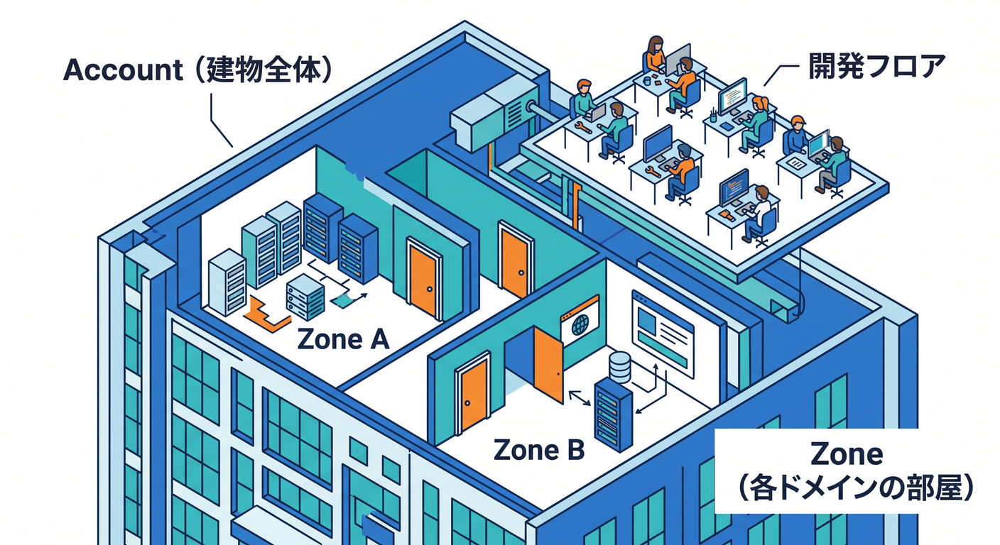
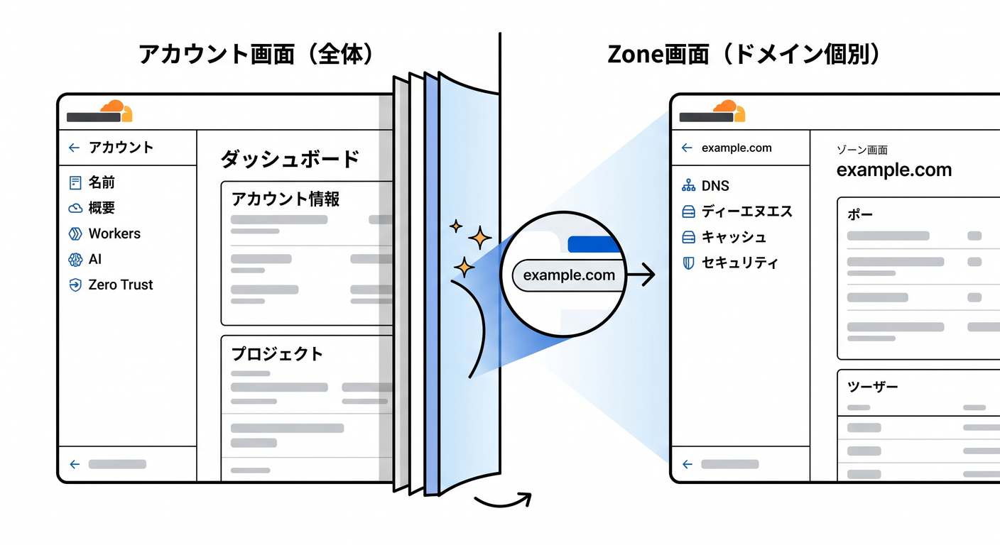
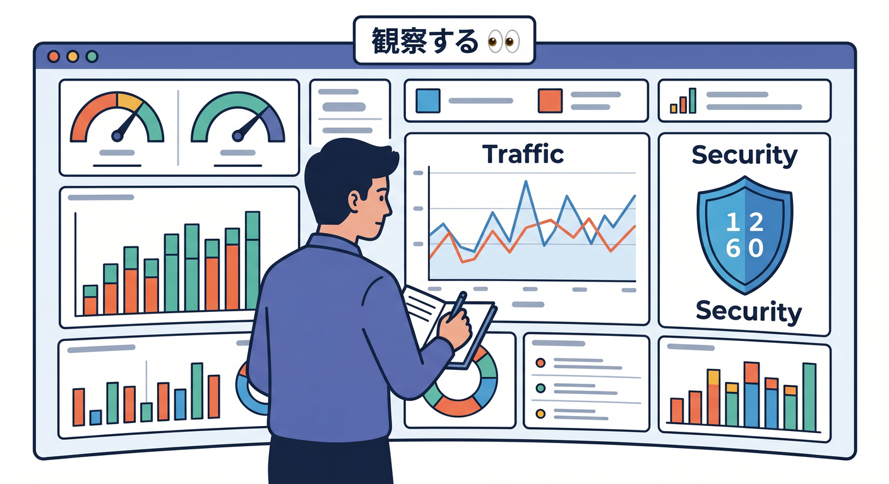
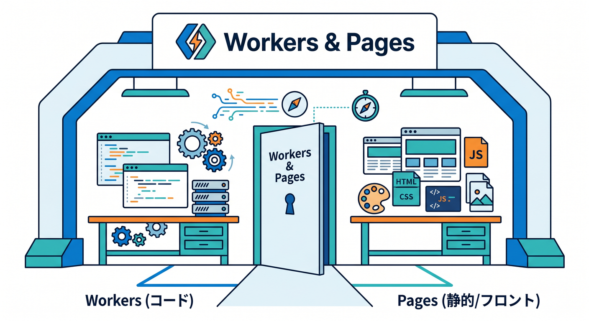
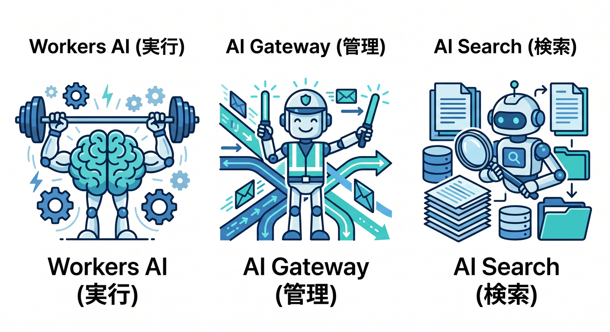
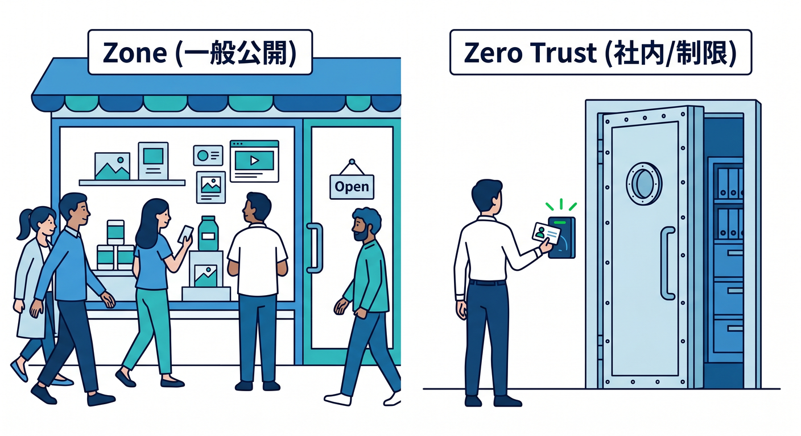
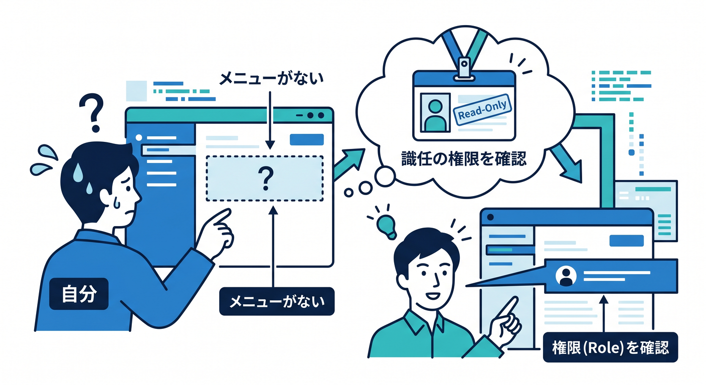

# 第09章：ダッシュボードを散歩して全体配置を覚えよう 👀

この章では、Cloudflareの管理画面を「全部理解する」のではなく、**まず迷子にならないこと**を目標にします 😊
Cloudflare公式では、アカウントを選んだあとに見えるものと、ドメイン（Zone）を選んだあとに見えるものは役割が違います。さらに、Workers はサーバーレス実行基盤、AI Gateway はAIリクエストの観測と制御、Zero Trust はユーザー・端末・ネットワーク保護の入口として別のまとまりを持っています。つまり、ダッシュボードは「ごちゃごちゃ」ではなく、**役割ごとにフロア分けされた建物**だと思うとかなり見やすくなります。 ([Cloudflare Docs][1])

---

## この章のゴール 🎯📘

この章を終えるころには、次の4つができれば十分です 🙆‍♂️

* **アカウント画面**と**Zone画面**の違いを説明できる
* **Workers & Pages** がどこにあり、何をする場所か言える
* **AI系メニュー** と **Zero Trust** の入口を見つけられる
* 「設定を触る前に、どこを見るべきか」を判断できる ([Cloudflare Docs][1])

---

## 1. まず最初に覚えるべきこと：Cloudflareには「2つの見方」があるよ 🧭🏠🌐

Cloudflareダッシュボードでいちばん最初につまずきやすいのは、**アカウント全体を見る画面**と、**1つのドメインを見る画面**が混ざって見えることです。
Cloudflare公式では、**Account は 1つ以上のユーザーとZoneを含む箱**で、Workers や Pages、Security Center など一部の機能は**アカウント単位**で扱われます。一方、**Zone は Cloudflare に追加したドメインやサブドメイン側のまとまり**で、そのドメインに対する DNS・Cache・セキュリティ・分析などは**Zone単位**で効きます。 ([Cloudflare Docs][1])

つまり感覚としてはこんな感じです ✨

* **Account** ＝ 建物全体 🏢
* **Zone** ＝ その中の各部屋 🚪
* **Workers & Pages** ＝ 開発フロア 🛠️
* **AI** ＝ AI機能フロア 🤖
* **Zero Trust** ＝ 社内や端末やアクセス制御の別棟 🔐

このイメージを持つだけで、「あれ、この設定どこ？」がかなり減ります。 ([Cloudflare Docs][1])

---

## 2. ダッシュボードは「アカウント単位」と「Zone単位」でサイドバーの意味が変わる 👈📚

Cloudflare公式では、**アカウントを選んだ直後で、まだZoneを選んでいない状態**では、サイドバーに**アカウントレベルの製品**が並びます。
そして、そこからドメインを1つ選んで**Zoneの中に入ると、サイドバーはそのZoneに関係する製品中心**に切り替わります。 ([Cloudflare Docs][1])

ここが超大事です 💡

初心者さんがよくやるのは、

「Workers を探しているのに Zone の中をうろうろする」
「DNS を触りたいのに Account 側を見ている」
「Zero Trust をドメイン設定の一部だと思って探す」

……という迷い方です 😵

でも整理すると、かなり単純です。

* **DNS / Security / Cache / Analytics & Logs**
  → 基本は **Zone側** で見ることが多い 🌐
* **Workers & Pages / PagesのGit連携 / WorkerのBuild**
  → **アカウント側の開発機能** として見ることが多い ⚙️
* **Zero Trust**
  → ふつうのZone画面とは少し別の入口として考える 🔐
* **AI Gateway / AI Search / Workers AI**
  → **AI系の製品群** として別まとまりで探す 🤖 ([Cloudflare Docs][1])

---

## 3. まずはこの順番で散歩しよう 🚶‍♂️☁️✨

この章では、管理画面を次の順で見ると頭に入りやすいです。

## 3-1. Account Home を見る 🏠

最初に見るべきなのは、Cloudflare全体の入口です。
Account home からは、アカウントそのものや、含まれているZone、さらにAccount IDなどを確認できます。公式でも、Account ID の確認は Account home から行う案内になっています。 ([Cloudflare Docs][2])

ここでは「設定する」よりも、まず次だけ把握すればOKです 😊

* 自分のアカウントがどれか
* そのアカウントにどのZoneが入っているか
* このあと Workers や AI を触るとき、**まずアカウントを選ぶ**流れになること

---

## 3-2. Zone を1つ選ぶ 🌍

次に、自分のドメインを1つ選んで Zone に入ります。
Zone は、そのドメインに対する Cloudflare の設定と分析の中心です。DNS、キャッシュ、セキュリティ、ドメインごとのメトリクス確認などは、基本的にこのZone視点で見るのが自然です。 ([Cloudflare Docs][1])

この時点では、「このドメインに対して何が起きているか」を見るモードに入った、くらいの理解で大丈夫です 👍

---

## 3-3. Analytics & Logs をのぞく 📊🔍

Zoneに入ったら、初心者さんにおすすめなのが **Analytics & Logs** です。
Cloudflare公式では、ここで **Traffic / Security / Performance / DNS / Workers / Logs** といったタブを確認できます。つまり「このドメインに、どれくらいアクセスが来ているか」「セキュリティ的に何が起きているか」「Workers関連の動きはどうか」を見る場所です。 ([Cloudflare Docs][3])

ここは設定画面というより、**観察する画面** です 👀
最初のうちは、数字の意味を全部理解しなくて大丈夫です。

見るポイントはこの3つで十分です。

* Traffic がある
* Security がある
* Workers のタブもある

つまり Cloudflare は、ただ設定を置くだけではなく、**見える化もしてくれる**と知ることが大切です。 ([Cloudflare Docs][3])

---

## 4. Workers & Pages は「開発の玄関」だと覚えよう 🛠️🚪⚡

Cloudflareを学んでいると、かなり高い確率でここに戻ってきます。
**Workers & Pages** は、Cloudflare上でアプリを作る・つなぐ・配るための中心入口です。Cloudflare公式では、Workers は「グローバルネットワーク上でアプリを構築・デプロイ・スケールできるサーバーレス基盤」と説明されていて、React や Next を含む各種フレームワークとも組み合わせられます。 ([Cloudflare Docs][4])

さらに、ダッシュボードから新しい Worker を作るときは **Workers & Pages → Create application** から入り、テンプレート選択、Gitリポジトリの取り込み、public repository のブートストラップなどができます。デプロイ後は `workers.dev` サブドメインでプレビューできます。 ([Cloudflare Docs][5])

ここで覚えるべきことはシンプルです 😄

* **Workers** ＝ コードを動かす場所 ⚙️
* **Pages** ＝ 静的サイトやフロント側公開の入口 🌐
* **Workers & Pages** ＝ 開発まわりをまとめて触る場所 🧰

Pages も同じ入口にあり、Reactサイトをダッシュボードから公開するときは **Create application > Pages > Import an existing Git repository** で進められます。公開後は `pages.dev` サブドメインやプレビュー deployment も使えます。 ([Cloudflare Docs][6])

---

## 5. 「Workers & Pagesの中で何を見るの？」を初心者向けに分解しよう 🧩✨

Workers & Pages に入ったら、最初は次の3か所だけ覚えれば十分です。

## 5-1. Create application 🆕

新規作成の入口です。Worker をゼロから作る、テンプレートから始める、Gitリポジトリを取り込む、という選択肢がここに集まっています。 ([Cloudflare Docs][5])

## 5-2. Settings / Domains & Routes 🌍

Worker にどのURLでアクセスさせるかを見る場所です。Custom Domain、Route、`workers.dev`、Preview URL などの設定がここに集まっています。公式でも、Preview URLs の有効化や Route 設定は **Settings > Domains & Routes** から行います。 ([Cloudflare Docs][7])

## 5-3. Builds / Deployments 🚀

GitHub や GitLab とつないで自動ビルド・自動デプロイするならここです。Cloudflare公式では、Worker を GitHub / GitLab リポジトリに接続して push ごとに build/deploy でき、Build history や preview URL も確認できます。 ([Cloudflare Docs][8])

この3つが見えるだけで、だいぶ「Cloudflareで開発する絵」が頭に入ります 😊

---

## 6. AI系メニューは「実行するAI」と「通り道を管理するAI」で分けるとわかりやすい 🤖🧠🛣️

CloudflareのAI系は、初心者さんには一見バラバラに見えます。
でも実際には、次のように分けるとスッと入ります。

## 6-1. Workers AI

**モデルを動かす側**です。
Cloudflare公式では、Workers AI アプリを作るときも、実際の作業は **Workers & Pages** から開始して、テンプレートとして LLM Chat App を選べます。つまり、「AIだけの別世界」ではなく、**Workers の延長線上にあるAI実行基盤**として考えるのが自然です。 ([Cloudflare Docs][9])

一方で、AI Gateway連携チュートリアルでは **AI > Workers AI** という案内もあり、ダッシュボード内では AI 製品群の入口から見つけられる場面もあります。初心者さんは「Workersで作るAIアプリ」と「AI製品群の入口」の両方から見つかることがある、と覚えておくと混乱しにくいです。 ([Cloudflare Docs][9])

## 6-2. AI Gateway

**AIリクエストの通り道を観測・制御する側**です。
Cloudflare公式では、AI Gateway は分析、ログ、キャッシュ、レート制限、リトライ、モデルフォールバックなどを提供し、AIアプリの見える化と制御を行います。ダッシュボードでは **AI > AI Gateway** から作成できます。 ([Cloudflare Docs][10])

## 6-3. AI Search

**自然言語検索やRAG寄りの入口**です。
Cloudflare公式では、AI Search は **Compute & AI > AI Search** から作成し、データ接続、chunking、embedding、retrieval 設定を行います。Workers Binding や REST API から使える設計です。 ([Cloudflare Docs][11])

この3つを一言でまとめるとこうです 🌈

* **Workers AI** ＝ AIを動かす 🤖
* **AI Gateway** ＝ AI呼び出しを監視・制御する 🚦
* **AI Search** ＝ AI検索を組み立てる 🔎

---

## 7. Zero Trust は「Webサイト設定の続き」ではなく「アクセス制御の世界」だよ 🔐🚪👤

Cloudflareの Zero Trust は、DNSやCacheの横にある単なる追加設定ではありません。
Cloudflare公式では、Zero Trust は **最小権限** の考え方にもとづき、ユーザー・端末・ネットワークを保護する仕組みで、始めるには **Cloudflare account と Zero Trust organization** が必要です。ダッシュボードでは **Zero Trust** を選んで組織を作り、team name を決めて進めます。 ([Cloudflare Docs][12])

つまり、感覚としてはこうです 😊

* Zone画面の DNS / Cache / Security は
  **公開中のサイトやAPI側を見る場所**
* Zero Trust は
  **誰が、どの端末で、どこへ入れるかを見る場所**

この違いを知っているだけで、「社内向け保護はどこ？」がすぐ分かるようになります。 ([Cloudflare Docs][13])

---

## 8. 権限まわりは「迷ったらAccountレベルを疑う」👥🪪

Cloudflareはチーム利用を前提にした機能も強いので、**見えるメニューが人によって違う**ことがあります。
公式のロール一覧を見ると、Zero Trust の read only / reporting、Workers Platform (Read-only)、DNS、Firewall、R2 Admin など、かなり細かく権限が分かれています。 ([Cloudflare Docs][14])

初心者さん向けには、まず次の理解でOKです 👍

* メニューが見えない
* 編集ボタンが出ない
* Zero Trust だけ入れない
* R2やWorkersは見えるのにDNSは触れない

こんなときは「自分が間違っている」より先に、**権限の問題かも**と考えましょう。Cloudflareは製品ごと・アカウントごとに権限設計できるので、これは珍しいことではありません。 ([Cloudflare Docs][14])

---

## 9. 初心者さん向け・おすすめ散歩ルート 🚶‍♀️🚶‍♂️🌟

では、実際にダッシュボードでどこを見ればいいか、やさしい順番で並べます。

## ルートA：全体像だけつかむコース ☁️

1. Account Home を開く
2. 自分の Zone 一覧を見る
3. Workers & Pages を開いて「Create application」があるのを確認
4. Zone を1つ開いて Analytics & Logs を見る
5. Zero Trust 入口が別まとまりであるのを確認する ([Cloudflare Docs][1])

## ルートB：開発者っぽく見るコース 🛠️

1. Workers & Pages を開く
2. Create application を押せる位置を確認
3. 既存Workerがあれば Settings > Domains & Routes を見る
4. Builds があれば Git連携と preview URL の位置を確認
5. `workers.dev` や Preview URL の意味をざっくり把握する ([Cloudflare Docs][5])

## ルートC：AIまわりを眺めるコース 🤖

1. AI > AI Gateway を開く
2. Workers AI の入口を確認
3. AI Search の入口も確認
4. 「AIを動かす」「AIを監視する」「AIで検索する」の3分類で頭に置く ([Cloudflare Docs][15])

---

## 10. この章でやってはいけない覚え方 🙅‍♂️💦

この段階で、次のような覚え方はおすすめしません。

## 10-1. メニュー名を全部暗記する

Cloudflareは機能が多いので、最初から全部覚えようとすると疲れます 😵
今は「**どの階層の話か**」だけ分かればOKです。 ([Cloudflare Docs][1])

## 10-2. Workers と Pages と AI を別会社の製品みたいに考える

実際には、Workers は Cloudflare の開発基盤で、その上に Workers AI や各種連携が乗ってきます。Pages も Workers & Pages から扱えます。 ([Cloudflare Docs][4])

## 10-3. Zero Trust を「サイト公開設定の続き」と思う

Zero Trust はアクセス制御・端末・組織利用の世界で、通常のZone設定とはかなり性格が違います。 ([Cloudflare Docs][13])

---

## 11. VS Code と GitHub Copilot を使うと、この章の理解が速くなる ✨💻🤝

2026年時点では、GitHub Copilot は VS Code で **chat / code completion / edit mode / agent mode** などをサポートしており、複数ステップの変更や外部ツール連携が必要な作業では agent mode も使えます。 ([GitHub Docs][16])

さらに Cloudflare公式は、Workers 学習向けに **AIエージェントへ Workers の文脈を教える方法** を案内していて、Cloudflare Docs の MCP server や observability MCP server を紹介しています。加えて、GitHub Copilot では **`.github/copilot-instructions.md`** をプロジェクトルートに置く案内も出しています。 ([Cloudflare Docs][17])

つまり、この章の学び方としてはこんな感じがかなり相性いいです 😊

* Cloudflareダッシュボードを自分で開く 👀
* VS Code の Copilot Chat で
  「Workers & Pages と Zone の違いをこのプロジェクト文脈で説明して」
  と聞く ✍️
* `.github/copilot-instructions.md` に
  「Cloudflare Workers中心で考える」「TypeScript優先」「wrangler.jsonc前提」
  のような方針を書く 🧠
* Cloudflare公式の Workers prompting ガイドも参考にする 📘

Cloudflare公式の prompting ガイドでは、Workers 向けのベースプロンプトや、TypeScript優先、ES Modules、`wrangler.jsonc`、`nodejs_compat`、observability を含めたベストプラクティスまでまとめられています。AI込みの学習とかなり相性がいいです。 ([Cloudflare Docs][17])

---

## 12. この章のハンズオン課題 🧪🎒✨

ここでは「設定変更」ではなく、**見つける練習**だけやりましょう。

## 課題1：Account と Zone の違いを目で確認する

* Account Home を開く
* Zone 一覧を確認する
* Zone を1つ選んで、サイドバーの内容が変わるのを確認する ([Cloudflare Docs][1])

## 課題2：Workers & Pages の入口を見つける

* Workers & Pages を開く
* Create application を探す
* 「テンプレート」「Import repository」系の入口があるのを確認する ([Cloudflare Docs][5])

## 課題3：ドメイン側の観察画面を見つける

* Zone を開く
* Analytics & Logs に入る
* Traffic / Security / Performance / DNS / Workers という並びを確認する ([Cloudflare Docs][3])

## 課題4：AI系の入口を探す

* AI Gateway を開く
* Workers AI の入口を探す
* AI Search の入口も確認する ([Cloudflare Docs][15])

## 課題5：Zero Trust を別世界として認識する

* Zero Trust 入口を開く
* organization / team name の概念があることを確認する ([Cloudflare Docs][13])

---

## 13. この章のチェックポイント ✅🌈

次の質問に答えられたら、この章はかなり成功です 🎉

* Account と Zone の違いは？
* Workers & Pages は何の入口？
* Analytics & Logs は何を見る場所？
* AI Gateway と Workers AI の違いは？
* Zero Trust は普通のZone設定と何が違う？ ([Cloudflare Docs][1])

---

## 14. この章のまとめ 📝☁️💖

Cloudflareダッシュボードは、最初は広く見えます。
でも実際には、

* **Account** で全体を見る 🏢
* **Zone** でドメインを見る 🌐
* **Workers & Pages** で開発する 🛠️
* **AI** でAI機能を使う 🤖
* **Zero Trust** でアクセスを守る 🔐

という配置で考えると、かなり整理できます。 ([Cloudflare Docs][1])

この章の目的は、「設定を使いこなす」ことではありません。
**次の章で出てくる機能を、どこに探しに行けばいいか分かること**です 😊
それができれば、この散歩は大成功です 🚶‍♂️✨🚶‍♀️✨

---

## 15. 次章へのつなぎ 🔜🛠️⚡

次は、いよいよ **VS Code から見る Cloudflare 開発の入口** に進むと流れがきれいです。
この章で覚えた **Workers & Pages の位置** が分かっていれば、Wrangler、Build、Preview、Git連携、Copilot活用がかなり理解しやすくなります。Cloudflare公式でも、Workers のダッシュボード開始、Git連携による builds、Pages の Git import などが、同じ「開発の入口」としてつながっています。 ([Cloudflare Docs][5])

必要なら次に、そのまま続けて
**「第10章　VS Codeから見るCloudflare開発の入口 🛠️」**
もこの調子で詳細教材化できます。

[1]: https://developers.cloudflare.com/fundamentals/concepts/accounts-and-zones/ "Accounts, zones, and profiles · Cloudflare Fundamentals docs"
[2]: https://developers.cloudflare.com/fundamentals/account/find-account-and-zone-ids/?utm_source=chatgpt.com "Find account and zone IDs"
[3]: https://developers.cloudflare.com/analytics/account-and-zone-analytics/zone-analytics/ "Zone Analytics · Cloudflare Analytics docs"
[4]: https://developers.cloudflare.com/workers/ "Overview · Cloudflare Workers docs"
[5]: https://developers.cloudflare.com/workers/get-started/dashboard/ "Get started - Dashboard · Cloudflare Workers docs"
[6]: https://developers.cloudflare.com/pages/framework-guides/deploy-a-react-site/ "React · Cloudflare Pages docs"
[7]: https://developers.cloudflare.com/workers/configuration/routing/routes/?utm_source=chatgpt.com "Routes - Workers"
[8]: https://developers.cloudflare.com/workers/ci-cd/builds/ "Builds · Cloudflare Workers docs"
[9]: https://developers.cloudflare.com/workers-ai/get-started/dashboard/ "Get started - Dashboard · Cloudflare Workers AI docs"
[10]: https://developers.cloudflare.com/ai-gateway/ "Overview · Cloudflare AI Gateway docs"
[11]: https://developers.cloudflare.com/ai-search/get-started/dashboard/ "Dashboard · Cloudflare AI Search docs"
[12]: https://developers.cloudflare.com/cloudflare-one/?utm_source=chatgpt.com "Overview · Cloudflare One docs"
[13]: https://developers.cloudflare.com/cloudflare-one/setup/ "Get started · Cloudflare One docs"
[14]: https://developers.cloudflare.com/fundamentals/manage-members/roles/ "Account roles · Cloudflare Fundamentals docs"
[15]: https://developers.cloudflare.com/ai-gateway/get-started/ "Getting started · Cloudflare AI Gateway docs"
[16]: https://docs.github.com/en/copilot/get-started/features "GitHub Copilot features - GitHub Docs"
[17]: https://developers.cloudflare.com/workers/get-started/prompting/ "Prompting · Cloudflare Workers docs"
