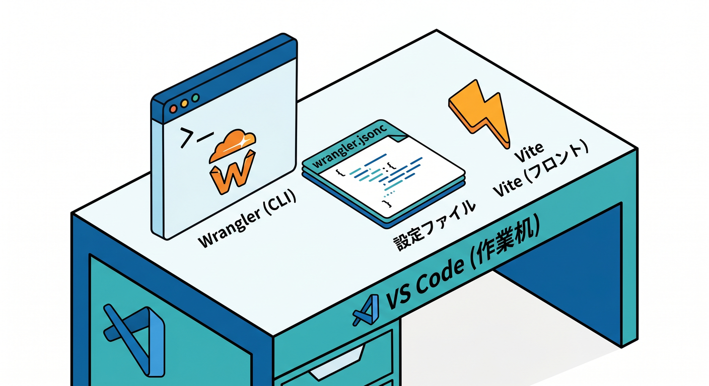
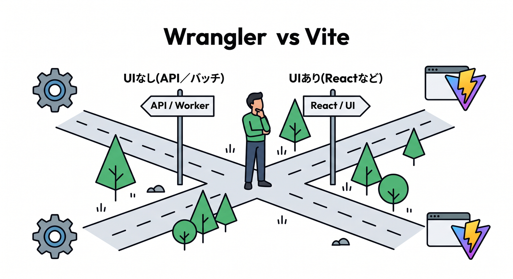
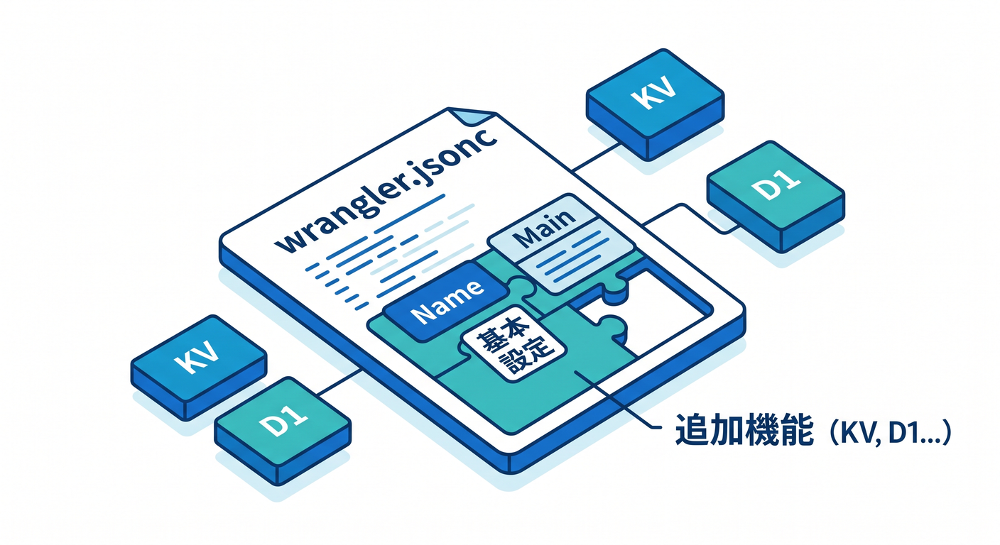
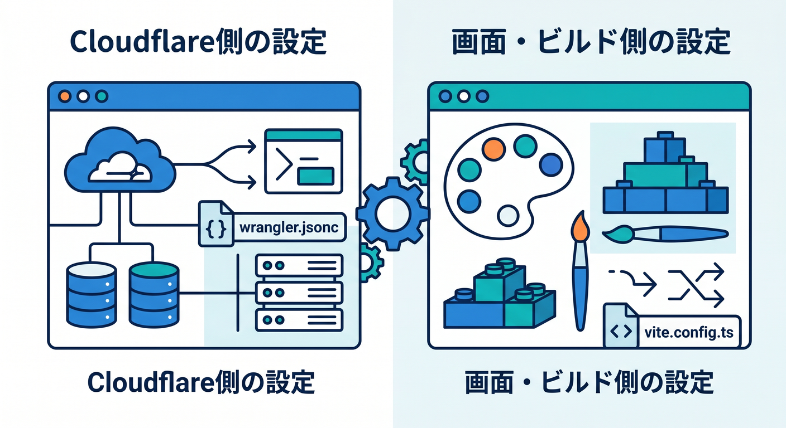
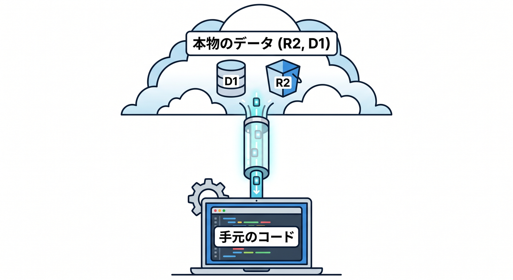
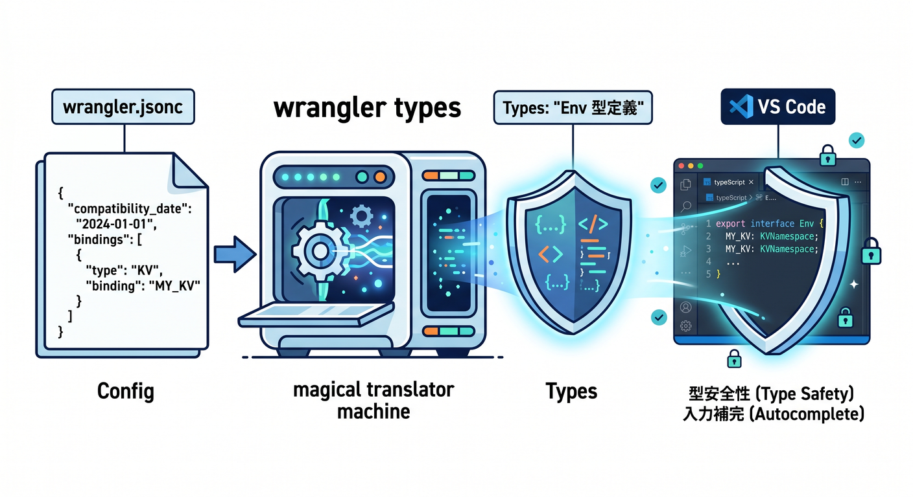
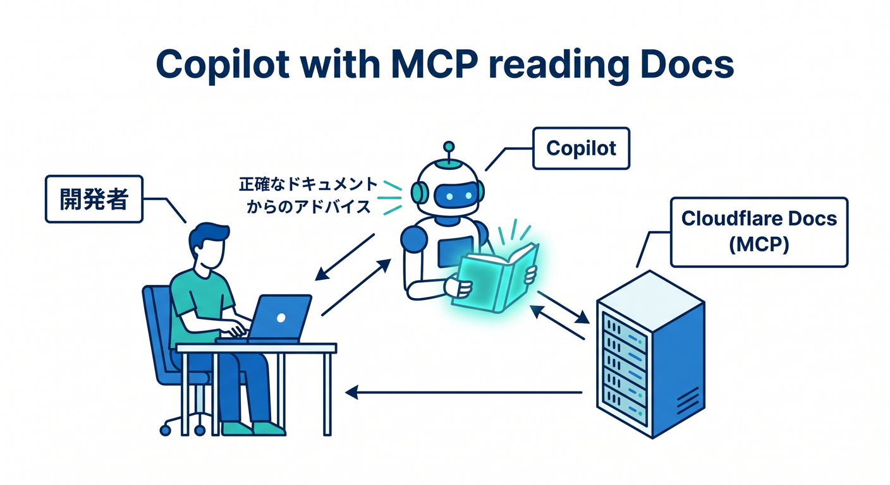

# 第10章：VS Codeから見るCloudflare開発の入口 🛠️

この章では、Cloudflare開発を「難しいクラウド操作」ではなく、**VS Codeの中でふつうにコードを書いて、すぐ試して、必要ならそのまま公開する流れ**として見ていきます 😊
2026年時点のCloudflare公式の主導線は、**C3で雛形を作る → `wrangler.jsonc` を中心に設定する → Wrangler または Cloudflare Vite plugin でローカル開発する → デプロイする**、という形です。新規プロジェクトでは `wrangler.jsonc` が推奨され、Vite plugin は本番に近い Workers ランタイムでの開発をかなり自然にしてくれます。 ([Cloudflare Docs][1])

## この章のゴール 🎯📘

この章のゴールは3つです 😄

1つ目は、**VS CodeでCloudflare開発を始めるとき、何を見ればいいか分かること**。
2つ目は、**Wrangler と Vite plugin をどう使い分けるか分かること**。
3つ目は、**Copilot と Cloudflare AI を“学習を助ける道具”として自然に組み込めること**です。Cloudflare公式は Workers 開発に VS Code や各種エージェントを使う流れを案内しており、GitHub Copilot 側も VS Code 上で MCP やカスタム指示に対応しています。 ([Cloudflare Docs][2])

---

## 1. VS Codeから見たときの「主役」は何か？ 👀💡

最初に大事なのは、Cloudflare開発の主役は「管理画面を覚えること」ではなく、**プロジェクトのファイル構成とローカル実行の流れをつかむこと**だという点です。
とくに最初に意識したい主役は、この4つです。`package.json`、`wrangler.jsonc`、`vite.config.ts`、そして実際の Worker コードです。Cloudflare公式も `wrangler.jsonc` を設定の source of truth として扱うことを勧めていて、Vite plugin もこの設定ファイルを見に行きます。 ([Cloudflare Docs][1])

ざっくり言うと、

* **Wrangler** は Cloudflare の公式CLI ☁️
* **`wrangler.jsonc`** は Cloudflare向け設定の中心 🧩
* **Vite plugin** は フロント寄り・React寄りの開発体験を気持ちよくする装置 ⚡
* **VS Code** は それらをまとめて扱う作業机 🪑

という感じです。Wrangler は開発・デプロイ・管理を担うCLIで、Cloudflareはグローバルインストールより**プロジェクトローカルでの利用**を勧めています。 ([Cloudflare Docs][3])



---

## 2. Wrangler と Vite plugin、どっちを使うの？ 🤔⚔️

ここは初心者がいちばん迷いやすいところです。でも整理するとシンプルです ✨

**Wrangler向き**なのは、API中心、バックエンド中心、軽い Worker、バッチっぽい処理、あるいは**`--remote` を使ったリモート実行が必要なとき**です。
**Vite plugin向き**なのは、React などのモダンなフロントエンドを使うとき、HMRでサクサク直したいとき、SPAやSSRやアセット込みの開発をしたいときです。Cloudflare公式もこの使い分けをかなりはっきり示しています。 ([Cloudflare Docs][2])

つまり、学習の最初はこう考えると楽です 😊

* **まず Worker 単体を触るなら Wrangler**
* **React も一緒に触るなら Vite plugin**
* **迷ったら、UIありは Vite、UIなしは Wrangler**



この感覚でだいたい合っています。しかも Cloudflare Vite plugin は GA 済みで、開発中のコードを `workerd` 上で動かしつつ、ViteのHMRも使えるので、かなり今っぽい開発体験になっています。 ([Cloudflare Docs][4])

---

## 3. 入口としておすすめの始め方 🚪✨

VS Code中心で始めるなら、入口はこの2パターンで十分です。

### パターンA：まずは Worker だけ触る

Cloudflare公式の C3 でプロジェクトを作ります。 ([Cloudflare Docs][5])

```bash
npm create cloudflare@latest -- my-first-worker
cd my-first-worker
npm run dev
```

### パターンB：React も一緒に触る

React + Vite + Workers API のセットで始められます。 ([Cloudflare Docs][6])

```bash
npm create cloudflare@latest -- my-react-app --framework=react
cd my-react-app
npm run dev
```

React テンプレートでは、`src/App.tsx` が画面側、`worker/index.ts` が API 側、`vite.config.ts` が Vite 側、`wrangler.jsonc` が Cloudflare 側、という役割分担になります。Cloudflare公式もこの構成をそのまま示しています。 ([Cloudflare Docs][6])

---

## 4. `wrangler.jsonc` を怖がらないコツ 🧾🌈

2026年のCloudflare学習でかなり大事なのが、**`wrangler.toml` より `wrangler.jsonc` を先に覚えること**です。Cloudflareは新規プロジェクトで `wrangler.jsonc` を推奨していて、新しい機能の一部は JSON 系設定を前提にしています。 ([Cloudflare Docs][1])

最小イメージはこんな感じです。

```jsonc
{
  "$schema": "./node_modules/wrangler/config-schema.json",
  "name": "hello-cloudflare",
  "compatibility_date": "2026-04-14",
  "main": "./worker/index.ts"
}
```

ここでまず見るのは3つだけで大丈夫です 😊

* `name` … Worker名
* `compatibility_date` … 互換性の基準日
* `main` … エントリーファイル

最初から全部覚える必要はありません。KV、D1、R2、Queues、Vectorize、Secrets などの binding は、必要になったら足せばOKです。しかも `wrangler.jsonc` は Worker 設定の source of truth として扱うのが公式のおすすめです。 ([Cloudflare Docs][1])



---

## 5. Vite plugin を使うと何がうれしいの？ ⚡🧠

Cloudflare Vite plugin のよさは、**Reactのいつもの開発体験と、Cloudflare Workers の実行環境を近づけてくれること**です。
`vite.config.ts` に `cloudflare()` を足すだけで、基本は動きます。しかも追加設定なしでもルートの `wrangler.jsonc` などを自動で見つけてくれます。 ([Cloudflare Docs][7])

```ts
import { defineConfig } from "vite";
import react from "@vitejs/plugin-react";
import { cloudflare } from "@cloudflare/vite-plugin";

export default defineConfig({
  plugins: [react(), cloudflare()],
});
```

ただし、ここで1つ注意があります ⚠️
Vite plugin を使うと、**ビルドやローカルサーバーまわりの設定は Vite 側が主役**になります。Cloudflare公式も、`define` やローカル dev の `port` など、いくつかの Wrangler 設定は Vite 側の設定に置き換わると説明しています。さらに、Vite build の結果として**出力用の Wrangler 設定が別に作られ、それが preview と deploy に使われます**。 ([Cloudflare Docs][8])

なので初心者向けに一言で言うと、

**Cloudflareの設定は `wrangler.jsonc`、画面とビルド体験は `vite.config.ts`**



と覚えるとスッキリします 😌

---

## 6. ローカル開発は「ローカルで動くけど、Cloudflareっぽい」🏠☁️

Cloudflareのローカル開発は、`wrangler dev` でも `vite dev` でも、基本は**自分のPC上で Worker コードが動きます**。その裏で Miniflare と `workerd` を使って、本番に近い形を再現してくれます。デフォルトでは binding 先もローカルシミュレーションですが、**AI binding は常にリモート実行**です。 ([Cloudflare Docs][9])

ここはとても大事です 💡
「Cloudflare開発＝毎回クラウドへ上げないと試せない」ではありません。
かなりの部分は、**VS Codeで保存 → ローカル確認 → 必要ならデプロイ**で進められます。 ([Cloudflare Docs][9])

さらに、R2 や D1 などは **remote bindings** で本物のクラウド側リソースにつなぐこともできます。



つまり、**コードは自分のWindows PCで動かしつつ、データだけ本物を見る**という学習も可能です。 ([Cloudflare Docs][9])

---

## 7. VS Codeでのデバッグは意外とやさしい 🔎🐞

Cloudflare Vite plugin は、デバッグ導線もかなり整っています。`vite dev` や `vite preview` を動かすと、**`/__debug` ルート**から DevTools を開けますし、VS Code 側からも **port 9229** にアタッチしてブレークポイントデバッグできます。しかもデバッグはデフォルトで有効です。 ([Cloudflare Docs][10])

たとえば `.vscode/launch.json` はこんな雰囲気です。

```json
{
  "configurations": [
    {
      "name": "hello-cloudflare",
      "type": "node",
      "request": "attach",
      "websocketAddress": "ws://localhost:9229/hello-cloudflare",
      "resolveSourceMapLocations": null,
      "attachExistingChildren": false,
      "autoAttachChildProcesses": false,
      "sourceMaps": true
    }
  ]
}
```

これがあると、VS Codeの「実行とデバッグ」から Worker にブレークポイントを当てやすくなります。
「エッジで動くコードってデバッグしにくそう…😇」という不安は、ここでかなり減らせます。 ([Cloudflare Docs][10])

---

## 8. TypeScriptでは `Env` を手書きしない ✍️❌➡️✅

Cloudflare学習で超重要な小ワザが、**`wrangler types` を使うこと**です。
Cloudflare公式は、`Env` インターフェースを手書きせず、**Wrangler設定から型を自動生成すること**を強く勧めています。 binding 名のズレをコンパイル時に見つけやすくなるからです。2026年1月からは複数 environment の型もまとめて生成されるようになっています。 ([Cloudflare Docs][11])

```bash
npx wrangler types
```

Workers AI binding や R2 binding を追加したのに、VS Code 側で型が出ない…というときは、まずこれを疑うとよいです 😊



学習中ほど、型の助けは大きいです。

---

## 9. GitHub Copilot を Cloudflare学習の相棒にする 🤝✨

GitHub Copilot は、Cloudflare学習とかなり相性がいいです。
特に VS Code では、**リポジトリ全体の指示**として `.github/copilot-instructions.md`、**パス別の指示**として `.github/instructions/**/*.instructions.md`、**エージェント向け指示**として `AGENTS.md` が使えます。Copilot Chat はこれらを参照でき、実際に使われたときは references に表示されます。 ([GitHub Docs][12])

たとえば Cloudflare学習用なら、こんな指示を書いておくとかなり効きます。

```md
## Cloudflare project instructions

- Prefer Cloudflare Workers-native APIs first.
- Treat wrangler.jsonc as the source of truth.
- When adding a new binding, remind me to run `wrangler types`.
- Prefer Web Standards APIs before Node-specific APIs.
- For React apps on Workers, keep frontend in `src/` and backend entry in `worker/`.
- When suggesting AI features, prefer Workers AI binding (`env.AI`) first.
```

これだけでも Copilot の提案がかなり安定します 🌟
「毎回同じ前提を説明する」のを減らせるのが大きいです。

---

## 10. Copilot と MCP をつなぐと、Cloudflare学習がさらに楽になる 🧠🔌

2026年時点では、GitHub Copilot は **MCP に対応**しており、VS Code では `.vscode/mcp.json` や `settings.json` で MCP サーバーを設定できます。Copilot Chat の **Agent モード**で使い、ツール一覧からサーバーや利用可能ツールを確認できます。MCP の resources や prompts も VS Code 側で扱えます。 ([GitHub Docs][13])

Cloudflare側も、Workers 学習用に **`cloudflare-docs` MCP サーバー** と **`cloudflare-observability` MCP サーバー** を案内しています。前者は Workers の知識をエージェントに教える用途、後者はログ・例外確認などに役立つ用途です。 ([Cloudflare Docs][14])

つまり、VS Code + Copilot + MCP を使うと、

* Cloudflareの公式知識を引き込みながら学ぶ 📚
* 実装中にログや例外の確認を助けてもらう 🔍
* その場でコード提案までつなげる ✨

という流れが作れます。



これは「AIに丸投げする」のではなく、**Cloudflare開発の地図を早く頭に入れるための補助輪**としてかなり優秀です 😊

---

## 11. CloudflareのAI機能をVS Code側から触る入口 🤖☁️

CloudflareのAIを開発導線に自然に混ぜるなら、まずは **Workers AI binding** を 1つ足すのが最短です。`wrangler.jsonc` に `ai.binding` を加えると、Worker コード内で `env.AI` が使えるようになります。さらに AI Gateway と組み合わせると、Gateway 経由の推論やログIDの取得もできます。TypeScript を使っているなら、binding を変えたあとに `wrangler types` を回すのが公式案内です。 ([Cloudflare Docs][15])

```jsonc
{
  "$schema": "./node_modules/wrangler/config-schema.json",
  "name": "ai-hello",
  "compatibility_date": "2026-04-14",
  "main": "./worker/index.ts",
  "ai": {
    "binding": "AI"
  }
}
```

```ts
export default {
  async fetch(_request: Request, env: Env) {
    const result = await env.AI.run("@cf/meta/llama-3.1-8b-instruct", {
      prompt: "Cloudflareを30文字で説明して"
    });

    return Response.json(result);
  }
};
```

この形だと、**VS Codeで書く → ローカルで確認する → AIはCloudflare側で動く**、という流れになります。AI binding はローカルシミュレーションではなくリモートで動くので、その点だけは普通の KV や D1 とは感覚が少し違います。 ([Cloudflare Docs][9])

---

## 12. Next.js はどう位置づければいい？ ⚛️➡️☁️

この章では Next.js に深くは入りませんが、位置づけだけは押さえておきましょう。
Cloudflare公式は、Next.js を **OpenNext adapter 経由で Workers にデプロイする導線**を用意しており、C3 から `--framework=next` でも始められます。ですが、学習順としては **まず Worker 単体か React + Vite で Workers の感覚をつかんでから** のほうが理解しやすいです。 ([Cloudflare Docs][16])

つまり、

* **Cloudflareを学ぶ章**では Worker / React + Vite を優先
* **Next.jsを学ぶ章**で OpenNext を見る

この順番のほうが、頭の中がごちゃつきにくいです 😌

---

## 13. 初学者向けおすすめ学習ルート 🗺️🌟

この章の内容を実際の行動にすると、次の順番がかなりおすすめです。

1. **Worker only で Hello World を動かす**
2. **React テンプレートで `src/` と `worker/` の役割を理解する**
3. **`wrangler.jsonc` に binding を1つ追加する**
4. **`wrangler types` を実行して型を更新する**
5. **VS Code でブレークポイントを置く**
6. **Copilot instructions を追加する**
7. **Workers AI binding を1つ試す**

この順番だと、Cloudflareを「なんとなく触る」ではなく、**VS Codeから見える形で理解を積み上げる**ことができます。React も AI も “Cloudflareの上に載るもの” として整理しやすくなります。 ([Cloudflare Docs][6])

---

## 14. この章のまとめ 🧁☁️🎉

この章でいちばん大事なのは、Cloudflare開発の入口を**「CLIが怖い世界」ではなく、「VS Codeの中で普通に進む開発」**として見直すことです。

覚えておきたい芯はこれです ✨

* Cloudflare設定の中心は **`wrangler.jsonc`**
* UIありなら **Vite plugin** がかなり強い
* ローカル開発でも **本番にかなり近い感覚**で試せる
* TypeScriptでは **`wrangler types` が超重要**
* Copilot は **instructions と MCP** を使うとかなり賢くなる
* AI機能は **`env.AI`** から小さく始めるとわかりやすい

ここまで見えれば、次の章で storage や bindings や AI を深掘りしても、かなり迷子になりにくくなります 😊🚀

---

## ミニ課題 📝✨

最後に小さな課題です。

1. Worker only テンプレートを作る
2. `wrangler.jsonc` を開いて `name` と `main` を確認する
3. `npx wrangler types` を実行する
4. VS Code に `.github/copilot-instructions.md` を作る
5. 余裕があれば `ai.binding` を追加して `env.AI` を触る

これだけでも、「Cloudflare開発の入口」はかなり自分のものになります 🌈

次はこの続きとして、第11章の **AI入りの開発体験：CopilotとCloudflareの相性** に自然につなげやすいです。

[1]: https://developers.cloudflare.com/workers/wrangler/configuration/ "Configuration - Wrangler · Cloudflare Workers docs"
[2]: https://developers.cloudflare.com/workers/development-testing/wrangler-vs-vite/ "Choosing between Wrangler & Vite · Cloudflare Workers docs"
[3]: https://developers.cloudflare.com/workers/wrangler/commands/?utm_source=chatgpt.com "Commands - Wrangler · Cloudflare Workers docs"
[4]: https://developers.cloudflare.com/changelog/post/2025-04-08-vite-plugin/ "The Cloudflare Vite plugin is now Generally Available · Changelog"
[5]: https://developers.cloudflare.com/workers/get-started/guide/?utm_source=chatgpt.com "Get started - CLI · Cloudflare Workers docs"
[6]: https://developers.cloudflare.com/workers/framework-guides/web-apps/react/ "React + Vite · Cloudflare Workers docs"
[7]: https://developers.cloudflare.com/workers/vite-plugin/get-started/ "Get started · Cloudflare Workers docs"
[8]: https://developers.cloudflare.com/workers/vite-plugin/reference/migrating-from-wrangler-dev/ "Migrating from wrangler dev · Cloudflare Workers docs"
[9]: https://developers.cloudflare.com/workers/development-testing/ "Development & testing · Cloudflare Workers docs"
[10]: https://developers.cloudflare.com/workers/vite-plugin/reference/debugging/ "Debugging · Cloudflare Workers docs"
[11]: https://developers.cloudflare.com/workers/languages/typescript/?utm_source=chatgpt.com "Write Cloudflare Workers in TypeScript"
[12]: https://docs.github.com/en/copilot/reference/custom-instructions-support "Support for different types of custom instructions - GitHub Docs"
[13]: https://docs.github.com/en/copilot/concepts/context/mcp "About Model Context Protocol (MCP) - GitHub Docs"
[14]: https://developers.cloudflare.com/workers/get-started/prompting/ "Prompting · Cloudflare Workers docs"
[15]: https://developers.cloudflare.com/workers-ai/configuration/bindings/ "Workers Bindings · Cloudflare Workers AI docs"
[16]: https://developers.cloudflare.com/workers/framework-guides/web-apps/nextjs/ "Next.js · Cloudflare Workers docs"
