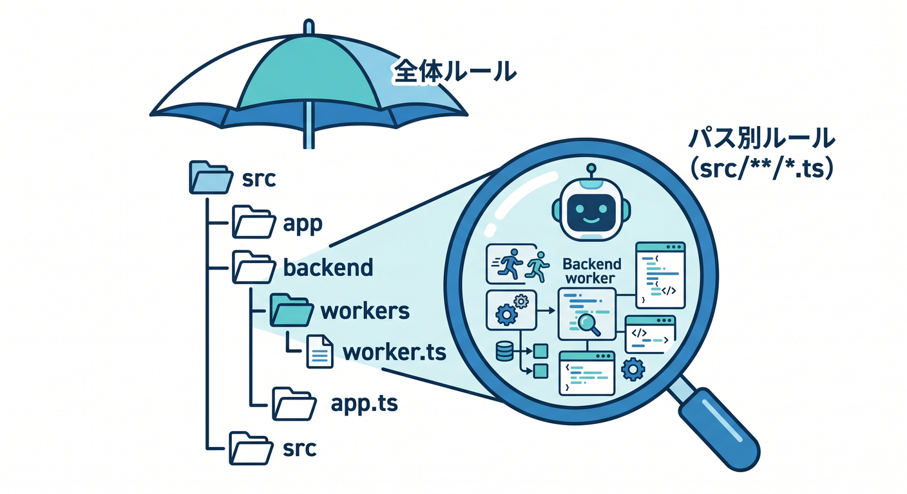
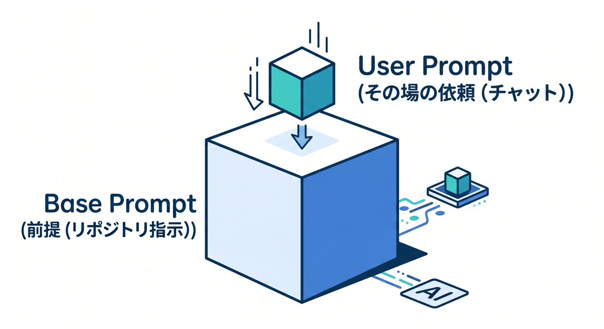
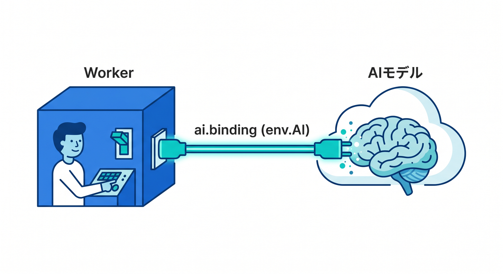
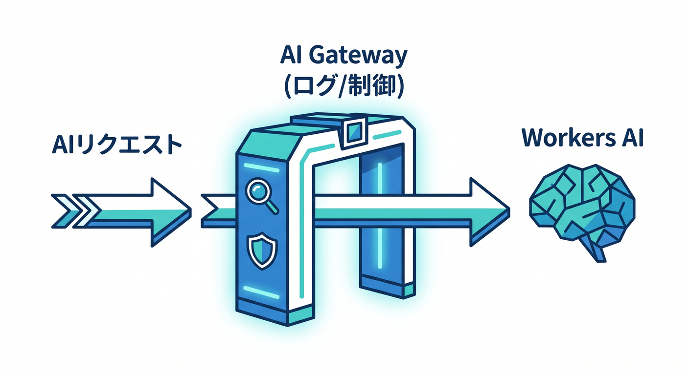

# 第11章：AI入りの開発体験：CopilotとCloudflareの相性 ✨🤝

この章では、AIを「なんでも自動でやってくれる魔法の箱」としてではなく、**Cloudflareを学ぶ速度を上げてくれる相棒**として使えるようになることを目指します 😊
特に今のCloudflareは、Workers向けのAI用プロンプト、Markdownで渡しやすいドキュメント、`llms.txt` / `llms-full.txt`、Documentation MCP Server まで用意していて、**AIに最新のCloudflare前提を食べさせやすい**のが強みです。さらにGitHub Copilot側も、VS Codeでリポジトリ単位のカスタム指示やMCP連携を扱えるので、両者の相性はかなり良いです。 ([Cloudflare Docs][1])

まず大事なのは、**Copilotに毎回ゼロから推測させないこと**です 🧠
Cloudflare公式は、Workers APIやベストプラクティスをAIツールへ渡すためのベースプロンプトを公開しています。GitHub Copilotも、`.github/copilot-instructions.md` や `.github/instructions/**/*.instructions.md` で、プロジェクトの前提や流儀を事前に教えられます。つまり2026年の開発では、**AIへ「質問する」より先に、AIへ「前提を仕込む」**のがコツです。 ([Cloudflare Docs][1])

## この章のゴール 🎯

この章が終わるころには、次の3つができる状態を目指します ✨
1つ目は、CopilotにCloudflare前提の返答をさせること。
2つ目は、Copilot ChatからCloudflareの最新情報へ近づく導線を作ること。
3つ目は、Workers AI・AI Gateway・AI Search・Vectorize の役割分担を、AI開発の流れとして説明できることです。 ([Cloudflare Docs][2])

---

## 1. なぜCopilotとCloudflareは相性がいいの？ ☁️💬

Cloudflareは、ただのホスティング先ではなく、**Workersでコードを動かし、Workers AIでモデルを呼び、AI Gatewayで観測・制御し、VectorizeやAI Searchで検索や記憶までつなげられる**開発基盤です。だからAIアシスタントにとっても、「どのサービスをどう組み合わせるか」を整理しやすい土台になっています。 ([Cloudflare Docs][3])

しかもCloudflare公式は、Workers向けに「AIツールへ前提知識を渡すためのベースプロンプト」を公開しています。これはかなり大きいです 🙌
AIに「Cloudflareの流儀」を察してもらうのではなく、**Cloudflare公式の文脈を先に与えてから考えさせる**ほうが、初学者にはずっと安定します。 ([Cloudflare Docs][1])

---

## 2. まずはCopilotに“このリポジトリの常識”を教えよう 📝🤖

GitHub Copilotでは、リポジトリのルートに `.github/copilot-instructions.md` を置くことで、**そのプロジェクトで共通して守ってほしい前提**を渡せます。ファイルは自然言語のMarkdownで書けます。VS Codeでもこの仕組みが使えます。 ([GitHub Docs][4])

Cloudflare学習用のリポジトリなら、ここに「TypeScript中心」「Cloudflare Workers前提」「Node専用APIを安易に使わない」「提案時はローカル確認手順も書く」などを入れておくと、Copilotの返答がかなり安定します 😊 ([GitHub Docs][5])

教材用の最小例はこんな感じです。

```md
## Cloudflare learning repo instructions

- Explain in simple Japanese.
- Prefer TypeScript over JavaScript.
- Prefer Cloudflare Workers patterns over Node-only server patterns.
- Avoid suggesting Node-specific APIs unless clearly necessary.
- When proposing AI features, first decide whether Workers AI, AI Gateway, AI Search, or Vectorize is the right fit.
- When changing code, also explain how to test locally with Wrangler.
- Keep examples small, readable, and beginner-friendly.
```

このファイル名と配置場所はGitHub公式の方式です。なお、Copilotの返答はAIなので毎回100%同じように従うとは限りません。**「かなり効くけど絶対ではない」**くらいの感覚で使うのがちょうどいいです。 ([GitHub Docs][4])


---

## 3. TypeScript用、Workers用、React用で“教え方”を分ける 🧩

リポジトリ全体の指示だけだと、だんだん太って読みづらくなります 💦
そこでGitHub Copilotは、`.github/instructions/**/*.instructions.md` という**パス別のカスタム指示**も使えます。VS CodeのCopilot Chatでは、リポジトリ全体の指示に加えて、対象ファイルに合うパス別指示も使えます。 ([GitHub Docs][4])

たとえば Workers 向けだけ別ルールにするなら、こんな感じです。

```md
---
applyTo: "src/**/*.ts"
---

- Assume Cloudflare Workers runtime first.
- Prefer fetch handlers and Web Standard APIs.
- Do not suggest Express or Node HTTP server code unless explicitly requested.
- For AI calls, start from env.AI binding examples.
- Mention when AI Gateway should be added for logging, retries, caching, or fallback.
```

`applyTo` で対象パスを絞る書き方もGitHub公式です。TypeScript用、React用、`src/worker/`用のように分けると、Copilotが余計なことを言いにくくなります ✨ ([GitHub Docs][4])



---

## 4. “毎回ぐぐる”を減らすには、CopilotにCloudflareの最新情報への道を渡す 🔎☁️

ここが2026年っぽい大事ポイントです 🚀
Cloudflareは、自社ドキュメントをAIが扱いやすい形でも提供しています。`llms.txt` / `llms-full.txt` があり、各ページは `/index.md` や `Accept: text/markdown` でもMarkdown化できます。つまり、**最新のCloudflare DocsをAIに渡しやすい**設計です。 ([Cloudflare Docs][6])

さらにCloudflareは、Documentation MCP Server も公開しています。Cloudflare側は、このMCPサーバーをVS Codeなどで使えるように案内していて、GitHub側もVS CodeのCopilot ChatでMCPサーバーを使えるようにしています。VS Codeでは、MCPサーバーをリポジトリ共有なら `.vscode/mcp.json`、個人用なら `settings.json` に設定でき、Copilot Chatでは **Agent** モードでツール一覧からMCPサーバーを使えます。 ([Cloudflare Docs][6])

Windowsで触るなら、VS Codeで `Ctrl` + `Shift` + `P` を押してコマンドパレットを開き、`MCP: List Servers` で認識されているサーバーを確認できます。Copilot Chat側では Agent モードに切り替え、ツールアイコンから使えるMCPサーバー一覧を確認します。 ([GitHub Docs][7])

つまり学習の現場では、こう考えるとラクです 😊
**Copilot本体は会話役、Cloudflare Docs MCP は最新資料係**、という役割分担です。これだけで「古い記事を元にした提案」をかなり減らせます。 ([Cloudflare Docs][6])


---

## 5. Cloudflare公式の“AI向け前提”も使おう 📘✨

Cloudflare Workersの docs には、AIツールへ前提を渡すための **base prompt** が公開されています。使い方もシンプルで、公式のコードブロックからコピーし、自分のAIツールに貼り、`<user_prompt>` の間に自分の依頼を書く流れです。 ([Cloudflare Docs][1])

この考え方はCopilotにも応用できます。
つまり、**毎回のチャットで長文を打つより、Cloudflare前提はリポジトリ指示に寄せる**。
その上で、その場だけの依頼は短く書く。
この二段構えがいちばん実用的です 👍 ([Cloudflare Docs][1])

たとえば、Copilot Chatにはこんな依頼がしやすくなります。

```text
このリポジトリの指示に従って、
Cloudflare Workers で POST /api/chat を作ってください。
Workers AI を使い、あとで AI Gateway を差し込める形にしてください。
初心者向けにコメントを多めに入れてください。
```

こういう短い依頼で済むようになるのが、カスタム指示の価値です 😊 ([GitHub Docs][5])



---

## 6. まずは最小のAI Workerを1本作る 🛠️🤖

Workers AI は、Cloudflareのグローバルネットワーク上で、**サーバーレスにAIモデルを実行できる仕組み**です。WorkersやPages、あるいはCloudflare APIから呼べます。インフラのスケーリングや未使用分の管理をあまり気にせず使えるのが強みです。 ([Cloudflare Docs][2])

AIバインディングは `wrangler.jsonc` に `ai.binding` を書く形です。AI SearchのWorkers bindingも同じ `env.AI` 系の考え方で使えます。 ([Cloudflare Docs][8])

まずは教材として、こんな最小構成をイメージしてください。

```jsonc
{
  "name": "ch11-ai-worker",
  "main": "src/index.ts",
  "compatibility_date": "2026-04-14",
  "ai": {
    "binding": "AI"
  }
}
```

Cloudflare公式は、Workers AIバインディングを `env.AI` として使う形を案内しています。さらにAI Gateway側の案内では、Wrangler設定を変えたら `wrangler types` を実行して `env` の型やランタイム型を生成する流れも紹介されています。TypeScriptで進めるなら、ここはかなり大事です ✍️ ([Cloudflare Docs][9])

次に、Worker本体です。

```ts
type Env = {
  AI: Ai;
};

export default {
  async fetch(_request: Request, env: Env): Promise<Response> {
    const result = await env.AI.run(
      "@cf/meta/llama-3.1-8b-instruct",
      {
        prompt: "Cloudflare Workersを超初心者向けに3行で説明して"
      }
    );

    return Response.json(result);
  }
} satisfies ExportedHandler<Env>;
```

`env.AI.run()` でモデルを呼び、第一引数にモデルID、第二引数に入力を渡すのが公式の基本形です。



モデルIDは今後も増減や更新があるので、固定で覚え込むより **Workers AI の Models ページで都度確認する**習慣をつけるのがおすすめです。 ([Cloudflare Docs][9])

---

## 7. AI Gatewayを1枚かませると、“開発の後半”が楽になる 📈🛡️

AI Gateway は、AIアプリに対して**可視化と制御**を足すためのサービスです。分析、ログ、キャッシュ、レート制限、リトライ、モデルフォールバックなどを扱えます。Workers AI との相性も良く、バインディング経由で比較的少ない変更で差し込めます。 ([Cloudflare Docs][10])

公式のWorkers向け例では、`env.AI.run()` の第3引数に `gateway: { id: "my-gateway" }` を渡せます。さらに最新のGatewayログIDを `env.AI.aiGatewayLogId` から取れる形も案内されています。 ([Cloudflare Docs][11])

教材用に1段だけ進めると、こうなります。

```ts
type Env = {
  AI: Ai;
};

export default {
  async fetch(_request: Request, env: Env): Promise<Response> {
    const result = await env.AI.run(
      "@cf/meta/llama-3.1-8b-instruct",
      {
        prompt: "Cloudflare Workersを超初心者向けに3行で説明して"
      },
      {
        gateway: {
          id: "my-gateway"
        }
      }
    );

    return Response.json({
      result,
      logId: env.AI.aiGatewayLogId
    });
  }
} satisfies ExportedHandler<Env>;
```

初心者のうちは、「まずAIが動く」だけで満足しがちです。でも実務では、**あとから“どのプロンプトで変な答えが出たのか”を追えるか**が効いてきます。



なので、CloudflareのAI系機能を学ぶときは、Workers AI単体で終わらせず、**早めにAI Gatewayも視野に入れる**のがとても良いです 😊 ([Cloudflare Docs][10])

---

## 8. AIアプリを広げるときの役割分担 🌍🧠

ここで、CloudflareのAI関連サービスを1本の流れで整理しておきます。

**Workers AI** は、モデルを実行する場所です。テキスト生成だけでなく、埋め込み、音声認識、画像系など複数タスクのモデルが一覧化されています。 ([Cloudflare Docs][2])

**AI Gateway** は、AI呼び出しの交通整理係です。ログ、分析、キャッシュ、レート制限、リトライ、フォールバックなどを担当します。 ([Cloudflare Docs][10])

**Vectorize** は、Cloudflareのグローバル分散ベクトルDBです。埋め込み検索や意味検索、推薦、RAGの土台に向いています。Workersと組み合わせてフルスタックAIアプリを作る前提で設計されています。 ([Cloudflare Docs][12])

**AI Search** は、Webサイトや非構造データをつなぐと、継続的に更新されるインデックスを作り、自然言語で問い合わせられるマネージド検索です。Workers AI、Vectorize、AI Gateway、R2、Browser Rendering などと統合されます。なお、古い資料では **AutoRAG** の名前が出てくることがありますが、今は **AI Search** です。 ([Cloudflare Docs][13])

つまり、ざっくり言うとこうです 😄
**Workers AI = 推論**
**AI Gateway = 監督**
**Vectorize = 記憶**
**AI Search = 検索体験の完成品寄り**


この分担を頭に入れておくと、Copilotへ相談するときも「何を選ぶべきか」がブレにくくなります。 ([Cloudflare Docs][2])

---

## 9. Copilotへの頼み方は、“実装依頼”より“判断依頼”が強い 💡

初心者ほど、Copilotにいきなり「全部作って」と言いたくなります。
でもCloudflare学習では、その頼み方よりも、まず **どの機能を選ぶべきか判断させる** ほうがうまくいきます。これはCloudflare側が「ベストプラクティス込みの文脈をAIへ与える」方針を出していることとも相性が良いです。 ([Cloudflare Docs][1])

たとえば、こんな聞き方が強いです。

```text
この要件なら、
Workers AI / AI Gateway / AI Search / Vectorize のうち
どれを使うべきか、理由つきで比較してから
最小構成を提案してください。
```

あるいは、こういう聞き方もかなり良いです。

```text
このコードは Node.js 前提になっていませんか？
Cloudflare Workers ランタイムで動く形に直してください。
必要なら Web Standard API に置き換えてください。
```

さらに学習用なら、こうです。

```text
コードを書くだけでなく、
なぜその構成にしたのかを、
初心者向けに先に説明してから実装してください。
```

この「判断 → 説明 → 実装」の順で頼むと、ただの自動補完ではなく、**理解の補助輪**としてCopilotを使いやすくなります 😊 ([Cloudflare Docs][1])

---

## 10. VS Codeでは“プロンプトの再利用”もできる 🧰

GitHub CopilotはVS Codeで、**prompt files** も扱えます。これは `*.prompt.md` 形式のMarkdownファイルに、よく使う依頼文と文脈を保存して再利用する仕組みで、GitHub公式では public preview とされています。 ([GitHub Docs][5])

Cloudflare学習では、たとえばこんなファイルを作ると便利です。

```md
## cloudflare-review.prompt.md

このコードが Cloudflare Workers ランタイム前提か確認してください。
Node 固有APIが混ざっていたら指摘してください。
必要なら Workers 向けに最小修正案を出してください。
最後にローカル確認手順も書いてください。
```

毎回同じ説明を打たなくて済むので、**教材づくり・検証・復習**がすごく楽になります ✨
リポジトリ全体の常識は custom instructions、1回ごとの依頼テンプレは prompt files、と分けると整理しやすいです。 ([GitHub Docs][5])

---

## 11. ハマりやすいポイント 😵‍💫⚠️

1つ目は、**カスタム指示は効くけれど、絶対ではない**ことです。GitHub公式も、AIの非決定性のため毎回まったく同じ従い方にはならないと明記しています。なので、重要ルールはファイルにも残し、レビューでも見る前提が大事です。 ([GitHub Docs][5])

2つ目は、**Copilot code review では custom instructions の読み取り上限がある**ことです。公式では、コードレビュー時は instruction file の先頭4,000文字までが対象で、それ以降はレビューに効かないと案内されています。長大な心得を書きすぎないほうがよいです。 ([GitHub Docs][14])

3つ目は、**古いCloudflare記事や断片的なブログを鵜呑みにしない**ことです。CloudflareはAI Searchのように名称更新や機能追加が続いていますし、Workers AIのモデル一覧も変化します。困ったらDocsのMarkdown版、`llms-full.txt`、またはDocumentation MCP Serverを使って最新情報に寄せましょう。 ([Cloudflare Docs][8])

---

## 12. この章の実践メニュー 🧪✨

この章の学習は、次の順で進めるのがおすすめです 😊
まず `.github/copilot-instructions.md` を作る。
次に Workers 用の path-specific instructions を1つ作る。
そのあと最小の Workers AI サンプルを1本動かす。
最後に AI Gateway を差し込んで、ログIDまで返す。
ここまでできると、AIを「便利なおしゃべり相手」から、**Cloudflare学習の実戦補助ツール**へ育てられます。 ([GitHub Docs][4])

---

## 13. まとめ 🌈

この章のいちばん大事なメッセージはこれです。
**Copilotを賢くする鍵は、質問の上手さより、前提の仕込み方にある**、です 🔑

Cloudflareは、Workers向けの公式ベースプロンプト、Markdownで渡しやすいDocs、`llms.txt` / `llms-full.txt`、Documentation MCP Server まで揃っていて、AIと一緒に学びやすい土台があります。GitHub Copilotも、VS Codeで custom instructions、path-specific instructions、prompt files、MCP という形でその土台に乗れます。だから今のCloudflare学習は、**AIを禁止するより、AIに正しい前提を食べさせるほうが強い**のです。 ([Cloudflare Docs][1])

---

## 練習問題 🏁

1問目 ✍️
`.github/copilot-instructions.md` を作って、「TypeScript優先」「Cloudflare Workers前提」「初心者向けの説明をつける」の3つを入れてみましょう。

2問目 🧠
`src/**/*.ts` だけに効く `.instructions.md` を作って、「Node専用APIを避ける」を追加してみましょう。

3問目 🤖
Workers AI の最小サンプルを作り、`env.AI.run()` で1回返答を返してみましょう。

4問目 📈
そのWorkerに AI Gateway を足して、返答と一緒に `logId` も返すようにしてみましょう。

5問目 🔎
Copilot Chat に「この要件では Workers AI / AI Search / Vectorize のどれが合う？」と聞き、理由の違いを比較してみましょう。 ([Cloudflare Docs][9])

必要なら次に、そのまま続けて
**「第11章のあとに置く確認テスト10問」**
の形で続編も作れます。

[1]: https://developers.cloudflare.com/workers/get-started/prompting/ "Prompting · Cloudflare Workers docs"
[2]: https://developers.cloudflare.com/workers-ai/ "Overview · Cloudflare Workers AI docs"
[3]: https://developers.cloudflare.com/workers/?utm_source=chatgpt.com "Overview · Cloudflare Workers docs"
[4]: https://docs.github.com/copilot/customizing-copilot/adding-custom-instructions-for-github-copilot "Adding repository custom instructions for GitHub Copilot - GitHub Docs"
[5]: https://docs.github.com/copilot/concepts/about-customizing-github-copilot-chat-responses "About customizing GitHub Copilot responses - GitHub Docs"
[6]: https://developers.cloudflare.com/style-guide/ai-tooling/ "AI tooling · Cloudflare Style Guide"
[7]: https://docs.github.com/ja/copilot/how-tos/provide-context/use-mcp-in-your-ide/extend-copilot-chat-with-mcp "モデル コンテキスト プロトコル (MCP) サーバーを使用した GitHub Copilot Chatの拡張 - GitHubドキュメント"
[8]: https://developers.cloudflare.com/ai-search/usage/workers-binding/ "Workers Binding · Cloudflare AI Search docs"
[9]: https://developers.cloudflare.com/workers-ai/configuration/bindings/ "Workers Bindings · Cloudflare Workers AI docs"
[10]: https://developers.cloudflare.com/ai-gateway/ "Overview · Cloudflare AI Gateway docs"
[11]: https://developers.cloudflare.com/ai-gateway/integrations/worker-binding-methods/ "AI Gateway Binding Methods · Cloudflare AI Gateway docs"
[12]: https://developers.cloudflare.com/vectorize/ "Overview · Cloudflare Vectorize docs"
[13]: https://developers.cloudflare.com/ai-search/ "Cloudflare AI Search · Cloudflare AI Search docs"
[14]: https://docs.github.com/copilot/using-github-copilot/code-review/using-copilot-code-review "Using GitHub Copilot code review - GitHub Docs"
