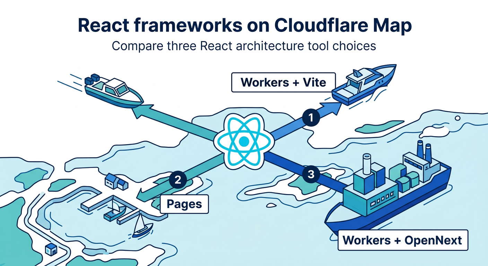
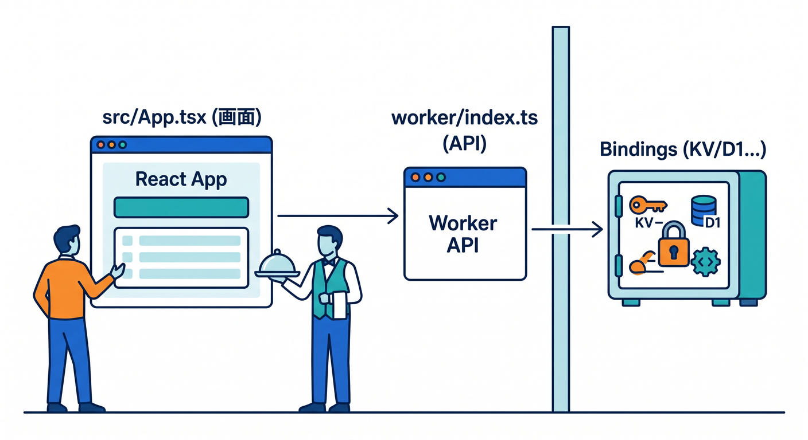
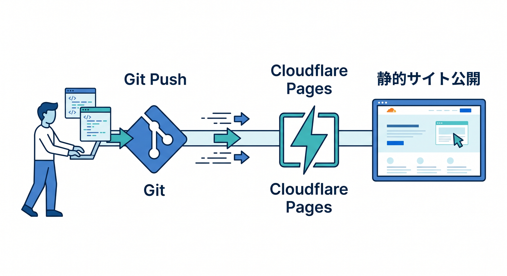
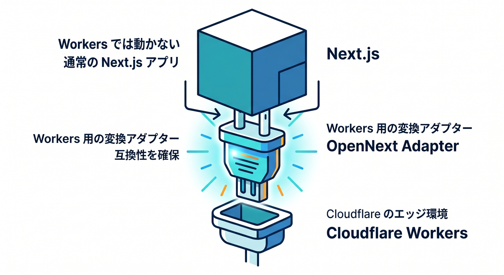
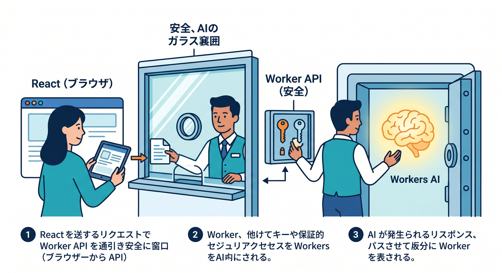

# 第12章：ReactやNext.jsから見たCloudflare ☁️⚛️

この章では、React や Next.js を主役にするのではなく、**Cloudflare を主役に見たときに React 系フレームワークがどう並ぶのか**をやさしく整理していきます 😊
2026年4月14日時点での見取り図を先に言うと、**React の最初の入口は Workers + Vite plugin がかなり素直**で、**Next.js は Workers 上で OpenNext adapter を使うのが本筋**、そして **Pages は静的公開や Git 連携の入り口として今も十分使いやすい**、という理解がいちばん自然です。([Cloudflare Docs][1])

## この章のゴール 🎯📚

この章のゴールは3つです 😌
1つ目は、**React / Next.js / Pages / Workers の役割分担を頭の中で地図にすること**。
2つ目は、**「どの構成から始めると迷いにくいか」を自分で判断できること**。
3つ目は、**Cloudflare の AI サービスを React 系アプリにどう差し込むかをイメージできること**です。Cloudflare の公式ドキュメントでも、Workers は React・Next・React Router など複数のフレームワークを受け止める中心基盤として整理されています。([Cloudflare Docs][2])

---

## 1. まず結論です。React系から見た Cloudflare の基本地図 🗺️⚡

いちばん大事なのは、**「Cloudflare で React を動かす」と言っても、実は3パターンくらいに分かれる**と知ることです 😊

* **React SPA を軽快に始めたい** → Workers + Vite plugin
* **静的サイトを Git 連携で気楽に公開したい** → Pages
* **Next.js の SSR や PPR も使いたい** → Workers + OpenNext adapter
  この整理は、Cloudflare の React / Next.js / Pages 各公式ガイドをそのままつないだ見方です。([Cloudflare Docs][1])



さらに今の Cloudflare は、Pages も使えますが、**Workers 側の機能幅がかなり広い**です。Cloudflare 自身が Pages から Workers への移行ガイドを用意していて、Workers は静的アセット・API・SSR をまとめて扱え、Pages より広い機能セットを持つと説明しています。つまり、**学習の中心軸を Workers に置くのはかなり筋がいい**です。([Cloudflare Docs][3])

---

## 2. React なら、最初の1本は Workers + Vite で考えるのがいちばんわかりやすいです 🧩🚀

Cloudflare の React 向け公式ガイドは、**React SPA + Cloudflare Workers API + Cloudflare Vite plugin** という形を前面に出しています。しかも Vite plugin は **workerd** 上で動くので、ローカル開発の挙動を本番にかなり近づけやすいです。これは初学者にとってかなり大きくて、**「ローカルでは動いたのに Cloudflare に上げたら違う」**を減らしやすい、ということです。([Cloudflare Docs][1])

Cloudflare 公式の React テンプレートでは、**フロントの React** と **バックエンド API の Worker** が最初からひとつの学習単位として置かれています。`src/App.tsx` 側から `worker/index.ts` の API を呼ぶ形が基本で、**React 画面から Cloudflare の binding を直接たたくのではなく、Worker を経由する**、という考え方を自然に身につけられます。



これはあとで D1、KV、R2、Workers AI をつなぐときにも、そのまま効いてきます。([Cloudflare Docs][1])

まずはこの形で始めるのがおすすめです 😊

```bash
npm create cloudflare@latest -- my-react-app --framework=react
cd my-react-app
npm run dev
```

React の Workers ガイドでは、この雛形で `npm run dev` によりローカル開発サーバーを起動し、`npm run deploy` でビルドとデプロイを行う流れが案内されています。([Cloudflare Docs][1])

そして SPA として動かすなら、**ルーティングの考え方**も早めに押さえておくと安心です。Workers の静的アセット機能では、SPA 用に `assets.not_found_handling = "single-page-application"` を設定できます。これにより、直接 `/about` のような URL を開いても `index.html` に落としてくれるので、React Router などのクライアントルーティングと相性がよくなります。([Cloudflare Docs][4])

例としてはこんな形です ✍️

```json
{
  "name": "my-react-app",
  "compatibility_date": "2026-04-14",
  "assets": {
    "directory": "./dist",
    "not_found_handling": "single-page-application"
  },
  "ai": {
    "binding": "AI"
  }
}
```

`wrangler.jsonc` は新規プロジェクトで推奨されていて、SPA 用の `assets.directory` や `not_found_handling`、そして AI binding のような設定をひとつの場所で管理しやすいです。([Cloudflare Docs][5])

---

## 3. Pages は「古い」ではなく、「向いている場所が違う」です 🌈📄

Pages も、2026年でもちゃんと居場所があります 😊
React の Pages ガイドでは、`npm create cloudflare@latest -- my-react-app --framework=react --platform=pages` で始められ、GitHub 連携、`*.pages.dev`、PR ごとの preview deployment まで素直につながります。**「まずは静的サイトを公開して、見た目を育てたい」**という段階では、今でもかなり気楽です。([Cloudflare Docs][6])

```bash
npm create cloudflare@latest -- my-react-app --framework=react --platform=pages
cd my-react-app
npm run dev
```

Pages は特に、**コーポレートサイト、LP、ドキュメントサイト、作品集、ちょっとした React フロント**のような用途と相性がいいです。



コミットのたびに再ビルド・再デプロイされ、Pull Request の preview も出るので、**「コードを書く → GitHub に push → 画面を見る」**の流れがきれいです。([Cloudflare Docs][6])

ただし、Pages にもサーバー側コードはあります。Pages Functions は **Cloudflare Workers の上で動く**仕組みで、認証、フォーム処理、middleware 的な処理などを加えられます。Node.js API 互換や compatibility date / flag も設定できます。つまり、**Pages は静的だけ**ではありません。ただし、Cloudflare の比較表では、Cloudflare Vite plugin や Cron Triggers、より広い観測機能など、Workers 側にしかない・Workers のほうが扱いやすい項目もあります。([Cloudflare Docs][7])

なので気持ちとしてはこうです 😄
**Pages は“入口としてやさしい”**、**Workers は“主戦場として広い”**。
この覚え方でほぼ大丈夫です。([Cloudflare Docs][3])

---

## 4. Next.js は「Cloudflare 上でどう置くか」を先に知っておくと混乱しません 🧠⚛️

Cloudflare 公式の Next.js ガイドは、はっきりしています。
**Next.js は Cloudflare Workers に OpenNext adapter を使ってデプロイする**、これが現在の本筋です。公式説明でも、Next.js は SSR / CSR に加えて PPR に対応し、Cloudflare Workers へは OpenNext adapter でデプロイできると書かれています。([Cloudflare Docs][8])

OpenNext 側の説明では、**Next.js のビルド出力を Cloudflare Workers 上で動く形に変換する**のが `@opennextjs/cloudflare` の役目です。つまり、Next.js の世界観を Cloudflare に無理やり押し込むというより、**変換レイヤーを挟んで Cloudflare に載せる**感じです。



([OpenNext][9])

既存の Next.js プロジェクトについては、Cloudflare の Workers ガイドで **`wrangler deploy` を実行すると Next.js を自動検出して必要な設定を生成する**流れも案内されています。しかも自動構成の表では、Next.js には `@opennextjs/cloudflare` が対応し、R2 caching も利用可能なら構成されるとされています。([Cloudflare Docs][8])

一方で、**Next.js を Pages に置くのは「静的エクスポートに限る特定用途」**という扱いです。Pages の static Next.js ガイドでも、**特別な事情がない限り Next.js は Workers へデプロイすることを Cloudflare が推奨**しています。Pages 側は static export 用、と割り切って覚えるとスッキリします。([Cloudflare Docs][10])

なので教育的には、こんな順番がいちばんきれいです 😊
**React + Workers で Cloudflare の考え方を理解する → そのあと Next.js を載せる。**
最初から Next.js に入ると、Cloudflare の理解と Next.js の理解が同時進行になって、初心者には少し重くなりやすいです。これは公式の推奨線とも相性がいい進め方です。([Cloudflare Docs][1])

---

## 5. React系アプリに AI を入れると、Cloudflare らしさが一気に出ます 🤖✨

Cloudflare の React 学習を 2026 年らしくするなら、**AI を “別の世界” にしない**のが大事です 😊
Workers AI は、Cloudflare のグローバルネットワーク上でサーバーレスにモデルを動かせる仕組みです。Workers からでも Pages からでも呼べますし、Worker に AI binding を設定して `env.AI` 経由で使う形が基本です。([Cloudflare Docs][11])

React 側の考え方はシンプルです。
**ブラウザの React 画面 → Worker API → Workers AI**。
この形にすると、API キーや binding をフロントに出さずに済みますし、レート制御やログもまとめやすいです。



Workers の全体像でも、Workers はフロント配信、API、AI 推論、バックグラウンド処理までまとめて扱える基盤として整理されています。([Cloudflare Docs][2])

さらに検索系アプリなら、**AI Search** もかなり相性がいいです。AI Search は Cloudflare の managed search サービスで、自然言語で検索できる継続更新インデックスを作り、Workers や Pages、Vectorize、Workers AI などと統合できます。しかも **AutoRAG の新しい名前が AI Search** で、2026年3月には `/search` と `/chat/completions` の OpenAI 互換 REST API も追加されています。React の検索 UI やチャット UI に入れるには、かなり扱いやすい流れです。([Cloudflare Docs][12])

この章の文脈でおすすめしたい AI 構成は、この2つです 🌟

* **AI チャット画面**：React → Worker → Workers AI
* **社内文書・FAQ検索画面**：React → Worker / Pages Functions → AI Search

この2本が作れるようになると、Cloudflare を「CDN 会社」ではなく、**フロント + API + AI をまとめて置ける開発基盤**として実感しやすくなります。([Cloudflare Docs][2])

---

## 6. VS Code と GitHub Copilot を前提にすると、学習効率はかなり上がります 🧠💡

Cloudflare は、AI コーディング前提の導線もかなり整えています。Workers の Prompting ガイドでは、**GitHub Copilot では `.github/copilot-instructions.md` をプロジェクトのルートに置く**案内が明記されています。([Cloudflare Docs][13])

GitHub 公式でも、`.github/copilot-instructions.md` に自然言語の指示を書けばリポジトリ全体に効かせられ、さらに `.github/instructions/*.instructions.md` による path-specific instructions もサポートされています。つまり、**「このプロジェクトでは Cloudflare 流の作法で書いてね」**を Copilot にかなり具体的に教えられます。([GitHub Docs][14])

VS Code 側でも、Copilot の agent は、**目標を受けて手順を分解し、複数ファイルを編集し、コマンド実行や自己修正まで行える**と公式に案内されています。さらに `/init` を打つと custom instructions を作成して AI がコードベースを理解しやすくする流れもあります。Cloudflare の教材を VS Code + Copilot で学ぶなら、これはかなり相性がいいです。


([Visual Studio Code][15])

たとえば、Copilot に渡す最初の方針はこんな感じで十分です 👇

```md
## Cloudflare project rules

- Prefer Cloudflare Workers as the main runtime.
- Use wrangler.jsonc for new configuration.
- Keep browser code in src/ and server code in worker/ or server/.
- Never access Cloudflare bindings directly from React client code.
- Put AI calls behind a Worker endpoint.
- Generate runtime types with `wrangler types`.
- Prefer Web Fetch APIs first, and use Node compatibility only when needed.
```

この内容そのものは教材向けのおすすめ例ですが、`wrangler.jsonc` 推奨、`wrangler types` 推奨、binding は Worker 経由、Node.js 互換は必要時のみ、という方向性は Cloudflare の現行ドキュメントととても相性がいいです。([Cloudflare Docs][5])

---

## 7. TypeScript でハマりにくくする小ワザも先に覚えておきましょう 🧷📘

Cloudflare Workers では TypeScript がかなり大事です。Cloudflare 自身が **TypeScript は first-class language** として扱っていて、**`wrangler types` で Worker の設定に合った型を生成する**ことを推奨しています。binding、compatibility date、compatibility flags に合わせて型が変わるので、ここはかなり実践的です。


([Cloudflare Docs][16])

```bash
npx wrangler types
```

また、新規設定ファイルは `wrangler.jsonc` 推奨です。Cloudflare は `wrangler.toml` もまだ使えますが、**新しい機能の一部は JSON 設定でしか使えない**と案内しています。教材も新規学習なら `wrangler.jsonc` ベースで統一したほうが迷いにくいです。([Cloudflare Docs][5])

Node.js 系の npm パッケージを使いたいときは、**必要に応じて `nodejs_compat` を有効化する**のが基本です。Cloudflare の Node.js compatibility docs では、このフラグと適切な compatibility date を設定するよう案内しています。逆に言うと、**最初から何でも Node 前提で考えない**ほうが、Workers らしい軽い設計を保ちやすいです。([Cloudflare Docs][17])

---

## 8. 2026年の補足として、React Router もかなり有力です 🛤️✨

この章の主題は React と Next.js ですが、2026年の Cloudflare 文脈では **React Router v7** も見逃せません。Cloudflare のガイドでは、React Router v7 は **Cloudflare Vite plugin と組み合わさって first-class experience** を提供するとされています。([Cloudflare Docs][18])

さらに Pages の Remix ガイドでは、**Remix は新規プロジェクト向けにはもはや推奨されず、後継の React Router を使うべき**と明記されています。なので、将来「React だけでは物足りないけれど、Next.js ほどは重くしたくない」と感じたら、**React Router v7 on Workers** を見る価値はかなりあります。([Cloudflare Docs][19])

---

## 9. この章のおすすめ実習ルート 🧪🎉

この章の学習用ミニ課題は、こんな順番がおすすめです 😊

1. **React + Workers の雛形を作る**
   `npm create cloudflare@latest -- my-react-app --framework=react` で開始。([Cloudflare Docs][1])

2. **`/api/hello` を作って React から fetch する**
   まずは「画面 → Worker API」の流れを体で覚える。binding はまだ使わなくてOKです。([Cloudflare Docs][1])

3. **Workers AI binding を追加して、1問1答のミニAI画面を作る**
   React から質問を送り、Worker が `env.AI` を呼ぶ形にします。([Cloudflare Docs][20])

4. **同じUIを Pages + Pages Functions でも試して差を見る**
   Pages のやりやすさと、Workers の広さの違いが体感できます。([Cloudflare Docs][6])

5. **最後に Next.js を Workers へ載せる位置づけだけ確認する**
   ここでやっと「なるほど、Next.js は Cloudflare 学習の入口ではなく、2段目なんだな」と腑に落ちます。([Cloudflare Docs][8])

---

## 10. まとめです 🌟📦

この章でいちばん覚えてほしいのは、たったこれだけです 😄

**React を Cloudflare で学ぶ最初の軸は Workers。**
**Pages は静的公開や Git 連携の入口として便利。**
**Next.js は Workers + OpenNext adapter が本筋。**
**AI は React から直接ではなく Worker をはさんで入れる。**

この4つが頭に入っていれば、第13章以降で D1、R2、KV、Durable Objects、AI Search に進んでも、かなり迷いにくくなります。Cloudflare の今の開発体験は、単なる CDN の延長ではなく、**フロント、API、AI、配信をひとつの地図で考える時代**に入っています。React や Next.js は、その地図の上に乗る“手段”として見るのがいちばん気持ちよく理解できます。([Cloudflare Docs][2])

必要なら次に、この第12章をさらに教材っぽくして、
**「章の冒頭導入文」「学習目標」「演習問題」「小テスト」「用語集」つきの完成版**に整えます。

[1]: https://developers.cloudflare.com/workers/framework-guides/web-apps/react/ "React + Vite · Cloudflare Workers docs"
[2]: https://developers.cloudflare.com/workers/?utm_source=chatgpt.com "Overview · Cloudflare Workers docs"
[3]: https://developers.cloudflare.com/workers/static-assets/migration-guides/migrate-from-pages/ "Migrate from Pages to Workers · Cloudflare Workers docs"
[4]: https://developers.cloudflare.com/workers/static-assets/routing/single-page-application/ "Single Page Application (SPA) · Cloudflare Workers docs"
[5]: https://developers.cloudflare.com/workers/wrangler/configuration/ "Configuration - Wrangler · Cloudflare Workers docs"
[6]: https://developers.cloudflare.com/pages/framework-guides/deploy-a-react-site/ "React · Cloudflare Pages docs"
[7]: https://developers.cloudflare.com/pages/functions/ "Functions · Cloudflare Pages docs"
[8]: https://developers.cloudflare.com/workers/framework-guides/web-apps/nextjs/ "Next.js · Cloudflare Workers docs"
[9]: https://opennext.js.org/cloudflare "Index - OpenNext"
[10]: https://developers.cloudflare.com/pages/framework-guides/nextjs/ "Next.js · Cloudflare Pages docs"
[11]: https://developers.cloudflare.com/workers-ai/?utm_source=chatgpt.com "Overview · Cloudflare Workers AI docs"
[12]: https://developers.cloudflare.com/ai-search/?utm_source=chatgpt.com "Cloudflare AI Search"
[13]: https://developers.cloudflare.com/workers/get-started/prompting/ "Prompting · Cloudflare Workers docs"
[14]: https://docs.github.com/copilot/customizing-copilot/adding-custom-instructions-for-github-copilot "Adding repository custom instructions for GitHub Copilot - GitHub Docs"
[15]: https://code.visualstudio.com/docs/copilot/overview "GitHub Copilot in VS Code"
[16]: https://developers.cloudflare.com/workers/languages/typescript/ "Write Cloudflare Workers in TypeScript · Cloudflare Workers docs"
[17]: https://developers.cloudflare.com/workers/runtime-apis/nodejs/ "Node.js compatibility · Cloudflare Workers docs"
[18]: https://developers.cloudflare.com/workers/framework-guides/web-apps/react-router/ "React Router (formerly Remix) · Cloudflare Workers docs"
[19]: https://developers.cloudflare.com/pages/framework-guides/deploy-a-remix-site/ "Remix · Cloudflare Pages docs"
[20]: https://developers.cloudflare.com/workers-ai/configuration/bindings/ "Workers Bindings · Cloudflare Workers AI docs"
