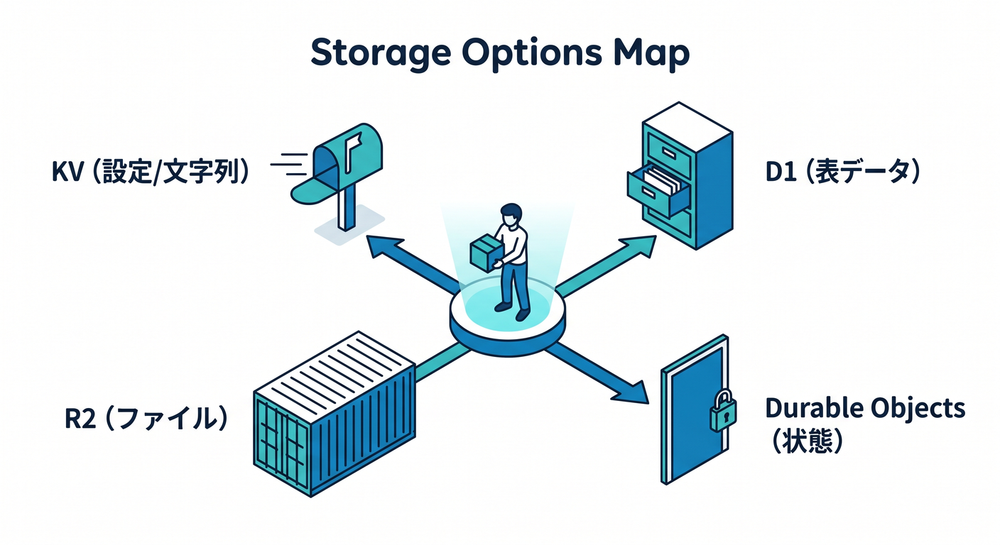
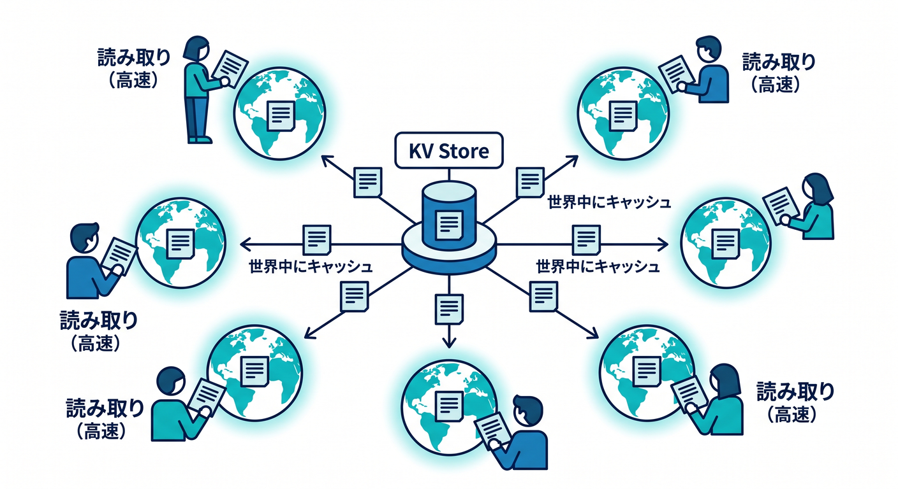
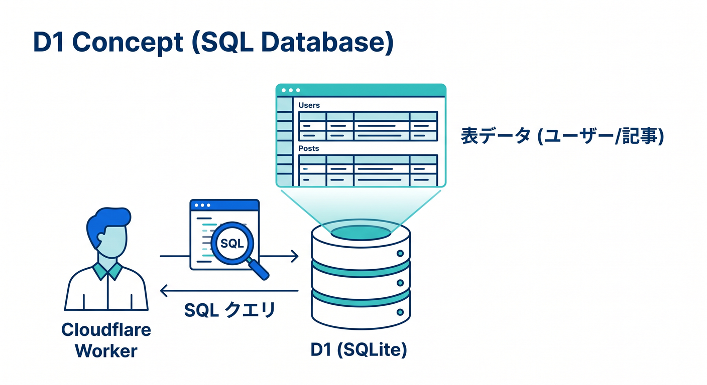
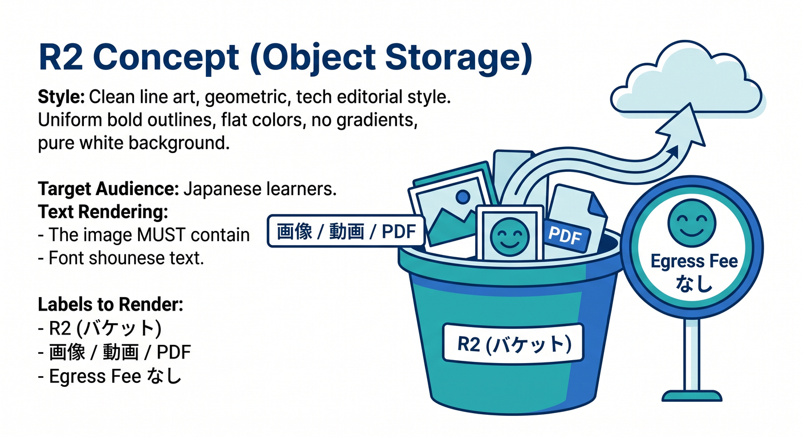
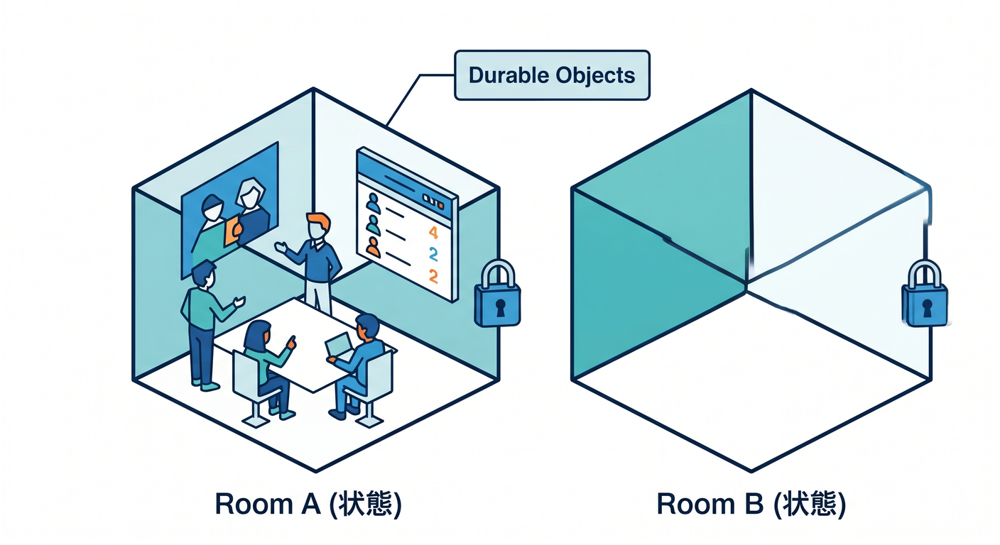
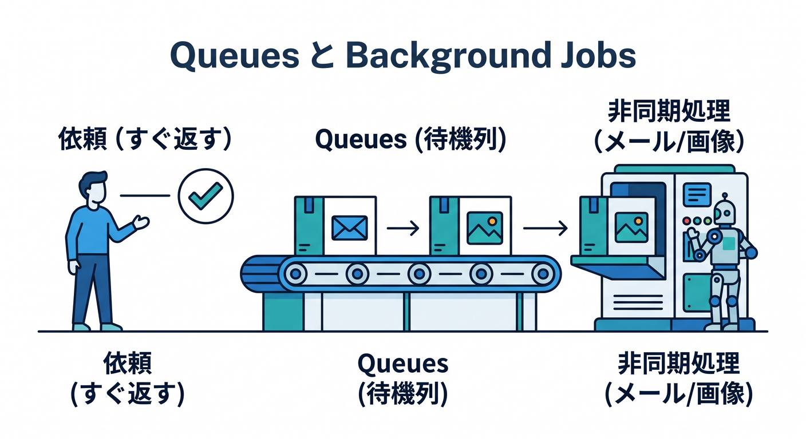
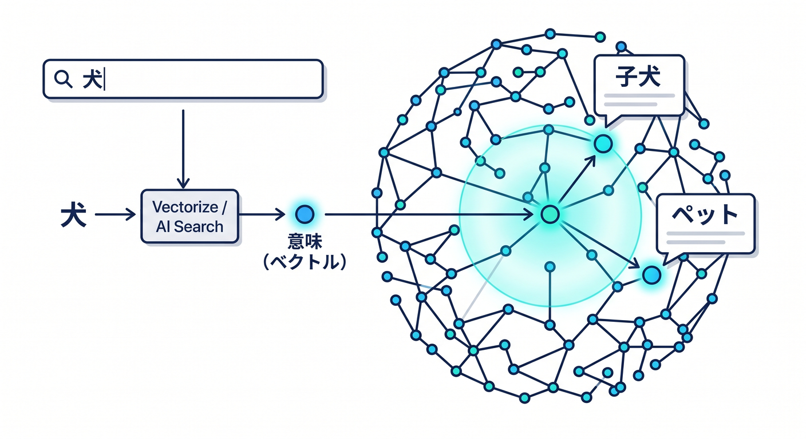

# 第13章：保存先の地図を先に作ろう 🗂️

この章のテーマは、とてもシンプルです 😊
**「Cloudflareには保存先がいくつもあるけど、何をどこに置けばいいの？」** を、最初に地図として頭に入れることです。

ここで大事なのは、APIの細かい書き方を全部覚えることではありません 🙅‍♂️
まずは、**データの“形”で置き場を選ぶ感覚**を作ることです。Cloudflareの公式案内でも、Workers からは KV・D1・R2・Queues・Durable Objects などを **Bindings** でつなぎ、コード上では `env` 経由で使うのが基本です。Pages Functions でも KV / Durable Objects / R2 / D1 / Vectorize を binding できます。([Cloudflare Docs][1])

---

## この章でできるようになりたいこと 🎯

この章のゴールは、次の3つです 😊

* **文字列の置き場**
* **表データの置き場**
* **ファイルの置き場**
* **リアルタイム状態の置き場**
* **あとで処理する仕事の置き場**
* **AI検索のための置き場**
* **秘密情報の置き場**

この7つを、迷わずざっくり言い分けられるようになることです。Cloudflareは公式に、KV を低レイテンシな key-value、D1 を serverless SQL、Durable Objects を stateful coordination、Queues を guaranteed delivery、R2 を blob/object storage として整理しています。さらに Vectorize はベクトルDB、AI Search は managed search、Secrets Store は再利用可能な秘密情報の保管場所として案内されています。([Cloudflare Docs][2])

---

## まずは結論の地図から見よう 🗺️✨

最初に、超ざっくり版です 😄

* **設定値・軽い文字列・フラグ** → **KV**
* **ユーザー一覧・注文一覧・記事一覧みたいな表** → **D1**
* **画像・PDF・動画・ZIP・学習データ** → **R2**
* **チャット部屋・対戦部屋・同時編集の1部屋ぶんの状態** → **Durable Objects**
* **メール送信・Webhook・画像変換など後回しの仕事** → **Queues**
* **意味で探す検索・RAG・類似検索** → **Vectorize**
* **検索基盤をなるべく自動で作りたい** → **AI Search**
* **APIキーや秘密鍵** → **Secrets Store / Workers Secrets**



この分け方でかなり勝てます 💪
Cloudflareの公式ドキュメントでも、KV は設定やパーソナライズ、R2 は画像や学習データ、Durable Objects は協調処理や強整合な状態、D1 は relational data、Queues は background jobs、Vectorize は semantic search と RAG に向くとされています。([Cloudflare Docs][3])

---

## 1. KV は「すばやく読む小さな置き場」📮

KV は、**Workers KV** です。
これは **eventually consistent な key-value ストア** で、Cloudflareのグローバルネットワーク上でキャッシュされることで、**低レイテンシな読み取り**が得意です。特に hot key の読み取りはかなり速く、公式案内では hot key はおおむね **500µs〜10ms** 程度とされています。([Cloudflare Docs][3])

KV が向いているのは、たとえばこんなものです 😊

* サイト全体の設定
* feature flag
* A/Bテストの切り替え
* 軽いセッション情報
* ルーティング用の小さなメタデータ
* 「このユーザーはお知らせを閉じたか」みたいな軽い状態

逆に、**今書いた値を全拠点ですぐ同じように読みたい**用途には向きません。KV は高性能の代わりに eventually consistent で、別の拠点では変更が見えるまで **60秒以上** かかることがあります。公式でも atomic operations や single transaction が必要なら Durable Objects を検討するよう案内しています。さらに、セッション保存のような用途では **1つのユニークキーに対して 1 write RPS** の制約を意識するよう説明されています。([Cloudflare Docs][4])

## KV をひとことで言うと 🌟

**「よく読む・あまり更新しない・小さなデータ」向け**です。



---

## 2. D1 は「表で管理したいデータの置き場」📊

D1 は Cloudflare の **managed, serverless SQL database** です。SQLite の SQL セマンティクスを持ち、Workers からの binding だけでなく、HTTP API からも触れます。Cloudflareは D1 を、**schema management、data import/export、query insights** を持つ “batteries included” な managed database として案内しています。([Cloudflare Docs][5])

向いているのは、こんなデータです 😊

* ユーザー
* 記事
* 商品
* 注文
* コメント
* 管理画面の一覧表示データ
* 条件検索したい業務データ

たとえば「会員登録日が新しい順に20件」「カテゴリAの商品だけ」「投稿者ごとの記事件数」みたいに、**表っぽく整理して SQL で検索したい**なら D1 が自然です。Cloudflareも、structured data や user/account data のような relational storage、そして **read-heavy な多くのWebアプリ** に向くと説明しています。([Cloudflare Docs][3])

ただし、D1 は **巨大な1個のDBをひたすら太らせる**というより、Cloudflare自身が **複数の小さめDBに水平分割する設計**に向くと案内しています。公式では **1データベース最大 10GB** を目安にし、必要なら複数DBへ分ける考え方が紹介されています。([Cloudflare Docs][3])

## D1 をひとことで言うと 🌟

**「表で持ちたいデータ」「SQLで探したいデータ」向け**です。



---

## 3. R2 は「ファイル置き場」🪣🖼️📦

R2 は Cloudflare の **S3互換 blob/object storage** です。大きな非構造データを保存する用途に向き、**egress fee なし**で使えるのが大きな特徴です。公式では **strongly consistent** で、web assets、training datasets、user-generated content に向くと案内されています。([Cloudflare Docs][3])

向いているものは、とてもわかりやすいです 😄

* 画像
* 動画
* PDF
* バックアップファイル
* CSV
* ZIP
* AI学習用の元データ
* ユーザーアップロードファイル

つまり、**「1件1件が大きい」「ファイルとして扱いたい」**なら、まず R2 を疑います。
R2 の公式説明でも、web asset 配信、training AI models、analytics data、log/event data などが代表例です。([Cloudflare Docs][3])

## R2 をひとことで言うと 🌟

**「表じゃない大きめデータ」「ファイルそのもの」向け**です。



---

## 4. Durable Objects は「その場の状態を持つ部屋」🏠⚡

Durable Objects は、Cloudflareでいちばん最初につまずきやすいけど、わかるとすごく強い存在です 😎
これは **compute と storage が一体になった特別な Worker** で、**グローバルに一意なID** を持ち、**強整合で速い状態管理**ができます。公式では、stateful applications と distributed systems の building block とされています。SQLite-backed Durable Objects と Storage API はすでに GA で、Free plan でも利用可能です。([Cloudflare Docs][6])

向いているのは、こんな場面です ✨

* チャットルーム
* 共同編集
* 対戦ゲームの部屋
* ライブ通知
* WebSocket を束ねる部屋
* 「同じキーに来る処理を1列に並べたい」ケース

Durable Objects の本質は、**1つのIDに対して、同時に1つの実体が世界で動く**ことです。だから「この部屋の状態は今これ」というのを安全に扱いやすいです。公式でも global uniqueness、transactional / strongly consistent / serializable storage、WebSocket hibernation、alarms などが主要機能として説明されています。([Cloudflare Docs][6])

さらに面白いのは、Cloudflare公式の storage options で **D1 と Queues は Durable Objects の上に built on** と案内されている点です。つまり Durable Objects は、Cloudflareの保存系地図の土台っぽい存在でもあります。([Cloudflare Docs][3])

## Durable Objects をひとことで言うと 🌟

**「部屋ごと・相手ごと・1対象ごとの生きた状態」向け**です。



---

## 5. Queues は「あとでやる仕事箱」📬⏳

Queues は、**今すぐ返事しなくていい仕事**を後ろに回す仕組みです。Cloudflare公式では **guaranteed delivery**、**at-least-once delivery**、**message batching** を持つ非同期メッセージ基盤として説明されています。([Cloudflare Docs][3])

向いている処理は、こんなものです 😊

* メール送信
* Webhook 発火
* 画像サムネイル生成
* ログ収集
* 外部APIへの書き込み
* 一時的に処理をためてからまとめて送る作業

たとえば、ユーザーがフォーム送信した瞬間に
「保存」「返信表示」だけはすぐ終わらせて、
「通知メール送信」「Slack通知」「分析ログ送信」は Queue に積む、という設計ができます。これで画面が軽くなります ✨

Queues には **1つの queue に対して active consumer は1つ** という考え方があり、Cloudflareはそれによって at-least-once delivery を実現しやすくしていると説明しています。つまり、**確実性を優先するので、重複処理に備えた設計**が大事です。([Cloudflare Docs][7])

## Queues をひとことで言うと 🌟

**「重い処理をいったん預ける」向け**です。



---

## 6. Vectorize は「意味で探すための置き場」🧠🔎

Vectorize は Cloudflare の **globally distributed vector database** です。**embeddings** を保存して、semantic search、classification、recommendation、RAG などを作るための基盤です。2026年4月時点で、Cloudflare docs では **Vectorize is now Generally Available** と案内されています。([Cloudflare Docs][8])

これは普通の検索とは少し違います。
普通の検索は「同じ単語が入っているか」を探しやすいですが、Vectorize は **意味の近さ** で探せます 😊

たとえば、

* 「退会方法」で検索したら「アカウント削除」が出る
* 「料金が高い」で検索したら「価格改定のお知らせ」が出る
* 「犬っぽい写真」で近い画像が出る

みたいなことがやりやすくなります。

Vectorize は **Workers AI** の埋め込みモデルとも組み合わせやすく、Cloudflare公式でも Workers AI で embeddings を作って Vectorize に保存し、metadata filtering で絞り込む流れを案内しています。([Cloudflare Docs][3])

## Vectorize をひとことで言うと 🌟

**「意味検索」「RAG」「類似検索」向け**です。

---

## 7. AI Search は「検索基盤をかなり自動で作る道」🤖📚

AI を強めに入れた章なので、ここはぜひ押さえたいです 😄
AI Search は Cloudflare の **managed search service** で、Webサイトや unstructured content をつなぐと、**継続的にインデックスを更新**し、自然言語で検索できるようにしてくれます。Cloudflare公式では、RAG パターンに対応し、Vectorize・R2・Workers AI・AI Gateway・Browser Rendering とネイティブ統合すると説明しています。([Cloudflare Docs][9])

つまり、
**「R2に資料を置く → chunking → embedding → Vectorize → 検索 → 生成」**
を自分で細かく全部組む道もあるし、
**「まず AI Search に任せる」** という道もあるわけです 😊

この章の地図としては、こう覚えるときれいです ✨

* **自分で細かく組みたい** → R2 + Workers AI + Vectorize + Worker
* **まずは速く managed に始めたい** → AI Search

AI Search は R2 をデータソースとして使えますし、画像や多様なファイルの取り込みでは Workers AI の Markdown conversion も使われます。([Cloudflare Docs][10])

## AI Search をひとことで言うと 🌟

**「検索パイプラインを自前で全部作らずに始めたい」向け**です。



---

## 8. 秘密情報は KV や D1 に雑に入れない 🔐

ここ、超大事です 🚨
APIキーや秘密鍵、外部サービスの token みたいなものは、**とりあえず KV に入れよう**ではなく、まず **Workers Secrets** や **Secrets Store** を考えるのが自然です。

Cloudflare Secrets Store は **secure, centralized** な account-level secrets の置き場で、2026年4月時点では **open beta**、Workers と AI Gateway に対応しています。しかも per-Worker の secrets とは別物で、**アカウント横断で再利用可能**です。([Cloudflare Docs][11])

## 覚え方 🔑

* **業務データ** → D1 / KV / R2
* **秘密情報** → Secrets 系

---

## 9. 初学者向けの選び方フローチャート 🌈

迷ったら、この順で考えるとかなり整理できます 😊

## ① それはファイルですか？

画像、PDF、CSV、動画、ZIP なら **R2** が第一候補です。([Cloudflare Docs][3])

## ② 表で持ちたいですか？

一覧、検索、並び替え、集計をしたいなら **D1** が第一候補です。([Cloudflare Docs][3])

## ③ 小さくて、読む回数が多いですか？

設定値、feature flag、軽いセッション、ルーティング情報なら **KV** が第一候補です。([Cloudflare Docs][3])

## ④ 1つの対象ごとに“今の状態”をきっちり持ちたいですか？

チャット部屋、同時編集、ゲームルーム、接続中クライアントの調整なら **Durable Objects** です。([Cloudflare Docs][6])

## ⑤ 重い仕事を後ろへ回したいですか？

通知、メール、画像処理、外部API書き込みは **Queues** です。([Cloudflare Docs][3])

## ⑥ AIで意味検索したいですか？

自前で組むなら **Vectorize**、かなり任せたいなら **AI Search** です。([Cloudflare Docs][8])

---

## 10. React系アプリで考えると、こうつながる ⚛️☁️

React や Next.js 寄りの人は、こう考えるとわかりやすいです 😊

* **画面** → React / Next / Pages
* **API層** → Worker / Pages Functions
* **保存先** → KV / D1 / R2 / Durable Objects / Vectorize
* **AI** → Workers AI / AI Search
* **非同期** → Queues

Pages Functions でも KV・D1・R2・Durable Objects・Vectorize を binding できますし、Workers 側でも同じように `env` から resource を触れます。つまり、**UIはReact、保存はCloudflare products、接着剤はWorker** という見方がとても自然です。([Cloudflare Docs][12])

---

## 11. 実例で見ると、一気に腹落ちする 🍱

## 例1：ブログ＋管理画面 ✍️

* 記事本文やカテゴリ → **D1**
* OGP画像や添付PDF → **R2**
* サイト設定や feature flag → **KV**
* 画像変換や通知 → **Queues**

この構成だと、表データとファイルをきれいに分けられます。D1 は relational storage、R2 は file/blob storage、KV は configuration data、Queues は deferred tasks に向くという Cloudflare の整理にそのまま乗っています。([Cloudflare Docs][3])

## 例2：リアルタイムチャット 💬

* ルーム状態 → **Durable Objects**
* 添付画像 → **R2**
* ユーザー情報 → **D1**
* 通知送信 → **Queues**

Durable Objects は chat や coordination に向くと公式で案内されています。そこに D1 と R2 を足すと、状態・表・ファイルの役割分担がきれいです。([Cloudflare Docs][6])

## 例3：社内FAQのAI検索 🤖

* 元ドキュメントPDFやHTML → **R2**
* embeddings → **Vectorize**
* 回答生成 → **Workers AI**
* 利用ログや権限情報 → **D1**
* もっと managed にしたい → **AI Search**

Cloudflare公式でも、Vectorize は Workers AI と組み合わせた RAG を想定しており、AI Search はその managed 版に近い位置づけです。([Cloudflare Docs][8])

---

## 12. VS Code と Copilot を使うときのコツ 💻✨

2026年の学習では、AIを使わない前提のほうがむしろ不自然です 😄
Cloudflare 公式は、AIツール向けに **Workers 用のベースプロンプト** や **Cloudflare Docs 用 MCP server** を公開しています。また GitHub Copilot では、`.github/copilot-instructions.md` を置いて、リポジトリ全体の指示を与えられます。VS Code では repository-wide custom instructions や path-specific instructions が使えます。([Cloudflare Docs][13])

この章と相性がいい Copilot 指示は、たとえばこんな感じです 👇

```md
## .github/copilot-instructions.md

このプロジェクトでは Cloudflare を次の役割分担で使う:
- KV: 設定値、軽いセッション、feature flag
- D1: 表形式の業務データ
- R2: 画像・PDF・アップロードファイル
- Durable Objects: ルーム単位の状態やリアルタイム協調
- Queues: 非同期ジョブ
- Vectorize: 意味検索
- Secrets: APIキーや秘密情報

提案コードは TypeScript を優先し、
Cloudflare bindings は env から参照すること。
秘密情報はコードへ直書きしないこと。
```

こういう方針を書いておくと、Copilot の提案が毎回ブレにくくなります 👍
Cloudflareの prompting guide でも、TypeScript をデフォルトにすること、Workers に集中すること、secrets を埋め込まないことなどがベースプロンプトに含まれています。([Cloudflare Docs][13])

---

## 13. 開発中の見え方も知っておこう 🧪

Workers 開発では、`wrangler dev` や Cloudflare Vite plugin でローカル実行できます。どちらも Miniflare ベースで、bindings は `env` から使います。通常はローカルシミュレーションですが、**Workers AI と Vectorize はローカルシミュレーションがないため remote binding が推奨**されています。一方で **Durable Objects は現時点では remote binding 非対応**です。([Cloudflare Docs][1])

つまり学習の最初は、こう考えると楽です 😊

* KV / D1 / R2 / Queues はまずローカルで試しやすい
* Workers AI / Vectorize は「実体はCloudflare側」と考えやすい
* Durable Objects はローカルで概念を理解してから進むとよい

---

## 14. この章のまとめ 🌟

この章でいちばん大事なのは、**「Cloudflareには保存先がたくさんある」ではなく、「データの形で自然に分かれる」** と感じられることです 😊

最後に、もう一度だけ超圧縮版です ✨

* **KV** → 小さくてよく読むもの
* **D1** → SQLで扱う表データ
* **R2** → ファイル
* **Durable Objects** → その場の状態
* **Queues** → 後ろでやる仕事
* **Vectorize** → 意味検索
* **AI Search** → managed な検索/RAG
* **Secrets Store** → 秘密情報

ここが見えると、次の章以降で個別サービスに入っても、
「これは地図のどこにある話か」がちゃんとわかるようになります 🧭☁️✨

---

## ミニ確認問題 📝😊

## Q1.

ユーザーがアップした画像やPDFを置くなら、最初の候補は何でしょう？

**答え：R2**
R2 は S3互換の blob/object storage で、非構造データや large object storage に向いています。([Cloudflare Docs][3])

## Q2.

商品一覧や注文履歴のように、SQLで検索・集計したいデータは何でしょう？

**答え：D1**
D1 は managed, serverless SQL database で、structured relational data に向いています。([Cloudflare Docs][5])

## Q3.

チャットルームごとの現在状態を安全に持ちたいなら何でしょう？

**答え：Durable Objects**
Durable Objects は global uniqueness と strong consistency を持つ stateful building block です。([Cloudflare Docs][6])

## Q4.

「送信後にメールを飛ばす」みたいな後回し処理は何でしょう？

**答え：Queues**
Queues は at-least-once delivery の非同期メッセージ基盤です。([Cloudflare Docs][3])

## Q5.

意味の近さでFAQ検索したいなら何でしょう？

**答え：Vectorize**
より自動化したいなら AI Search も有力です。([Cloudflare Docs][8])

---

必要なら次に、この第13章をベースにして
**「章末の演習問題つき完全版」** に広げます。

[1]: https://developers.cloudflare.com/workers/development-testing/ "Development & testing · Cloudflare Workers docs"
[2]: https://developers.cloudflare.com/workers/ "Overview · Cloudflare Workers docs"
[3]: https://developers.cloudflare.com/workers/platform/storage-options/ "Choosing a data or storage product. · Cloudflare Workers docs"
[4]: https://developers.cloudflare.com/kv/concepts/how-kv-works/ "How KV works · Cloudflare Workers KV docs"
[5]: https://developers.cloudflare.com/d1/?utm_source=chatgpt.com "Overview · Cloudflare D1 docs"
[6]: https://developers.cloudflare.com/durable-objects/ "Overview · Cloudflare Durable Objects docs"
[7]: https://developers.cloudflare.com/queues/reference/how-queues-works/ "How Queues Works · Cloudflare Queues docs"
[8]: https://developers.cloudflare.com/vectorize/ "Overview · Cloudflare Vectorize docs"
[9]: https://developers.cloudflare.com/ai-search/ "Cloudflare AI Search · Cloudflare AI Search docs"
[10]: https://developers.cloudflare.com/ai-search/get-started/?utm_source=chatgpt.com "Get started with AI Search"
[11]: https://developers.cloudflare.com/secrets-store/ "Overview · Cloudflare Secrets Store docs"
[12]: https://developers.cloudflare.com/pages/functions/bindings/ "Bindings · Cloudflare Pages docs"
[13]: https://developers.cloudflare.com/workers/get-started/prompting/ "Prompting · Cloudflare Workers docs"
