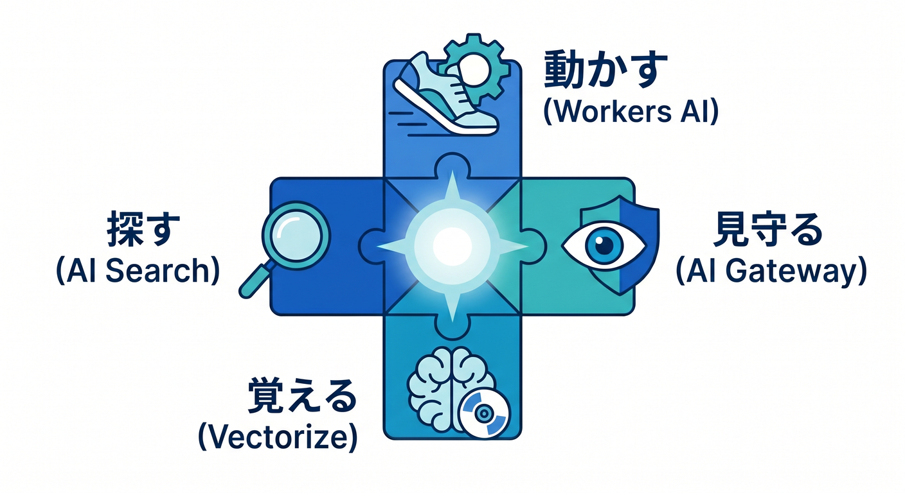
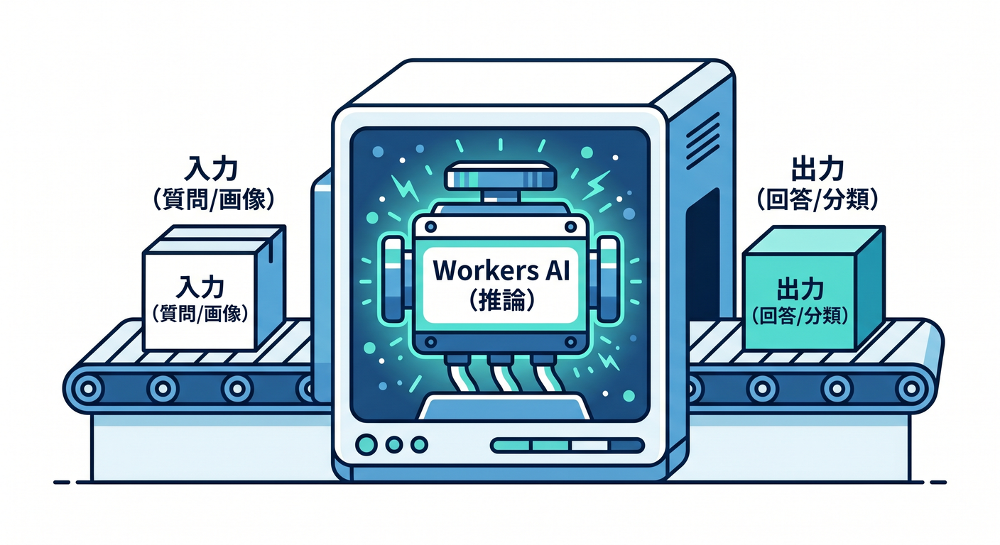
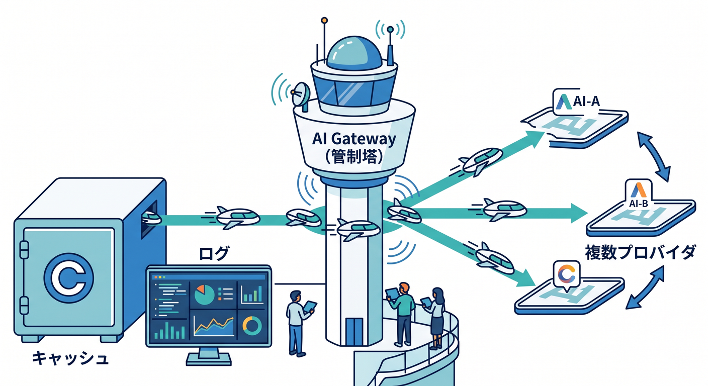
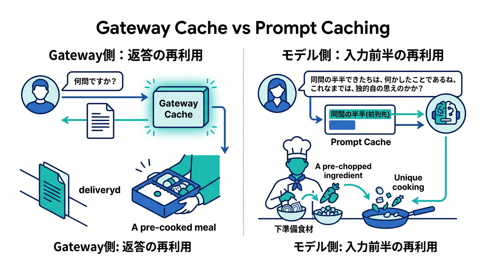
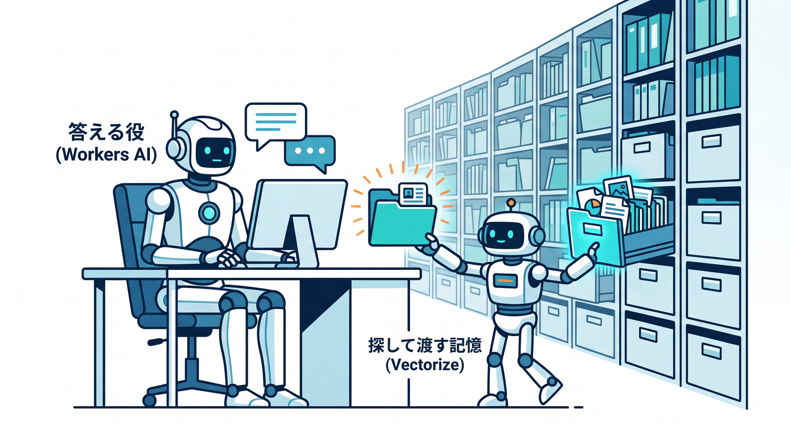
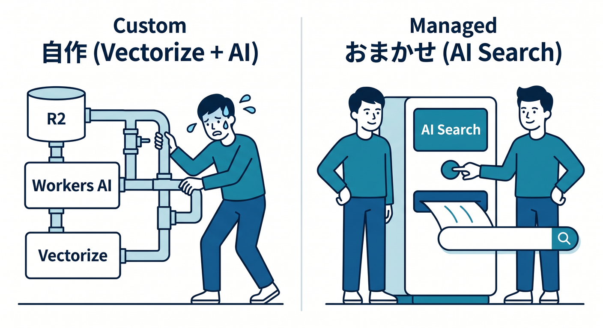
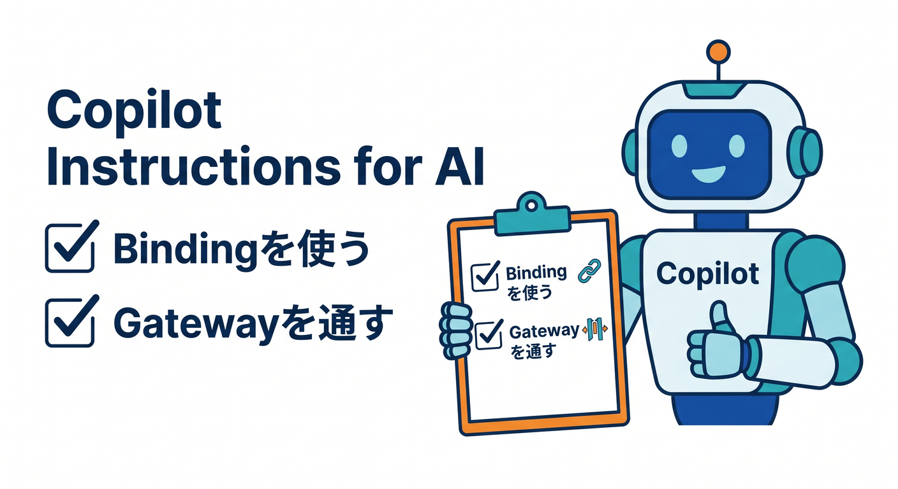

# 第14章：CloudflareのAI地図を描こう 🤖🧠

この章では、CloudflareのAIまわりを「機能の名前を並べる」のではなく、**役割の地図**としてつかみます 🗺️
2026年4月14日時点で見ると、CloudflareのAIは大きく **Workers AI＝モデル実行**、**AI Gateway＝観測と制御**、**Vectorize＝意味で探す記憶**、**AI Search＝管理された自然言語検索** として理解すると、とても整理しやすいです。Workers AI は Free / Paid の両方で利用でき、Workers・Pages・Cloudflare API から呼び出せます。AI Search は旧 AutoRAG で、自然言語で問い合わせられる継続更新インデックスを作れるサービスです。 ([Cloudflare Docs][1])

## この章のゴール 🎯

この章を読み終わるころには、こんなことが言えるようになるのが目標です 😊

* 「CloudflareでAIをやる」とは、どの製品が何を担当するのか説明できる
* 自分の作りたいものに合わせて、Workers AI / AI Gateway / Vectorize / AI Search をざっくり選べる
* VS Code で小さく試すときの入口が見える
* Copilot を使って、Cloudflareらしい作り方をプロジェクトに教えられる

---

## まずは1枚の地図から 🗺️✨

CloudflareのAIを、まずはこの4層で覚えましょう。

* **Workers AI**
  AIモデルそのものを動かす場所です。チャット、要約、分類、画像系、音声系などの推論を実行する「脳みそ」に近い役です。 ([Cloudflare Docs][1])

* **AI Gateway**
  AIリクエストを見える化し、ログ・分析・キャッシュ・レート制限・リトライ・フォールバックを付ける「管制塔」です。 ([Cloudflare Docs][2])

* **Vectorize**
  テキストや画像の意味をベクトルにして保存し、**意味の近さ**で検索するための「意味メモリ」です。 ([Cloudflare Docs][3])

* **AI Search**
  Webサイトや非構造データをつないで、継続更新インデックスを作り、自然言語で検索できる「管理された検索基盤」です。 ([Cloudflare Docs][4])

この4つをひとことで言うなら、**「動かす・見守る・覚える・探す」** です 😊



ここを先に押さえておくと、CloudflareのAIが急に“製品名の暗記ゲーム”ではなくなります。

---

## 14-1. Workers AI は「AIを動かす場所」🤖⚡

Workers AI は、Cloudflareのグローバルネットワーク上で、サーバーレスにAIモデルを実行する仕組みです。Cloudflare公式では、**50以上のオープンソースモデル**にアクセスでき、テキスト生成、画像分類、物体検出などのタスクを扱えると案内しています。 ([Cloudflare Docs][1])

ここで大事なのは、Workers AI は**「AIアプリ全体」ではなく「推論エンジン」**だということです。
つまり、質問に答えたり、分類したり、埋め込みを作ったりする中心部分を受け持ちます。でも、ログを見たり、複数プロバイダを切り替えたり、文書検索を自動化したりする役までは、Workers AI 単体では担当しません。そこを補うのが、後で出てくる AI Gateway や Vectorize や AI Search です。 ([Cloudflare Docs][1])



また、Workers AI は Workers の binding として `env.AI` から使えます。Cloudflare公式は、Workers AI を Worker から使うとき、Wrangler 設定に `ai.binding` を追加して `env.AI` として参照する形を案内しています。 ([Cloudflare Docs][5])

さらに2026年時点では、Workers AI は大きめのモデル追加も続いていて、たとえば 2026年3月には **Kimi K2.5** が追加され、256k コンテキスト、マルチターンのツール呼び出し、vision 入力、structured outputs などが案内されています。つまり Cloudflare の AI は、単なる「軽い推論のお試し」ではなく、かなり本格的なエージェント系ワークロードも見据えた進化を続けています。 ([Cloudflare Docs][6])

費用の見方も少しだけ知っておくと安心です 💰
Workers AI は Free / Paid の Workers プランに含まれており、2026年4月14日時点では **1日 10,000 Neurons の無料枠**があり、超えた分は **1,000 Neurons あたり 0.011ドル**です。最初の学習や小さな実験なら、かなり入りやすい設計です。 ([Cloudflare Docs][7])

---

## 14-2. AI Gateway は「AIの運用を見えるようにする場所」🚦📊

初心者がいちばん見落としやすいのがここです。
AIアプリは、**モデルを呼べたら終わり**ではありません。どれだけ呼ばれたか、失敗したか、遅いか、コストが増えているか、どのモデルに逃がしたか、そういう“運用の目”が必要です。Cloudflare の AI Gateway は、まさにそこを担当します。公式では、**analytics、logging、caching、rate limiting、request retries、model fallback** などを提供すると案内しています。 ([Cloudflare Docs][2])

しかも AI Gateway は、Workers AI だけを見る道具ではありません。OpenAI 互換の `/chat/completions` エンドポイントを持ち、**1つのURLで複数プロバイダを扱える**ようにしています。さらに、OpenAI、Anthropic、Google 系、Workers AI など多くのプロバイダに対応し、ネイティブ対応外でも **HTTPS API を持つ任意のAIプロバイダを Custom Providers としてつなげる**設計です。 ([Cloudflare Docs][8])

つまり AI Gateway は、こう考えるとわかりやすいです 😊

* Workers AI は **AIを動かす場所**
* AI Gateway は **AIを運用する場所**



この違いはすごく大事です。

### 似ているけれど別物：AI Gateway のキャッシュ と Workers AI の prompt caching 🧩

ここは混乱しやすいポイントです。

AI Gateway のキャッシュは、**応答そのものを Cloudflare 側でキャッシュして再利用する**考え方です。速くなりやすく、コスト削減にも効きます。 ([Cloudflare Docs][2])

一方、Workers AI の **prompt caching** は、同じ会話の共通 prefix を再計算しない仕組みです。Cloudflare はこれを、TTFT の短縮や TPS の向上につながる最適化として説明しています。長い会話やエージェント処理で効きやすいです。 ([Cloudflare Docs][9])

同じ「キャッシュ」でも、

* **Gateway側** = 返答の再利用
* **モデル側** = 入力前半の再利用



と考えると整理しやすいです 👍

---

## 14-3. Vectorize は「意味で探すための記憶」🧠📚

Vectorize は Cloudflare の**グローバル分散ベクトルデータベース**です。
人間の言葉そのままではなく、文章や画像の特徴を数値ベクトルにして保存し、「この質問と意味が近い文はどれ？」を探すために使います。Cloudflare公式は、Vectorize を full-stack AI アプリ向けの vector database と説明しています。 ([Cloudflare Docs][3])

Vectorize 単体で覚えるより、**Workers AI とセット**で考えるのがわかりやすいです。
Workers AI で埋め込みを作る → Vectorize に保存する → 質問が来たら似た内容を検索する、という流れです。公式ドキュメントでも、Vectorize は Workers AI を使ってベクトル埋め込みを生成し、類似検索に使える形で案内されています。 ([Cloudflare Docs][10])

Vectorize が向いているのは、たとえばこんな場面です 📌

* 社内FAQやマニュアルの意味検索
* 商品説明の類似検索
* 長い会話の「記憶」
* LLM に渡す関連文脈の抽出

Cloudflare公式でも、Vectorize を使うと **semantic search、recommendations、anomaly detection、LLM への context / memory 提供**に使えると説明しています。 ([Cloudflare Docs][1])

ここでの理解ポイントは、**Vectorize は“答えるAI”ではなく、“探して渡す記憶”**だということです。
答える役は Workers AI。Vectorize は、その答えに必要な材料を探して渡す役です。



---

## 14-4. AI Search は「検索基盤をかなり任せられるサービス」🔎✨

AI Search は、Cloudflareの**managed search service**です。
Webサイトや非構造データをつなぐと、Cloudflare 側が継続的にインデックスを更新し、自然言語で問い合わせられる形にしてくれます。Cloudflare は AI Search を、アプリや AI エージェントから自然言語検索できる継続更新インデックスとして説明しています。 ([Cloudflare Docs][4])

ここで Vectorize との違いをざっくり言うと、

* **Vectorize** = ベクトルDBを自分で使いこなす寄り
* **AI Search** = 検索基盤をかなり任せる寄り



です 😊

AI Search の公式説明では、内部の考え方として **Indexing** と **Querying** の2段階があり、Indexing では非同期バックグラウンド処理でデータ変化を監視しながらベクトル化し、Querying ではユーザーの問い合わせに対して関連コンテンツを取り出して context-aware な応答を生成します。 ([Cloudflare Docs][11])

また、AI Search は **R2 と連携してデータを保存**し、最初のインスタンス作成には **アクティブな R2 subscription が必要**です。ここは「検索サービスだけど R2 も関係あるんだ」と最初に知っておくと混乱しません。 ([Cloudflare Docs][12])

もうひとつ大事なのは、**昔の情報では AutoRAG という名前で出てくる**ことです。2025年9月に Cloudflare は AutoRAG を AI Search へ改名したと案内しています。古いブログや会話ログを読むときは、「AutoRAG = 今の AI Search なんだな」と読み替えると迷いにくいです。 ([Cloudflare Docs][13])

---

## 14-5. じゃあ、どれをどう組み合わせるの？ 🧩☁️

ここが実務でいちばん大事です。

### パターンA：まずはチャットや要約を動かしたい 💬

おすすめは **Workers AI + AI Gateway** です。
Workers AI で返答を作り、AI Gateway でログ・分析・キャッシュ・レート制御を付けます。最初の1本としてとても素直です。 ([Cloudflare Docs][1])

### パターンB：自分の文書を意味検索したい 📚

おすすめは **Workers AI + Vectorize + R2** です。
自分でチャンク分割やメタデータ設計を考えたいならこちらが向きます。検索精度の調整を自分で握りやすいです。 ([Cloudflare Docs][3])

### パターンC：検索基盤をなるべく管理したくない 🔎

おすすめは **AI Search + AI Gateway** です。
WebサイトやR2のデータをつないで、継続更新インデックスと自然言語検索をまとめて持ちたいなら、かなり相性がいいです。 ([Cloudflare Docs][4])

### パターンD：将来エージェントまで視野に入れたい 🤖🚀

まずは **Workers AI + AI Gateway** から始めて、必要に応じて Vectorize や AI Search を足すのがおすすめです。CloudflareのAgentsまわりは、Workers AIやAI Gatewayと自然につながる方向に進んでいます。 ([Cloudflare Docs][14])

---

## 14-6. VS Code で最小構成を触るならこの入口 🛠️💻

Cloudflare公式の現在の導線では、C3（`npm create cloudflare`）でプロジェクトを作り、React + Vite なら Cloudflare Vite plugin を使う形がとても自然です。React + Vite ガイドでは C3 から始める流れが案内されていて、Vite plugin はローカルでも `workerd` 上でコードを動かし、本番に近い挙動で開発しやすいように設計されています。さらに新規プロジェクトでは `wrangler.jsonc` が推奨です。 ([Cloudflare Docs][15])

まずはこんな感じで始めるのがわかりやすいです。

```bash
npm create cloudflare@latest my-ai-map --framework=react
```

Workers AI を Worker から使うときは、Wrangler の設定に AI binding を足します。Cloudflare公式は `env.AI` で使う形を案内しています。 ([Cloudflare Docs][5])

```json
{
  "ai": {
    "binding": "AI"
  }
}
```

テキスト生成モデルを使うなら、Workers AI の prompting ドキュメントでは **messages 配列を使う scoped prompts が推奨**です。下は学習用の最小イメージです。 ([Cloudflare Docs][16])

```ts
export interface Env {
  AI: Ai;
}

export default {
  async fetch(_request: Request, env: Env): Promise<Response> {
    const result = await env.AI.run(
      "@cf/meta/llama-3.1-8b-instruct",
      {
        messages: [
          { role: "system", content: "あなたはやさしい学習アシスタントです。" },
          { role: "user", content: "CloudflareのAI製品の役割を3行で説明して。" }
        ]
      }
    );

    return Response.json(result);
  }
} satisfies ExportedHandler<Env>;
```

さらに AI Gateway を同じ呼び出しに乗せると、**ログ・分析・キャッシュ**を付けたまま Workers AI を使えます。Cloudflare公式は `env.AI.run()` の第3引数で `gateway` を渡す形を案内しています。 ([Cloudflare Docs][17])

```ts
const result = await env.AI.run(
  "@cf/meta/llama-3.1-8b-instruct",
  {
    prompt: "CloudflareでAI Gatewayを使う理由を教えて"
  },
  {
    gateway: {
      id: "my-gateway",
      skipCache: false,
      cacheTtl: 300
    }
  }
);
```

---

## 14-7. Copilot を Cloudflare 流に育てる 🧑‍💻✨🤝

Cloudflare公式は、Workers のベストプラクティスを AI ツールに伝える方法として、**GitHub Copilot ならリポジトリのルートに `.github/copilot-instructions.md` を置く**案内をしています。GitHub公式でも、そのファイルをリポジトリルートに作る手順を案内しており、さらに `.github/instructions/*.instructions.md` で **パス別のカスタム命令**も使えます。 ([Cloudflare Docs][18])

この章のテーマなら、Copilot にはこんなことを覚えさせると相性がいいです ✨

```md
## Cloudflare project instructions

- Prefer `wrangler.jsonc` for new config files.
- Use Cloudflare bindings such as `env.AI` instead of raw service URLs when possible.
- For text generation with Workers AI, prefer `messages`-based prompting.
- When adding AI features, consider AI Gateway for logs, caching, retries, and fallback.
- Keep the app simple: React on the front, Worker endpoints on the back.
- Explain code in beginner-friendly Japanese comments when generating examples.
```

これを置いておくと、Copilot が Cloudflare らしくない提案をしにくくなります。
とくに AI 系は、何も指示しないと「とりあえず OpenAI SDK を直接入れる」方向へ流れがちなので、**Cloudflare binding を優先する**、**Gateway を考慮する**、**`wrangler.jsonc` を使う**あたりを書いておく価値は大きいです。 ([Cloudflare Docs][18])



---

## 14-8. 初学者がハマりやすい勘違い 😵‍💫🪤

### 「Workers AI があれば全部できる」

半分正解、半分ちがいます。
Workers AI は推論の中心ですが、ログ・フォールバック・複数プロバイダ管理は AI Gateway、意味検索の記憶は Vectorize、かなり任せたい検索基盤は AI Search です。 ([Cloudflare Docs][1])

### 「Vectorize と AI Search は同じもの」

同じではありません。
Vectorize はベクトルDB、AI Search は管理された検索サービスです。自分で細かく設計したいなら Vectorize、なるべく基盤側に任せたいなら AI Search、と考えると整理しやすいです。 ([Cloudflare Docs][3])

### 「AI Gateway は Workers AI 専用」

専用ではありません。
AI Gateway は Workers AI だけでなく、多数のAIプロバイダを扱え、Custom Providers で HTTPS API を持つ任意のプロバイダにも広げられます。 ([Cloudflare Docs][19])

### 「AI Search の古い記事が見つからない」

旧名が AutoRAG だからです。
古い情報を読むときは、名前の変化を頭に入れておきましょう。 ([Cloudflare Docs][13])

---

## 14-9. データの扱いで安心してよい点 🔐🙂

AIを使うと「入力したデータって学習に使われるの？」が気になりますよね。
Cloudflare の Workers AI データ利用説明では、**Cloudflare は Workers AI で提供されるモデルを自分で作成・訓練しておらず、Customer Content はユーザーが所有し、他の Cloudflare 顧客に共有されず、明示的な同意なしにモデル訓練やサービス改善に使わない**と案内しています。保存が発生するのは、R2 や KV や Vectorize などのストレージを自分で併用した場合です。 ([Cloudflare Docs][20])

この説明を知っておくと、
**「モデル推論そのもの」と「自分で保存すること」** を分けて考えやすくなります。
AIアプリでは、この切り分けがかなり大事です。

---

## 14-10. この章のおすすめ理解順 📘🚶‍♂️

最初は次の順で覚えると、かなり迷いにくいです。

1. **Workers AI** でモデルを動かす
2. **AI Gateway** で運用を見える化する
3. **Vectorize** で意味検索の記憶を持つ
4. **AI Search** で管理された検索基盤まで広げる

この順番だと、頭の中に
**「答える → 見守る → 覚える → 探す」**
という流れができます 😊

---

## 章末まとめ 🌟

この章の核心はこれです。

* **Workers AI** は、Cloudflare上でAIモデルを動かす場所 🤖
* **AI Gateway** は、AI呼び出しを観測・制御する場所 🚦
* **Vectorize** は、意味で探すための記憶 🧠
* **AI Search** は、検索基盤をかなり任せられる managed search 🔎

そして2026年のCloudflareは、この上に Agents や MCP や Browser Rendering までつながっていく流れになっています。次の章では、その「AIが外界に手を伸ばす」発展マップに進むと、とても自然です。 ([Cloudflare Docs][21])

## 確認クイズ 📝✨

**Q1.** Workers AI と AI Gateway の役割の違いを、ひとことで言うと？
**Q2.** 「自分の文書を意味で検索したい」とき、Vectorize は何を担当する？
**Q3.** 古い記事で AutoRAG と書かれていたら、今の何を指している？

---

必要なら次に、この第14章に対応する **演習問題つき版** もそのまま続けて作れます。

[1]: https://developers.cloudflare.com/workers-ai/ "Overview · Cloudflare Workers AI docs"
[2]: https://developers.cloudflare.com/ai-gateway/ "Overview · Cloudflare AI Gateway docs"
[3]: https://developers.cloudflare.com/vectorize/ "Overview · Cloudflare Vectorize docs"
[4]: https://developers.cloudflare.com/ai-search/ "Cloudflare AI Search · Cloudflare AI Search docs"
[5]: https://developers.cloudflare.com/workers-ai/configuration/bindings/ "https://developers.cloudflare.com/workers-ai/configuration/bindings/"
[6]: https://developers.cloudflare.com/changelog/post/2026-03-19-kimi-k2-5-workers-ai/ "https://developers.cloudflare.com/changelog/post/2026-03-19-kimi-k2-5-workers-ai/"
[7]: https://developers.cloudflare.com/workers-ai/platform/pricing/ "Pricing · Cloudflare Workers AI docs"
[8]: https://developers.cloudflare.com/ai-gateway/usage/chat-completion/ "Unified API (OpenAI compat) · Cloudflare AI Gateway docs"
[9]: https://developers.cloudflare.com/workers-ai/features/prompt-caching/ "Prompt caching · Cloudflare Workers AI docs"
[10]: https://developers.cloudflare.com/vectorize/get-started/embeddings/ "Vectorize and Workers AI · Cloudflare Vectorize docs"
[11]: https://developers.cloudflare.com/ai-search/concepts/how-ai-search-works/ "How AI Search works · Cloudflare AI Search docs"
[12]: https://developers.cloudflare.com/ai-search/get-started/ "Get started with AI Search · Cloudflare AI Search docs"
[13]: https://developers.cloudflare.com/changelog/post/2025-09-25-ai-search-more-models/ "AI Search (formerly AutoRAG) now with More Models To Choose From · Changelog"
[14]: https://developers.cloudflare.com/changelog/product/agents/ "Agents Changelog | Cloudflare Docs"
[15]: https://developers.cloudflare.com/workers/framework-guides/web-apps/react/ "React + Vite · Cloudflare Workers docs"
[16]: https://developers.cloudflare.com/workers-ai/features/prompting/ "Prompting · Cloudflare Workers AI docs"
[17]: https://developers.cloudflare.com/ai-gateway/usage/providers/workersai/ "https://developers.cloudflare.com/ai-gateway/usage/providers/workersai/"
[18]: https://developers.cloudflare.com/workers/get-started/prompting/ "Prompting · Cloudflare Workers docs"
[19]: https://developers.cloudflare.com/ai-gateway/usage/providers/ "Provider Native · Cloudflare AI Gateway docs"
[20]: https://developers.cloudflare.com/workers-ai/platform/data-usage/ "https://developers.cloudflare.com/workers-ai/platform/data-usage/"
[21]: https://developers.cloudflare.com/agents/ "Agents · Cloudflare Agents docs"
