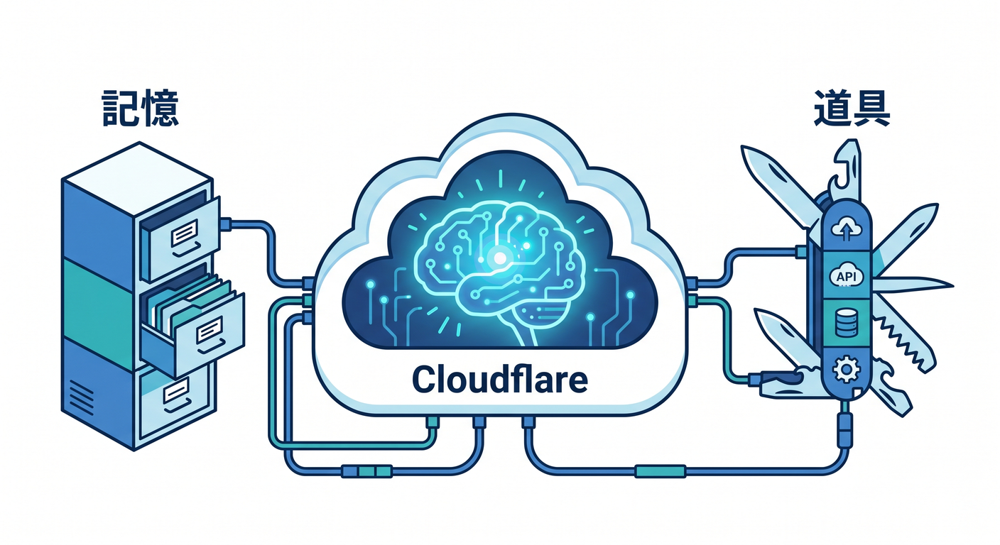
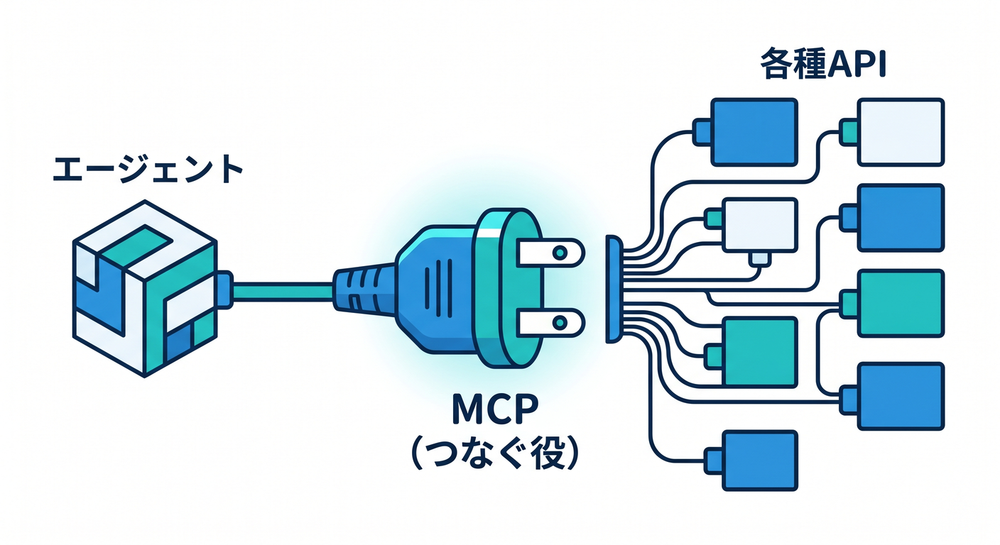
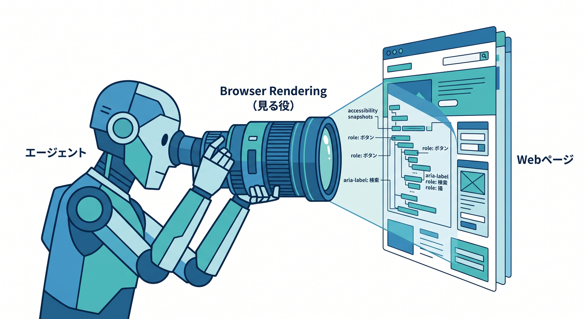
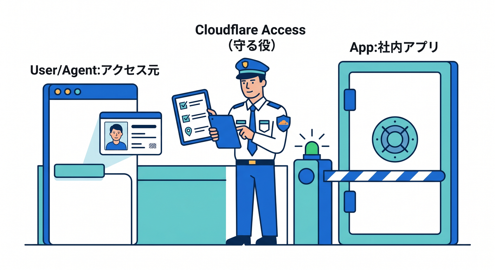
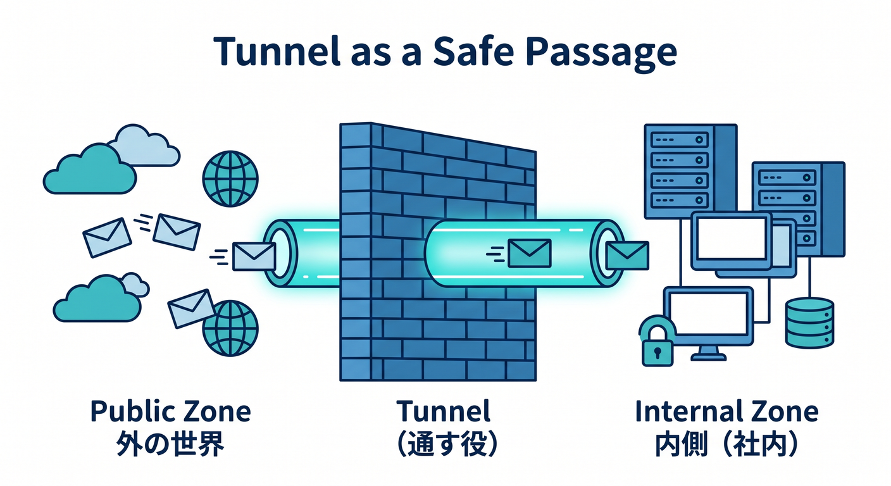
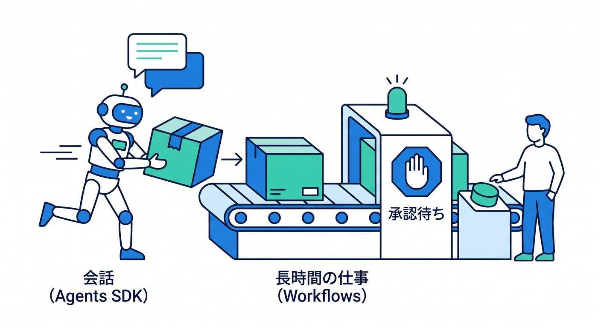
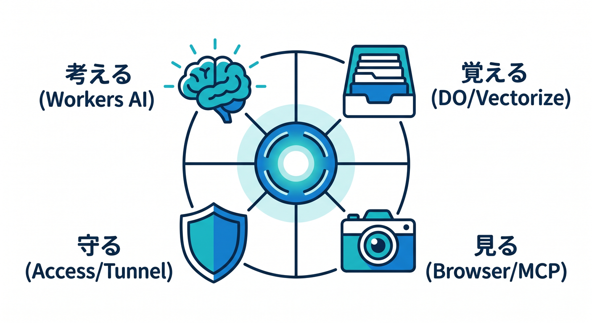

# 第15章：エージェント時代のCloudflareと、次の学習ルート 🚀

ここまで学んできた内容を、最後にひとつの地図としてまとめます 😊
この章のテーマは、**Cloudflareを「Webを速くする箱」ではなく、「AIエージェントが動いて・見て・守られて・外とつながる土台」として見ること**です。2026年のCloudflareは、Workers だけを見るより、**Agents SDK・Durable Objects・Workflows・MCP・Browser Rendering・Zero Trust・Tunnel**までつなげて見ると、かなり全体像がわかりやすくなります。 ([Cloudflare Docs][1])

## この章のゴール 🎯

この章では、次の3つをつかめれば大成功です 🌟

1. **Cloudflareが、なぜ「エージェント時代」に強いのか**
2. **MCP・Browser Rendering・Zero Trust・Tunnel がどうつながるのか**
3. **このあと何をどの順で学ぶと、いちばん迷いにくいのか**

---

## 1. いまのCloudflareは「コードを置く場所」より、もう一段広い ☁️🧠

CloudflareのAgents SDKは、いわゆる「ただのチャット」ではなく、**記憶する・道具を使う・予定で動く・リアルタイムにつながる**ような本格的なエージェントを作る方向に寄っています。公式ドキュメントでも、現代のAIアプリは stateless になりがちだけれど、**本物のエージェントには会話の記憶、ツール呼び出し、スケジュール、リアルタイム接続が必要**だと説明されています。そして Agents SDK では、各エージェントが **Durable Object** 上で動き、SQLデータベース、WebSocket、スケジューリングを持てます。しかもスターターは **Workers AI をデフォルト**に使います。 ([Cloudflare Docs][1])

ここがすごく大事です 😊

Cloudflareでは、**「AIの頭脳」だけでなく、「状態を持つ実行場所」まで同じ土台で考えやすい**んです。Durable Objects 自体も、公式では **AI agents・chat・リアルタイムアプリ**の土台として案内されています。なので、Cloudflareを学ぶときは「Workerで1回返して終わり」だけでなく、**ずっと生きている小さな頭脳を世界中に置ける感じ**で見ると、発想が一気に広がります。 ([Cloudflare Docs][2])

---

## 2. エージェント時代のCloudflare地図 🗺️✨

この章では、4つの役に分けると整理しやすいです。

### 2-1. つなぐ役：MCP 🔌🤝

Cloudflareは、**managed remote MCP servers** のカタログを自前で持っています。公式には、Cloudflareの remote MCP server は OAuth でクライアントにつなげられ、Cloudflare API MCP server では **DNS・Workers・R2・Zero Trust などを含む 2,500 以上の API endpoint** に、実質2つの道具 **search() と execute()** で触れられると案内されています。 ([Cloudflare Docs][3])

さらに Zero Trust 側では、**MCP server portals** によって複数のMCPサーバーを **1つのHTTP endpoint** にまとめられますし、**Access for SaaS** を使うと Cloudflare Access を OAuth SSO provider として使って MCP サーバーを守れます。つまり Cloudflare のMCPは、単に「ツールを増やす」だけでなく、**会社やチームの中で安全に使う導線**まで用意され始めています。 ([Cloudflare Docs][4])

### 2-2. 見る役：Browser Rendering 🌐👀

Browser Rendering は、**Cloudflareのグローバルネットワーク上で headless Chrome を動かす機能**です。用途としては、ブラウザ自動操作、スクレイピング、テスト、コンテンツ生成などが公式に挙げられています。 ([Cloudflare Docs][5])

そして 2026年4月10日の changelog では、Browser Rendering が **CDP（Chrome DevTools Protocol）** を公開し、**Cloudflare Workers・ローカルPC・他クラウド環境**など、どこからでも CDP client で接続できるようになったこと、さらに **MCP client からも Browser Rendering を使える**ことが明記されています。Cloudflareの Browser Rendering docs でも、MCP client と組み合わせると、AI coding agent が **ページ遷移・スクリーンショット・パフォーマンス監査・JavaScriptデバッグ**までできると説明されています。 ([Cloudflare Docs][6])

しかも Cloudflare には **Playwright MCP** まで用意されていて、こちらは screenshot 前提ではなく **accessibility snapshot のような構造化データ**で LLM が扱いやすい設計になっています。なので Browser Rendering は、「ブラウザを自動で開く機能」より、**エージェントに“Webを見る目”を持たせる部品**として理解するとしっくりきます。 ([Cloudflare Docs][7])

### 2-3. 守る役：Zero Trust と Access 🛡️🔐

Cloudflare Access は、公式に **identity-aware proxy** として説明されています。つまり、アプリの前に立って、**IdP の情報や device posture などを使って、各リクエストごとに「通していいか」を判断する**役です。社内ツールや管理画面を守るときに、VPN一発ではなく、**人・端末・条件**で絞る発想ですね。 ([Cloudflare Docs][8])

MCP サーバーや社内アプリの時代になると、この考え方はさらに重要です。Cloudflare docs でも、**internal apps を browser から VPN なしで安全に使える**流れや、**MCP サーバーに OAuth で安全に権限委譲する**流れが案内されています。つまり「AIに道具を持たせる」時代ほど、**その道具を誰にどこまで持たせるか**を Access で考える必要が出てきます。 ([Cloudflare Docs][9])

### 2-4. 通す役：Tunnel 🚇☁️

Cloudflare Tunnel は、公開側の docs では **origin servers・APIs・services を、public IP なしで、post-quantum encrypted tunnels で Cloudflare に安全接続する仕組み**として説明されています。 ([Cloudflare Docs][10])

一方で Cloudflare One 側の Tunnel docs は、**private networking・VPN replacement・private network access** 用の文脈で案内されています。つまり Tunnel は1つでも、見方は2つあります。
**外に安全に公開するトンネル**として見るか、**内側のネットワークへ安全につなぐトンネル**として見るかです。エージェント時代には後者もかなり重要で、たとえば AI が社内ダッシュボードや社内APIを触る場合、**Tunnel で通路を作り、Access で鍵をかける**と理解すると覚えやすいです。 ([Cloudflare Docs][11])

---

## 3. 長く動く処理は Workflows で考えるとラク ⏳🔁

エージェントっぽい処理は、1回のHTTPリクエストで終わらないことが多いです。
たとえば「調査して」「途中で承認を待って」「終わったら通知して」みたいな流れですね。

Cloudflare Workflows は、公式に **durable multi-step applications** のための仕組みとして説明されていて、**自動リトライ、状態の永続化、数分〜数週間の継続、外部イベントや承認での一時停止、観測性**などが入っています。しかも Workers changelog では、Workflows は **GA** になっていて、**waitForEvent** による human-in-the-loop も強化されています。 ([Cloudflare Docs][12])

さらに Cloudflare は、**Agents SDK と Workflows を組み合わせて Durable AI Agent を作るガイド**まで出しています。そこでは、LLM呼び出しやツール呼び出しを個別の step にし、失敗時は自動再試行、承認待ちは長時間停止、進捗はリアルタイム更新、という流れが紹介されています。なので初心者のうちは、
**会話の中心 = Agents SDK**
**長時間の仕事 = Workflows**
と分けて覚えるとかなり楽です 😊 ([Cloudflare Docs][13])

---

## 4. GitHub Copilot と Cloudflare は、どう組み合わせると気持ちいい？ 🧑‍💻✨

GitHub docs では、MCP は **Copilot の能力を他システムやツールに広げるための仕組み**として説明されています。しかも MCP は、IDE、Copilot CLI、GitHub.com 上の agent など、複数の Copilot surface で使われます。 ([GitHub Docs][14])

Windows + VS Code 前提で見ると、いちばん実務的にわかりやすいのは **VS Code で MCP を使う流れ**です。GitHub docs では、VS Code で MCP サーバーを **.vscode/mcp.json** または **settings.json** に設定でき、Copilot Chat の **Agent モード**から使えると案内されています。さらに、すでに Claude Desktop 側で MCP 設定があるなら、**chat.mcp.discovery.enabled** を使って VS Code 側が既存設定を見つける方法も載っています。 ([GitHub Docs][15])

Copilot を Cloudflare 開発に自然になじませたいなら、リポジトリ側のガイドも大事です。GitHub docs では、**.github/copilot-instructions.md** にリポジトリ共通の指示を書けて、**.github/instructions** 配下の path-specific instructions も作れます。さらに AI agent 向けには **AGENTS.md** も使えます。これらの instruction は保存直後から Copilot の request に自動追加され、References から使われたか確認できます。つまり Cloudflare プロジェクトでは、**「Wranglerで検証する」「Workers優先で考える」「R2はこう扱う」**みたいなチームルールを Copilot に食べさせやすいわけです。 ([GitHub Docs][16])

ただし、ここは期待値調整が必要です ⚠️
GitHub docs では、**Copilot cloud agent は、OAuth を使う remote MCP servers を現時点ではサポートしていない**と明記されています。Cloudflare の managed remote MCP servers は OAuth 接続が前提なので、**GitHub.com 側の cloud agent ですぐ何でも直結できる、とは考えない方が安全**です。現実的には、まず **VS Code の Copilot Chat / Agent モード**で MCP を触り、Cloudflare 側の Browser Rendering や自分で用意した MCP を使いながら慣れるのが、いちばん滑らかです。これは Cloudflare docs と GitHub docs を並べると見えてくる、かなり大事な実務ポイントです。 ([Cloudflare Docs][3])

---

## 5. 初学者向けの覚え方は「考える・覚える・見る・守る」だけでOK 🧩😊

難しく考えすぎなくて大丈夫です。
Cloudflareをエージェント時代の地図でざっくり覚えるなら、こんな4つで十分です。

**考える** → Workers AI / Agents SDK
**覚える** → Durable Objects / Vectorize / 必要ならD1
**見る** → Browser Rendering / MCP
**守る** → Access / Tunnel / Zero Trust policy

この見方は、Cloudflareの各公式 docs が示している役割分担にかなり沿っています。Workers AI は serverless GPU でモデルを動かし、AI Gateway は可視化や rate limiting や fallback を担い、Vectorize は vector database として埋め込みを扱い、AI Search は自然言語で更新され続ける検索インデックスを作り、Agents SDK はその上に stateful な agent を載せられます。 ([Cloudflare Docs][17])

---

## 6. このあと進むなら、学習ルートはこの3本がおすすめです 🛤️🌈

### ルートA：まず「作る」を極める 🛠️

最短で手応えが出やすいのは、**Workers → Durable Objects → Agents SDK → Workflows → Browser Rendering** の順です。Workers はフルスタックや各種フレームワークの土台になり、Agents Quick Start では React フロントとリアルタイム同期する agent まで入っています。そこへ Workflows を足すと「長い仕事」ができ、最後に Browser Rendering を足すと「Webを見て動く」まで届きます。 ([Cloudflare Docs][18])

### ルートB：まず「守る」を極める 🔐

社内ツール、管理画面、会員制サイト、検証環境を触ることが多いなら、**Tunnel → Access → Policies → MCP portal / MCP security** の順が強いです。Tunnel で通路を作り、Access で人と端末を見て、Policy で条件を決め、必要なら MCP portal で AI 向けの道具をまとめる流れです。これは「AIアプリを作る前に、まず入口をちゃんと守る」ルートです。 ([Cloudflare Docs][10])

### ルートC：まず「AIアプリ」を極める 🤖

AIが一番気になるなら、**Workers AI → AI Gateway → Vectorize → AI Search → Agents SDK** が自然です。Workers AI がモデル実行、AI Gateway が観測と制御、Vectorize が埋め込み検索、AI Search が自然言語検索の入口、最後に Agents SDK で状態を持つエージェントへ進む感じです。第14章で作ったAI地図を、そのままエージェント実装へ伸ばすルートですね。 ([Cloudflare Docs][17])

---

## 7. この章のミニ実践テーマ ✍️💡

この章を読んだあと、次のどれか1つを妄想設計できたらかなり強いです 😊

**案1：社内ドキュメント調査エージェント**
社内サイトや限定ページは Access で守る。必要なら Tunnel で内側につなぐ。Agent が Browser Rendering でページを見に行き、必要な処理は Workflow に回す。

**案2：会員限定の自動チェック係**
会員向け管理画面を Access で保護し、Agent が定期的に状態確認。エラー時は Workflows で再試行し、必要なら人の承認待ち。

**案3：Cloudflare運用補助エージェント**
Cloudflare API MCP を将来的な選択肢として見つつ、まずは VS Code + Copilot + instructions ファイルで開発体験を整え、Browser Rendering や Workers AI を足していく。

---

## まとめ 🎓☁️🚀

第15章で本当に覚えてほしいのは、たったこれだけです。

**Cloudflareは、もう「CDNの会社」だけではありません。**
**AIエージェントが、考えて 🧠・覚えて 🗂️・見て 👀・安全に動く 🔐 ための土台が、かなり1か所に集まってきているプラットフォームです。** ([Cloudflare Docs][1])

そして学び方としては、全部を一気にやらなくて大丈夫です 🙌
まずは **自分が「作りたい人」なのか、「守りたい人」なのか、「AIを組みたい人」なのか** を決めて、そのルートから掘ればOKです。Cloudflareは機能が多いですが、地図さえあれば怖くありません。最後にその地図が頭に入れば、この15章のゴールは達成です 🌈✨

必要なら次に、この第15章をベースにして
**「章末課題つきの完成版教材」** の形に整えます。

[1]: https://developers.cloudflare.com/agents/ "Agents · Cloudflare Agents docs"
[2]: https://developers.cloudflare.com/durable-objects/?utm_source=chatgpt.com "Overview · Cloudflare Durable Objects docs"
[3]: https://developers.cloudflare.com/agents/model-context-protocol/mcp-servers-for-cloudflare/?utm_source=chatgpt.com "Cloudflare's own MCP servers"
[4]: https://developers.cloudflare.com/cloudflare-one/access-controls/ai-controls/mcp-portals/ "MCP server portals · Cloudflare One docs"
[5]: https://developers.cloudflare.com/browser-rendering/ "Browser Rendering · Cloudflare Browser Rendering docs"
[6]: https://developers.cloudflare.com/changelog/post/2026-04-10-browser-rendering-cdp-endpoint/ "Browser Rendering adds Chrome DevTools Protocol (CDP) and MCP client support · Changelog"
[7]: https://developers.cloudflare.com/browser-rendering/playwright/playwright-mcp/ "Playwright MCP · Cloudflare Browser Rendering docs"
[8]: https://developers.cloudflare.com/cloudflare-one/access-controls/applications/http-apps/?utm_source=chatgpt.com "Add web applications · Cloudflare One docs"
[9]: https://developers.cloudflare.com/cloudflare-one/setup/secure-private-apps/?utm_source=chatgpt.com "Secure private apps · Cloudflare One docs"
[10]: https://developers.cloudflare.com/tunnel/ "Cloudflare Tunnel · Cloudflare Docs"
[11]: https://developers.cloudflare.com/cloudflare-one/networks/connectors/cloudflare-tunnel/ "Cloudflare Tunnel · Cloudflare One docs"
[12]: https://developers.cloudflare.com/workflows/ "Overview · Cloudflare Workflows docs"
[13]: https://developers.cloudflare.com/workflows/get-started/durable-agents/ "Build a Durable AI Agent · Cloudflare Workflows docs"
[14]: https://docs.github.com/en/copilot/concepts/context/mcp "About Model Context Protocol (MCP) - GitHub Docs"
[15]: https://docs.github.com/ja/copilot/how-tos/provide-context/use-mcp-in-your-ide/extend-copilot-chat-with-mcp "モデル コンテキスト プロトコル (MCP) サーバーを使用した GitHub Copilot Chatの拡張 - GitHubドキュメント"
[16]: https://docs.github.com/copilot/customizing-copilot/adding-custom-instructions-for-github-copilot "Adding repository custom instructions for GitHub Copilot - GitHub Docs"
[17]: https://developers.cloudflare.com/workers-ai/?utm_source=chatgpt.com "Overview · Cloudflare Workers AI docs"
[18]: https://developers.cloudflare.com/workers/?utm_source=chatgpt.com "Overview · Cloudflare Workers docs"
