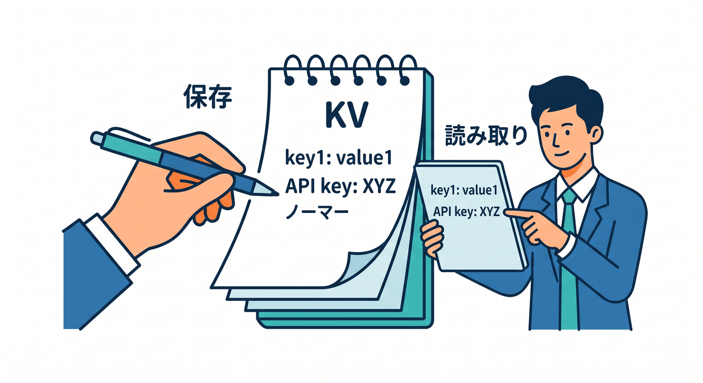
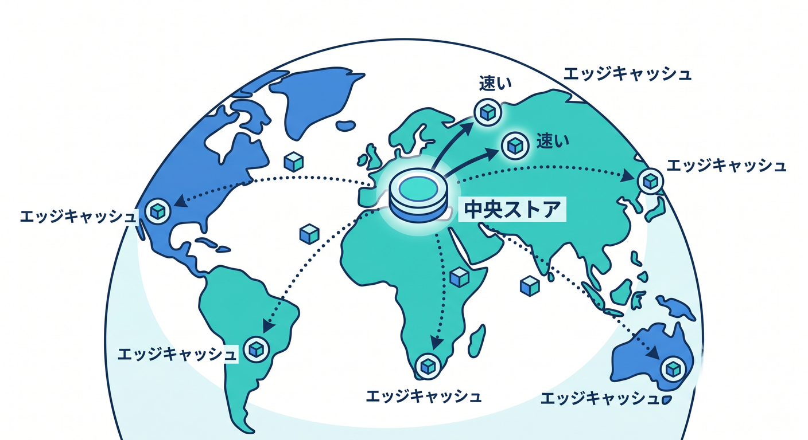
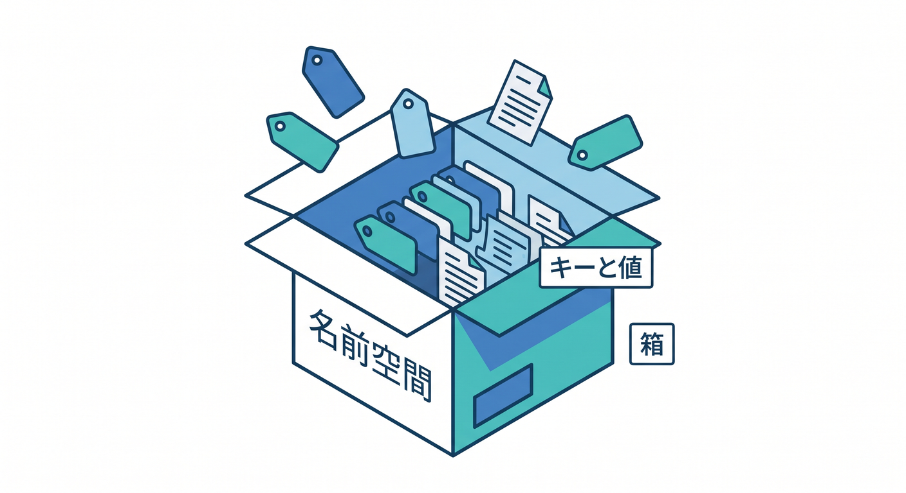
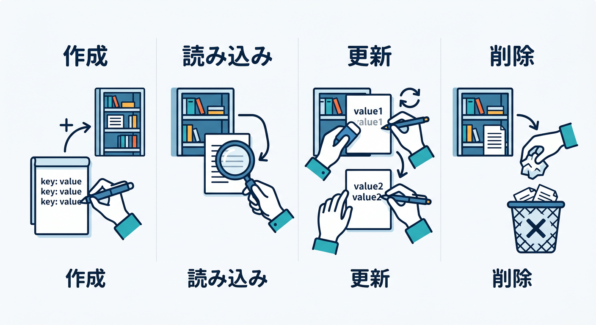
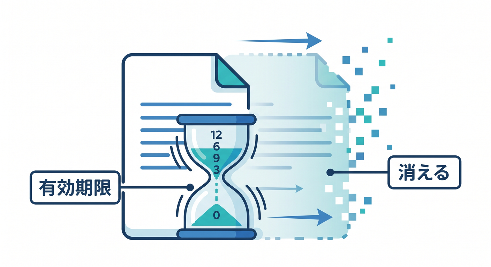
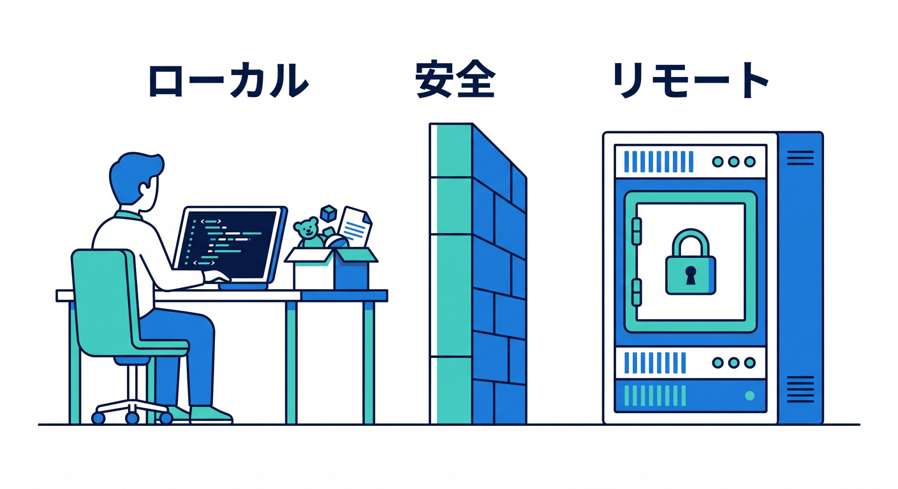
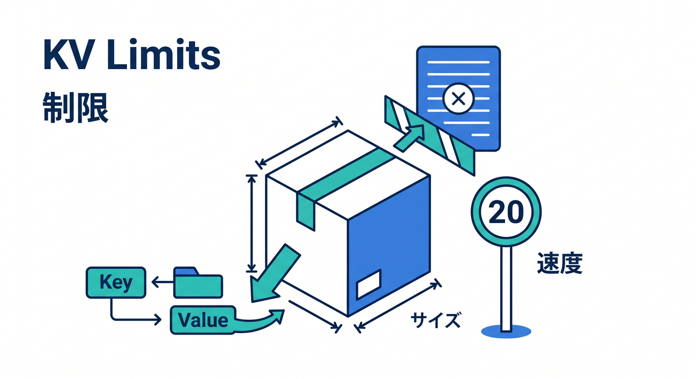

# Cloudflare Workers KV編 15章アウトライン 🗝️☁️📦

確認日: 2026-04-24  
主な確認先: Cloudflare Workers KV / How KV works / KV Getting started / Workers Binding API / KV Limits / Wrangler KV commands 公式ドキュメント

## 第1章　KVはWorkerに“軽い記憶”を持たせる道具 🗝️

Workers KVは、キーと値でデータを保存するCloudflareのストレージです。  
まずは「名前をつけて保存し、同じ名前で読む」だけを理解します 😊  
設定値、簡単なメモ、機能フラグ、軽いキャッシュなどを題材にします。  
SQLのような表ではなく、大きなファイル置き場でもありません。  
KVはグローバルで低遅延な読み取りに向いたkey-value storeとして案内されています。

最初の章では、KVを“Workerの小さなメモ帳”としてイメージします。  
D1やR2との違いは軽く触れ、深追いはしません。  
この章のゴールは、KVの役割を一言で説明できることです 📦

## 第2章　KVの仕組み：書く場所と読む場所を知ろう 🌍

KVは、書き込んだデータを中央ストアへ保存し、読まれた場所でキャッシュします。  
最初の読み取りは少し遅いことがありますが、よく読まれる値は近くで速く返せます ⚡  
公式ドキュメントでは、KVは書き込み少なめ・読み取り多めの用途に向くと説明されています。  
変更は書いた場所ではすぐ見えやすい一方、他の地域では最大60秒以上遅れることがあります。  
つまりKVはeventually consistentです。

ここで「速い読み取り」と「即時の正確さ」は別だと学びます ⚖️  
在庫や残高のような用途には注意し、設定値や軽いキャッシュ向きと理解します。  
この章のゴールは、KVの得意・不得意を仕組みから理解することです 🧠

## 第3章　KV NamespaceとBindingを作ろう 🌉

KVを使うには、まずKV namespaceを作ります。  
namespaceは、キーと値を入れる箱のようなものです 📦

Wranglerでは `npx wrangler kv namespace create <BINDING_NAME>` で作成できます。  
作成後、`wrangler.jsonc` の `kv_namespaces` にbindingを追加します。  
binding名はWorkerコードで `env.APP_KV` のように参照する名前です。  
TypeScriptでは `Env` 型に `APP_KV: KVNamespace` を書きます。  
Reactから直接KVに触るのではなく、Worker APIを通します 🔐  
この章のゴールは、WorkerからKVへつながる橋を作れることです ✅

## 第4章　最初の保存と読み取りをやってみよう ✍️

KVの最初の体験は、`put()` で保存して `get()` で読むことです。  
`await env.APP_KV.put("hello", "world")` のようにキーと値を保存します。  
`await env.APP_KV.get("hello")` で値を取り出します 👀  
値がない場合は `null` が返るので、404や初期値を考えます。  
文字列だけでなくJSONを保存するときは `JSON.stringify()` と `JSON.parse()` を使います。  
エラー時にはsecretや個人情報をログに出さないよう注意します。  
まずは `workers.dev` で保存と読み取りを確認します。  
この章のゴールは、KVの最小CRUDのうちCreate/Readを体験することです 🚀

## 第5章　更新・削除・存在しないキーを扱おう 🔁

同じキーへ `put()` すると値を更新できます。  
`delete()` を使えばキーを削除できます 🧹  
削除後の `get()` は `null` になるため、存在しない状態を自然に扱う必要があります。  
KVは即時整合性が必要なカウンター更新には注意が必要です。  
同じキーへの書き込みは制限もあるため、連打更新には向きません。

簡単なメモ更新ならOKですが、リアルタイム状態にはDurable Objectsも検討します。  
この章では、更新と削除の基本APIを学びます。  
この章のゴールは、KVの基本操作を一通り説明できることです ✅

## 第6章　キー設計を考えよう：名前の付け方が大事 🏷️

KVでは、キーの付け方が設計のかなり大事な部分です。  
`user:123:settings`、`feature:new-ui`、`cache:weather:tokyo` のように意味が見える名前にします。  
キーは最大512 bytesという制限があります。  
prefixをそろえると、`list({ prefix })` で探しやすくなります 🔎  
ユーザーIDや種類を含めると、データの役割が分かりやすくなります。  
ただし個人情報そのものをキーに入れるのは避けます。  
あとで消す・一覧する・移行することを考えたキー設計をします。  
この章のゴールは、読みやすく安全なKVキーを設計できることです 🧭

## 第7章　JSONとmetadataを使って少し実用的にしよう 🧾

KVの値には文字列やJSON文字列を保存できます。  
オブジェクトを保存するなら `JSON.stringify()`、読むなら `JSON.parse()` を使います。  
KVにはmetadataも付けられ、値とは別に小さなJSONメタ情報を持てます 📎  
metadataはキー一覧時に軽い情報を見たいときに便利です。  
ただしmetadataにもサイズ制限があるため、大きなデータは入れません。  
値本体とmetadataの使い分けを、メモアプリを例に学びます。  
TypeScriptでは型を用意して、parse後の形を意識します。  
この章のゴールは、KVに構造化データを安全に入れる感覚を持つことです ✅

## 第8章　expirationとTTLで“期限つき保存”を使おう ⏱️

KVでは、キーに期限をつけることができます。  
`expiration` や `expirationTtl` を使うと、一定時間後に値を消せます ⏳  
一時的なキャッシュ、短時間の確認コード、軽いセッション的な情報に使えます。  
ただし認証や重要なセッション設計は慎重に考えます。  
TTLは便利ですが、いつ消えるかを前提にアプリを設計する必要があります。

期限切れ後の `get()` は `null` として扱います。  
CloudflareのキャッシュTTLとは別物として整理します。  
この章のゴールは、KVで期限つきデータを安全に扱えることです 🕰️

## 第9章　listでキー一覧を扱おう 📋

KVでは `list()` を使ってキー一覧を取得できます。  
prefixを使えば、特定の種類のキーだけを探せます 🔎  
ただし、KVは本格的な検索DBではありません。  
一覧・検索・並び替えが中心ならD1を検討します。  
`list()` は管理画面、移行、簡単な一覧確認に使うイメージです。  
大量キーの扱いではページングやcursorの考え方も必要になります。  
キー設計が悪いと一覧処理がつらくなります。  
この章のゴールは、KVの一覧機能を過信せず使えることです ✅

## 第10章　ローカル開発とremote KVの違いを知ろう 🧪

`wrangler dev` では、デフォルトでローカル版KVを使い、本番データを壊さないようになっています。  
そのため、ローカルで読んだキーが `null` になることがあります。  
公式ドキュメントでは、Cloudflare上のremote KVへつなぐにはbindingに `"remote": true` を設定する方法が案内されています。  
開発中に本番KVへ書くと危険なので、使い分けを学びます ⚠️  
dev、staging、productionでnamespaceを分ける考え方も扱います。  
Wrangler CLIで `--remote` を付ける操作にも触れます。  
テストデータと本番データを混ぜないことが大切です。

この章のゴールは、local KVとremote KVを混同しないことです ✅

## 第11章　KVを使った簡単メモAPIを作ろう 📝

ここでは、KVで小さなメモAPIを作ります。  
`POST /memo/:id` で保存し、`GET /memo/:id` で読む構成にします。  
JSON bodyを読み、文字数制限や空文字チェックを入れます 🧪  
キーは `memo:<id>` のようにprefixを付けます。  
個人ごとの大量メモや検索が必要になったらD1が候補になることも説明します。  
まずはKVで保存体験を優先します。  
Reactからfetchして、画面に保存結果を表示する流れも考えます。  
この章のゴールは、KVを使った小さなAPIを設計できることです 🚀

## 第12章　設定ストア・機能フラグとしてKVを使おう 🚩

KVは、アプリ設定や機能フラグと相性がよいです。  
`feature:new-ui = enabled` のような値を保存できます 🚩  
ユーザーごとの表示設定、A/Bテスト、ルーティング情報なども候補です。  
Cloudflare公式のstorage optionsでも、configurationやpersonalization用途が案内されています。  
頻繁に読む設定値はKVの得意分野です。  
ただし即時反映が必要な設定変更では、eventual consistencyに注意します。  
安全のため、管理APIには認証やRate Limitingも考えます。  
この章のゴールは、KVを軽い設定ストアとして使えることです ✅

## 第13章　キャッシュ用途のKVを考えよう 📦

KVはAPIレスポンスなどの軽いキャッシュにも使えます。  
外部APIの結果を短時間保存し、同じ問い合わせを速く返す使い方です ⚡  
`cacheTtl` を上げるとKV読み取りのパフォーマンス改善に効くことがあります。  
ただしCloudflare CDN CacheやWorkers Cache APIとは別物です。  
個人情報やユーザー別レスポンスを共有キャッシュしないよう注意します 🔐  
TTLやキー設計を誤ると古い情報が残ります。  
AI API結果は入力内容やプライバシーに注意して慎重に扱います。  
この章のゴールは、KVキャッシュの向き不向きを判断できることです 🧠

## 第14章　KVの制限とアンチパターンを知ろう ⚠️

KVには制限があります。  
キーサイズ、valueサイズ、metadataサイズ、同一キーへの書き込み頻度、1 invocationあたりの操作数などを確認します。  
2026年時点の公式Limitsでは、valueは25 MiB、keyは512 bytes、metadataは1024 bytesなどが案内されています。  
同じキーへの書き込みは1秒1回の制限があります。  
カウンター、在庫、銀行残高、リアルタイムチャット状態には注意します 🚧  
必要に応じてD1、Durable Objects、R2、Queuesへ分けます。  
KVを万能DBとして使わないことが大切です。

この章のゴールは、KVでやらない方がよいことを説明できることです ✅

## 第15章　総仕上げ：KVつきミニアプリを作ろう 🏁

最後に、React + Workers + KVの小さなアプリを作る設計をまとめます。  
題材は、ユーザー設定と短いメモを保存するミニアプリです 📝  
KV namespace、binding、Env型、GET/POST API、React fetchをつなげます。  
local KVとremote KVの確認、`workers.dev` でのデプロイ確認も行います。  
キー設計、JSON保存、TTL、エラー処理、ログの注意点を総復習します。  
将来検索が必要ならD1、画像が必要ならR2、状態が必要ならDOへ広げる道も示します。  
Copilotに最終レビューを頼み、公式ドキュメントで重要点を確認します。  
この章のゴールは、KVを“軽い記憶”として実アプリに組み込めることです 🎉

## 参照URL 🔗

- Cloudflare Workers KV: https://developers.cloudflare.com/kv/
- KV Getting started: https://developers.cloudflare.com/kv/get-started/
- How KV works: https://developers.cloudflare.com/kv/concepts/how-kv-works/
- Workers Binding API: https://developers.cloudflare.com/kv/api/
- KV Limits: https://developers.cloudflare.com/kv/platform/limits/
- Wrangler KV commands: https://developers.cloudflare.com/kv/reference/kv-commands/
- KV namespaces: https://developers.cloudflare.com/kv/concepts/kv-namespaces/
- KV bindings: https://developers.cloudflare.com/kv/concepts/kv-bindings/
- KV data security: https://developers.cloudflare.com/kv/reference/data-security/
- Workers storage options: https://developers.cloudflare.com/workers/platform/storage-options/
