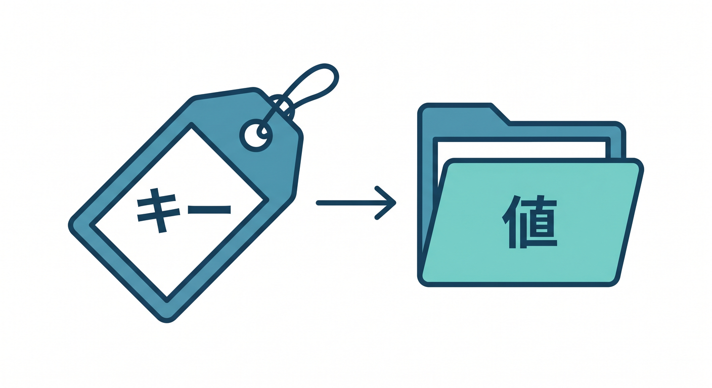
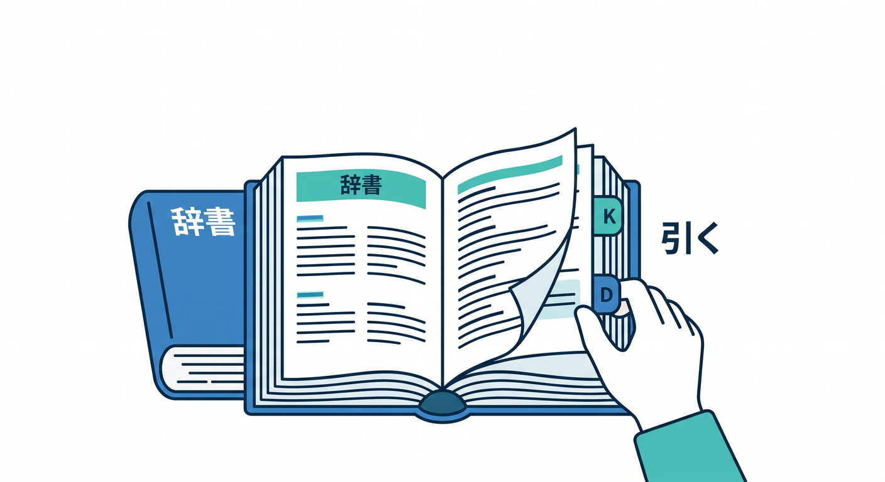
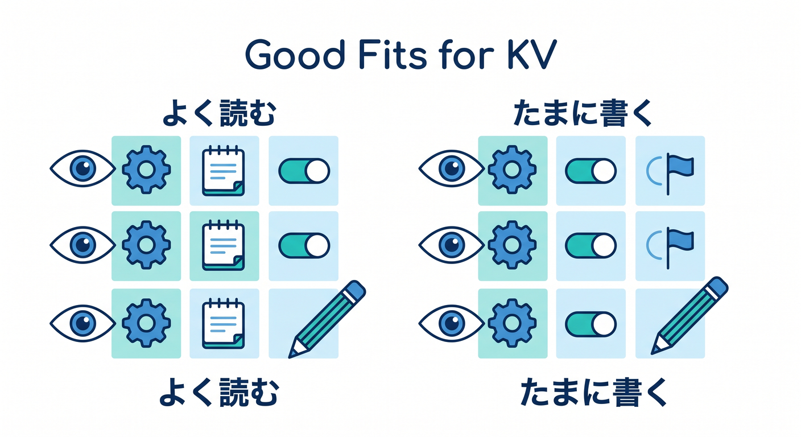
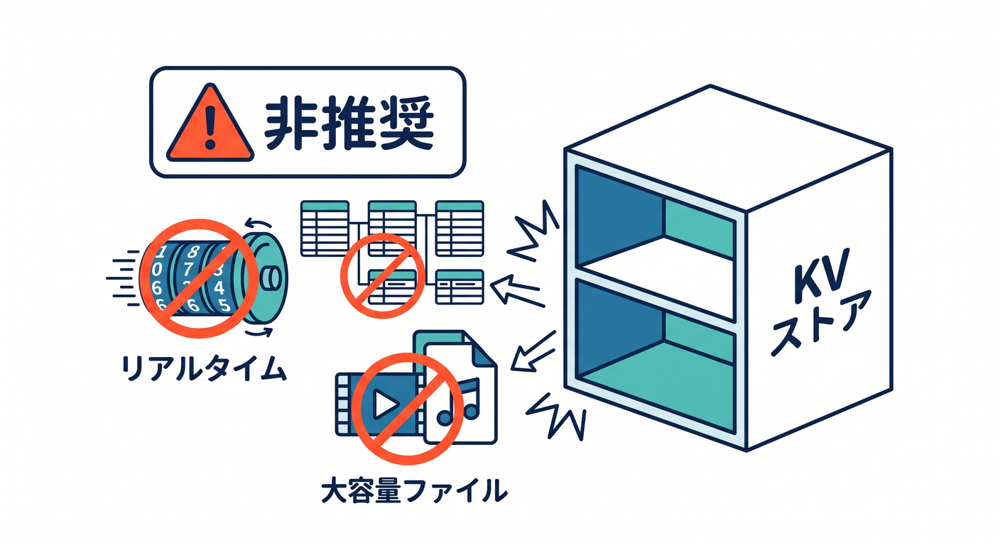
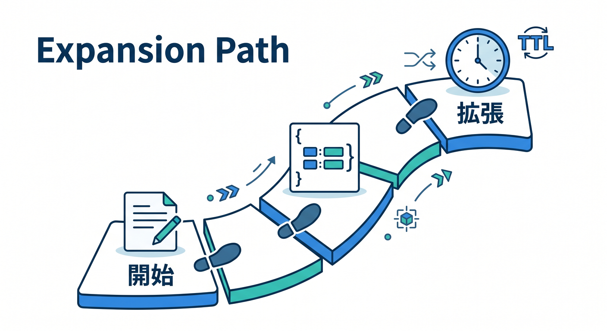
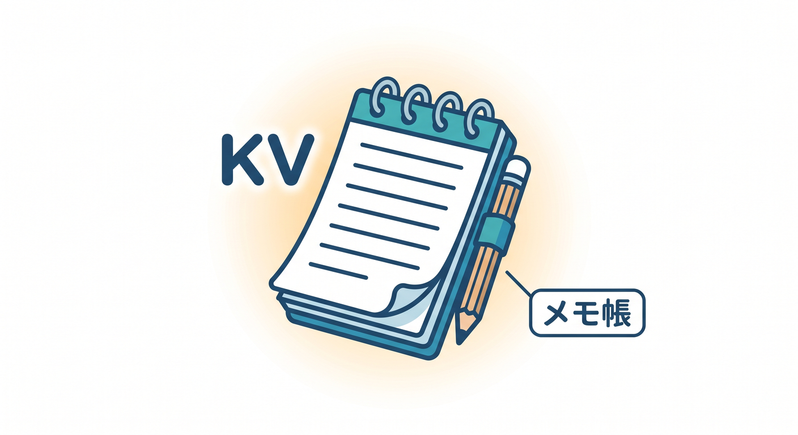

# 第01章：KVはWorkerに“軽い記憶”を持たせる道具 🗝️📦

Cloudflare Workersは、リクエストを受けて返事をするのが得意です。  
でも、何かを覚えておきたい場面もあります。


そのときに使える保存先の1つがWorkers KVです 😊

---

## 1. KVはkey-valueの保存先 🗝️

KVは、keyとvalueのペアで保存します。



```text
key   = "theme:user_123"
value = "dark"
```

キーを指定して保存し、同じキーで読みます。  
SQLのように表を作るのではなく、大きな辞書のように考えると分かりやすいです。



```text
名前をつけて保存する
同じ名前で取り出す
```

これがKVの基本です。

---

## 2. KVが向いているもの 🌱

KVは、軽いデータを気軽に保存するのに向いています。

例です。

- アプリ設定
- ユーザー設定
- 機能フラグ
- 短いメモ
- 軽いキャッシュ
- ルーティング情報

とくに「よく読むけれど、頻繁には書き換えない」データと相性がよいです。



---

## 3. KVが向かないもの ⚠️

KVは便利ですが、万能データベースではありません。

向かないものです。

- 複雑な検索が必要なデータ
- SQLで一覧や集計をしたいデータ
- 大きな画像やPDF
- リアルタイムのチャット状態
- 正確なカウンター
- 在庫や残高のような厳密な値

こうしたものは、D1、R2、Durable Objectsなどを検討します。



---

## 4. KVは“軽い記憶”として考える 🧠

KVは、Workerにちょっとした記憶を持たせる道具です。

たとえば、次のようなイメージです。

```text
feature:new-ui = enabled
user:123:theme = dark
memo:abc = 今日のメモ
```

最初は、短い文字列を保存して読むだけで十分です。  
そこからJSON、TTL、一覧、キャッシュ用途へ広げていきます。



---

## 5. 章末チェック ✅

- KVはkey-value形式の保存先だと分かる
- 軽い設定や短いメモに向いていると分かる
- SQL検索や大きなファイルには向かないと分かる
- KVをWorkerの軽い記憶として説明できる

この章で覚える一言はこれです。  
**KVは、Workerに小さなメモ帳を持たせるための仕組みです 🗝️**


