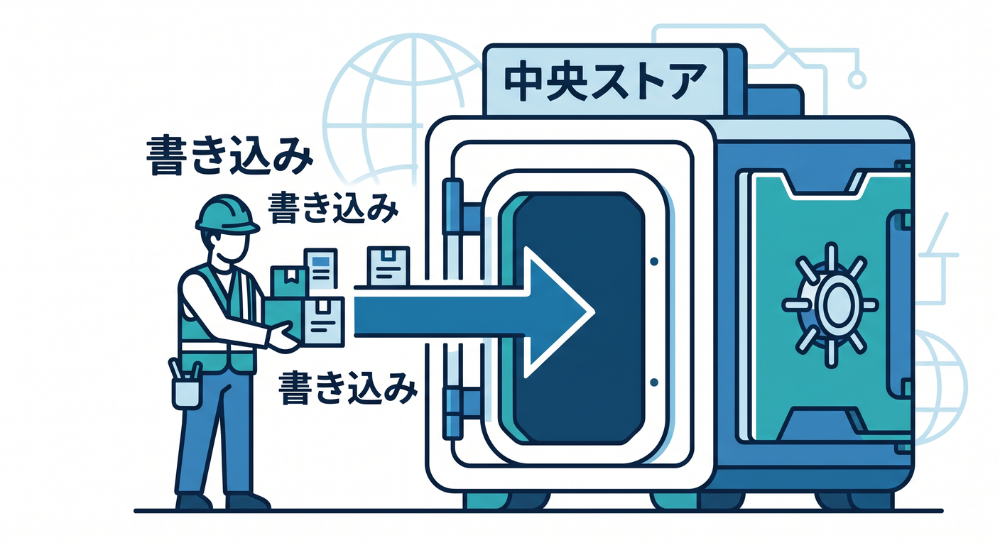
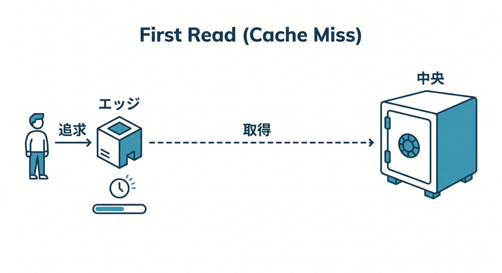
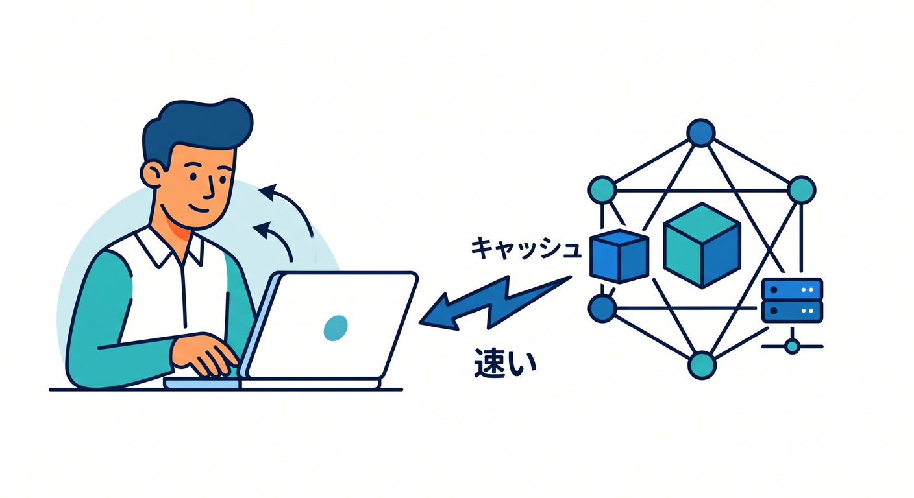
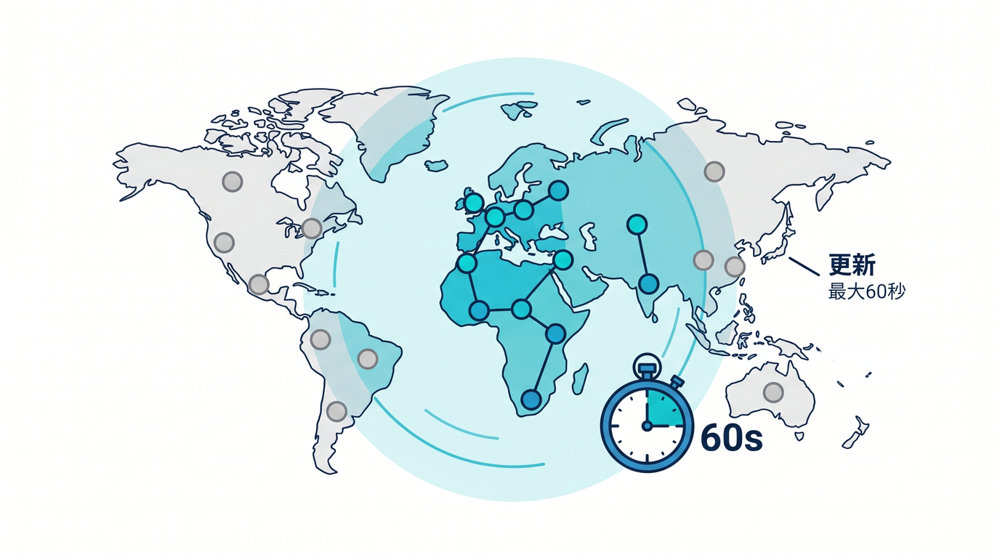
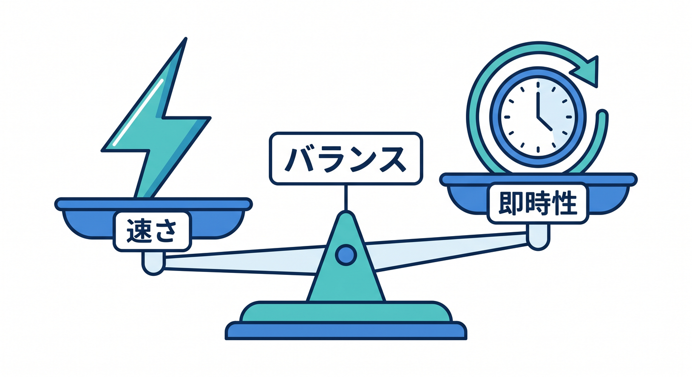
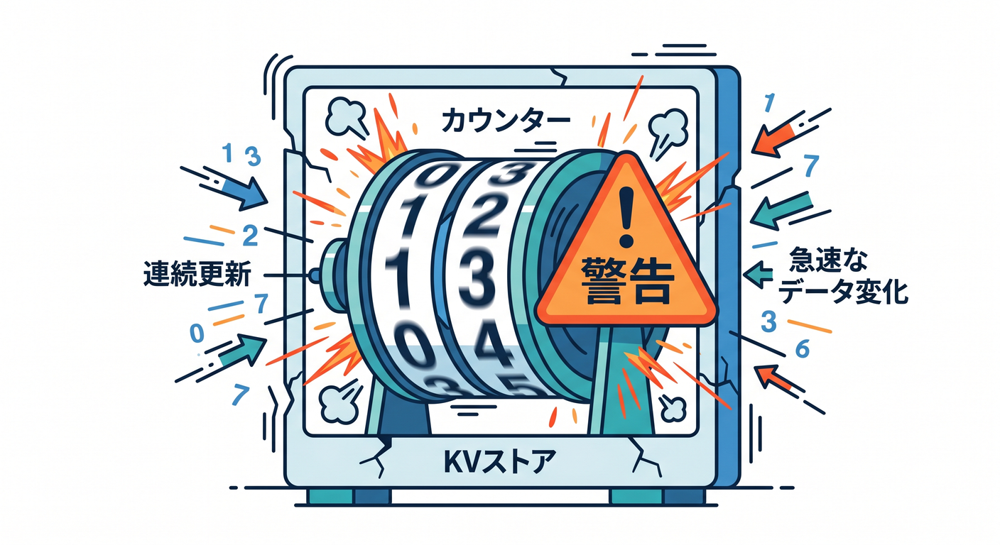
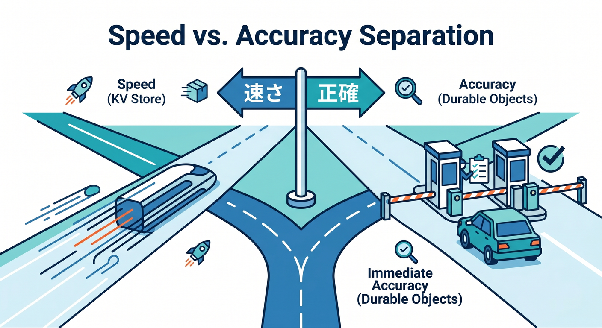

# 第02章：KVの仕組み：書く場所と読む場所を知ろう 🌍⚡

KVはグローバルで低遅延なkey-value storeです。  
ただし、書いたデータが一瞬で世界中の全場所へ配られる、という意味ではありません。  
この章では、KVがなぜ読み取りに強いのか、なぜ整合性に注意が必要なのかを見ます 😊

---

## 1. 書き込みは中央ストアへ行く 🏢

Cloudflare公式では、KVは少数の中央データセンターにデータを保存し、読まれた場所でCloudflareのデータセンターにキャッシュすると説明されています。

つまり、書き込み時に世界中すべての場所へ同時配布されるわけではありません。



```text
Worker
  ↓ put()
KV central stores
```

この仕組みが、KVの読み取り性能と整合性の特徴につながります。

---

## 2. よく読まれる値は近くで速くなる ⚡

最初にある地域でキーを読むと、まだ近くにキャッシュがないことがあります。  
その場合、中央ストア側まで取りに行くため少し遅くなることがあります。



でも、一度読まれると、その地域でキャッシュされます。  
次からは近くで返せるので速くなります。



KVは、読み取りが多いデータに向いている理由がここにあります。

---

## 3. KVはeventually consistent ⚖️

KVは高性能のためにキャッシュを使います。  
そのため、書き込み後すぐに世界中どこでも新しい値が見えるとは限りません。

公式ドキュメントでは、変更は書き込みが行われたCloudflare locationではすぐ見えやすい一方、他のlocationではキャッシュの期限まで、最大60秒以上かかることがあると説明されています。



これをeventually consistentと呼びます。  
最終的には反映されるけれど、常に即時ではないという意味です。



---

## 4. どんな用途に向く？🧩

KVに向く用途です。

- アプリ設定
- 機能フラグ
- 軽いキャッシュ
- ユーザー設定
- あまり頻繁に変わらない値

向きにくい用途です。

- 在庫数
- 残高
- 厳密な投票数
- リアルタイムの部屋状態
- 同じキーを連続更新するカウンター



即時の正確さが必要なら、D1やDurable Objectsを検討します。

---

## 5. 章末チェック ✅

- KVは中央ストアへ書き込むと分かる
- 読まれた場所でキャッシュされると分かる
- KVは読み取りが多い用途に向いていると分かる
- eventually consistentの意味が分かる
- 即時正確性が必要な用途には注意できる

この章で覚える一言はこれです。  
**KVは速く読むためにキャッシュする。だから“すぐ全世界で正確”とは分けて考えよう 🌍⚖️**


