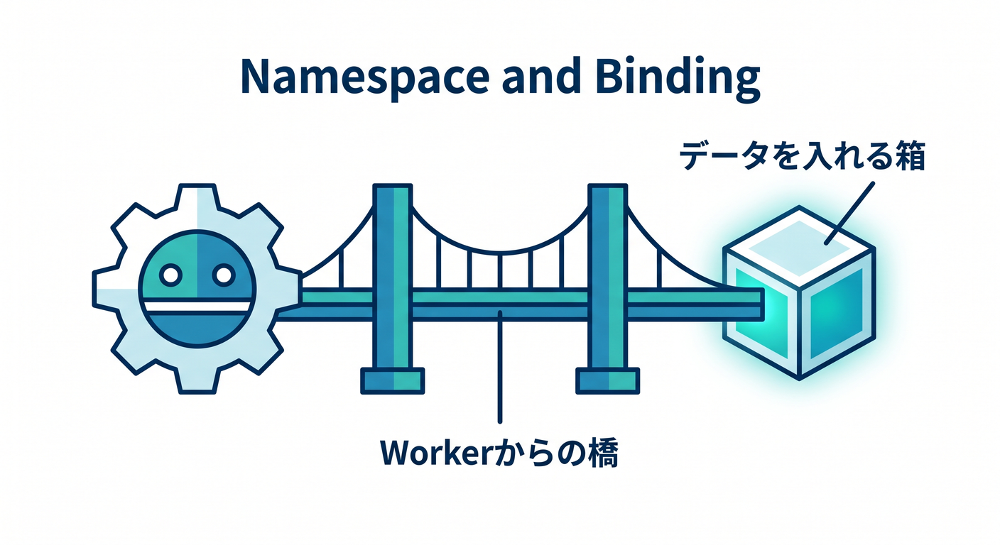
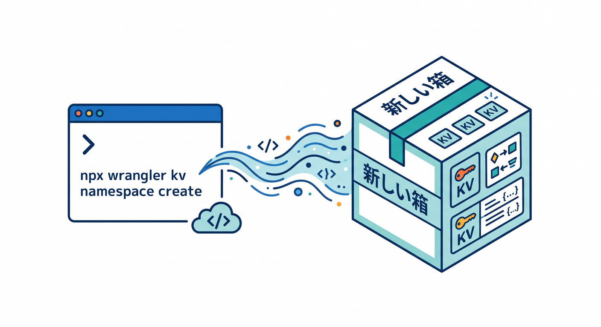
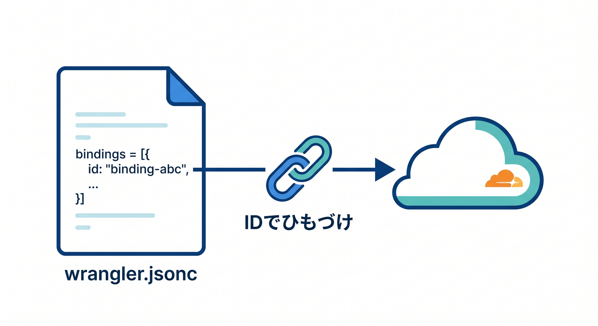
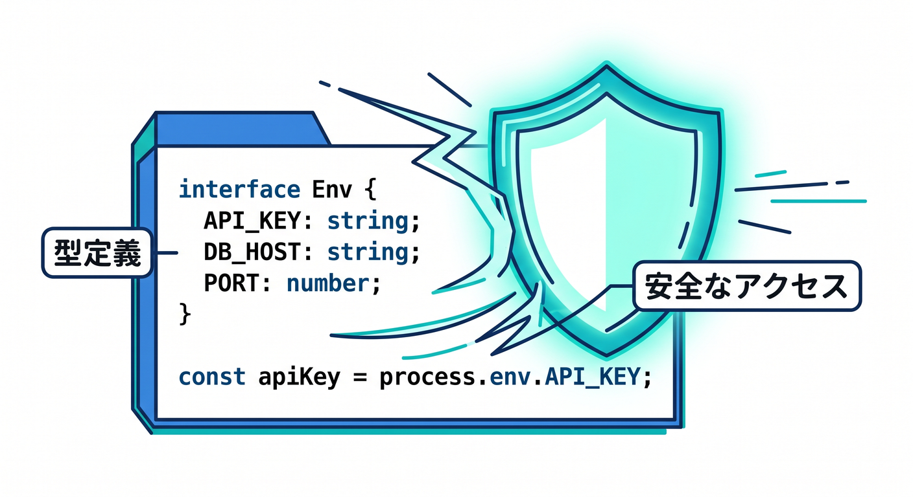
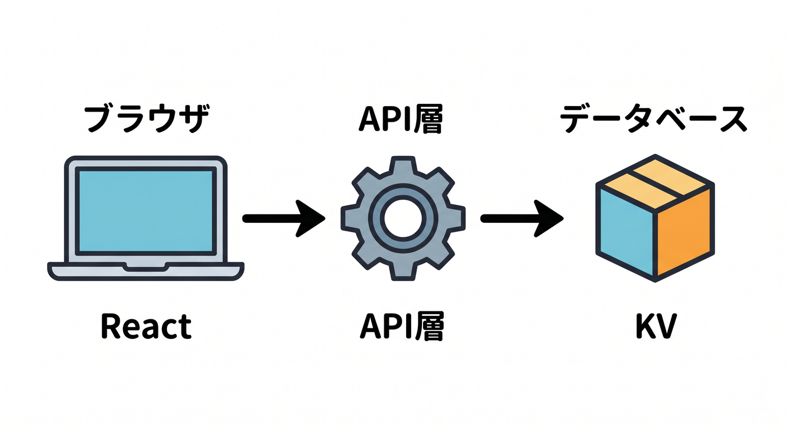
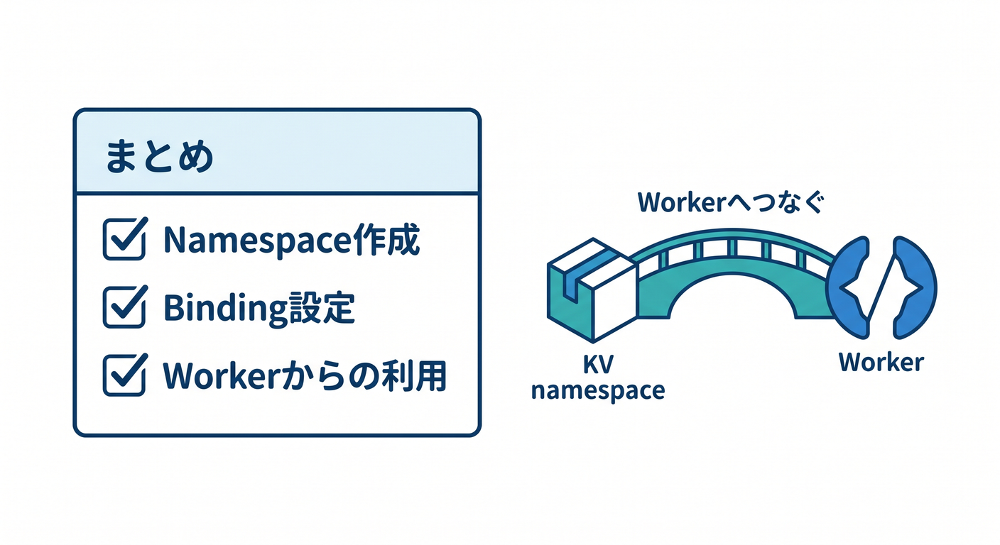

# 第03章：KV NamespaceとBindingを作ろう 🌉📦

KVを使うには、まずKV namespaceを作り、Workerにbindingします。  
namespaceはデータを入れる箱、bindingはWorkerからその箱へつながる橋です。  



この章では、Wranglerと `wrangler.jsonc` の流れを見ます 😊

---

## 1. KV namespaceを作る 📦

WranglerでKV namespaceを作れます。

```powershell
npx wrangler kv namespace create APP_KV
```



公式ドキュメントでは、`npx wrangler kv namespace create <BINDING_NAME>` でnamespaceを作成し、生成されたIDを設定ファイルに追加する流れが案内されています。

`APP_KV` はWorkerから参照するときのbinding名として使います。

---

## 2. `wrangler.jsonc` にbindingを書く 🧾

作成後、次のような設定を追加します。

```jsonc
{
  "kv_namespaces": [
    {
      "binding": "APP_KV",
      "id": "<BINDING_ID>"
    }
  ]
}
```

`binding` はコード側の名前です。  
`id` はCloudflare上のnamespaceを指すIDです。

Workerでは `env.APP_KV` として使えます。



---

## 3. TypeScriptのEnv型を書く ✍️

TypeScriptでは、`Env` 型を用意します。

```ts
export interface Env {
  APP_KV: KVNamespace;
}

export default {
  async fetch(request: Request, env: Env): Promise<Response> {
    const value = await env.APP_KV.get("hello");
    return Response.json({ value });
  },
};
```

型を書いておくと、binding名の間違いや補完に役立ちます。



---

## 4. Reactから直接KVに触らない 🔐

Reactはブラウザで動くので、KVへ直接触らせる設計は避けます。  
基本はWorker APIを通します。

```text
React
  ↓ fetch
Worker
  ↓ env.APP_KV
KV
```

この形なら、入力チェック、認証、Rate Limiting、ログも入れやすくなります。



---

## 5. 章末チェック ✅

- KV namespaceはデータを入れる箱だと分かる
- bindingはWorkerからnamespaceへつなぐ橋だと分かる
- `wrangler.jsonc` に `kv_namespaces` を書ける
- `Env` 型に `KVNamespace` を書ける
- Reactから直接KVに触らないと分かる

この章で覚える一言はこれです。  
**KVはnamespaceを作り、bindingでWorkerにつないで使います 🌉**


