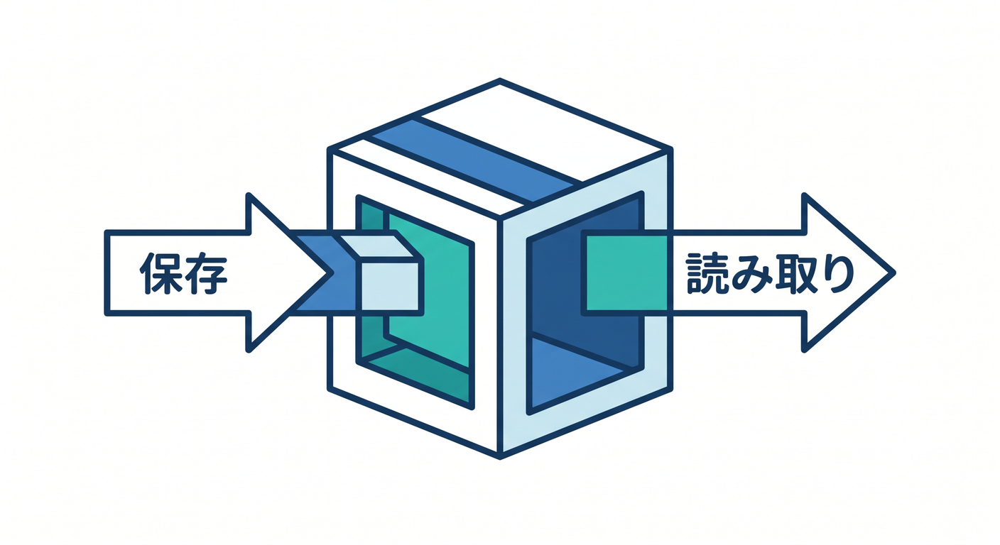
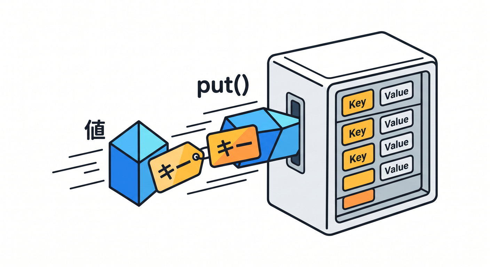
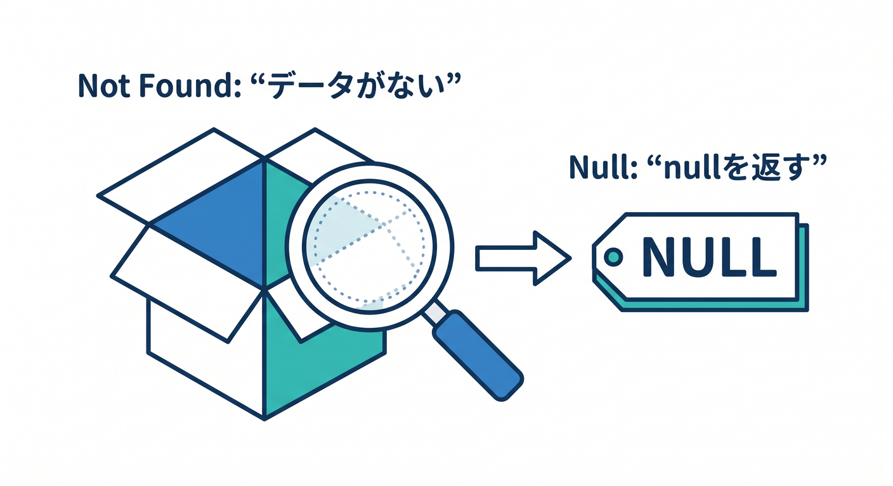
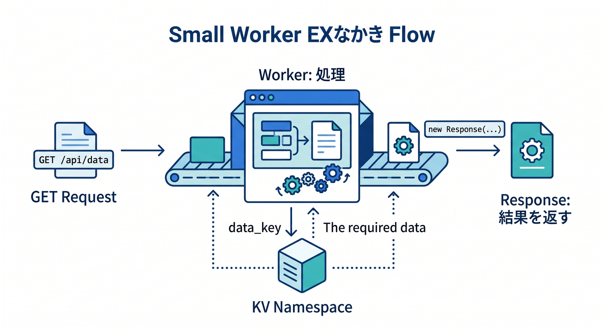
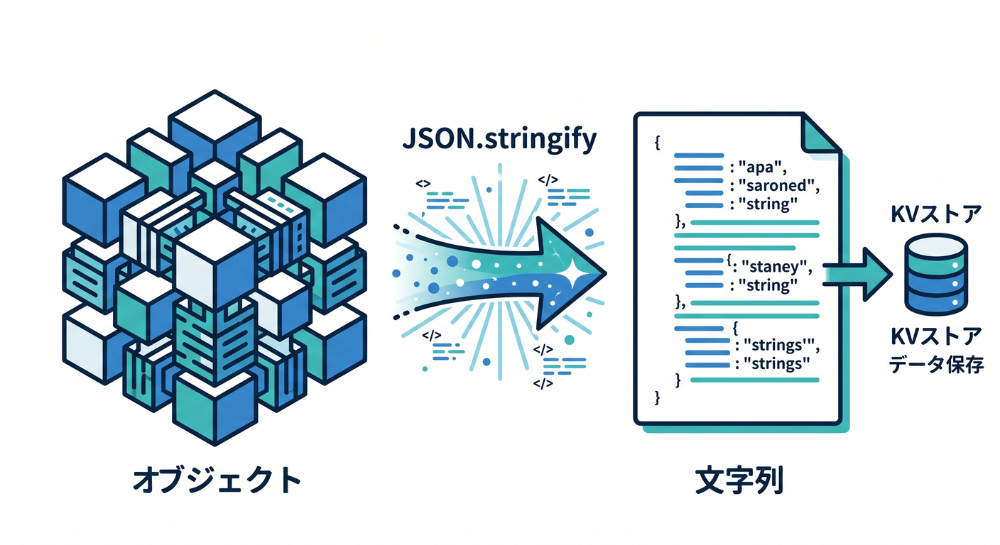
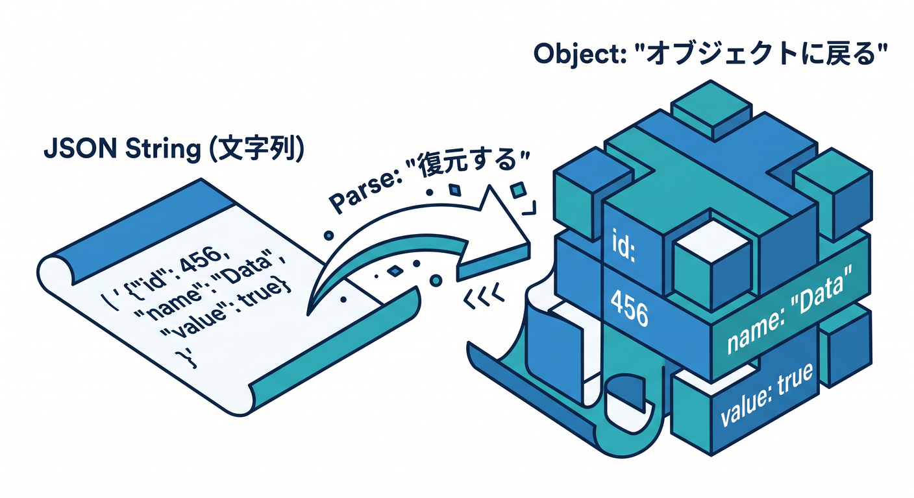
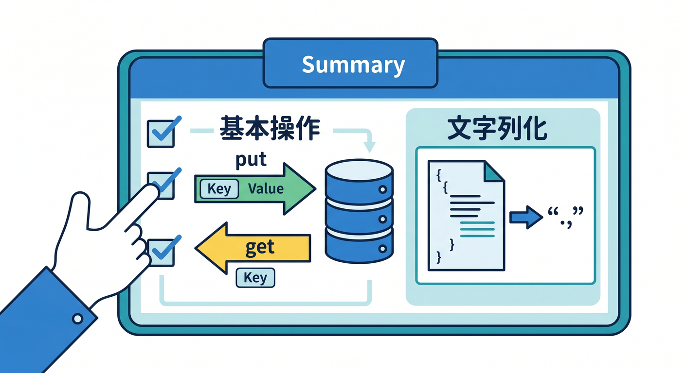

# 第04章：最初の保存と読み取りをやってみよう ✍️👀

KVの最初の体験はとてもシンプルです。  



`put()` で保存し、`get()` で読みます。  
この章では、まず文字列を1つ保存して読み取るところから始めます 😊

---

## 1. `put()` で保存する 📦

KVへ値を保存するには `put()` を使います。

```ts
await env.APP_KV.put("hello", "world");
```

これは、`hello` というキーに `world` という値を保存する、という意味です。

```text
hello = world
```

最初はこのくらい単純で大丈夫です。



---

## 2. `get()` で読む 👀

保存した値は `get()` で読みます。

```ts
const value = await env.APP_KV.get("hello");
```

キーが存在すれば値が返ります。  
存在しなければ `null` が返ります。

```ts
if (value === null) {
  return new Response("Not found", { status: 404 });
}
```

存在しないキーを自然に扱えるようにしておくのが大切です。



---

## 3. 小さなWorker例 🧑‍💻

```ts
export interface Env {
  APP_KV: KVNamespace;
}

export default {
  async fetch(request: Request, env: Env): Promise<Response> {
    await env.APP_KV.put("hello", "world");
    const value = await env.APP_KV.get("hello");

    return Response.json({ value });
  },
};
```

このWorkerを開くと、KVに保存して読み取った結果が返ります。  
学習用としては分かりやすいですが、実アプリでは毎回同じキーへ書く設計は避けます。



---

## 4. JSONを保存する 🧾

オブジェクトを保存したいときは、文字列に変換します。



```ts
const memo = {
  title: "今日のメモ",
  body: "KVを学んだ",
};

await env.APP_KV.put("memo:1", JSON.stringify(memo));
```

読むときは戻します。

```ts
const raw = await env.APP_KV.get("memo:1");
const memo = raw ? JSON.parse(raw) : null;
```



---

## 5. 章末チェック ✅

- `put()` で値を保存できる
- `get()` で値を読める
- 存在しないキーは `null` として扱うと分かる
- JSONは文字列化して保存すると分かる
- 最初のKV Workerを書ける

この章で覚える一言はこれです。  
**KVの最初の一歩は、putで保存、getで読むことです ✍️👀**


