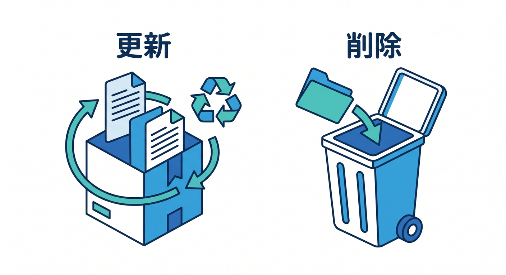
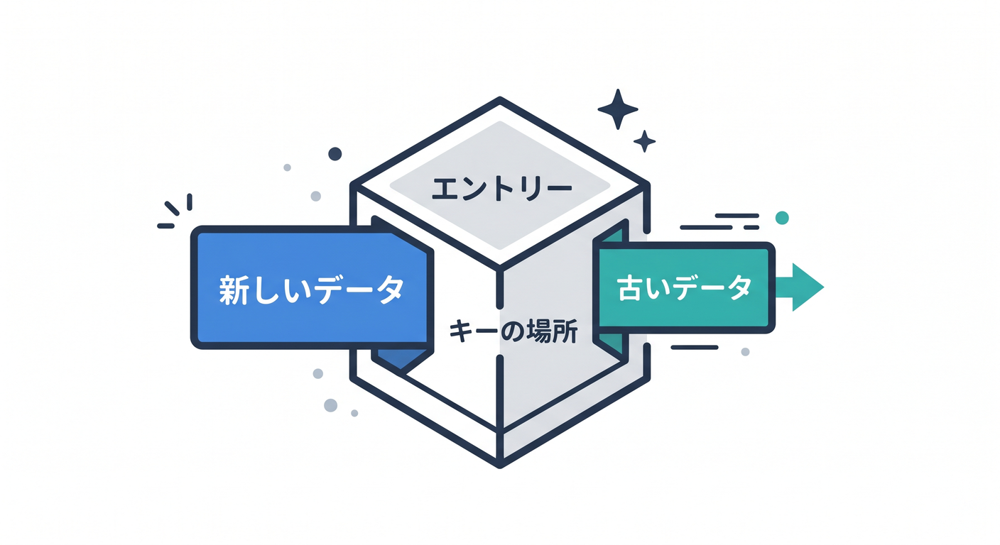
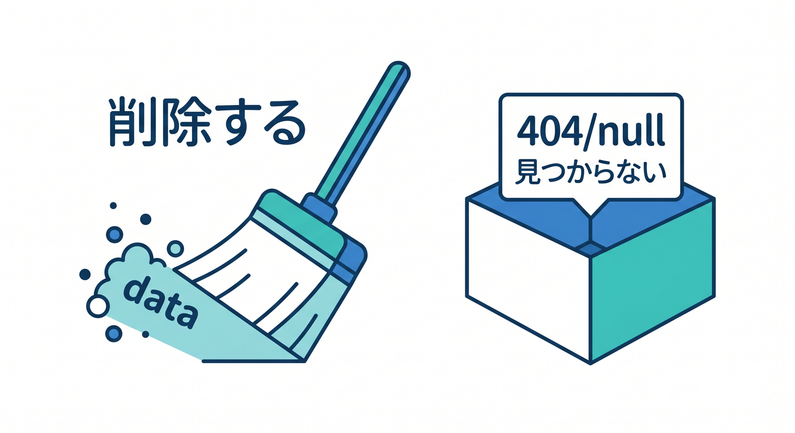
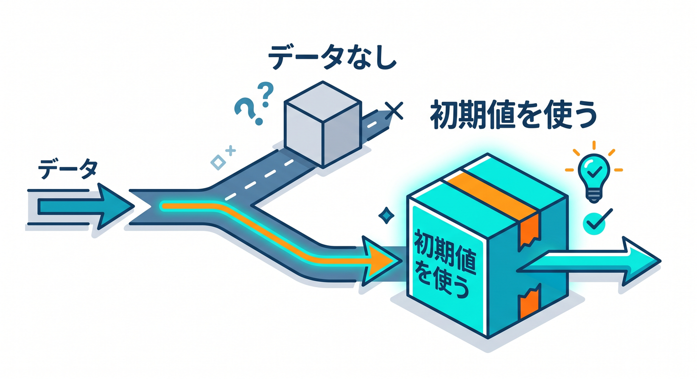
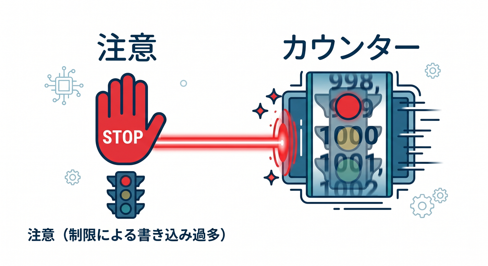
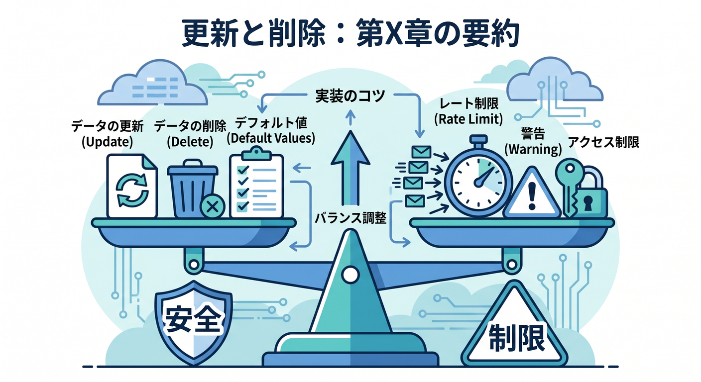

# 第05章：更新・削除・存在しないキーを扱おう 🔁🧹

KVでは、同じキーにもう一度 `put()` すると値を更新できます。  
不要になったキーは `delete()` で削除できます。  
この章では、保存後の変更と削除を扱います 😊



---

## 1. 同じキーへ `put()` すると更新 🔁

最初に保存します。

```ts
await env.APP_KV.put("memo:1", "old text");
```

同じキーへもう一度保存します。

```ts
await env.APP_KV.put("memo:1", "new text");
```

これで値は更新されます。

ただし、KVは世界中で即時に完全反映される仕組みではありません。  
更新直後の読み取りにはeventual consistencyの注意があります。



---

## 2. `delete()` で削除する 🧹

キーを削除するには `delete()` を使います。

```ts
await env.APP_KV.delete("memo:1");
```

削除後に読むと、基本的には `null` として扱います。

```ts
const value = await env.APP_KV.get("memo:1");
if (value === null) {
  return new Response("Deleted or not found", { status: 404 });
}
```



---

## 3. 存在しないキーはエラーではない 🌱

KVで存在しないキーを読んでも、通常は例外ではなく `null` が返ります。  
これは自然な状態として扱います。

たとえば、設定値がない場合は初期値を使えます。

```ts
const theme = (await env.APP_KV.get("theme:user_123")) ?? "light";
```

このように、デフォルト値を考えるとアプリが壊れにくくなります。



---

## 4. 同じキーへの連続更新に注意 ⚠️

KVには、同じキーへの書き込み頻度に制限があります。  
公式Limitsでは、同じキーへの書き込みは1秒に1回と案内されています。

そのため、カウンターのように同じキーを何度も更新する用途には向きません。

例です。

```text
page:view_count = 12345
```

これをアクセスごとにKVで更新する設計は避けた方がよいです。



---

## 5. 章末チェック ✅

- 同じキーへの `put()` は更新になると分かる
- `delete()` でキーを削除できる
- 存在しないキーは `null` として扱うと分かる
- 初期値を用意する考え方が分かる
- 同じキーへの連続更新はKVに向かないと分かる

この章で覚える一言はこれです。  
**KVは更新も削除も簡単。ただし連続更新する正確なカウンターには向きません 🔁**


