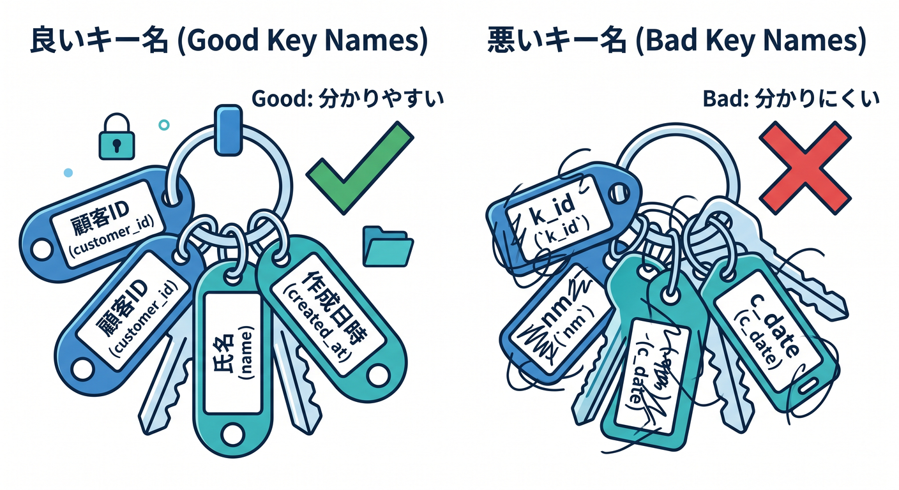
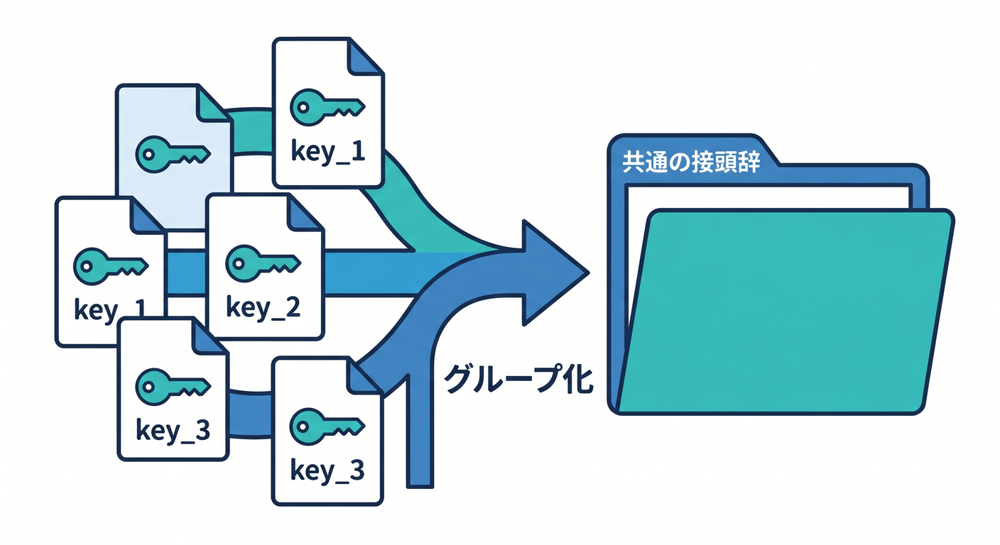
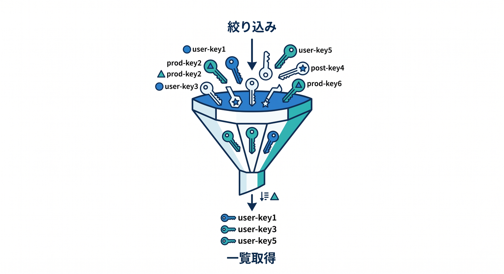
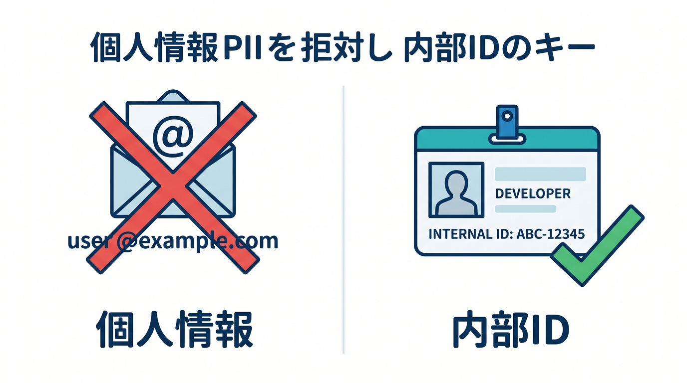
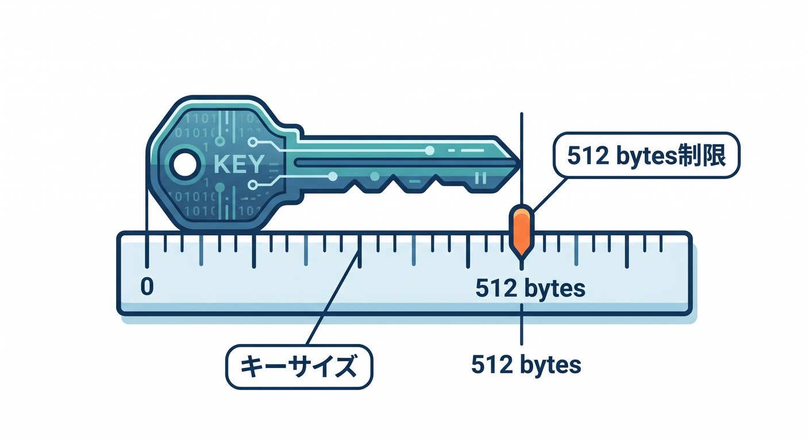
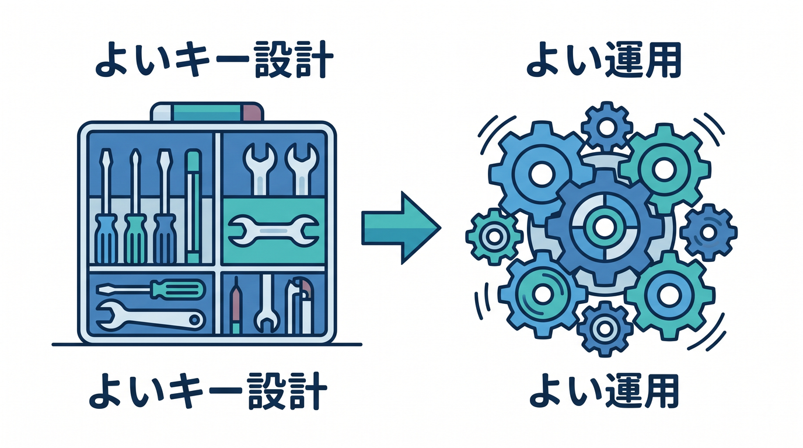

# 第06章：キー設計を考えよう：名前の付け方が大事 🏷️🧭

KVでは、キーの名前がとても大事です。  
キーがぐちゃぐちゃだと、あとで探す・消す・移行するのがつらくなります。  
この章では、読みやすいキー設計を学びます 😊

---

## 1. キーはデータの住所 🏠

KVでは、キーがデータの住所です。


```text
user:123:settings
memo:abc
feature:new-ui
cache:weather:tokyo
```

見ただけで何のデータか分かるキーにすると、運用が楽になります。



悪い例です。

```text
data1
test
abc
```

半年後の自分が読んでも分かる名前にしましょう。

---

## 2. prefixをそろえる 📋

同じ種類のデータにはprefixを付けます。



```text
memo:001
memo:002
memo:003
```

こうしておくと、`memo:` で始まるキーを一覧しやすくなります。

```ts
const list = await env.APP_KV.list({ prefix: "memo:" });
```

prefix設計は、後の `list()` と相性がよいです。



---

## 3. 個人情報をキーに入れない 🔐

キー名には、メールアドレスや電話番号のような個人情報を直接入れない方が安全です。



避けたい例です。

```text
user:tanaka@example.com:settings
```

代わりに、内部IDを使います。

```text
user:12345:settings
```

キーもログや管理画面で見える可能性があるため、慎重に扱います。

---

## 4. キーサイズ制限を知る 📏

KVのキーサイズには制限があります。  



公式Limitsでは、key sizeは512 bytesと案内されています。

長すぎるキーや、巨大なJSONをキーに入れる設計は避けます。

キーは短く、意味が分かる形にします。

```text
cache:article:123
feature:beta-ui
user:123:theme
```

---

## 5. 章末チェック ✅

- キーはデータの住所だと分かる
- prefixをそろえる意味が分かる
- 個人情報をキーに入れないと分かる
- キーサイズ制限を意識できる
- 読みやすいキー名を設計できる

この章で覚える一言はこれです。  
**KVでは、よいキー設計がよい運用につながります 🏷️**


