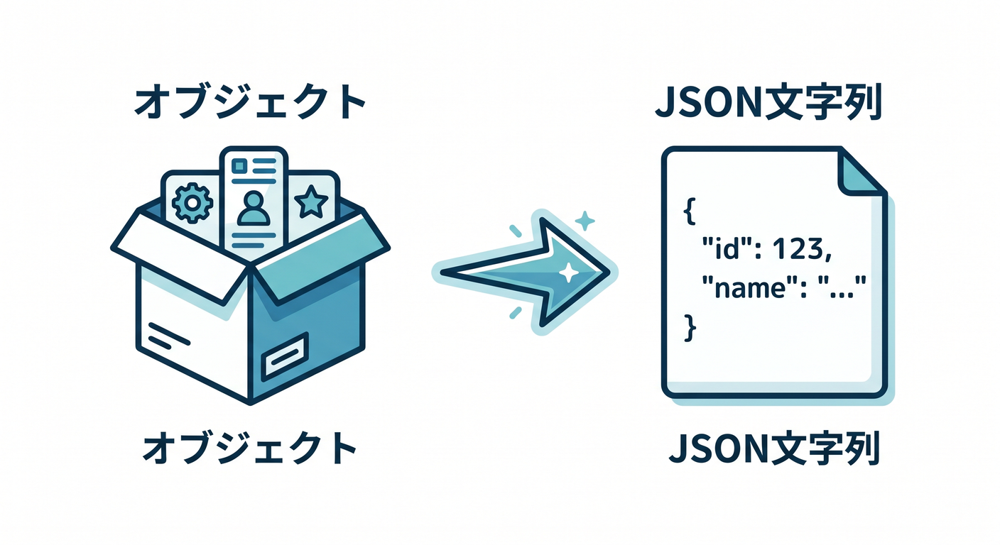
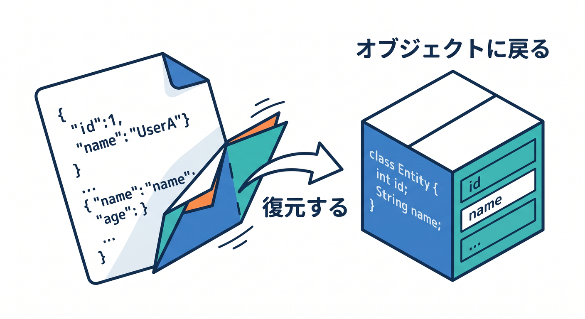
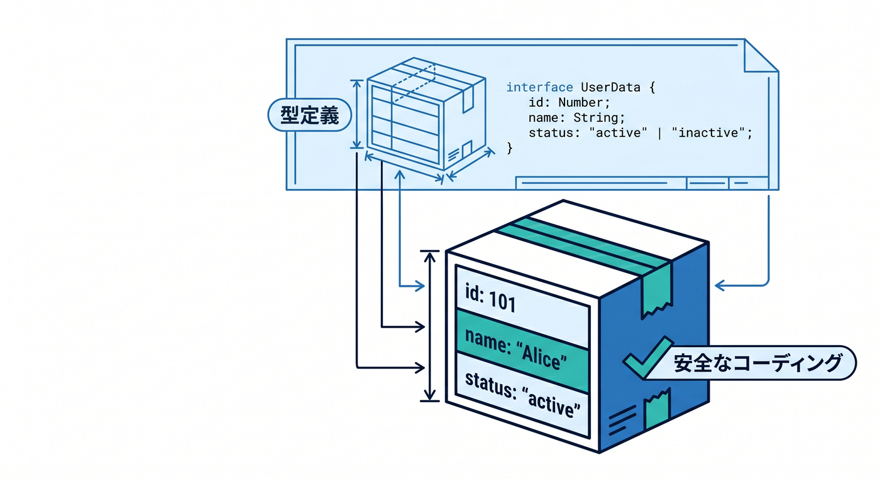
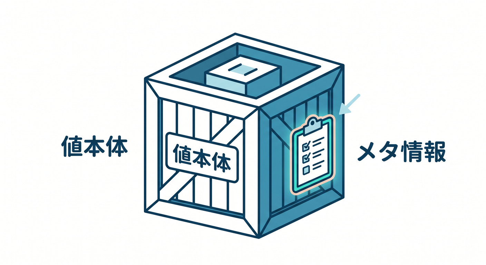
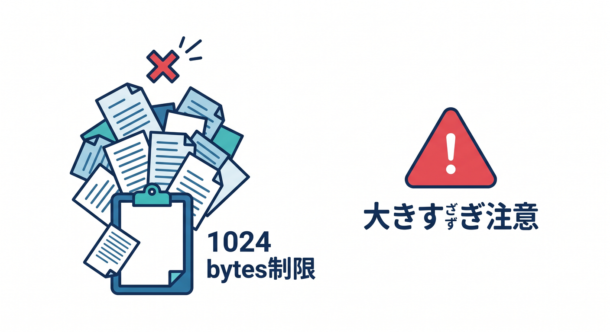
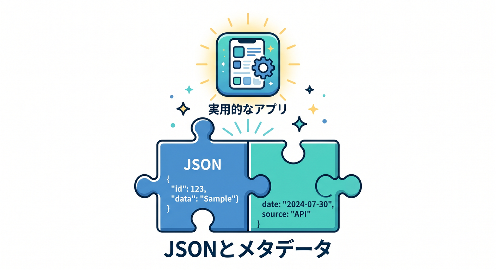

# 第07章：JSONとmetadataを使って少し実用的にしよう 🧾📎

KVには文字列を保存できます。  
でも実際のアプリでは、タイトルや本文、作成日時のように複数の情報をまとめたいことがあります。  
この章では、JSONとmetadataの使い方を見ます 😊

---

## 1. オブジェクトはJSON文字列で保存する 🧾

KVにオブジェクトをそのまま保存するのではなく、JSON文字列にします。



```ts
const memo = {
  title: "KVの勉強",
  body: "JSONで保存する",
  createdAt: new Date().toISOString(),
};

await env.APP_KV.put("memo:1", JSON.stringify(memo));
```

読むときは `JSON.parse()` します。



```ts
const raw = await env.APP_KV.get("memo:1");
const memo = raw ? JSON.parse(raw) : null;
```

---

## 2. 型を用意すると安全 ✍️

TypeScriptでは型を用意しておくと分かりやすいです。



```ts
type Memo = {
  title: string;
  body: string;
  createdAt: string;
};
```

ただし、`JSON.parse()` は本当にその形かまでは保証しません。  
重要なAPIでは、最低限の入力チェックを入れましょう。

---

## 3. metadataとは何か 📎

KVでは、値とは別にmetadataを付けられます。  



metadataは小さなJSONメタ情報です。

たとえば、値本体に本文を入れ、metadataにタイトルや作成日時を入れる考え方があります。

```ts
await env.APP_KV.put("memo:1", "本文です", {
  metadata: {
    title: "今日のメモ",
    createdAt: new Date().toISOString(),
  },
});
```

---

## 4. metadataは大きな情報向けではない ⚠️

metadataにはサイズ制限があります。  



公式Limitsでは、key metadataは1024 bytesと案内されています。

そのため、大きな本文や複雑なデータをmetadataへ入れないようにします。

metadataは、一覧時に見たい軽い情報くらいに使うのが自然です。

---

## 5. 章末チェック ✅

- オブジェクトはJSON文字列として保存すると分かる
- `JSON.stringify()` と `JSON.parse()` を使える
- TypeScript型を用意する意味が分かる
- metadataは小さな補助情報だと分かる
- metadataに大きなデータを入れないと分かる

この章で覚える一言はこれです。  
**KVで構造化データを扱うなら、JSONとmetadataを小さく安全に使おう 🧾📎**


