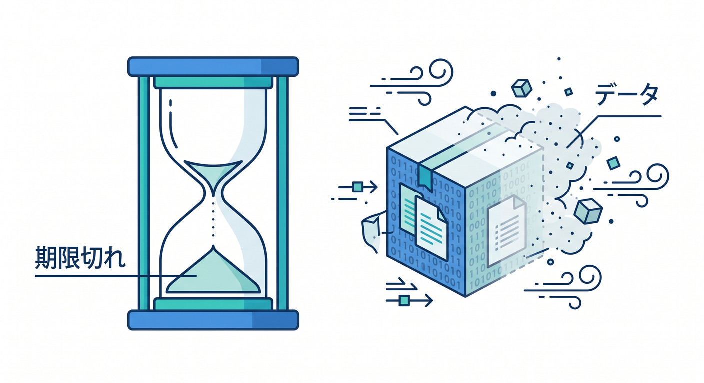
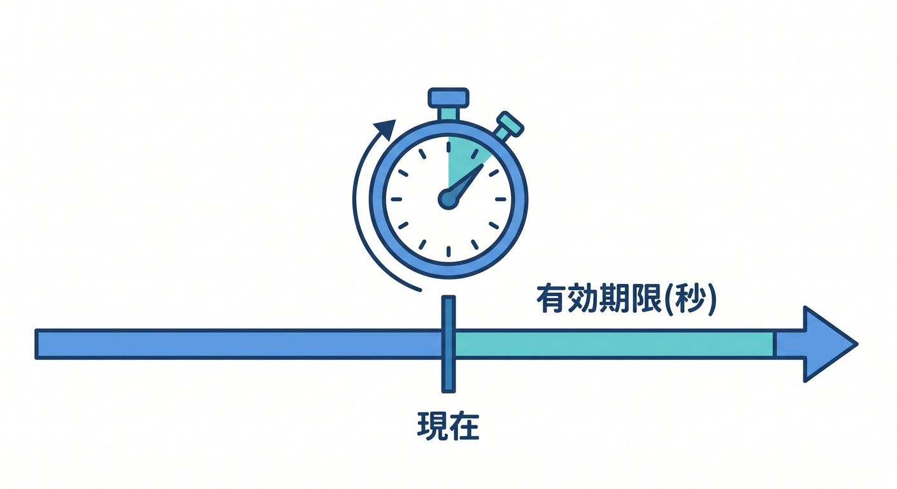
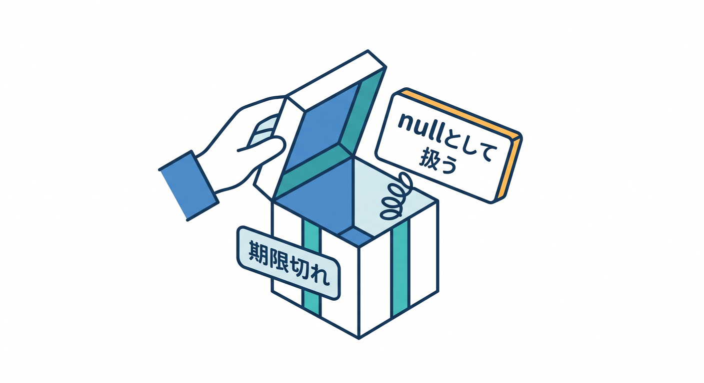

# 第08章：expirationとTTLで“期限つき保存”を使おう ⏱️🕰️

KVでは、保存したデータに期限をつけられます。  
一定時間だけ残して、あとで自動的に消えるデータに便利です。  
この章では、`expirationTtl` と期限つき保存の考え方を学びます 😊

---

## 1. 期限つき保存とは ⏳

期限つき保存は、「この値は一定時間だけ有効」というデータに使います。



例です。

- 一時的なキャッシュ
- 短時間の確認コード
- 一時的な設定
- 期限つきのお知らせ

期限が切れると、そのキーは読めなくなります。  
読むと `null` として扱う設計にします。

---

## 2. `expirationTtl` を使う 🛠️

`expirationTtl` は、今から何秒後に期限切れにするかを指定します。



```ts
await env.APP_KV.put("cache:weather:tokyo", "sunny", {
  expirationTtl: 300,
});
```

この例では、300秒後、つまり5分後に期限切れになります。

短時間キャッシュには分かりやすい指定です。

---

## 3. `expiration` は時刻指定 📅

`expiration` は、Unix epoch秒で期限の時刻を指定します。


```ts
const expiresAt = Math.floor(Date.now() / 1000) + 3600;

await env.APP_KV.put("notice:today", "公開中", {
  expiration: expiresAt,
});
```

指定した時刻を過ぎると、キーが期限切れになります。

---

## 4. 期限切れを前提に処理する 🌱

期限つきのキーは、いつか消えます。  
そのため、読む側では `null` を自然に扱います。



```ts
const value = await env.APP_KV.get("cache:weather:tokyo");

if (value === null) {
  return new Response("Cache expired", { status: 404 });
}
```

期限切れはエラーというより、想定された状態です。

---

## 5. 章末チェック ✅

- KVに期限つき保存ができると分かる
- `expirationTtl` は秒数指定だと分かる
- `expiration` は時刻指定だと分かる
- 期限切れ後は `null` を扱うと分かる
- 短時間キャッシュに使えると分かる

この章で覚える一言はこれです。  
**KVの期限つき保存は、軽いキャッシュや一時データに便利です ⏱️**


