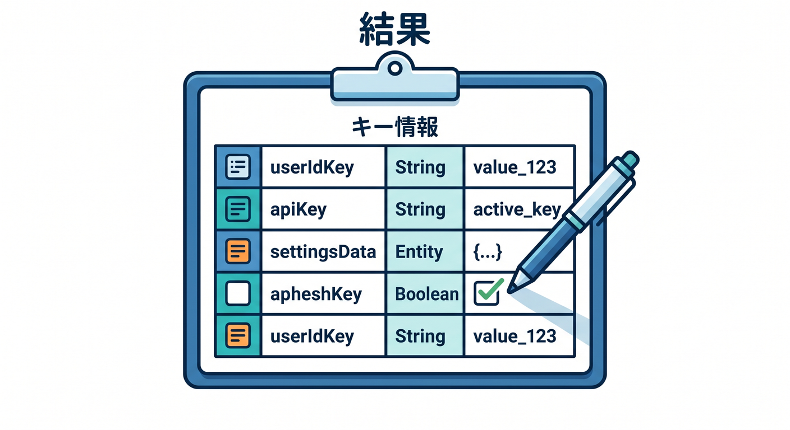
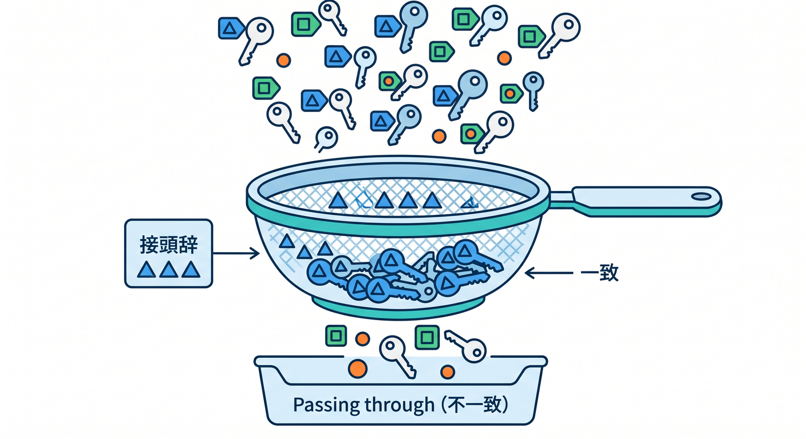
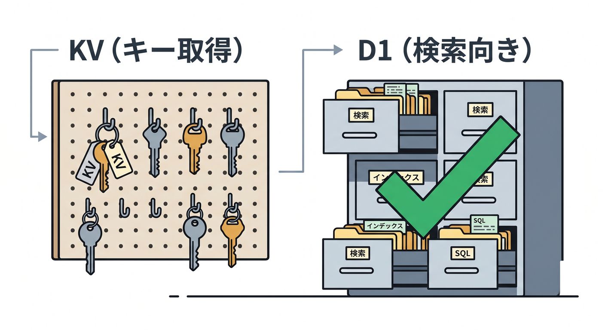
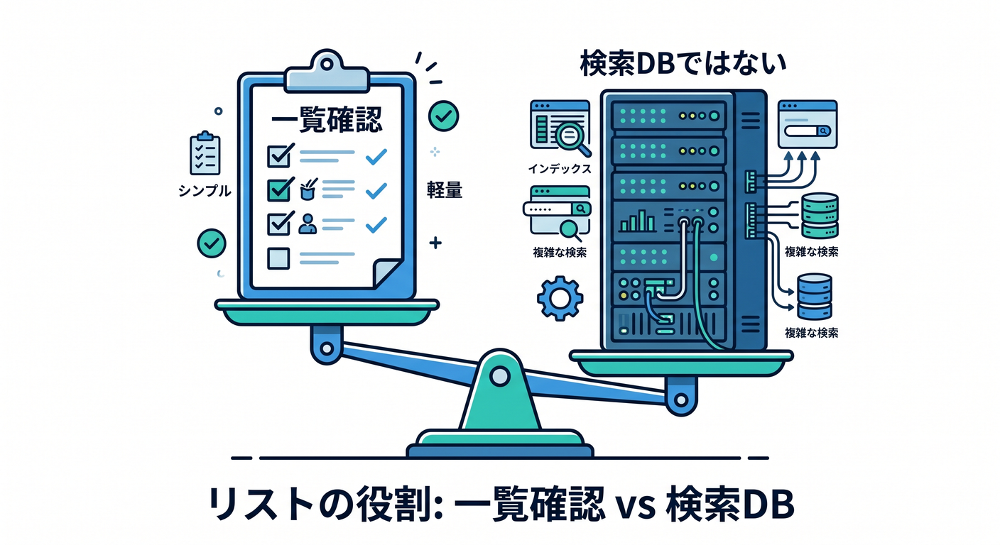

# 第09章：listでキー一覧を扱おう 📋🔎

KVでは、保存したキーの一覧を取得できます。  

ただし、KVは本格的な検索データベースではありません。  
この章では、`list()` を便利に使いつつ、過信しない考え方を学びます 😊

---

## 1. `list()` でキー一覧を取る 📋

KV namespaceのキー一覧は `list()` で取得できます。

```ts
const result = await env.APP_KV.list();
```

結果にはキーの情報が含まれます。


学習中は、どんなキーが入っているか確認するのに便利です。

---

## 2. prefixで絞る 🏷️

prefixを使うと、特定の種類のキーだけを取り出しやすくなります。


```ts
const result = await env.APP_KV.list({ prefix: "memo:" });
```

このため、キー設計でprefixをそろえておくことが大切です。

```text
memo:001
memo:002
memo:003
```

---

## 3. 大量キーではページングを考える 📚

キーが大量にある場合、一度に全部扱うのは大変です。  
KVの一覧では、cursorを使って続きのページを取る考え方があります。


初心者のうちは深く実装しなくてもよいですが、次は覚えておきましょう。

```text
listは小さな確認には便利。
大量データの検索UIにはD1の方が自然なことが多い。
```

---

## 4. 検索DBとして使いすぎない ⚠️

KVは、キーで値を取るのが得意です。  
複雑な検索、並び替え、絞り込みには向きません。


たとえば、メモを次の条件で探したいならD1が自然です。


- 作成日順に並べる
- タグで検索する
- タイトルで部分一致検索する
- ユーザーごとの件数を集計する

KVの `list()` だけで全部やろうとしないことが大切です。

---

## 5. 章末チェック ✅

- `list()` でキー一覧を取得できる
- prefixでキーを絞れる
- キー設計と一覧が関係すると分かる
- 大量キーではページングが必要と分かる
- 複雑な検索ならD1を検討すると分かる

この章で覚える一言はこれです。  
**KVのlistは便利な一覧確認。検索DBの代わりにしすぎないようにしよう 📋**


