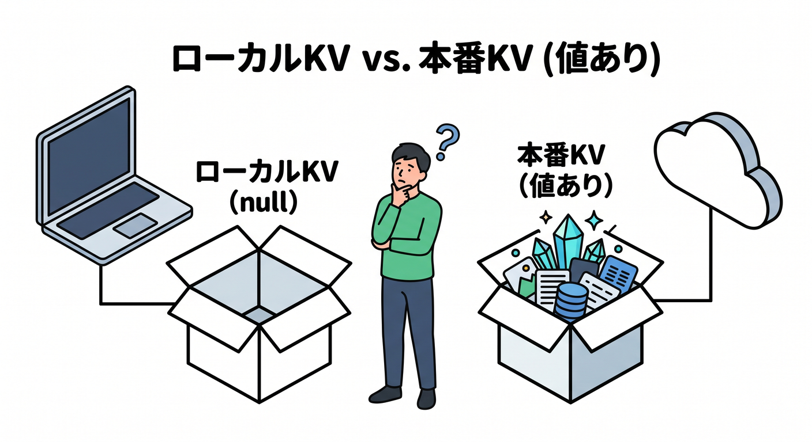
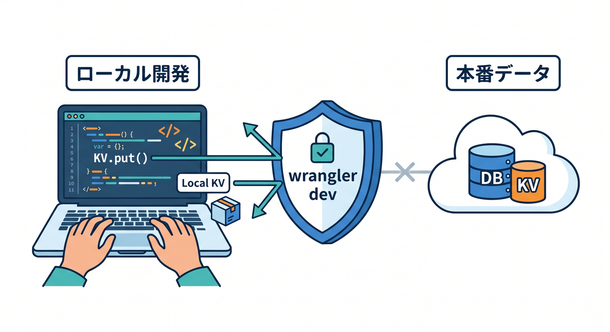
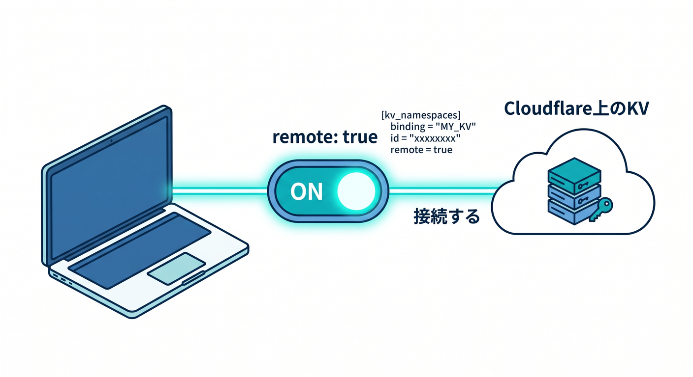
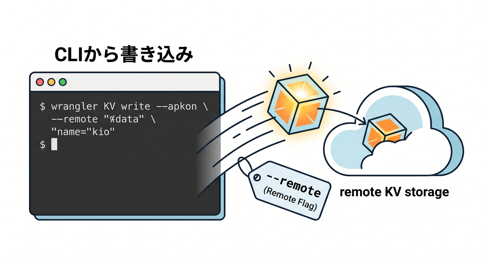
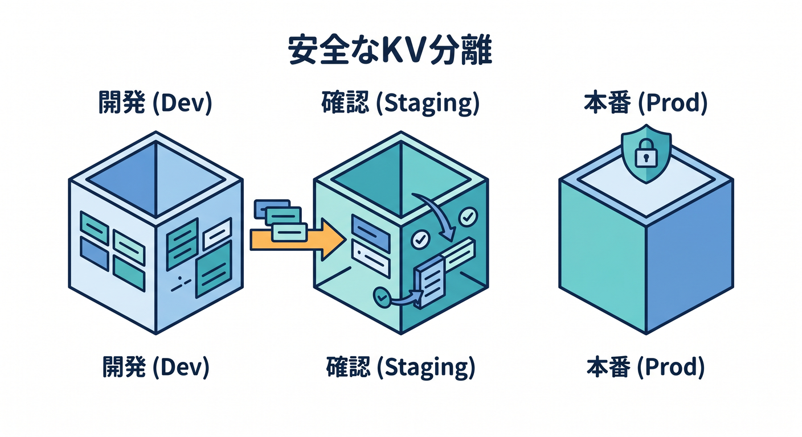
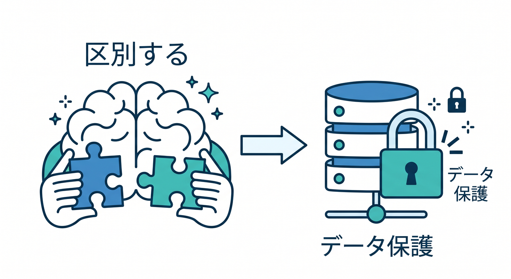

# 第10章：ローカル開発とremote KVの違いを知ろう 🧪☁️

KVを学んでいると、「本番には値があるのにローカルではnullになる」ということがあります。  

これは、Wranglerのローカル開発ではデフォルトでローカル版KVを使うためです。  
この章では、local KVとremote KVを分けて理解します 😊

---

## 1. `wrangler dev` は本番KVを守ってくれる 🛡️

公式ドキュメントでは、`wrangler dev` はデフォルトでローカル版KVを使い、本番データへ干渉しないようになっていると説明されています。


これは安全のためです。  
開発中に間違えて本番データを書き換えたら困ります。

そのため、ローカルでまだ書いていないキーを読むと `null` になることがあります。

---

## 2. remote KVへつなぐ方法 ☁️

Cloudflare上のKV namespaceへ接続したい場合、bindingに `"remote": true` を設定する方法があります。


例です。

```jsonc
{
  "kv_namespaces": [
    {
      "binding": "APP_KV",
      "id": "<BINDING_ID>",
      "remote": true
    }
  ]
}
```

ただし、remoteを使うと実データに触る可能性があります。  
開発中は十分注意しましょう。

---

## 3. Wrangler CLIの `--remote` 🛠️

WranglerでKVへ値を入れるときも、ローカルとremoteの違いがあります。

```powershell
npx wrangler kv key put --binding=APP_KV "hello" "world"
```

remoteへ書く場合は `--remote` を使います。


```powershell
npx wrangler kv key put --binding=APP_KV "hello" "world" --remote
```

どちらへ書いているかを必ず確認しましょう。

---

## 4. dev / staging / productionを分ける 🌱

安全な運用では、環境ごとにKV namespaceを分けます。


```text
APP_KV_DEV
APP_KV_STAGING
APP_KV_PRODUCTION
```

本番データで直接試すのではなく、staging用namespaceで確認します。

特に削除や上書きを試すときは、テスト用のnamespaceを使いましょう。

---

## 5. 章末チェック ✅

- `wrangler dev` はデフォルトでローカルKVを使うと分かる
- remote KVへつなぐには `"remote": true` を使う場合があると分かる
- CLI操作でも `--remote` に注意すると分かる
- dev/staging/productionでnamespaceを分ける発想が分かる
- 本番KVを開発で壊さない意識が持てる

この章で覚える一言はこれです。  
**KVでは、localとremoteを混同しないことがデータを守る第一歩です 🧪☁️**


