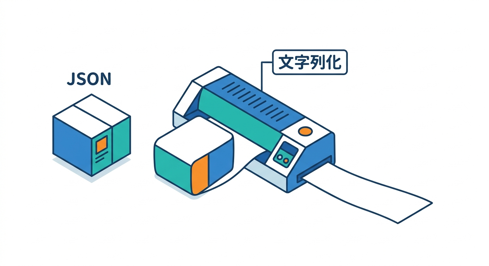
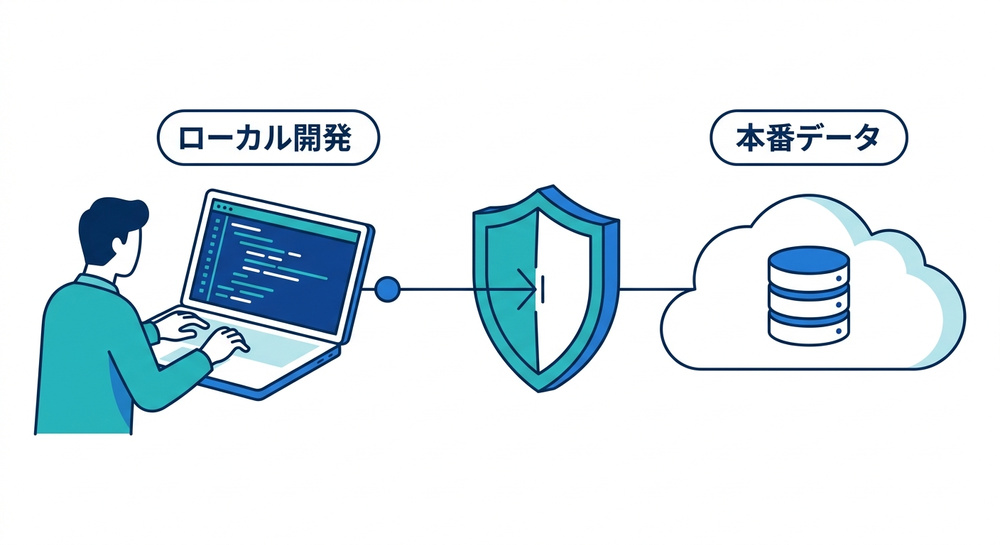
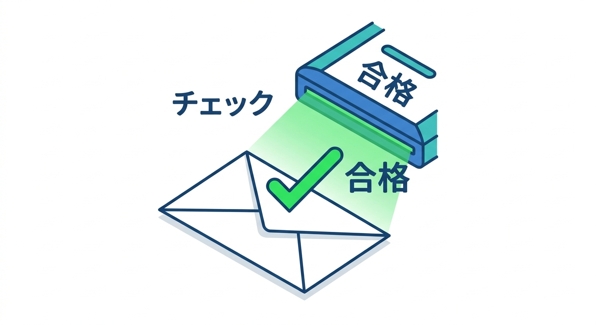
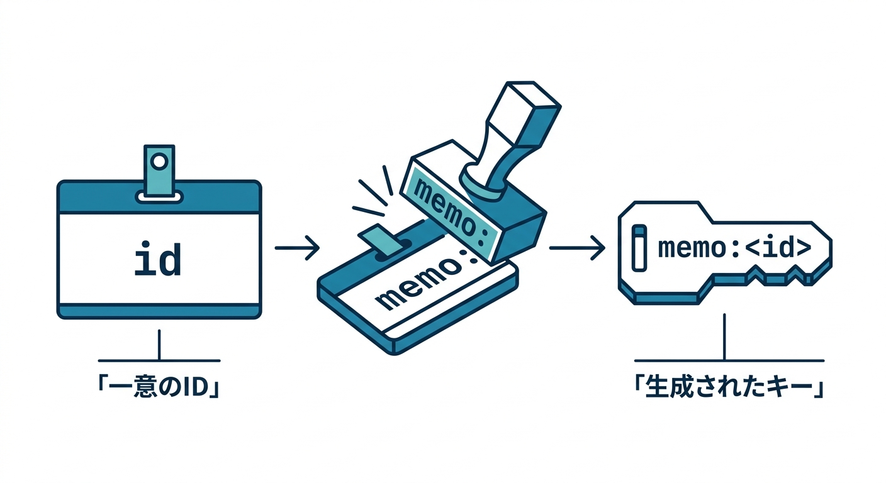
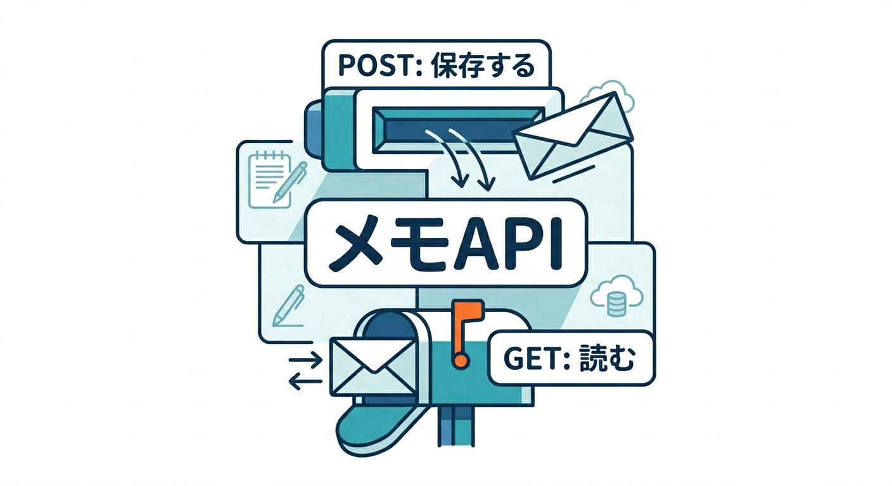
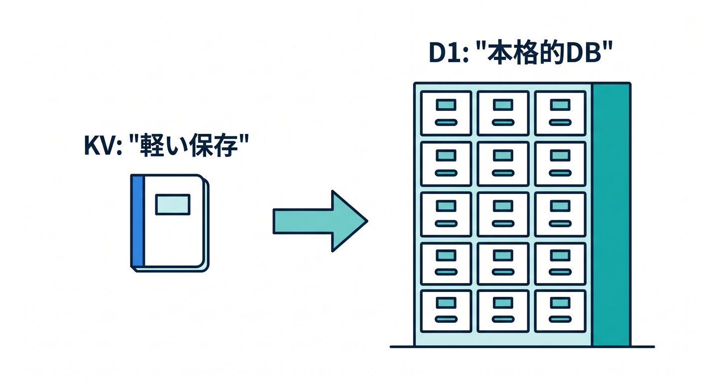
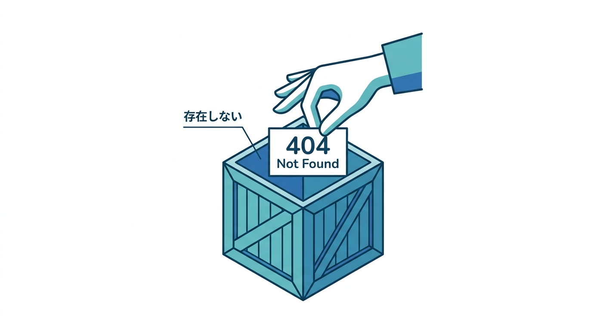

# 第11章：KVを使った簡単メモAPIを作ろう 📝🚀

ここでは、KVを使って小さなメモAPIを設計します。  
目的は、本格的なメモアプリではなく「保存する」「読む」をAPIとして体験することです。  

キー設計、入力チェック、JSON保存をまとめて練習します 😊

---

## 1. APIの形を決める 🧭

シンプルに次の2つを作ります。

```text
POST /memo/:id  メモを保存する
GET  /memo/:id  メモを読む
```

KVのキーは次のようにします。


```text
memo:<id>
```

たとえば `id` が `abc` なら、キーは `memo:abc` です。

---

## 2. 保存するデータ 🧾

保存するJSONの例です。

```json
{
  "title": "今日のメモ",
  "body": "KVを学んだ",
  "updatedAt": "2026-04-24T00:00:00.000Z"
}
```

KVへ入れるときは `JSON.stringify()` します。


---

## 3. 保存APIの考え方 ✍️

保存時には、まず入力チェックをします。

- POSTか
- JSONが読めるか
- titleが空ではないか
- bodyが長すぎないか
- idが変な文字列ではないか

チェックしてからKVへ保存します。


```ts
await env.APP_KV.put(`memo:${id}`, JSON.stringify(memo));
```

---

## 4. 読み取りAPIの考え方 👀

読み取りでは、キーを作って `get()` します。

```ts
const raw = await env.APP_KV.get(`memo:${id}`);

if (raw === null) {
  return new Response("Not found", { status: 404 });
}

return new Response(raw, {
  headers: { "Content-Type": "application/json" },
});
```

存在しないメモは404にします。


---

## 5. いつD1へ移る？🧠

このメモAPIは学習には便利です。  
ただし、次のような機能が欲しくなったらD1を検討します。

- メモ一覧を日付順で出す
- タグ検索をする
- ユーザーごとに絞る
- 件数を集計する
- 複雑な検索をする

KVは軽い保存に向きますが、本格的なメモDBならD1が自然です。


---

## 6. 章末チェック ✅

- `POST /memo/:id` と `GET /memo/:id` を設計できる
- `memo:<id>` のようなキーを作れる
- JSONをKVに保存できる
- 存在しないキーを404にできる
- 検索や一覧が必要ならD1を考えると分かる

この章で覚える一言はこれです。  
**KVメモAPIは、軽い保存の練習にぴったりです 📝**


