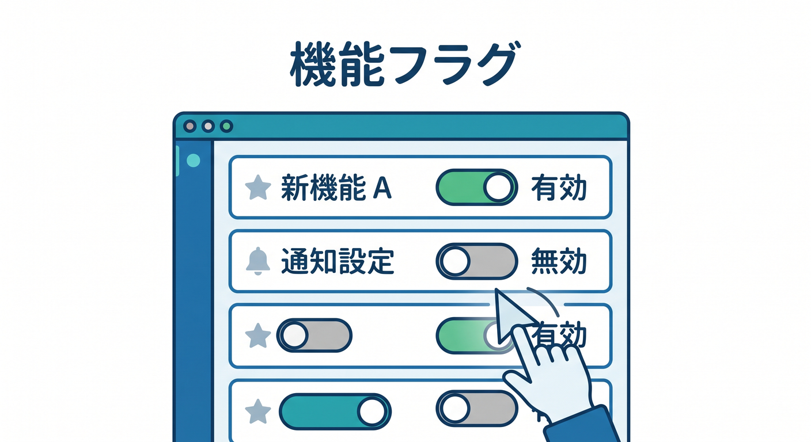
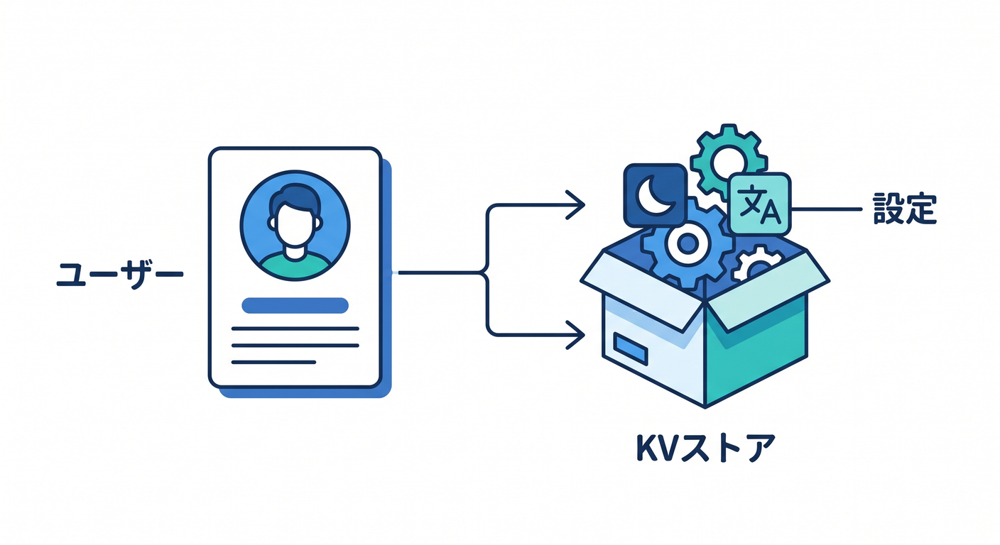
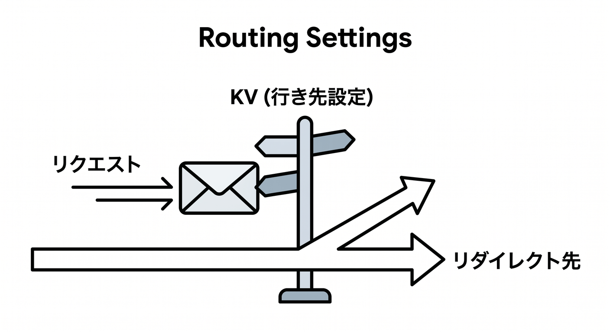
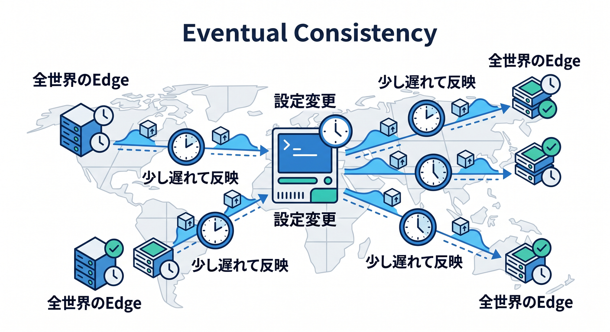
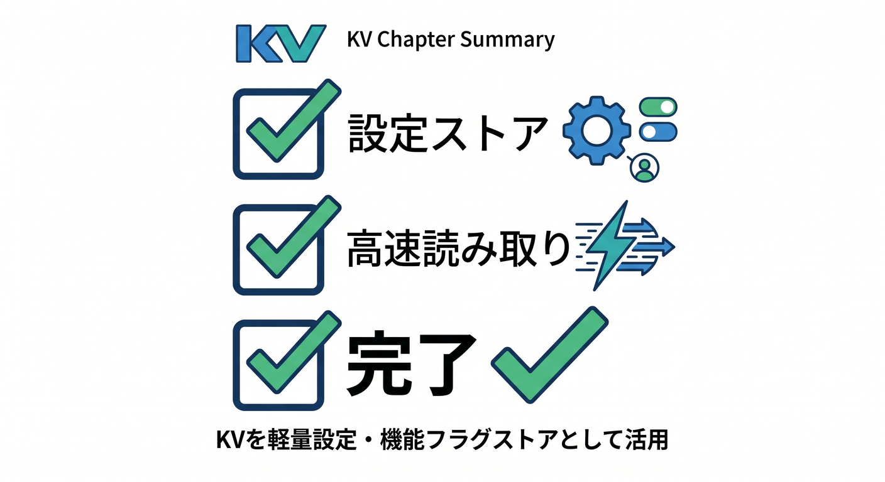

# 第12章：設定ストア・機能フラグとしてKVを使おう 🚩🗝️

KVは、アプリの設定や機能フラグと相性がよいです。  
軽く読みたい値を、キーで素早く取り出せるからです。  
この章では、設定ストアとしてのKVを見ます 😊

---

## 1. 機能フラグとは 🚩



機能フラグは、機能をON/OFFするための設定です。

例です。

```text
feature:new-ui = enabled
feature:ai-summary = disabled
```

コードをデプロイし直さなくても、設定で挙動を変えられる場合があります。

---

## 2. ユーザー設定にも使える 👤



ユーザーごとの軽い設定にもKVは候補になります。

```text
user:123:theme = dark
user:123:language = ja
```

ただし、ユーザー設定が増えて検索や一覧が必要になったらD1も検討します。

---

## 3. ルーティング設定にも使える 🧭



KVは、リクエストの行き先を決める設定にも使えます。

例です。

```text
route:/old-page = /new-page
```

WorkerがKVを読んで、どこへredirectするか決めるような使い方です。

Cloudflare公式のstorage optionsでも、routing metadataのような用途がKVに向く例として案内されています。

---

## 4. 反映遅れに注意 ⚖️



KVはeventually consistentです。  
設定を変えても、全世界ですぐ同じ値が見えるとは限りません。

そのため、緊急停止スイッチのように即時反映が必要な用途では注意します。

少し遅れてもよい設定ならKVは便利です。  
即時性が大事なら別の設計も検討します。

---

## 5. 章末チェック ✅



- 機能フラグの考え方が分かる
- ユーザー設定をKVに置く例が分かる
- ルーティング設定にも使えると分かる
- KVの反映遅れに注意できる
- 設定ストアとしてKVを使う判断ができる

この章で覚える一言はこれです。  
**KVは、軽く読める設定や機能フラグの置き場として便利です 🚩**

