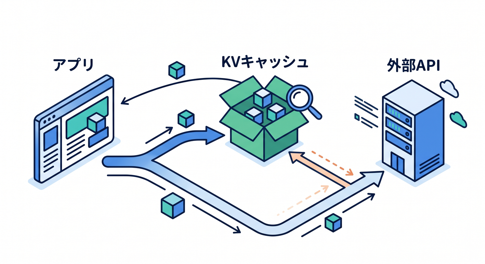
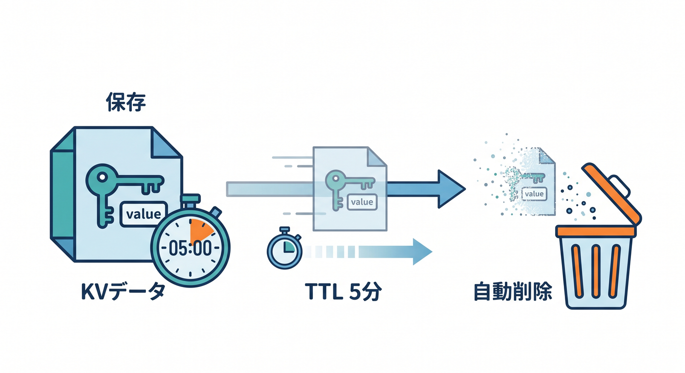
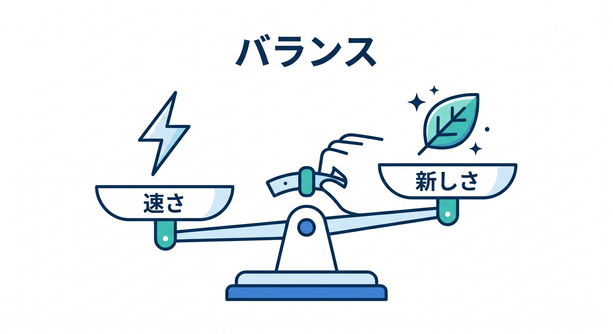
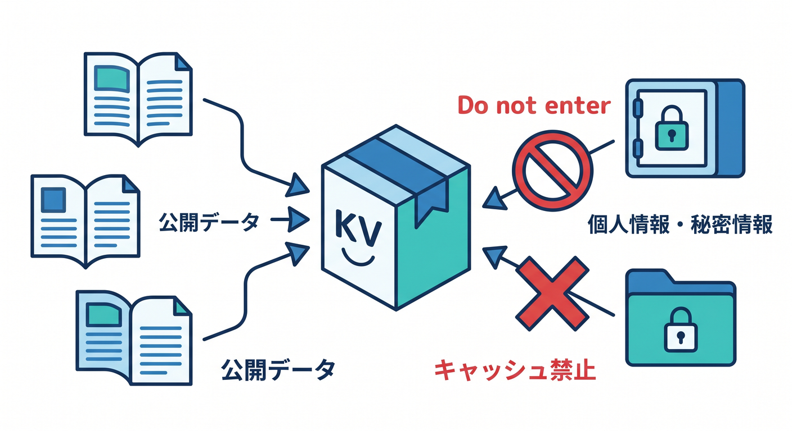
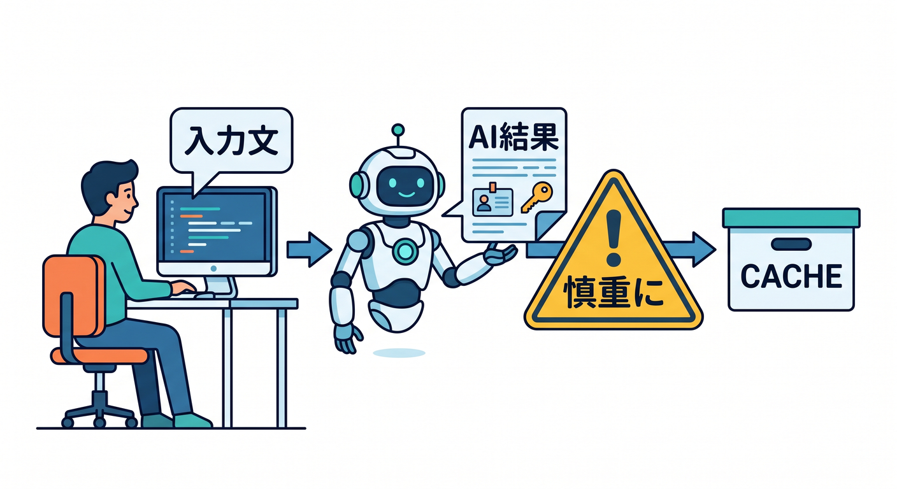

# 第13章：キャッシュ用途のKVを考えよう 📦⚡

KVは、軽いキャッシュ用途にも使えます。  
たとえば外部APIの結果を短時間保存し、同じ問い合わせに速く返す使い方です。  
ただし、Cloudflare CDN CacheやWorkers Cache APIとは別物として考えます 😊

---

## 1. KVキャッシュの例 🌦️



外部APIから天気情報を取得するアプリを考えます。

```text
cache:weather:tokyo = JSON文字列
```

最初のリクエストでは外部APIへ取りに行き、KVへ保存します。  
次のリクエストではKVから返します。

これにより、外部API呼び出しを減らせます。

---

## 2. TTLと組み合わせる ⏱️



キャッシュ用途では、期限つき保存が便利です。

```ts
await env.APP_KV.put("cache:weather:tokyo", JSON.stringify(data), {
  expirationTtl: 300,
});
```

5分だけ保存し、期限が切れたら再取得するようにします。

古すぎる情報を返さないために、TTLを考えることが大事です。

---

## 3. `cacheTtl` の考え方 ☁️



KVの読み取りでは、`cacheTtl` を指定できます。  
公式ドキュメントでは、パフォーマンス改善のために `cacheTtl` をデフォルトの60秒から上げる考え方が案内されています。

ただし、長くすると更新反映が遅く見えることがあります。

速さと新しさのバランスを考えましょう。

---

## 4. 個人情報はキャッシュしない 🔐



KVキャッシュに向かないものです。

- ユーザーごとの個人情報
- ログイン後のAPIレスポンス
- 支払い情報
- 秘密情報
- Turnstile token

共有される可能性があるキャッシュには、誰が見てもよいデータだけを入れます。

---

## 5. AI API結果は慎重に 🤖



AI要約APIの結果をKVに入れたくなることがあります。  
しかし、入力文に個人的な内容が含まれることがあります。

また、入力ごとに結果が変わるため、キー設計も難しくなります。  
AI API結果をキャッシュする場合は、プライバシーとTTLを慎重に考えます。

最初の学習では、AI API結果を安易に共有KVキャッシュしない方が安全です。

---

## 6. 章末チェック ✅

- KVを短時間キャッシュに使えると分かる
- `expirationTtl` と組み合わせられる
- `cacheTtl` の存在を知っている
- 個人情報をキャッシュしないと分かる
- AI API結果のキャッシュに注意できる

この章で覚える一言はこれです。  
**KVキャッシュは便利。でも“誰に返してよいデータか”を先に考えよう 📦🔐**

