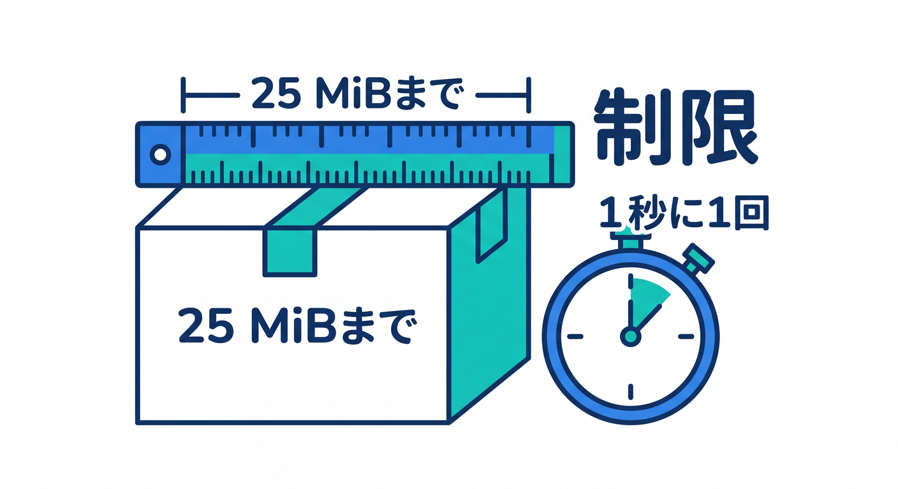
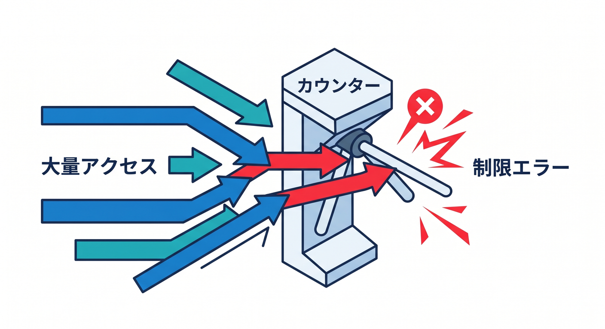
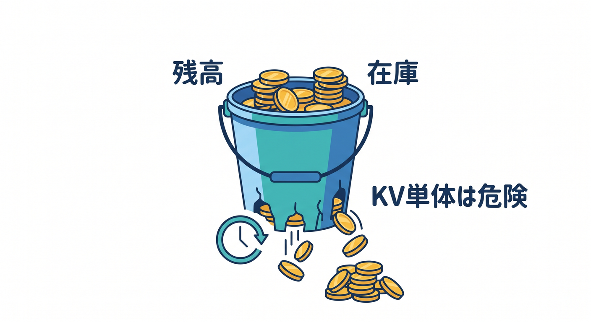
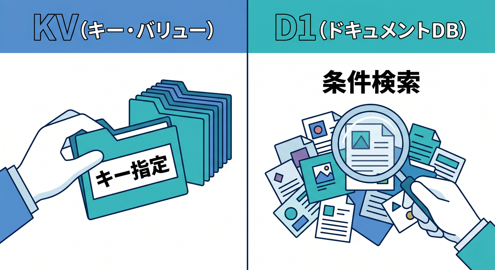
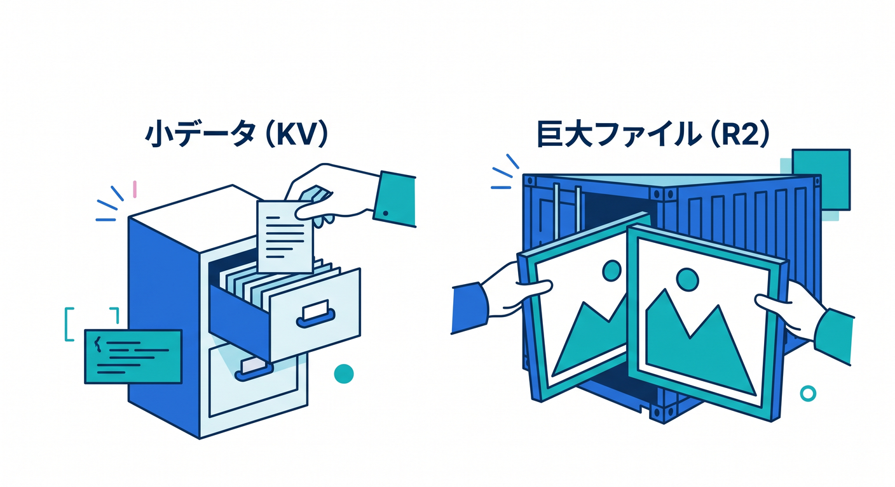
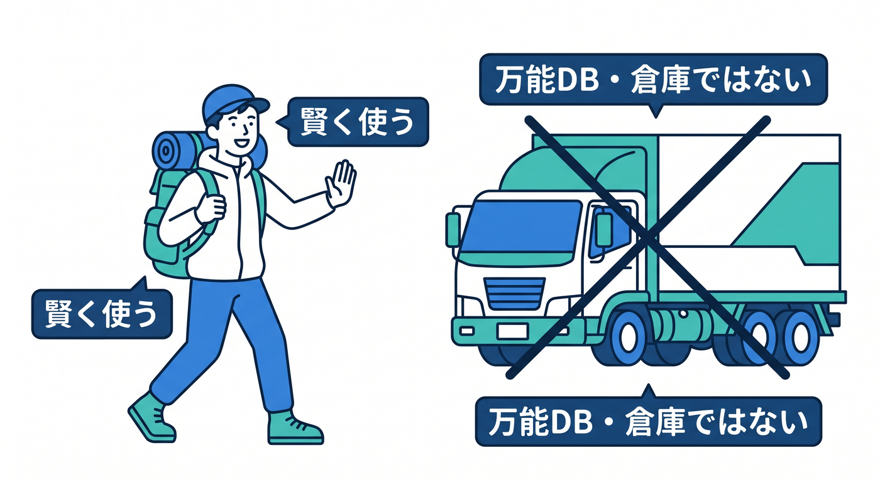

# 第14章：KVの制限とアンチパターンを知ろう ⚠️🚧

KVは便利ですが、制限があります。  
制限を知らずに使うと、あとで設計を変えることになります。  
この章では、KVでやらない方がよいことを先に知っておきます 😊

---

## 1. 代表的な制限 📏

2026年時点の公式Limitsでは、次のような制限が案内されています。

- key size: 512 bytes
- value size: 25 MiB
- key metadata: 1024 bytes
- 同じキーへの書き込み: 1秒1回
- 1 Worker invocationあたり外部サービス操作: 1000回

正確な数字は今後変わる可能性があるため、実装前には公式Limitsを確認します。



---

## 2. カウンターには注意 🔢

アクセス数のようなカウンターを、同じKVキーで毎回更新する設計は向きません。

```text
counter:page = 123
```

アクセスごとにこのキーを書き換えると、同じキーへの書き込み制限や整合性の問題にぶつかります。



カウンター用途では、Durable Objects、Analytics Engine、D1など別の選択肢を検討します。

---

## 3. 在庫・残高には向かない 💰

在庫数や残高のように、正確さが強く必要なデータをKVだけで扱うのは危険です。

理由です。

- eventual consistency
- 同時更新の難しさ
- 同じキーへの書き込み制限

こうしたデータには、より強い整合性を持つ設計が必要です。



---

## 4. 検索DBとして使いすぎない 🔎

KVは、キーで読むのが得意です。  



タグ検索、全文検索、日付順一覧、集計などには向きません。

メモ一覧やユーザー管理を本格的に作るならD1を検討します。

```text
キーが分かっている → KV
条件で探したい → D1
```

この切り分けが大事です。

---

## 5. 大きなファイルはR2へ 🪣

KVのvalue sizeは25 MiBです。  
小さなJSONや文字列ならよいですが、画像やPDFの本体をKVに入れるのは自然ではありません。



ファイル本体はR2、ファイル情報はD1やKVへ置く形を考えます。

---

## 6. 章末チェック ✅

- KVの主な制限を把握している
- 同じキーへの高頻度書き込みに注意できる
- カウンターや在庫にKVだけを使わないと分かる
- 検索DBとして使いすぎないと分かる
- 大きなファイルはR2を検討すると分かる

この章で覚える一言はこれです。  
**KVは軽い記憶。万能DBや巨大ファイル倉庫として使いすぎないようにしよう ⚠️**


