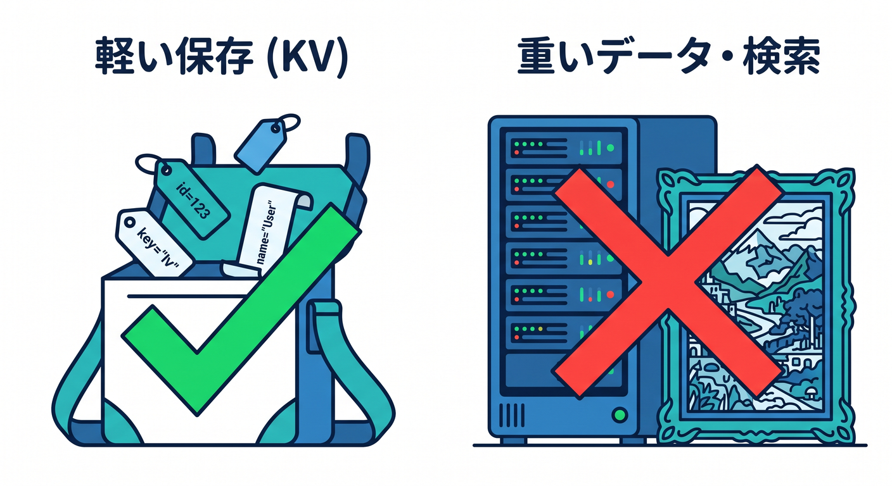
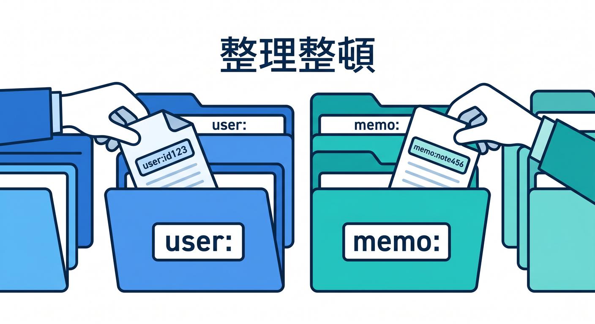
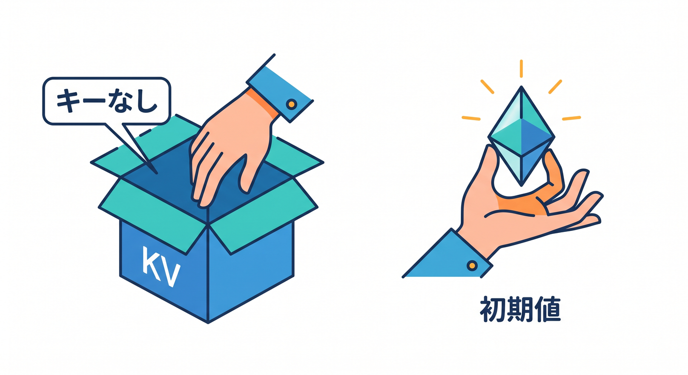
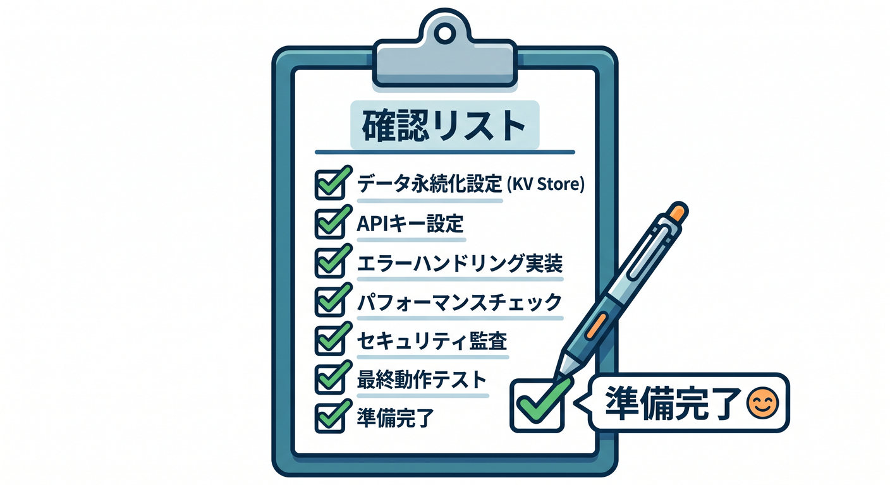
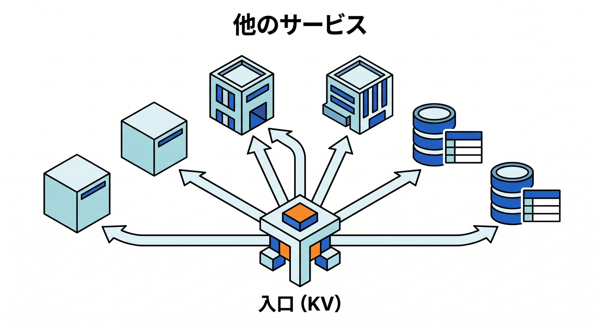

# 第15章：総仕上げ：KVつきミニアプリを作ろう 🏁🗝️

最後は、React + Workers + KVの小さなアプリを設計します。  
題材は、ユーザー設定と短いメモを保存するミニアプリです。  

ここまで学んだKVの基本をまとめて使います 🎉

---

## 1. 作るもの 📝

アプリの機能です。

- 表示テーマを保存する
- 短いメモを保存する
- 保存したメモを読む
- 期限つきのお知らせを保存する

保存先はKVです。  
本格的な検索や画像保存は扱わず、KVの得意な軽い保存に絞ります。


---

## 2. キー設計 🏷️

キーは次のようにします。

```text
user:<userId>:theme
memo:<memoId>
notice:temporary
feature:new-ui
```

prefixをそろえることで、あとで一覧や管理がしやすくなります。


個人情報そのものはキーに入れません。

---

## 3. API設計 🚪

Worker APIの例です。

```text
GET  /settings/theme
POST /settings/theme
GET  /memo/:id
POST /memo/:id
```

POSTではJSONを読み、文字数制限を入れます。  
GETでは存在しないキーを `null` として扱い、必要なら404や初期値を返します。


---

## 4. bindingとEnv型 🧾

`wrangler.jsonc` の例です。

```jsonc
{
  "kv_namespaces": [
    {
      "binding": "APP_KV",
      "id": "<BINDING_ID>"
    }
  ]
}
```

TypeScriptの例です。

```ts
export interface Env {
  APP_KV: KVNamespace;
}
```

---

## 5. 確認ポイント ✅

公開前に確認します。

- local KVとremote KVを混同していない
- `put()` と `get()` が動く
- 存在しないキーを扱える
- JSON保存とparseができる
- 文字数制限がある
- SecretをKVに雑に保存していない
- 大量検索をKVだけでやろうとしていない
- 本番データを開発中に壊さない


---

## 6. 次の広げ方 🗺️

KVミニアプリに慣れたら、次のように広げられます。

- メモ一覧や検索が必要 → D1
- 画像添付が必要 → R2
- リアルタイム共同編集 → Durable Objects
- 重いAI処理 → Queues
- 既存DBへ接続 → Hyperdrive

KVは入口として分かりやすいですが、必要に応じて他の保存先と組み合わせます。


---

## 7. 章末チェック ✅

- KVつきミニアプリの構成を説明できる
- キー設計を理由つきで考えられる
- Worker APIからKVを使える
- local/remoteの違いを確認できる
- KVからD1/R2/DO/Queuesへ広げる判断ができる

この章で覚える一言はこれです。  
**KVで軽い記憶を持たせられると、Cloudflareアプリが一段アプリらしくなります 🏁🗝️**

