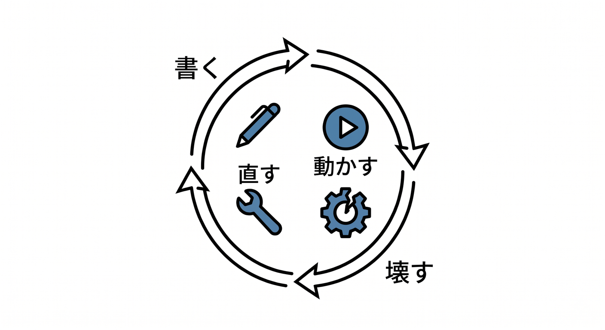
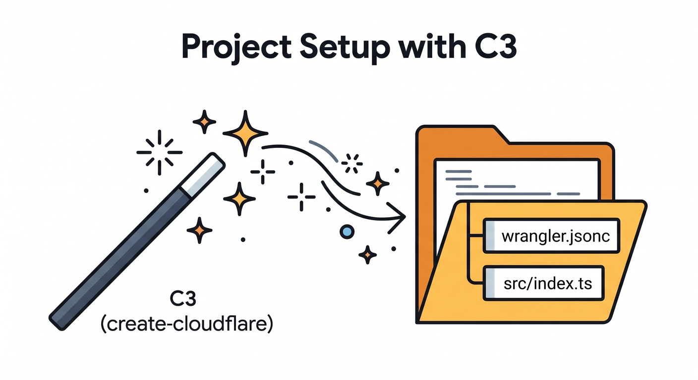
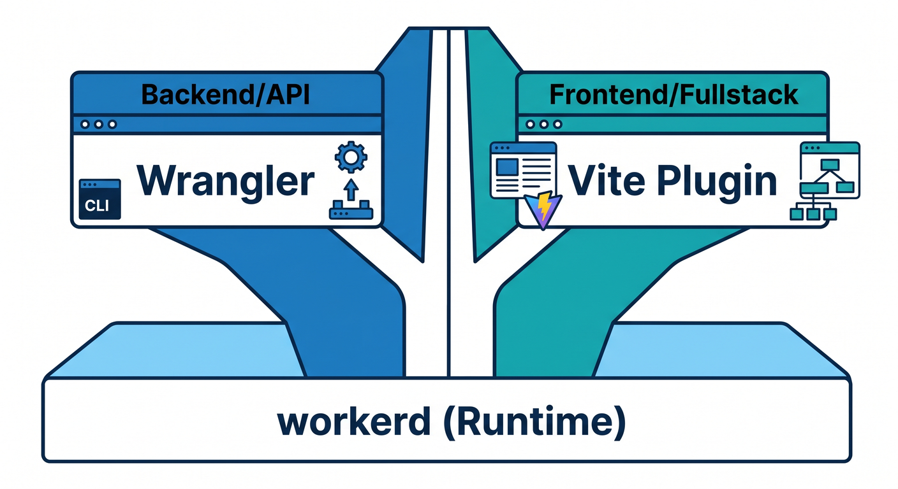
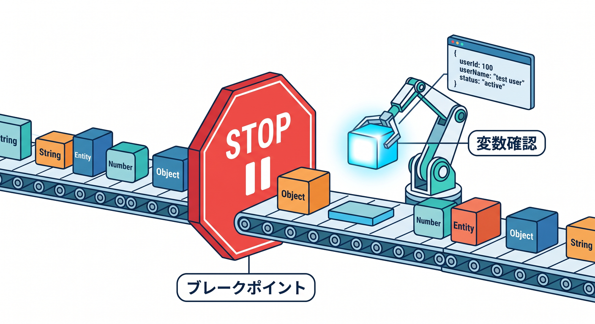
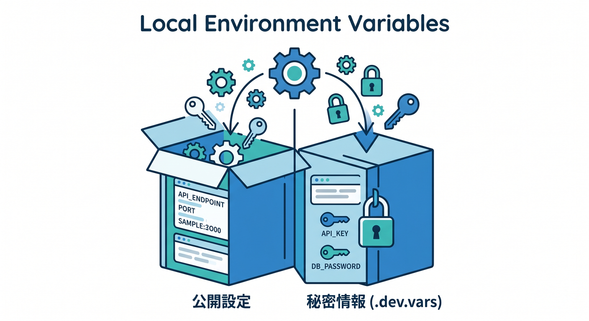
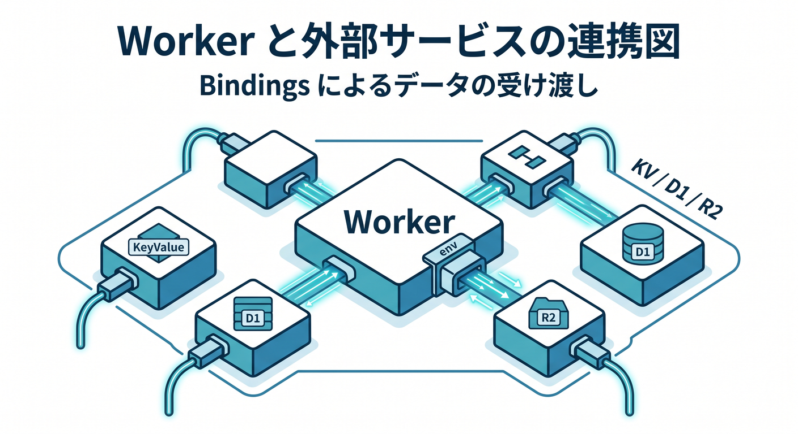

# ローカル実行・デバッグ・テストを中心にした15章構成 ☁️🔎🛠️✨

## 第1章　ローカル開発って何のためにやるの？🌱💻
この章では、いきなり本番へ出さずに、まず手元で確かめる意味をつかみます。
Cloudflare の開発は「書く → 動かす → 壊す → 直す」の小さな繰り返しがすごく大事です。

最初は「ローカル確認って面倒そう…」と感じても大丈夫です。
むしろ、ここを先に覚えると本番公開がずっと怖くなくなります。
Cloudflare のローカル実行は、ただの見た目確認ではなく、実行環境にかなり近い形で試せるのが強みです。
「今どこで動いているのか」「どこまで本番に近いのか」をやさしく整理します。
この章のゴールは、ローカル実行を“余計な作業”ではなく“安心のための習慣”として見られることです。
最初の土台として、ここで気持ちを落ち着けてから先へ進みます 🌸 ([Cloudflare Docs][1])

## 第2章　最初の検証用プロジェクトを作ろう 📦🚀
ここでは、ローカル実行とテストを学ぶための小さな Workers プロジェクトを作ります。
C3 で土台を作ると、今の Cloudflare の標準導線にかなり素直に乗れます。

生成されたファイルは全部理解しなくて大丈夫ですが、役割だけはざっくり見ます。
特に `wrangler.jsonc` は、この先ずっと触る大事なファイルです。
「どのファイルにコードを書くのか」「どのファイルが設定なのか」を区別できるだけで十分です。
この章では、まず“練習場を用意した”という感覚を持てればOKです。
難しいことより先に、Cloudflare用の土台がきちんとできたことを確認します。
ここから先は、この小さなプロジェクトを少しずつ育てていきます 🌼 ([Cloudflare Docs][2])

## 第3章　`wrangler dev` と Vite の役割をつかもう ⚡🧭
この章では、Cloudflare のローカル起動でよく出てくる 2つの入口を整理します。
ひとつは `wrangler dev`、もうひとつは Cloudflare Vite plugin を使う流れです。
最初は「どっちを使えばいいの？」と迷いやすいですが、ここでやさしく交通整理します。
Workers単体の検証なら Wrangler がわかりやすく、フロントと一緒に開発するなら Vite 側の流れが自然です。

Cloudflare はどちらでも **workerd** に近い形で動かせるように整えています。
つまり、見た目だけでなく、かなり本番に寄せた確認がしやすいわけです。
この章では、ツールの違いを覚えるというより、「使い分けの雰囲気」をつかみます。
ここがわかると、あとで React や軽い Next.js 紹介へ進んでも混乱しにくいです 🚦 ([Cloudflare Docs][3])

## 第4章　エラーの見方に慣れよう 😵‍💫➡️🙂
この章では、「赤い文字がいっぱい出た…」で止まらないための練習をします。
エラーには、起動前のエラー、型エラー、実行時エラー、本番で出るエラーなど、いくつか種類があります。
全部を一度に理解する必要はなく、まずは「今どの種類の失敗か」を分けられれば十分です。
Cloudflare Workers では、本番でレスポンスを返せないとエラーページになることもあります。
その前にローカルで気づけるなら、それがいちばん平和です。
この章では、ログの先頭を見る癖、重要そうな行から読む癖もいっしょに作ります。
エラーは敵というより、「何がダメかを教えてくれる手紙」みたいなものだと感じてもらいます。

この感覚がつくと、開発がかなり怖くなくなります 📨 ([Cloudflare Docs][4])

## 第5章　VS Code でブレークポイントデバッグしてみよう 🪲🎯
ここでは、ログだけでなく「止めて見る」デバッグへ進みます。
VS Code には Workers のデバッグと相性のよい方法が用意されています。
今の Cloudflare は、VS Code の JavaScript Debug Terminal から `wrangler dev` や `vite dev` を起動すると、かなり自然にデバッグしやすいです。
ブレークポイントを置くと、「この行まで本当に来ているのか」が目で追えます。

変数の中身をその場で見られるので、初心者ほど恩恵が大きいです。
さらに launch.json を使った接続方法もあり、少し本格的な形にも進めます。
この章では、難しい設定を詰め込むより、「止めて確認できるとこんなに楽なんだ」を体験します。
“なんとなく修正”から卒業する、大事な一歩です 🔍 ([Cloudflare Docs][5])

## 第6章　環境変数とローカル secrets を扱おう 🔐🌿
この章では、設定値や秘密情報をどう手元で扱うかを学びます。
APIキーをコードへ直書きしない、という基本をここで自然に身につけます。
Cloudflare のローカル開発では `.dev.vars` や `.env` を使う流れがあります。

どれがローカル用なのか、どれが本番用なのか、ここで混ざらないように整理します。
Wrangler にはローカル開発時の `.env` の読み方を調整する仕組みもあります。
「設定が足りないのか」「秘密情報が読めていないのか」を切り分けるだけで、詰まり方がかなり減ります。
この章は、セキュリティの章というより、“安心して検証する章”です。
あとで AI や外部APIにつなぐときにも、ここが効いてきます 🌱 ([Cloudflare Docs][6])

## 第7章　bindings と `env` の感覚をつかもう 🔗☁️
ここでは Cloudflare らしい大事な考え方、**bindings** をやさしく学びます。
Workers は、いろいろな Cloudflare サービスへ `env` 経由でつながります。
KV、D1、R2、Workers AI なども、この binding の考え方でつながっていきます。

Cloudflare のローカル開発では、bindings はまずローカルにシミュレートされるのが基本です。
そして必要なら、binding ごとに remote resource へ切り替えることもできます。
この“ローカルが基本、必要なら一部だけ本物”という感覚がとても大事です。
この章では、いきなり全部のサービスを覚えず、「つなぎ口があるんだな」と思えれば十分です。
ここを越えると、Cloudflare の設計がかなり見えてきます 🗺️ ([Cloudflare Docs][7])

## 第8章　外部APIとのつなぎ方をローカルで練習しよう 🌍📡
この章では、Worker から外のAPIへアクセスする練習をします。
Cloudflare Workers では、外部APIとの通信は基本的に `fetch()` で行います。
でも、最初から本番の外部サービスに依存しすぎると、デバッグが難しくなりがちです。
そこでこの章では、「まず簡単なAPIにつなぐ」「あとで差し替えやすい形にする」考え方を学びます。
レスポンスが遅い、失敗する、形式が違う、という“現実のズレ”もここで少し体験します。
そうすると、ローカル開発がただの見た目確認ではないことがよくわかります。
この章は API の深掘りより、“ローカルでの確かめ方”を覚える章です。
外とつながると、テストの意味もぐっと見えてきます 🌐 ([Cloudflare Docs][8])

## 第9章　Cloudflare流のテスト入門を始めよう ✅🧪
ここでは、いよいよテストへ入ります。
Cloudflare は Workers のテスト方法をいくつか用意していますが、今は **Vitest integration** がかなり中心です。
この仕組みでは、Workers runtime の中でテストを動かせます。
つまり「ただのNode上での仮のテスト」より、Cloudflareっぽい確認に近づけます。
最初は unit test と integration test の細かい違いを気にしすぎなくて大丈夫です。
まずは「入力したらこう返るはず」を少しずつ書けるようになればOKです。
テストは堅苦しい儀式ではなく、「毎回の安心を増やすメモ」くらいに考えると楽です。
この章で、ローカル確認が一段レベルアップします 📘 ([Cloudflare Docs][9])

## 第10章　テストをデバッグできるようになろう 🧠🛠️
この章では、「テストを書いたけど、そのテスト自体が壊れている」場面にも対応できるようにします。
Cloudflare の Vitest integration には、テストのデバッグ方法も用意されています。
inspect モードで起動して、ポートにアタッチして中を見る流れを体験します。
ここまで来ると、ふつうのアプリ開発とかなり近い安心感が出てきます。
特に初心者は、アプリ本体とテストのどちらが悪いのか混ざりやすいです。
だからこそ、テストを止めて確認できることがすごく大事です。
この章では“テストもコードなんだ”という感覚を自然に持ってもらいます。
ローカル開発の基礎体力が、かなりしっかりしてきます 💪 ([Cloudflare Docs][10])

## 第11章　Observability と Logs で「見る力」を育てよう 📈👀
ここでは、ローカル確認だけで終わらず、「動いているものを観測する力」を育てます。
Cloudflare Workers には observability と logs の仕組みが用意されています。
ログは単に文字を眺めるものではなく、動きや失敗を追うための地図です。
最近は CPU time や Wall time なども見やすくなっていて、処理の重さを感じ取りやすくなっています。
初心者のうちは、まず「いつ呼ばれたか」「何を返したか」「どこで止まったか」だけ追えれば十分です。
ここで“見ながら直す”習慣がつくと、本番公開後もかなり強いです。
この章は、派手ではないけれど後半でじわっと効く章です。
開発者としての安心感を作る、とても大事なパートです 🔭 ([Cloudflare Docs][11])

## 第12章　GitHub Copilot と MCP をデバッグの相棒にしよう 🤖💬
この章では、AIを「答えを丸投げする相手」ではなく、「状況整理の相棒」として使います。
GitHub Copilot は VS Code 上で Chat、agent mode、MCP 連携を使える流れが整っています。
たとえばエラーメッセージの要約、設定ファイルの説明、テスト失敗の整理などにかなり向いています。
MCP を使うと、Copilot から外部のツールや情報源へつながる考え方も見えてきます。
Cloudflare 自身も managed remote MCP servers を提供し始めています。
つまり、Cloudflare開発と AI エージェントの距離がかなり近くなってきています。
この章では「AIに直してもらう」より先に、「AIに説明させる」「候補を比べさせる」を重視します。
そのほうが、学習教材としてずっと強いです 🪄 ([GitHub Docs][12])

## 第13章　Workers AI と AI Gateway で“テストを助けるAI”も触ろう 🤖☁️
この章では、Cloudflare のAIサービスをデバッグや検証の流れへ自然に混ぜます。
Workers AI は binding 経由で Worker から呼び出せます。
AI Gateway を間に入れると、AIリクエストのログ、分析、キャッシュ、制御をまとめやすくなります。
学習としては、AIそのものを深掘りするより、「ローカル検証の延長でAIも試せるんだ」と感じられれば十分です。
たとえばテスト用の文章を作らせる、分類結果を比べる、失敗時の挙動を見る、といった題材と相性がよいです。
CloudflareのAI機能は、別世界の話ではなく Workers の延長として扱えるのが面白いところです。
この章で、Cloudflareがただの実行基盤ではないことが見えてきます。
“ローカル実行の学習”が、今どきのAI開発へつながる章です ✨ ([Cloudflare Docs][13])

## 第14章　Browser Rendering と軽いフロント連携を試そう 🌐🖼️
ここでは少しだけ視野を広げて、ブラウザ操作や画面側の確認へ進みます。
Cloudflare Browser Rendering は、Cloudflare上で headless Chrome を動かせる仕組みです。
しかも最近は CDP でも MCP client 経由でも扱いやすくなっていて、ローカルマシンからつなぐ導線もあります。
これを使うと、画面の確認や軽い自動化を Cloudflare の文脈で体験しやすいです。
React との軽い連携や、Next.js の紹介もこの章でふわっと触れるとちょうどよいです。
Next.js は今かなり進化していますが、この教材では主役にしすぎません。
あくまで中心は「Cloudflare のローカル実行・デバッグ・テスト」です。
そのうえで、少しだけ“今っぽい広がり”を見せる章にします 🌈 ([Cloudflare Docs][14])

## 第15章　ミニ作品で総仕上げしよう 🏁🎉
最後は、ここまで学んだローカル実行・デバッグ・テストの流れを、小さな作品にまとめます。
たとえば「入力を受けて返す Worker」「設定を読み分ける」「ログを見る」「テストを書く」くらいでも立派な作品です。
余力があれば Workers AI や AI Gateway を1本だけ足してもよいです。
大切なのは、機能を盛ることより、「確認しながら安心して作れること」です。
Cloudflare の学習は、最初の1本を作ったあとに差がつきます。
ここまで来ていれば、ただ動かすだけでなく、ちゃんと確かめながら育てられる状態になっています。
この章では、公開前チェックリストも軽く作って、学習を“使える力”に変えます。
読了後に「自分でも続けられそう」と思える着地を目指します 🌟 ([Cloudflare Docs][1])

## この15章のねらい 🎯
この構成は、**Cloudflare を初めて触る人が、いきなり本番や複雑な構成へ行かず、まず「手元で安全に試せる力」を身につける**ための流れです。
しかも今の公式導線に合わせて、**Wrangler / Vite / `wrangler.jsonc` / bindings / Vitest / VS Code デバッグ / Copilot / MCP / Workers AI / AI Gateway** を自然に混ぜています。だから「昔の Cloudflare 教材」ではなく、**2026年の Cloudflare 開発らしい学び方**になっています。 ([Cloudflare Docs][1])

次はこの15章をもとに、**各章ごとの「学習目標・演習課題・成果物・想定学習時間」つきの教材設計版**へ落とし込むと、かなり実用的になります。

[1]: https://developers.cloudflare.com/workers/development-testing/?utm_source=chatgpt.com "Development & testing - Workers"
[2]: https://developers.cloudflare.com/workers/vite-plugin/get-started/?utm_source=chatgpt.com "Get started · Cloudflare Workers docs"
[3]: https://developers.cloudflare.com/workers/vite-plugin/?utm_source=chatgpt.com "Vite plugin · Cloudflare Workers docs"
[4]: https://developers.cloudflare.com/workers/observability/errors/?utm_source=chatgpt.com "Errors and exceptions - Workers"
[5]: https://developers.cloudflare.com/workers/observability/dev-tools/breakpoints/?utm_source=chatgpt.com "Breakpoints - Workers"
[6]: https://developers.cloudflare.com/workers/development-testing/environment-variables/?utm_source=chatgpt.com "Environment variables and secrets - Workers"
[7]: https://developers.cloudflare.com/workers/development-testing/bindings-per-env/?utm_source=chatgpt.com "Supported bindings per development mode"
[8]: https://developers.cloudflare.com/workers/configuration/integrations/apis/?utm_source=chatgpt.com "APIs - Workers"
[9]: https://developers.cloudflare.com/workers/testing/?utm_source=chatgpt.com "Testing - Workers"
[10]: https://developers.cloudflare.com/workers/testing/vitest-integration/debugging/?utm_source=chatgpt.com "Debugging - Workers"
[11]: https://developers.cloudflare.com/workers/observability/?utm_source=chatgpt.com "Observability - Workers"
[12]: https://docs.github.com/en/copilot/tutorials/enhance-agent-mode-with-mcp?utm_source=chatgpt.com "Enhancing GitHub Copilot agent mode with MCP"
[13]: https://developers.cloudflare.com/workers-ai/configuration/bindings/?utm_source=chatgpt.com "Workers Bindings · Cloudflare Workers AI docs"
[14]: https://developers.cloudflare.com/browser-rendering/?utm_source=chatgpt.com "Browser Rendering"
