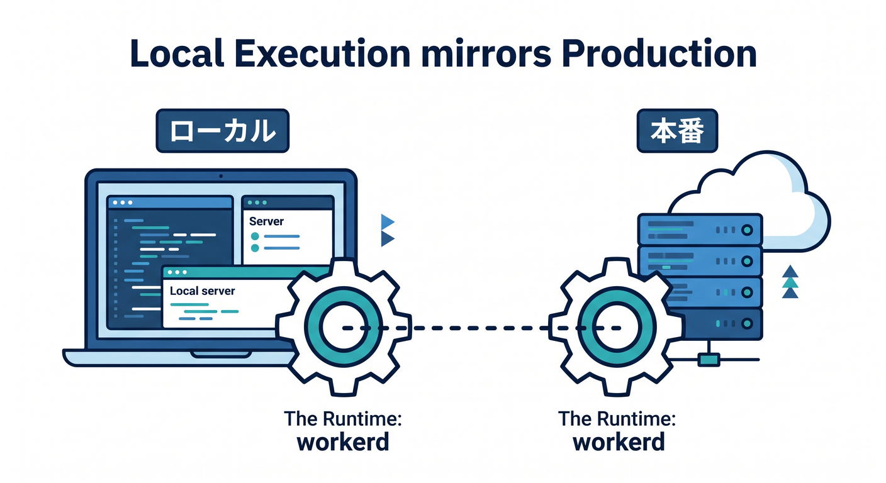
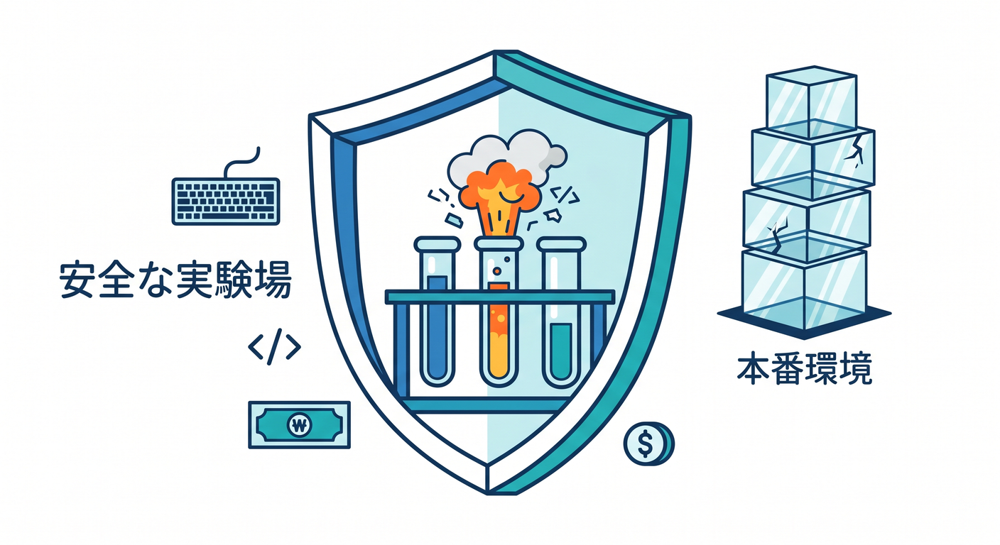
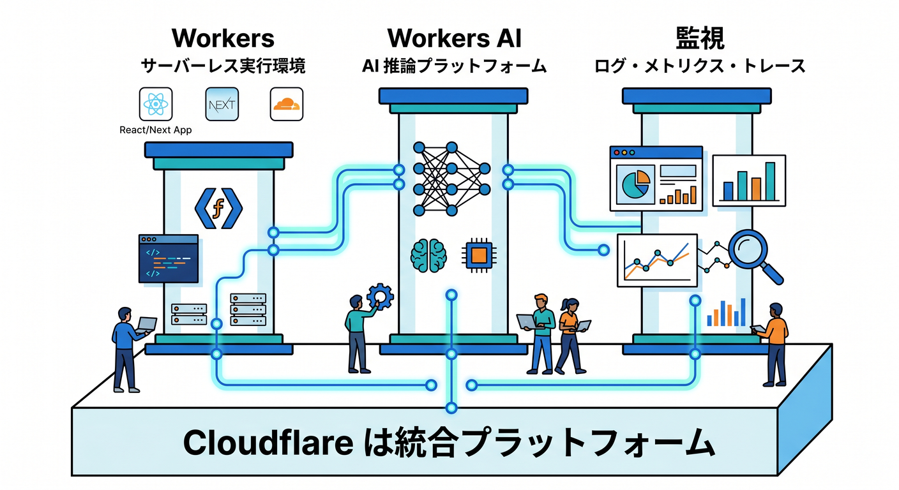
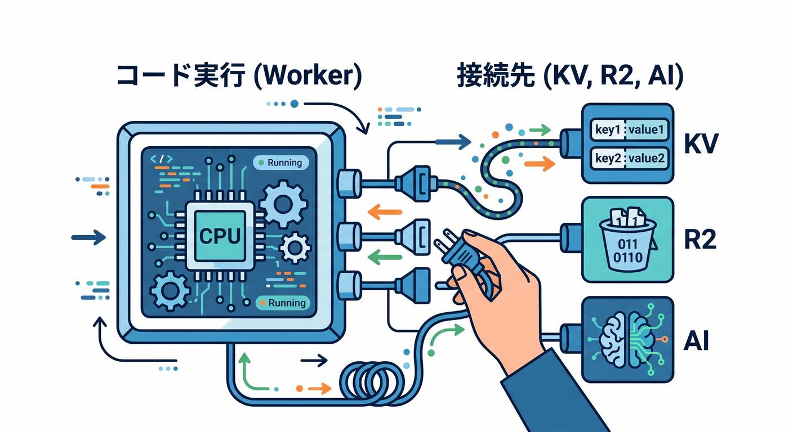
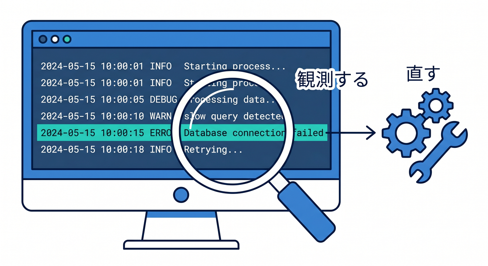
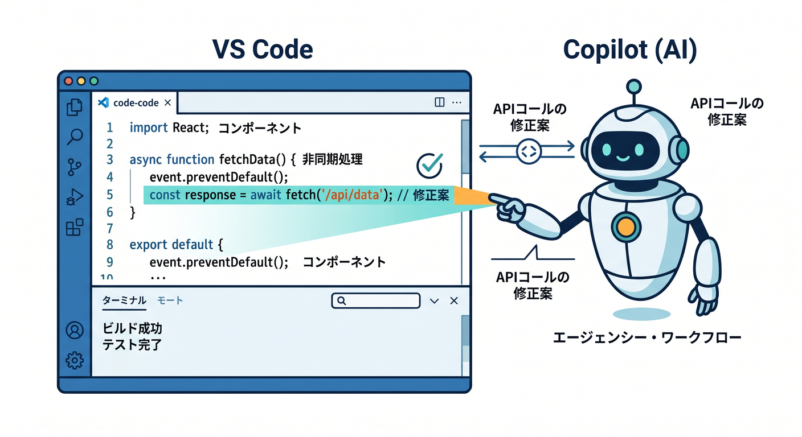
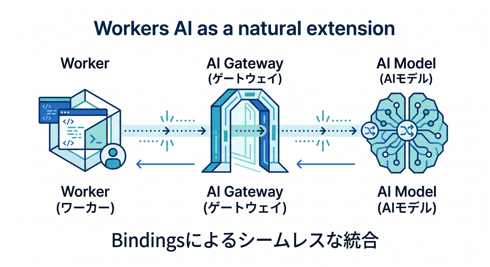

# 第1章　ローカル開発って何のためにやるの？🌱💻☁️
まず最初に、この章のいちばん大事な結論からいきます 😊
**ローカル開発は「本番前の面倒な儀式」ではなく、Cloudflare 開発の本番そのものです。**
書いて、動かして、変になって、直して、また確かめる。この小さな往復をたくさん回すほど、あとで本番公開がこわくなくなります 🌸

本日時点での公式情報を見ても、Cloudflare は Workers を「ローカルで build / run / test してからデプロイする」流れをかなり重視しています。しかもローカル実行は Miniflare を通じて、**本番と同じ `workerd` ランタイム**を使う形で試せるのが大きな強みです。

さらに、bindings は標準ではローカルの疑似リソースへつながり、必要なら remote bindings で本物のリソースにも寄せられます。つまり Cloudflare のローカル開発は、ただの見た目確認ではなく、**かなり本番に近い試運転**なんです 🚗✨ ([Cloudflare Docs][1])

## この章でつかみたいこと 🎯
この章で覚えたいのは、細かいコマンドより先に、次の感覚です。

* ローカル開発は「失敗していい場所」である 😊
* Cloudflare のローカルは「思ったより本番に近い」🌍
* 「どこでコードが動くか」と「何につながるか」は別の話 🧩
* AI を使う時代ほど、ローカルで落ち着いて確かめる習慣が大事 🤖

ここが腹落ちすると、後ろの章で `wrangler dev`、VS Code デバッグ、テスト、Workers AI を学ぶときに、全部が1本の線でつながって見えてきます 🌈

## 1. ローカル開発は「公開前の確認」ではなく「安心して壊せる練習場」🏠🧪
たとえば料理でも、いきなりお客さんに出す前に味見しますよね 🍳
Cloudflare の開発でも同じで、ローカルは「味見する場所」です。

ここで大事なのは、**ローカルでは失敗が安い**ことです。

本番で失敗すると「表示が壊れた」「API が返らない」「AI 呼び出しで想定外の課金やログ汚れが出た」みたいな話になります。でもローカルなら、失敗しても自分だけが困るだけです 😌

だから初心者ほど、
「うまく書く」より先に
**「安心して試せる場所を持つ」**
ことが重要です。ここを持っている人は強いです 💪✨

## 2. Cloudflare のローカル開発が特に強い理由 ☁️⚙️
Cloudflare Workers は、Cloudflare のグローバルネットワーク上で動くサーバーレス基盤です。公式 overview でも、Workers は React や Next を含む各種フレームワークと組み合わせられ、Observability も組み込みで使えると案内されています。さらにサーバーレス AI 推論として Workers AI も同じ世界観の中に入っています。つまり Cloudflare は、API だけの世界ではなく、**アプリ・監視・AI までひと続きで考える土台**なんですね 🌍🚀 ([Cloudflare Docs][2])

そのうえで、ローカル実行では Worker 自体は自分のマシン上で動かしつつ、Cloudflare の本番ランタイムにかなり近い挙動で試せます。ここが「ローカルは本番と全然違うんでしょ？」という不安を小さくしてくれます。Cloudflare 公式も、Worker execution と bindings を分けて考えることを大事な基本概念として説明しています 🧠✨ ([Cloudflare Docs][1])

## 3. まずはこの2つを分けて考えると、かなりラクです 🪄
Cloudflare 学習の最初のつまずきポイントは、いろんな用語が一気に出てくることです 😵
でも、最初は次の2つだけ分ければかなりスッキリします。

**① Worker execution**
コードそのものが、どこで動いているのか。
ローカルなのか、Cloudflare 側なのか、という話です。

**② Bindings**
そのコードが、何につながっているのか。
KV、R2、D1、Queues、Durable Objects、Workers AI などへ `env` 経由でつながる話です。

Cloudflare 公式もこの分け方をコア概念として置いています。しかもローカル開発では、bindings は基本的にローカルでシミュレートされ、必要に応じて remote bindings で本物のリソースとつなげられます。だから「コードは手元で落ち着いて試しつつ、必要な部分だけ実物に寄せる」という考え方ができます 🧩☁️ ([Cloudflare Docs][1])

この感覚がつくと、あとで D1 や Workers AI を触るときに、
「何がローカルで、何が本物なの？」
で混乱しにくくなります 🌼

## 4. 2026年の Cloudflare 開発入口は、だいぶ整理されています 🚪✨
今の公式導線では、ざっくり次のイメージで考えるとわかりやすいです。

**Wrangler** は、Workers や API、バックエンド寄りの開発に向いています。
**Cloudflare Vite plugin** は、React などのモダンなフロント開発に自然につながる入口です。公式の比較ページでも、Workers / API / serverless functions 寄りなら Wrangler、フロント中心で Vite の流れに乗るなら Vite plugin と整理されています。Vite plugin 側は Worker コードを `workerd` の中で動かし、Workers runtime APIs や bindings へ直接アクセスでき、HMR も活かせます ⚡🧭 ([Cloudflare Docs][3])

なので、この教材ではこう考えると気楽です 😊
「Cloudflare の芯を学ぶなら Wrangler 側の感覚を先に持つ」
「React と自然につなげる時は Vite plugin 側の流れも見る」
この2本立てです。
Next.js は触れられるけれど、この教材では主役にしすぎない。そのくらいの距離感がちょうどいいです 🌿

## 5. ローカル開発は、デバッグと観測の入口でもあります 🔍📈
ローカル開発の価値は、単にブラウザで表示を見ることだけではありません。
**ログを見る、エラーを追う、どこで止まったか知る**。ここまで入って、はじめて「開発」になります。

Cloudflare の Observability ドキュメントでは、Logs はアプリの挙動理解やトラブルシュートに重要とされ、Workers Logs、Real-time logs、Tail Workers などの導線が整理されています。Workers Logs では invocation logs、custom logs、errors、uncaught exceptions を扱えますし、Real-time logs は新しいデプロイの様子をほぼリアルタイムで確認する用途にも向いています 👀📜 ([Cloudflare Docs][4])

つまりローカル開発は、
「ちゃんと動くかな？」
だけでなく、
**「もし変だったら、どこを見れば直せるかな？」**
まで含んだ練習なんです。

この考え方は、Cloudflare を長く使うほど効いてきます 🌟

## 6. AI 時代の Cloudflare 学習では、ローカル開発がさらに大事です 🤖☁️✨
ここ数年で面白くなったのは、Cloudflare 開発と AI の距離がかなり近くなったことです。

まず GitHub Copilot は、IDE 上でコード提案だけでなく、**コード説明、ユニットテスト生成、修正提案**まで扱えます。さらに agent mode では、タスクに応じてファイル変更やターミナル操作の提案まで進められます。GitHub 公式は MCP を、Copilot を他システムやツールとつなぐための仕組みとして説明していて、IDE・CLI・GitHub.com 上の agent など複数の面で使えると案内しています 🧠🔌 ([GitHub Docs][5])

そして Cloudflare 側も、この流れにかなり前向きです。Cloudflare 公式の Prompting ドキュメントでは、Workers アプリを VS Code や Codex などのエディタ／エージェントからプロンプトで作る導線を案内していますし、`cloudflare-docs` MCP サーバーや `cloudflare-observability` MCP サーバーをつないで、Workers の知識やログ・例外確認を AI エージェントに渡せるとしています。さらに Cloudflare 自身が managed remote MCP servers のカタログも提供しています 🤝📚 ([Cloudflare Docs][6])

さらに Cloudflare の AI 機能そのものも、Workers の延長で扱えます。Workers AI は Cloudflare のグローバルネットワーク上で serverless GPU による AI モデル実行を提供し、Workers からは binding を作って呼び出せます。AI Gateway は AI アプリの analytics / logging に加えて、caching、rate limiting、request retries、model fallback などをまとめて扱えるようにしています。つまり **AI だから特別な別世界**ではなく、Cloudflare のローカル開発・binding・observability の延長として学べるんです 🤖🛠️ ([Cloudflare Docs][7])

この章で言いたいのはシンプルです。
**AI を使う時代ほど、ローカルで小さく試して、ログを見て、原因を切り分ける力が大事**ということです 🌱

## 7. Windows で学ぶ人の最初の注意点 🪟⚠️
ここは軽くで大丈夫ですが、今の Wrangler ドキュメントでは対応 OS として **Windows 11** が案内されています。また Cloudflare は Wrangler をグローバルではなく、**各プロジェクトへローカルインストールする形**を推奨しています。チームでバージョンを揃えやすく、プロジェクトごとに管理しやすいからです 🧰 ([Cloudflare Docs][8])

第1章ではまだインストール作業に深く入りませんが、
「Cloudflare 開発ツールも、プロジェクトごとに整える文化なんだな」
くらいの印象を持てれば十分です 👍

## 8. この章のミニ演習 ✍️🌼
まだコードを書かなくて大丈夫です。
まずは次の3問を、自分の言葉で答えられるか試してみてください。

1. なぜ、いきなり本番へ出す前にローカルで試すの？
2. Cloudflare でいう「コードがどこで動くか」と「何につながるか」は、どう違うの？
3. Copilot や Workers AI を使うとしても、なぜローカル確認が必要なの？

ここで完璧な答えは不要です 😊
**自分なりの言葉で説明できる**ことが大事です。
それができれば、この章はかなり成功です 🎉

## この章のまとめ 🌸
この章では、ローカル開発を「公開前の面倒な作業」ではなく、**安心して試し、壊し、直せる主戦場**として見る感覚を作りました。

Cloudflare のローカル開発は、
本番と同じ `workerd` に近い形で動かせること、
bindings をローカル／リモートで整理できること、
そして logs・observability・AI 機能へ自然につながることが強みです。 ([Cloudflare Docs][1])

次の章では、いよいよこの考え方を土台にして、**練習用の小さな Workers プロジェクト**を用意していきます 📦🚀
ここから先は、「知る」から「少しずつ触る」へ進みます。わくわくしていきましょう 😊✨

必要ならこのまま続けて、同じ調子で **第2章** も詳細版で作れます。

[1]: https://developers.cloudflare.com/workers/development-testing/ "Development & testing · Cloudflare Workers docs"
[2]: https://developers.cloudflare.com/workers/ "Overview · Cloudflare Workers docs"
[3]: https://developers.cloudflare.com/workers/development-testing/wrangler-vs-vite/ "Choosing between Wrangler & Vite · Cloudflare Workers docs"
[4]: https://developers.cloudflare.com/workers/observability/ "Observability · Cloudflare Workers docs"
[5]: https://docs.github.com/copilot/using-github-copilot/asking-github-copilot-questions-in-your-ide "Asking GitHub Copilot questions in your IDE - GitHub Docs"
[6]: https://developers.cloudflare.com/workers/get-started/prompting/ "Prompting · Cloudflare Workers docs"
[7]: https://developers.cloudflare.com/workers-ai/ "Overview · Cloudflare Workers AI docs"
[8]: https://developers.cloudflare.com/workers/wrangler/install-and-update/ "Install/Update Wrangler · Cloudflare Workers docs"
