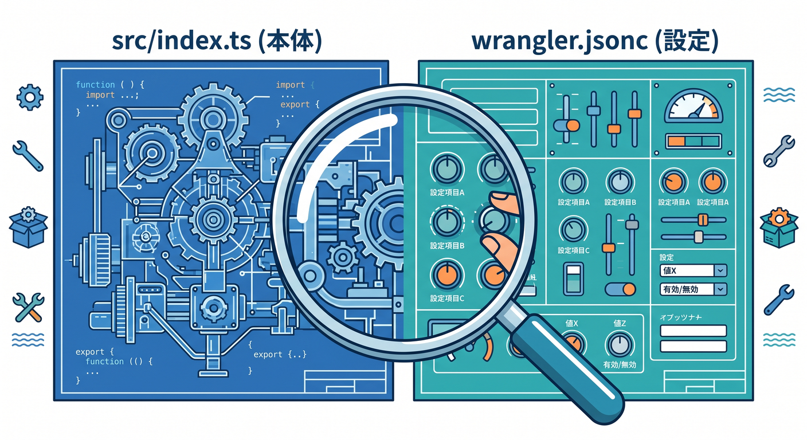
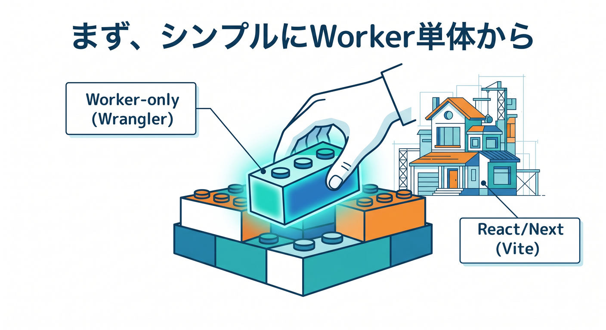
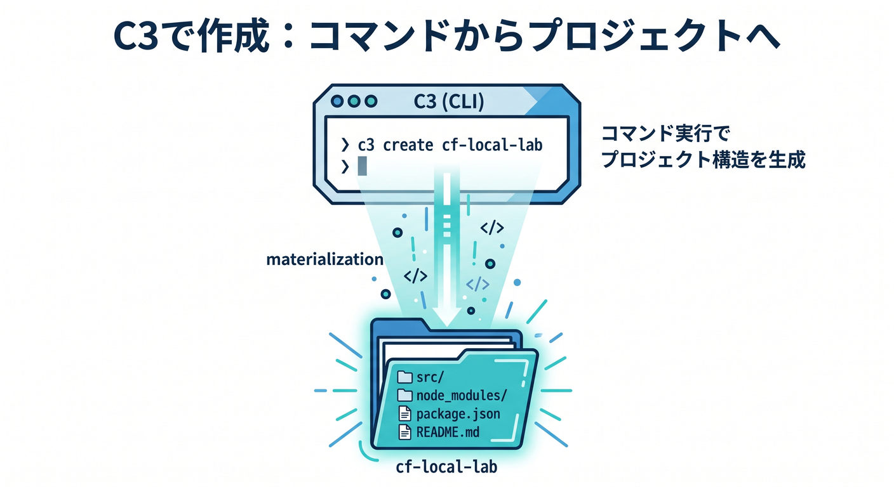
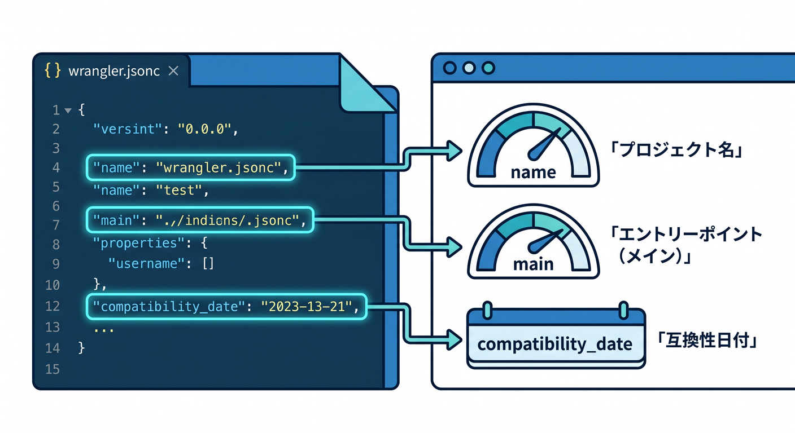
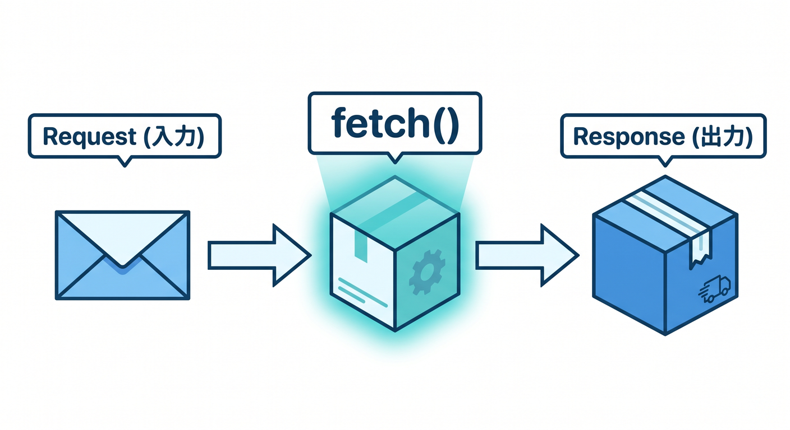
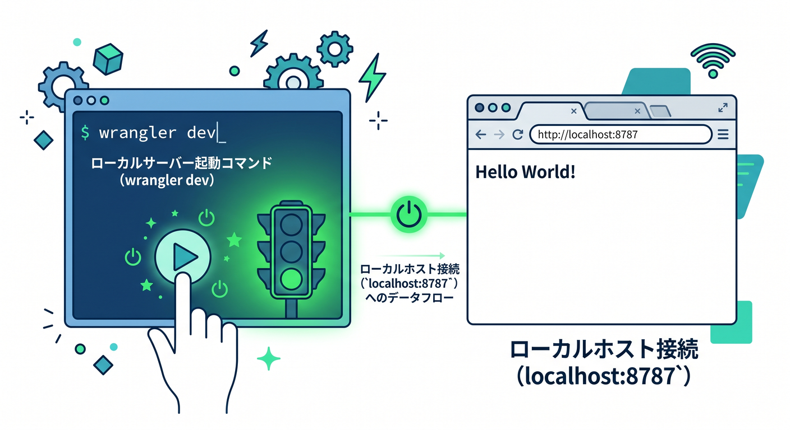
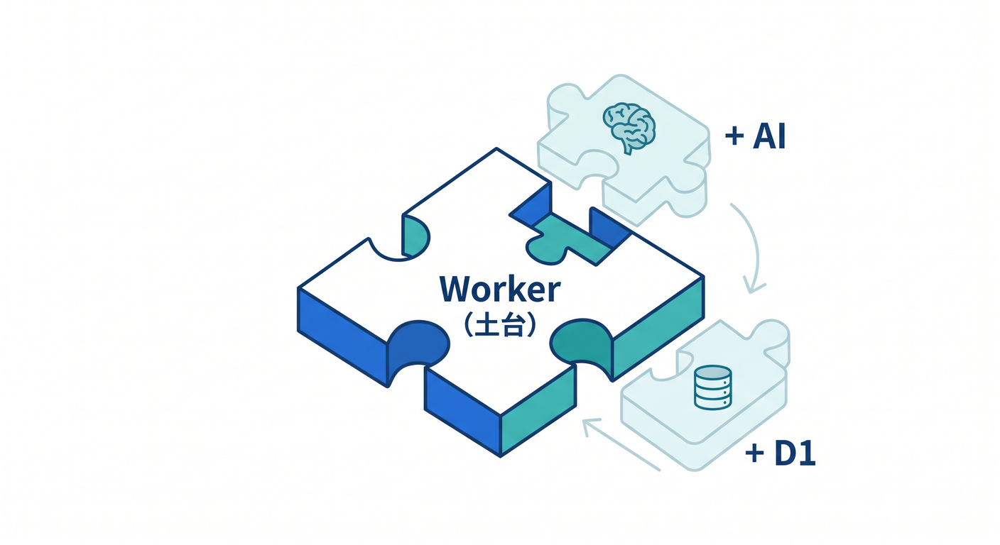

# 第2章　最初の検証用プロジェクトを作ろう 📦🚀☁️
この章では、これから何度も使う「検証用の小さな Workers プロジェクト」を作ります ✨
ここで大事なのは、いきなり全部を理解することではありません。まずは **Cloudflare 用の練習場をちゃんと作ること**、そして **どのファイルが本体で、どのファイルが設定なのか** を見分けられるようになることです。

Cloudflare の今の公式導線では、新規作成は C3（`create-cloudflare`）、Workers 中心の開発は Wrangler、設定の中心は `wrangler.jsonc` という形がかなりはっきりしています。 ([Cloudflare Docs][1])

---

## この章のゴール 🎯
この章が終わるころには、こんな状態を目指します 🌱

* C3 を使って最初のプロジェクトを作れる
* `src/index.ts` と `wrangler.jsonc` の役割がわかる
* `wrangler dev` でローカル確認の入口に立てる
* 後で Workers AI や D1 などを足していく土台だと理解できる
* VS Code と Copilot を使って、生成されたファイルを怖がらず読める

---

## 1. 最初の1本は「Worker-only + TypeScript」で始めよう 🛠️📘
この教材では、最初の検証用プロジェクトとして **Worker-only の TypeScript** を選ぶのがいちばんわかりやすいです 😊

理由はシンプルで、Cloudflare 公式も **API やサーバーレス関数など、Workers を中心に作るならまず Wrangler が向いている** と整理しています。一方で、React や Vue のようなフロント中心の開発では Vite plugin が自然です。だから最初の第2章では、React や Next.js をまだ主役にせず、まず Workers そのものを小さく動かす形にしたほうが、あとで混乱しにくいです。さらに Cloudflare Workers では TypeScript が第一級サポートで、型は `workerd` ベースで扱われます。 ([Cloudflare Docs][2])

---

## 2. C3 でプロジェクトを作ろう 🎉
Cloudflare 公式の現在の標準的な入口は **C3（`create-cloudflare`）** です。

C3 は新しい Cloudflare アプリの土台を作るための CLI で、Wrangler もいっしょに入れてくれます。Workers AI の最新ガイドでも、最初の作成手順として **Hello World example → Worker only → TypeScript → Git は Yes → Deploy は No** という流れが案内されています。まずは公開せず、ローカルで触れる土台だけを作るのが自然です。 ([Cloudflare Docs][1])

VS Code のターミナルで、まずはこんな感じで作ればOKです 👇

```bash
npm create cloudflare@latest -- cf-local-lab
```

途中で質問されたら、こんな選び方で進めるのがおすすめです 🌼

* What would you like to start with?
  → `Hello World example`
* Which template would you like to use?
  → `Worker only`
* Which language do you want to use?
  → `TypeScript`
* Do you want to use git for version control?
  → `Yes`
* Do you want to deploy your application?
  → `No`

作成できたら、フォルダへ移動します。

```bash
cd cf-local-lab
```

---

## 3. できたファイルは「全部わかる」より「役割だけわかる」でOK 👀📁
C3 でできた直後のプロジェクトでは、Cloudflare 公式の TypeScript 導線でも **`src/index.ts` に Hello World の Worker 本体**、**`wrangler.jsonc` に設定** が置かれます。一般的な CLI ガイドでも、これに加えて `package.json` や `node_modules` が作られます。つまり、最初に覚えるべき中心はこの3つです。 ([Cloudflare Docs][1])

ざっくり言うと、こんな見方で十分です 😊

* `src/index.ts`
  → 実際に動く Worker のコード本体
* `wrangler.jsonc`
  → Cloudflare 向けの設定ファイル。名前、エントリーポイント、binding などを置く場所
* `package.json`
  → Node 系の依存関係やスクリプトの入口

特に `wrangler.jsonc` は超重要です 📌
Cloudflare は新規プロジェクトでは **`wrangler.jsonc` を推奨** していて、新しめの機能の中には JSON 設定でしか使えないものもあります。さらに、公式は **Wrangler 設定ファイルを “source of truth” として扱うこと** を勧めています。つまり、設定の本丸はダッシュボードではなく、このファイルだと思っておくと後で迷いません。 ([Cloudflare Docs][3])

---

## 4. `wrangler.jsonc` は「Cloudflare との約束メモ」だと思おう 📝☁️
たとえば Vite plugin の最新ガイドでも、`wrangler.jsonc` には `name`、`compatibility_date`、`main` などが入り、`main` が Worker の入口ファイルを指します。

React 系の Cloudflare テンプレートでも、`wrangler.jsonc` に **どの Worker を動かすか**、**SPA の扱い**、**binding をどうつなぐか** がまとまっています。 ([Cloudflare Docs][4])

今の段階では、細かい意味まで暗記しなくて大丈夫です 🙆
まずはこう思っておけば十分です。

* `name`
  → この Worker の名前
* `main`
  → 実行の入口
* `compatibility_date`
  → どの時点の Workers 仕様に合わせるか
* bindings の設定
  → KV、D1、R2、Workers AI などとのつなぎ口

つまり、**コードは `src/index.ts` に書く、Cloudflare らしい設定は `wrangler.jsonc` に書く**。この2つが分かれただけでもかなり前進です 🌸

---

## 5. まずは本体を1回だけ読んでみよう 👓✨
公式の基本形では、Worker は `fetch()` ハンドラーで HTTP リクエストを受け取り、`Response` を返します。

Cloudflare の CLI ガイドでも、`fetch(request, env, ctx)` が呼ばれ、`Response` を返す形が最初の Hello World です。 ([Cloudflare Docs][5])

最初はこんな感じで十分です 👇

```ts
export interface Env {}

export default {
  async fetch(request: Request, env: Env, ctx: ExecutionContext): Promise<Response> {
    return new Response("Hello Worker! 👋");
  },
} satisfies ExportedHandler<Env>;
```

ここで覚えたいのは3つだけです 😊

* `fetch()` が、アクセスされたときの入口
* `Response` を返せば、ブラウザに返事ができる
* `env` は後で binding を受け取る場所になる

この時点では、「Node のサーバーを立てる」みたいな発想よりも、**1リクエストを受けて1レスポンスを返す** という感覚をつかむのが大事です ☁️

---

## 6. もうローカル実行の入口まで来ているよ 🚦
C3 で作った Workers プロジェクトには Wrangler が入り、Cloudflare 公式でもプロジェクト作成後は `wrangler dev` でローカルサーバーを起動する流れです。標準的な案内では、`npx wrangler dev` を実行して `localhost:8787` で確認します。 ([Cloudflare Docs][5])


実行はこんな感じです 👇

```bash
npx wrangler dev
```

ここではまだ「詳しくデバッグする」必要はありません。
第2章では、次の3つが確認できれば大成功です 🎊

1. ターミナルで起動できた
2. ブラウザで開けた
3. `src/index.ts` を変えたら表示が変わった

これだけで、もう **Cloudflare 用の自分の練習場** ができています 🌟

---

## 7. VS Code と Copilot は「理解の補助輪」として使おう 🤖💬
GitHub 公式では、VS Code などの IDE の Copilot Chat で **コード提案、コード説明、単体テスト生成、修正案の提案** ができると案内されています。さらに `/explain` のようなスラッシュコマンドも使えますし、VS Code では選択したコードを **Copilot > Explain** で説明させることもできます。 ([GitHub Docs][6])

この章では、Copilot に「書かせる」より先に、「読ませて説明させる」がすごくおすすめです 💡
たとえばこんな聞き方が相性いいです。

* `この wrangler.jsonc の各項目を初心者向けに説明して`
* `src/index.ts の fetch が何をしているか 1 行ずつ説明して`
* `/explain`
* `この Worker を壊さずに、返す文字列だけ変えたい`
* `このあと Vitest を入れる前提で、この構成の意味を教えて`

また、GitHub Docs では agent mode が **複数ファイルの更新** や、開発者の許可つきで **コマンド実行やテスト実行** まで扱える流れも紹介されています。MCP を組み合わせると、Copilot は外部リソースやツールにもアクセスしやすくなります。第2章の段階ではまだそこまで使い込まなくてよいですが、「将来かなり強い相棒になる」と思っておくとよいです。 ([GitHub Docs][7])

---

## 8. この小さなプロジェクトは、あとで AI の土台にもなる 🤖☁️✨
この章ではまだ AI を本格的には使いませんが、Cloudflare のよいところは **最初の Worker プロジェクトが、そのまま Workers AI の実験場にもなりやすい** ことです。公式の Workers AI ガイドでも、C3 で作った Worker に対して `wrangler.jsonc` へ AI binding を追加し、`env.AI` からモデルを呼ぶ流れになっています。

([Cloudflare Docs][1])

しかも、Cloudflare の開発・テスト系ドキュメントでは、**ローカル開発時の bindings は基本的にローカルシミュレーション** ですが、**AI bindings だけは常にリモート実行** だと説明されています。つまり、あとで Workers AI を足すときは「コードはローカルで動かしているけど、AI モデル自体はクラウド側で動くんだな」という感覚を持てばOKです。 ([Cloudflare Docs][8])

この感覚が早めにあると、後半で「ローカル開発なのに AI の利用料が出るの？」みたいな混乱が起きにくいです 🌿

---

## 9. React や Vite に進む前の、ちょうどいい足場になっている 🧱⚡
後で React 側へ進むと、Cloudflare の Vite plugin がかなり便利です。公式では、Vite plugin は **Worker コードを `workerd` の中で動かし、本番にできるだけ近い挙動** を目指す作りで、HMR も使えます。また、プラグインはデフォルトでアプリのルートにある `wrangler.jsonc` を見にいきます。 ([Cloudflare Docs][9])

ただし、第2章でいきなりそこまで広げると、初心者には情報が多すぎます 😵‍💫
だから今は、

* まず Worker-only を小さく作る
* `src/index.ts` と `wrangler.jsonc` に慣れる
* `wrangler dev` で動かす

ここまでで十分です。
この土台があると、第3章以降で Wrangler と Vite の違いを見たときに、「あ、Worker の土台は同じなんだな」と理解しやすくなります 🌈

---

## 10. 古い記事を読むときの注意 ⚠️📚
Cloudflare はここ数年で導線がかなり整理されました。なので、昔の記事を読むと **Workers Sites** が出てくることがありますが、公式では **Workers Sites は Wrangler v4 で deprecated** で、**新規プロジェクトでは Workers Static Assets を使うように** と案内しています。しかも Vite plugin は Workers Sites をサポートしていません。 ([Cloudflare Docs][10])

なので、第2章の時点ではこう覚えておけば安全です ✅

* 新しく始めるなら C3
* 設定の中心は `wrangler.jsonc`
* React へ広げるなら Vite plugin 側
* 昔の Workers Sites ベースの記事は、そのまま信じすぎない

---

## この章のミニ演習 🧪🎓
## 演習1
C3 で `cf-local-lab` を作成しよう

## 演習2
`src/index.ts` の返り値を `"Hello Worker! 👋"` に変えよう

## 演習3
`wrangler.jsonc` を開いて、次の3つを探そう

* `name`
* `main`
* `compatibility_date`

## 演習4
Copilot Chat に、次のどれかを聞いてみよう

* `この wrangler.jsonc を初心者向けに説明して`
* `この fetch 関数の流れを図解っぽく説明して`
* `/explain`

---

## この章のチェックポイント ✅✨
* 「Cloudflare の練習場」を自分で作れた
* `src/index.ts` が本体だとわかった
* `wrangler.jsonc` が設定の中心だとわかった
* `wrangler dev` でローカル確認の入口に立てた
* この小さな Worker が、あとで AI やストレージ機能にも育つと見えてきた

---

## まとめ 🌸
第2章のいちばん大事な成果は、すごいアプリを作ることではありません。
**Cloudflare を学ぶための、壊しても安心な小さな実験場を自分で作れたこと** が最大の成果です 🎉

ここで作ったプロジェクトは、あとで

* ローカル実行
* エラー確認
* VS Code デバッグ
* 環境変数
* bindings
* テスト
* Workers AI

へつながる、ずっと使える土台になります。
つまりこの章は、地味だけどめちゃくちゃ大事です ☁️🛠️✨

必要なら続けて、この同じトーンで **第3章** もそのまま詳細化します。

[1]: https://developers.cloudflare.com/workers-ai/get-started/workers-wrangler/ "Get started - Workers and Wrangler · Cloudflare Workers AI docs"
[2]: https://developers.cloudflare.com/workers/development-testing/wrangler-vs-vite/ "Choosing between Wrangler & Vite · Cloudflare Workers docs"
[3]: https://developers.cloudflare.com/workers/wrangler/configuration/ "Configuration - Wrangler · Cloudflare Workers docs"
[4]: https://developers.cloudflare.com/workers/vite-plugin/get-started/ "Get started · Cloudflare Workers docs"
[5]: https://developers.cloudflare.com/workers/get-started/guide/ "Get started - CLI · Cloudflare Workers docs"
[6]: https://docs.github.com/copilot/using-github-copilot/asking-github-copilot-questions-in-your-ide "Asking GitHub Copilot questions in your IDE - GitHub Docs"
[7]: https://docs.github.com/en/copilot/tutorials/enhance-agent-mode-with-mcp "Enhancing GitHub Copilot agent mode with MCP - GitHub Docs"
[8]: https://developers.cloudflare.com/workers/development-testing/ "Development & testing · Cloudflare Workers docs"
[9]: https://developers.cloudflare.com/workers/vite-plugin/ "Vite plugin · Cloudflare Workers docs"
[10]: https://developers.cloudflare.com/workers/configuration/sites/configuration/ "Workers Sites configuration · Cloudflare Workers docs"
