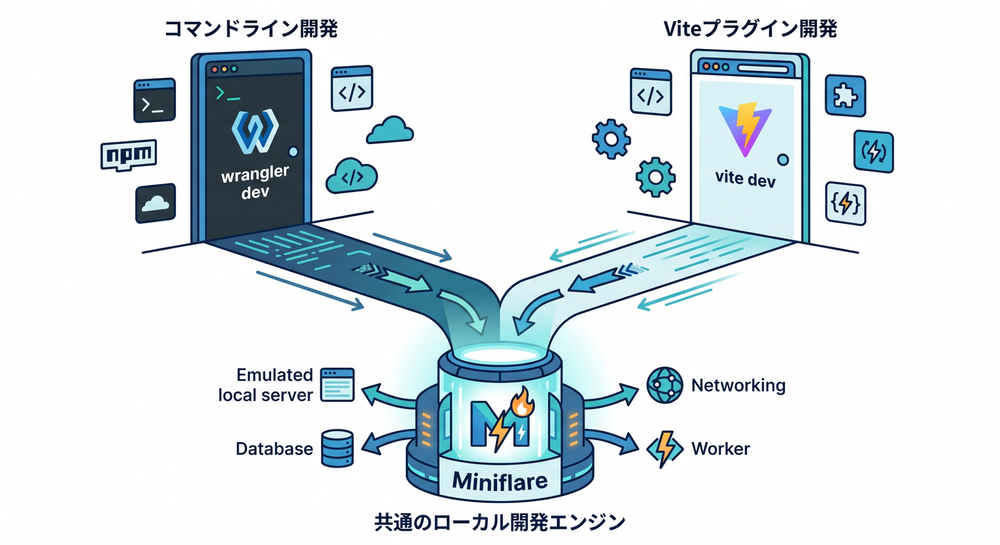
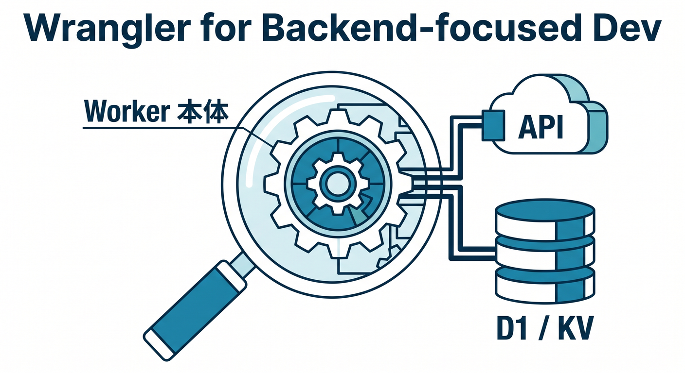
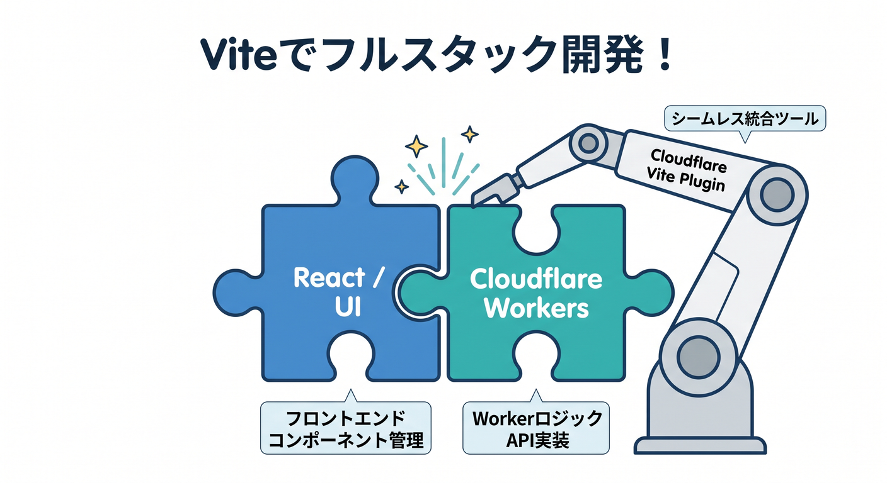
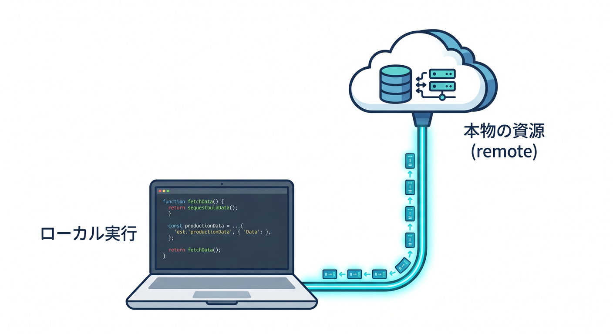
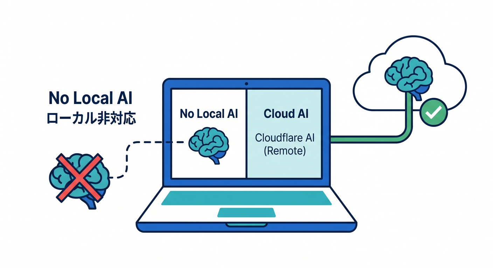
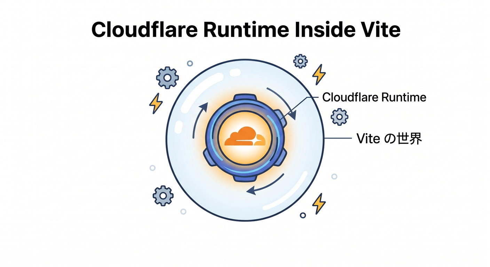
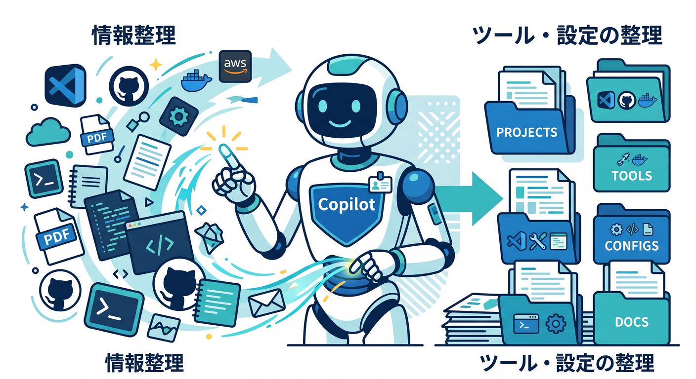

# 第3章　`wrangler dev` と Vite の役割をつかもう ⚡🧭
この章では、Cloudflare のローカル起動でいちばん迷いやすい
「`wrangler dev` を使うのか 🤔」「Vite 側で進めるのか 🤔」
という分かれ道を、やさしく整理します 🌸

Cloudflare 公式では、ローカル開発の入口は大きく 2 つあります。
1つは Workers 向け CLI の `wrangler dev`、もう1つは Cloudflare Vite plugin を使った `vite dev` です。どちらも Cloudflare チームが保守しており、内部では Miniflare を使ってローカル開発を支えています。既定では、Worker のコードは手元で動き、bindings はローカルにシミュレートされた資源へつながります。([Cloudflare Docs][1])



---

## この章のゴール 🎯
この章のゴールは、コマンドを丸暗記することではありません。
「いま自分の作っているものは、Wrangler向きなのか、Vite向きなのか」を、自分で落ち着いて判断できるようになることです 😊

Cloudflare の公式ガイドでも、使い分けはかなりはっきりしています。API、サーバーレス関数、バックグラウンド処理のような **Workers中心の開発** なら Wrangler が向いています。いっぽう、React などのモダンなフロントエンドと一緒に進める **UI中心・フルスタック寄りの開発** なら Cloudflare Vite plugin が自然です。さらに、Cloudflare のネットワーク上でリモート実行しながら開発したい場合は `wrangler dev --remote` が必要で、これに相当する Vite plugin 側の仕組みはありません。([Cloudflare Docs][2])

---

## 1. まずは「入口が2つある」と知ればOK 🚪🚪
最初に大事なのは、**どちらが正義か** ではなく、**作るものに合った入口を選ぶ** という考え方です 🌱

`wrangler dev` は、Workers をそのままローカルで試すための、いちばん素直な入口です。公式ドキュメントでも、`wrangler dev` は Worker をローカルでテストする方法として案内されていて、起動中は `localhost:8787` へアクセスして動作確認でき、`console.log` や例外もターミナルに出ます。([Cloudflare Docs][3])

いっぽう Vite plugin は、Vite の開発サーバーやビルド体験を使いながら、Worker コードを `workerd` の中で動かせる仕組みです。つまり、**Viteの快適さ** と **Cloudflare Workers らしい実行感覚** を、いっしょに取りにいく道です。Cloudflare はこの plugin を 2025 年 4 月に GA にしており、すでに本格的な導線として扱っています。([Cloudflare Docs][4])

---

## 2. `wrangler dev` はどんなときに使うの？ 🛠️
`wrangler dev` が向いているのは、まず **Worker 単体で考えたいとき** です。
たとえば、こんな題材です ✨

* JSON を返す API を作る
* URL に応じて分岐する
* `fetch()` で外部APIをたたく
* D1 や KV とつなぐ
* Workers AI を binding 経由で呼ぶ

こういうときは、画面側の都合よりも、**Worker 本体の挙動をまっすぐ確認したい** はずです。Cloudflare 公式も、API やサーバーレス関数、バックグラウンドタスクのような **backend / Workers-focused** な用途では Wrangler を使うよう案内しています。([Cloudflare Docs][2])



この教材の流れでも、まだフロントエンドが主役ではありません。なので、この段階では **まず Wrangler を主ルートとして理解する** のがいちばん安心です 😊
「Cloudflare の実行環境そのものに慣れる」ことが先で、「画面と気持ちよくつなぐ」のはその次、という順番です。

---

## 3. Vite plugin はどんなときに使うの？ ⚡🎨
Vite plugin が向いているのは、**画面側も一緒に気持ちよく開発したいとき** です。
React、Vue、Svelte、Solid など、Vite と相性のよいモダンなUI開発では、このルートがかなり自然です。Cloudflare 公式でも、フロントエンド中心の開発や React Router v7 のようなフルスタック構成では Vite plugin を勧めています。([Cloudflare Docs][2])

Vite plugin の強みは、**Worker を Cloudflare runtime に近い形で動かしつつ、Vite 側の開発体験もそのまま使える**ことです。公式ドキュメントでは、Worker コードは `workerd` 内で実行され、本番にできるだけ近い挙動で開発とデプロイへの自信を高められる、と説明されています。さらに GA の告知では、Vite の HMR と Workers 特有の runtime APIs や Durable Objects などを同時に扱える点が強調されています。([Cloudflare Docs][4])



つまり、感覚でいうとこんな感じです 🌈

* **Workerだけ見たい** → `wrangler dev`
* **画面もAPIも一緒に育てたい** → `vite dev`

この2行で、まずは十分です ✨

---

## 4. じゃあ今の自分はどっち？ 迷ったらこう考える 🚦
迷ったら、次の順番で考えるとスッキリします 😊

**① いま主役は Worker 本体？**
はい → `wrangler dev` から始める

**② React の画面も同時に作る？**
はい → Vite plugin を考える

**③ Cloudflare 上でのリモート実行が必要？**
はい → `wrangler dev --remote` が必要

この判断軸は、Cloudflare の公式ガイドそのものとかなり一致しています。Wrangler は backend / Workers 中心、また `--remote` を使ったリモート開発向け。Vite plugin はフロントエンド中心で、Vite ワークフローへ自然に統合される構成向けです。しかも **remote development は Wrangler 専用** で、Vite plugin には同等機能がありません。([Cloudflare Docs][2])

この章では、
「Vite のほうが新しいから上」
「Wrangler は古いやり方」
みたいに考えないのがコツです 🙅‍♂️
役割が違うだけです。

---

## 5. 両方とも「かなり本番に近い」の？ ☁️🧪
ここも初心者が気になりやすいところです 👀

Cloudflare の公式では、ローカル開発は Miniflare によって支えられていて、これは production で使われる `workerd` と同じ runtime を使って Worker を実行する simulator だと説明されています。また、`wrangler dev` と `vite dev` のどちらでも、既定では Worker コードはローカルで走り、bindings はローカル資源へつながります。([Cloudflare Docs][1])

なので、「ローカルだから単なる見た目確認でしょ？」ではありません。
Cloudflare のローカル開発は、かなりちゃんと **実行の確認** ができます 🌟

ただし、**完全に本番そのもの** ではありません。
Cloudflare 公式も、binding は既定ではローカルシミュレーションにつながり、必要なら `remote: true` で個別に remote resource へ切り替える、という考え方を案内しています。つまり、

* コードはローカルで速く回す
* 必要な binding だけ本物につなぐ

というのが、いまの Cloudflare らしい進め方です。([Cloudflare Docs][1])



---

## 6. AI を使うときは、ここを先に知っておくと強い 🤖✨
この教材では Cloudflare の AI サービスも積極的に触れていくので、第3章の段階でここだけ先に押さえておくとかなりラクです。

Cloudflare の開発モード一覧では、**AI binding はローカルシミュレーション非対応** で、**remote binding connections には対応** しています。さらに Workers AI の getting started でも、ローカル開発時に `wrangler dev` で Workers AI を試せる一方、AI モデルの実行は Cloudflare アカウントへアクセスするため、**ローカル開発でも利用料金が発生する** と案内されています。([Cloudflare Docs][5])



ここ、すごく大事です 🔔
**AIだけは「全部ローカルで完結する気分」で触らないほうがいい** です。
普通の KV や D1 はローカル資源で練習しやすいですが、AI は remote 前提の感覚を早めに持っておくと混乱しません。

なので、この章での理解としてはこうです 😊

* `wrangler dev` でも Vite plugin でも、Cloudflare AI を視野に入れられる
* でも AI は「なんとなくローカル」ではなく、**実質 remote 寄り** の気持ちで扱う
* 小さな実験から始めて、無駄打ちを減らす

これで十分です 🌸

---

## 7. Vite plugin を使うと何が増えるの？ 🧩
Vite plugin は、設定がものすごく重いわけではありません。
公式の get started では、`vite.config.ts` に `cloudflare()` を入れるだけの最小構成が示されていて、plugin は既定でアプリルートの `wrangler.jsonc` / `wrangler.json` / `wrangler.toml` を探します。さらに Cloudflare は、新規プロジェクトでは `wrangler.jsonc` を推奨していて、新しい機能の一部は JSON 系設定ファイルでのみ使えます。([Cloudflare Docs][6])

つまり Vite plugin を選んでも、Cloudflare 側の設定が消えるわけではありません。
**Vite と Cloudflare が別々に存在する** のではなく、
**Vite の開発体験の中に Cloudflare runtime が入ってくる**
というイメージです 🧠✨



この感覚がつくと、あとで React を少し足したときも、
「Vite の世界」と「Cloudflare の世界」が頭の中でケンカしにくくなります 😊

---

## 8. 第3章の時点でおすすめしたい実務感のある覚え方 📘
この章の段階では、次の3つだけ覚えれば十分です。

## 覚え方①
**Workers単体なら、まず `wrangler dev`** 🛠️

## 覚え方②
**React などの画面と一緒なら、Vite plugin を検討** ⚡

## 覚え方③
**AI や本物の資源を絡めるなら、local と remote の境目を意識** 🤖🔗

Cloudflare 公式も、ローカル開発では binding ごとに remote へ切り替えられること、AI binding はローカルシミュレーションではなく remote 前提であること、remote development 自体は Wrangler の `--remote` で行うことを明示しています。([Cloudflare Docs][1])

---

## 9. この章のミニ演習 💻🌼
ここでは「理解のための小さな体験」をやります。
まだ大きなアプリは作らなくて大丈夫です。

## 演習1　Wrangler ルートを体験する
ターミナルで Worker プロジェクトを起動し、レスポンスとターミナルログを見る練習をします。`wrangler dev` は `localhost:8787` でローカル確認でき、ログや例外もターミナルに出ます。([Cloudflare Docs][3])

```bash
npm run dev
```

`package.json` にスクリプトがまだなければ、こんな形にしておくとわかりやすいです。

```json
{
  "scripts": {
    "dev": "wrangler dev"
  }
}
```

## 演習2　Vite ルートは「存在を理解する」
この章では、いまの Worker-only 練習プロジェクトを無理に Vite 化しなくて大丈夫です。
ただし、将来 React を足すときは Cloudflare 公式に React + Vite の導線があり、`create-cloudflare` で React SPA + Workers API + Cloudflare Vite plugin の構成を始められます。([Cloudflare Docs][7])

```bash
npm create cloudflare@latest -- my-react-app --framework=react
```

ここでは「こういう道もあるんだな」と眺めるだけで十分です 👀✨

## 演習3　ローカル資源は空だと知る
`wrangler dev` でも `vite dev` でも、ローカルの KV・D1・R2 などは最初は空です。データ投入は Wrangler CLI で行います。([Cloudflare Docs][8])

この一言を覚えておくだけで、
「動いてるのにデータがない 😭」
で混乱しにくくなります。

---

## 10. GitHub Copilot をこの章でどう使うといい？ 🤖💬
この章では、Copilot にコードを丸投げするより、**整理役** として使うのがすごく相性いいです 😊

GitHub 公式では、VS Code 上の Copilot agent mode は、必要なファイルを見つけて編集提案やコマンド提案を行えると案内されています。また MCP 対応の IDE として VS Code が挙げられていて、GitHub MCP server を Copilot Chat から使う流れも公式化されています。さらに Cloudflare 側も、Workers を学ばせるための `cloudflare-docs` MCP server や、ログ・例外確認に役立つ `cloudflare-observability` MCP server を案内しています。([GitHub Docs][9])



この章なら、たとえばこんな聞き方がかなり有効です ✨

* 「このプロジェクトは `wrangler dev` 向き？ `vite dev` 向き？」
* 「`wrangler.jsonc` の各項目を初心者向けに説明して」
* 「Workers AI を使う場合、local と remote の注意点を整理して」
* 「Vite plugin を入れた場合の構成差分を最小限で出して」

こういう使い方だと、理解しながら前へ進めます 🌷

---

## 11. 先回りメモ：Vite plugin 側のデバッグもかなり強い 🔍
この章の本題は使い分けですが、Vite plugin 側にもちゃんとデバッグ導線があります。公式では、`vite dev` や `vite preview` 実行時に `/__debug` ルートが追加され、Cloudflare の DevTools 実装へ入れます。さらに VS Code の `launch.json` を使ったブレークポイントデバッグ案内もあります。API reference では inspector の既定ポートが `9229` で、必要なら変更可能とも書かれています。([Cloudflare Docs][10])

なので、
「Vite ルートに行くと Cloudflare の中身が見えにくくなるのでは？」
と心配しなくて大丈夫です 🙆‍♂️
Vite plugin は、見た目開発だけの道ではありません。

---

## 12. この章のまとめ 🌟
この章でいちばん大事なのは、次のひとことです。

**`wrangler dev` は Worker をまっすぐ確かめる入口、Vite plugin は UI と Worker を一緒に気持ちよく育てる入口** です。Cloudflare 公式でも、Wrangler は backend / Workers 中心や `--remote` を使うリモート開発向き、Vite plugin はフロントエンド中心や Vite ベースのフルスタック開発向きとして整理されています。どちらも Miniflare と `workerd` に近い形を土台にしていて、Cloudflare らしいローカル開発を支えています。([Cloudflare Docs][2])

この教材の流れでは、今の段階では **まず `wrangler dev` を自分の基本フォームにする** のがおすすめです 💪
そして、React や軽いフロント連携が見えてきたら、
「ここからは Vite plugin の出番だな 😊」
と自然に切り替えられれば大成功です。

次の第4章では、この理解を土台にして、**実際に起動したときの画面・ログ・レスポンスをどう読めばいいか** へ進むと、とてもきれいにつながります 🚀

必要なら次に、この第3章と同じ粒度で
**「学習目標」「ハンズオン手順」「演習課題」「理解度チェック問題」付きの教材版** にそのまま落とし込みます。

[1]: https://developers.cloudflare.com/workers/development-testing/ "Development & testing · Cloudflare Workers docs"
[2]: https://developers.cloudflare.com/workers/development-testing/wrangler-vs-vite/ "Choosing between Wrangler & Vite · Cloudflare Workers docs"
[3]: https://developers.cloudflare.com/workers/wrangler/commands/general/ "General commands · Cloudflare Workers docs"
[4]: https://developers.cloudflare.com/workers/vite-plugin/ "Vite plugin · Cloudflare Workers docs"
[5]: https://developers.cloudflare.com/workers/development-testing/bindings-per-env/ "Supported bindings per development mode · Cloudflare Workers docs"
[6]: https://developers.cloudflare.com/workers/vite-plugin/get-started/ "Get started · Cloudflare Workers docs"
[7]: https://developers.cloudflare.com/workers/framework-guides/web-apps/react/ "React + Vite · Cloudflare Workers docs"
[8]: https://developers.cloudflare.com/workers/development-testing/local-data/ "Adding local data · Cloudflare Workers docs"
[9]: https://docs.github.com/copilot/using-github-copilot/asking-github-copilot-questions-in-your-ide "Asking GitHub Copilot questions in your IDE - GitHub Docs"
[10]: https://developers.cloudflare.com/workers/vite-plugin/reference/debugging/ "Debugging · Cloudflare Workers docs"
