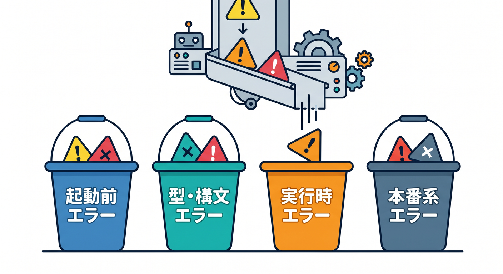
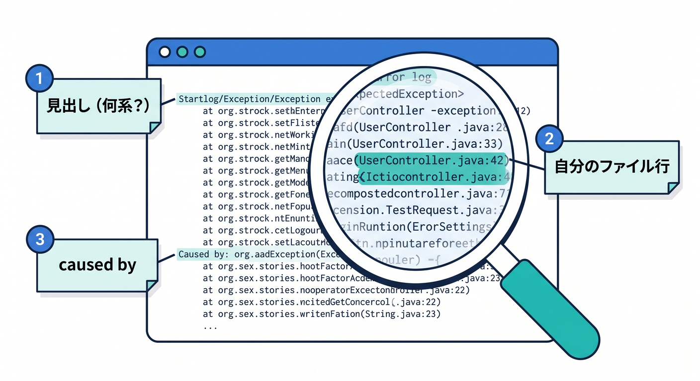
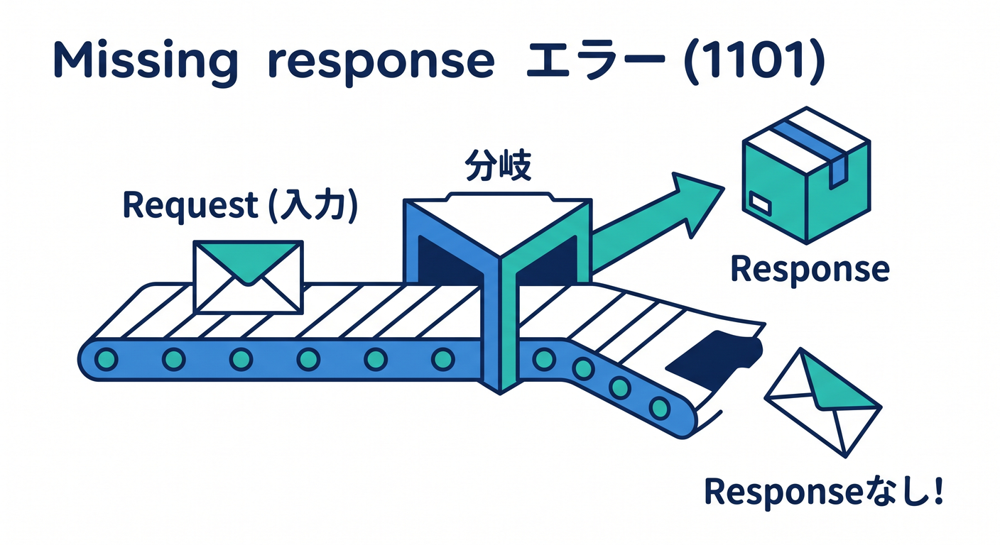
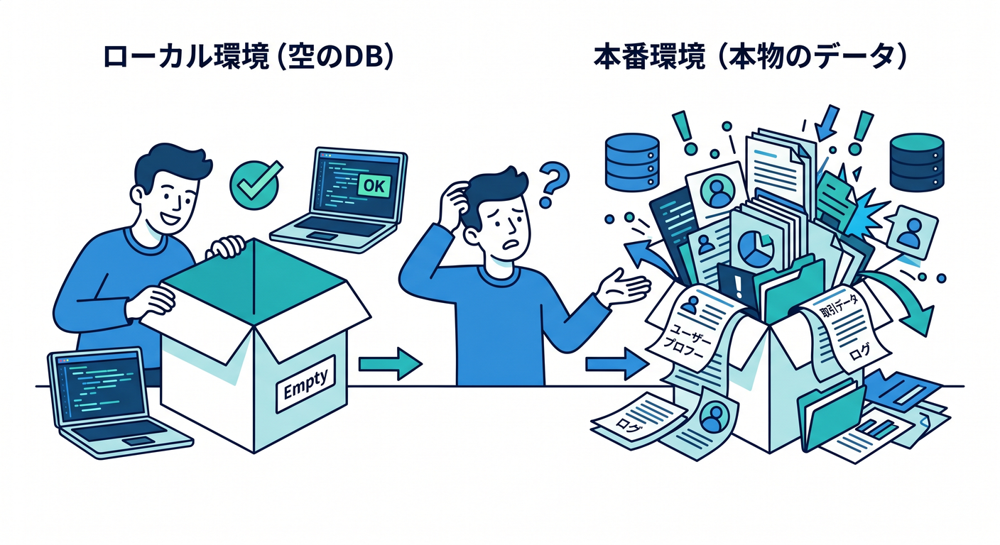
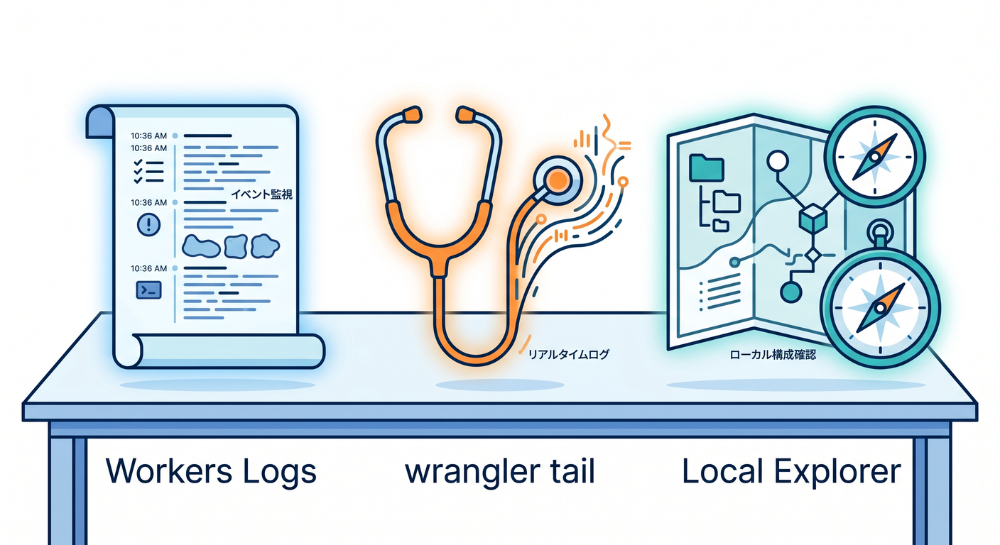
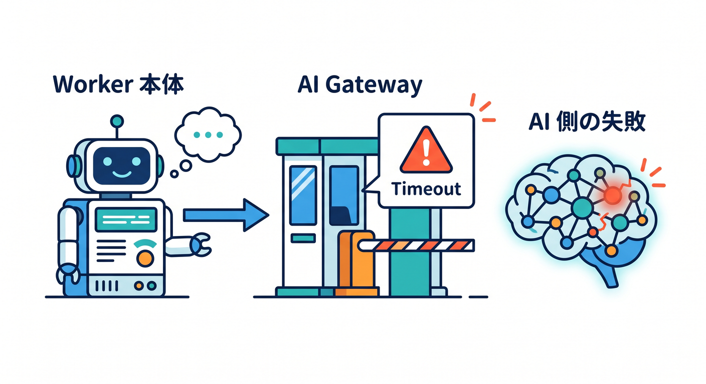

# 第4章　エラーの見方に慣れよう 😵‍💫➡️🙂📨
この章では、Cloudflare 開発でいちばん心が折れやすい「赤い文字」と仲よくなる練習をします ✨
Workers のローカル開発は、手元の PC で動かしつつ、本番と同じ runtime である `workerd` に近い形で確かめられるのが大きな強みです。しかも通常は bindings もローカルにシミュレートされるので、壊しても落ち着いて原因を追いやすいです。なお、AI bindings だけは例外で、ローカル開発中でもモデル実行自体はリモートになります。 ([Cloudflare Docs][1])

この章のゴールは、エラーを全部暗記することではありません 🌱
大事なのは、**「これは何系の失敗か」→「どこを見ればいいか」→「次に何を試すか」** の順で動けるようになることです。Cloudflare 公式も、Errors、Workers Logs、Breakpoints、Local Explorer などを組み合わせた観測をかなり重視しています。 ([Cloudflare Docs][2])

---

## 1. まずはエラーを4種類に分けよう 🧭
Cloudflare Workers のエラーは、初心者目線では次の4つに分けるとかなり整理しやすいです。

1. **起動前エラー**
   `wrangler dev` の開始前後で出る、設定ファイル・依存関係・コマンド周りの失敗です。

2. **型・構文エラー**
   TypeScript や構文の問題で、実行前に止まるタイプです。

3. **実行時エラー**
   実際にリクエストが来て初めて起きる失敗です。たとえば JavaScript 例外、ネットワーク失敗、メモリ系、返すべき `Response` を返していないケースなどです。Workers docs では runtime errors は利用者にはそのまま見えず、ログで検出するものもあると案内されています。 ([Cloudflare Docs][2])

4. **本番系エラー / エラーページ系**
   本番でレスポンスを返せなかったときは、Cloudflare 側のエラーページになります。代表例として、`1101` は JavaScript 例外、`1102` は CPU time limit 超過、`1019` は loop limit、`1021` はアクセスできない host、`1024` は Cloudflare 管理 IP への subrequest 禁止です。 ([Cloudflare Docs][2])

この4分類ができるだけで、頭の中がかなり静かになります 😊
「コードが悪いのか」「設定が悪いのか」「Cloudflare 特有の制約なのか」を混ぜないことが、最初の大事なコツです。 ([Cloudflare Docs][2])



---

## 2. 赤い文字を見たら、読む順番を固定しよう 👀📌
エラーを見るときは、毎回この順番で OK です。

**① いちばん上の1行を見る**
ここには「何系の失敗か」の見出しが出やすいです。
まず全部読もうとせず、タイトル行だけで分類します。

**② 自分のファイル名と行番号を探す**
`src/index.ts` のような見慣れたパスが出たら、そこが最優先です。
逆に自分のコードが出てこないなら、設定や platform 側を疑います。

**③ “caused by” や直前の説明行を見る**
長いスタックトレースは最後まで追わなくて大丈夫です。
原因説明は、前半か直前に出ることが多いです。

**④ その失敗が「起動時」か「リクエスト時」かを分ける**
サーバー起動時に落ちるなら設定寄り、URL を叩いた瞬間だけ落ちるなら実行時寄りです。

**⑤ まず1か所だけ直して再実行する**
一気に3か所直すと、どれが効いたのかわからなくなります。

この「読む順番の固定」は、Cloudflare に限らずずっと効く基礎体力です 💪
特に Workers は、ローカル実行・ログ・ブレークポイント・Local Explorer が揃っているので、落ち着いて1個ずつ切り分けるのが強いです。 ([Cloudflare Docs][3])



---

## 3. Cloudflare で特に覚えたい“よくある失敗” 😇⚠️
## 3-1. `Response` を返していない 😵
Cloudflare Workers では、リクエスト処理の最後に `Response` を返せていないと、`1101` の一種として **`The script will never generate a response`** が出ることがあります。
公式 docs では、イベントループ上の処理が終わったのに `Response` が返らなかったときに起きると説明されています。 ([Cloudflare Docs][2])

たとえば、こんなコードです。

```ts
export default {
  async fetch(request: Request) {
    const url = new URL(request.url)

    if (url.pathname === "/ok") {
      return new Response("OK")
    }

    // それ以外のパスで Response を返していない
  }
}
```

この場合は、**「分岐のどこかで return し忘れていないか」** を最初に疑います。
初心者のうちは、`if` を増やしたあとに最後の `return` を消してしまうのが本当に多いです 🌧️



---

## 3-2. ただの JavaScript 例外 😵‍💥
`1101` はもっと広く、**Worker が JavaScript exception を投げた** ときにも出ます。
つまり、`undefined` を読んだ、`JSON.parse()` に失敗した、存在しないプロパティを触った、みたいな普通の例外でも普通にここへ入ります。 ([Cloudflare Docs][2])

```ts
export default {
  async fetch() {
    const user = null as { name: string } | null
    return new Response(user.name) // ここで例外
  }
}
```

このタイプは、**Cloudflare 特有というより、まず JavaScript/TypeScript の基礎エラー**です。
なので慌てて platform の設定を触るより、**変数の中身・null チェック・想定入力**を見るのが先です 🙆

---

## 3-3. CPU・メモリ・ループ系の失敗 ⏱️🧠🔁
本番のエラーページとしては、`1102` が CPU time limit 超過、`1019` が loop limit と公式に整理されています。
また runtime errors 側では、メモリ上限に当たりそうな読み込みや一時的な接続失敗もログ経由で見えることがあります。 ([Cloudflare Docs][2])

ここでの見分けポイントはシンプルです。

* **一瞬で落ちる** → 例外や設定寄り
* **重い処理のあとに落ちる** → CPU / メモリ寄り
* **同じコードでもたまに落ちる** → 外部 API やネットワーク寄り

---

## 4. ローカルで動くのに、本番でだけ失敗するとき ☁️🆚💻
`wrangler dev` / `vite dev` では、Worker 本体はローカル PC で動き、通常の bindings はローカルにシミュレートされます。
そのため、**ローカルでは空の D1 / KV / R2 を見ていて、本番では本物のデータを見ている** というズレが起こりえます。しかも AI bindings は常にリモート実行なので、AI だけ挙動が別に見えることもあります。 ([Cloudflare Docs][1])

この章では、ここをこう覚えるのがおすすめです 🌟

* **コードの書き方が悪いのか**
* **データの中身が違うのか**
* **接続先が違うのか**
* **AI や外部 API 側の失敗なのか**

この4つを分けて考えるだけで、かなり迷子になりにくくなります。



---

## 5. まず使うべき観測ツールたち 🔦
## 5-1. Workers Logs を見る 📜
Cloudflare の Workers Logs は、invocation logs、custom logs、errors、uncaught exceptions を集めて、保存・検索・分析できる仕組みです。
公式 docs では、historic logs も見られ、エラーを探すには `$metadata.error EXISTS` や `$workers.outcome = "exception"` で絞る方法も案内されています。 ([Cloudflare Docs][4])

もしログがうまく出ないなら、`wrangler.jsonc` に `observability.enabled` を明示して再デプロイすると整理しやすいです。Workers Logs docs では observability 設定と `head_sampling_rate` の例も出ています。 ([Cloudflare Docs][4])

```jsonc
{
  "observability": {
    "enabled": true,
    "head_sampling_rate": 1
  }
}
```

## 5-2. `wrangler tail` を使う 🧵
本番寄りの例外を追うなら、Cloudflare docs では `wrangler tail` で例外を確認する流れも案内されています。
JSON の `exceptions` フィールドに出るので、「直したつもりなのにまだ落ちている」を追いやすいです。 ([Cloudflare Docs][2])

## 5-3. Local Explorer を使う 🧪
「エラー原因はコードではなく、ローカルの D1 / KV / R2 の中身では？」というときは、Local Explorer がかなり便利です。
`/cdn-cgi/explorer` からブラウザで local bindings の中身を見たり編集したりでき、`wrangler dev` 実行中にターミナルで `e` を押して開く方法もあります。 ([Cloudflare Docs][5])



---

## 6. VS Code で“読むだけ”から“一時停止して確認”へ 🪲🎯
Cloudflare docs では、Wrangler や Vite でローカル開発中の Worker は、VS Code の JavaScript Debug Terminal から `wrangler dev` か `vite dev` を起動すると自動接続しやすく、ブレークポイントで止められると説明されています。 `launch.json` での attach 例も用意されています。 ([Cloudflare Docs][3])

第4章では、ここを深掘りしすぎなくて大丈夫です。
ただし、**ログを読むだけでわからないときは、次章のブレークポイントへ進めばいい** と知っておくと安心です 😊

---

## 7. Copilot を“答え係”ではなく“整理係”として使おう 🤖📝
GitHub Docs では、Copilot Chat を IDE で使って、**コードの説明、修正案、テスト生成、コード修正提案**を出せると案内しています。さらに、アクティブファイルにエラーがあるときは `/fix`、テスト作成には `/tests` が使えます。 ([GitHub Docs][6])

この章での使い方は、こんな感じがおすすめです ✨

* 「このエラー文を3行で要約して」
* 「原因候補を3つに絞って」
* 「この Worker に最低限の error handling を足して」
* 「この分岐で Response を返し漏れていないか見て」

つまり、**正解を丸投げするより、頭の整理を手伝わせる** のが向いています。
そのほうが、あとで自力で直せる力が残ります 🌸


---

## 8. AI を使う Worker でのエラーの見方 🤖☁️
AI を混ぜると、エラーの切り分けが少し変わります。
Cloudflare の開発 docs では、AI bindings はローカル開発中でも常にリモート実行です。だから、AI 呼び出しで失敗したときは、**自分の Worker コードのバグ**と**AI 側・上流側の失敗**を分けて考える必要があります。 ([Cloudflare Docs][1])

Workers AI には専用のエラー一覧があり、たとえば `5007` は「No such model」、`5004` は「Invalid data」、`3007` は timeout、`3036` と `3040` は 429 系の制限・容量系エラーとして整理されています。 ([Cloudflare Docs][7])

さらに AI Gateway を通すと、Cloudflare docs にある通り、**request status、token usage、cost、duration** などをログで見られます。上流 provider からのエラーが返っている場合も、AI Gateway troubleshooting と logs が切り分けに役立ちます。 ([Cloudflare Docs][8])

この章では、AI まわりは次の一言で十分です 💡
**「AI が失敗したら、まず model 名・入力形式・認証・timeout を疑う」**
これだけでもかなり戦えます。



---

## 9. この章の演習課題 🧩✍️
## 演習1：わざと `Response` を返し忘れる
上のサンプルのように、特定パスで `return` しない Worker を作ってみます。
どの URL で落ちるか、どんな文言が出るか、修正後にどう消えるかを確認します。

## 演習2：わざと JavaScript 例外を出す
`null.name` のような簡単な失敗を入れて、
「どの行が原因だったか」「自分のコードの何行目が先に見つかるか」を確認します。

## 演習3：`console.log()` を1個だけ増やす
大量にログを入れるのではなく、
「関数に入った」「分岐Aに入った」「返す直前」の3点だけ出して、原因が絞れるか試します。

## 演習4：Copilot に“整理だけ”させる
エラー全文を貼って、
「要約」「原因候補3つ」「最初に見るべきファイル」を出させます。
そのあと、自分で実際の原因を確かめます。

---

## 10. この章のまとめ 🎓🌈
この章で身につけたいのは、次の3つです。

* **エラーを4種類に分けること**
* **赤い文字を上から順に全部読まず、先頭・自分の行・原因説明から読むこと**
* **ログ・Local Explorer・ブレークポイント・Copilot を役割分担して使うこと**

Cloudflare Workers では、Errors、Workers Logs、`wrangler tail`、Local Explorer、VS Code ブレークポイントまで、**「見ながら直す」ための道具がかなり揃っています**。
だからエラーは、怖がる相手というより、**次にどこを見ればいいか教えてくれる案内板**だと思って進めば大丈夫です 🚦💖 ([Cloudflare Docs][2])

次に続けるなら、第5章向けにこの流れのまま **「VS Code でブレークポイントデバッグしてみよう」版** へつなげると、とても自然です。

[1]: https://developers.cloudflare.com/workers/development-testing/ "Development & testing · Cloudflare Workers docs"
[2]: https://developers.cloudflare.com/workers/observability/errors/ "Errors and exceptions · Cloudflare Workers docs"
[3]: https://developers.cloudflare.com/workers/observability/dev-tools/breakpoints/ "Breakpoints · Cloudflare Workers docs"
[4]: https://developers.cloudflare.com/workers/observability/logs/workers-logs/ "Workers Logs · Cloudflare Workers docs"
[5]: https://developers.cloudflare.com/workers/development-testing/local-explorer/ "Local Explorer · Cloudflare Workers docs"
[6]: https://docs.github.com/copilot/using-github-copilot/asking-github-copilot-questions-in-your-ide "Asking GitHub Copilot questions in your IDE - GitHub Docs"
[7]: https://developers.cloudflare.com/workers-ai/platform/errors/ "Errors · Cloudflare Workers AI docs"
[8]: https://developers.cloudflare.com/ai-gateway/observability/logging/ "Logging · Cloudflare AI Gateway docs"
