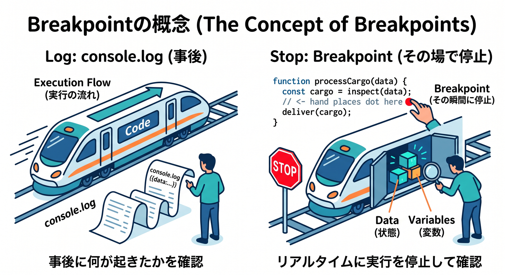
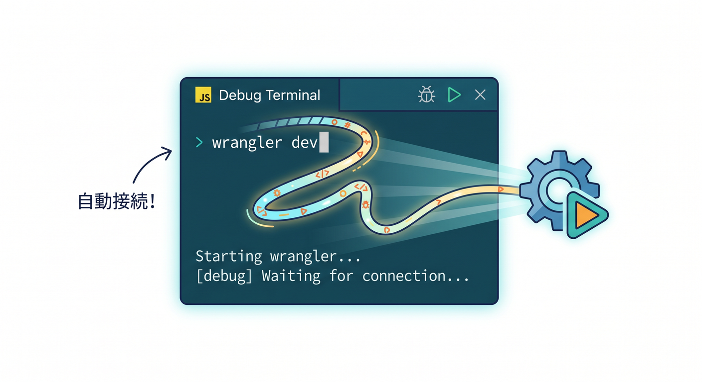
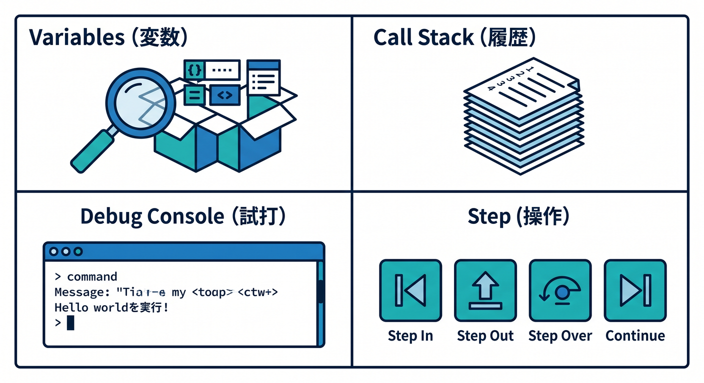
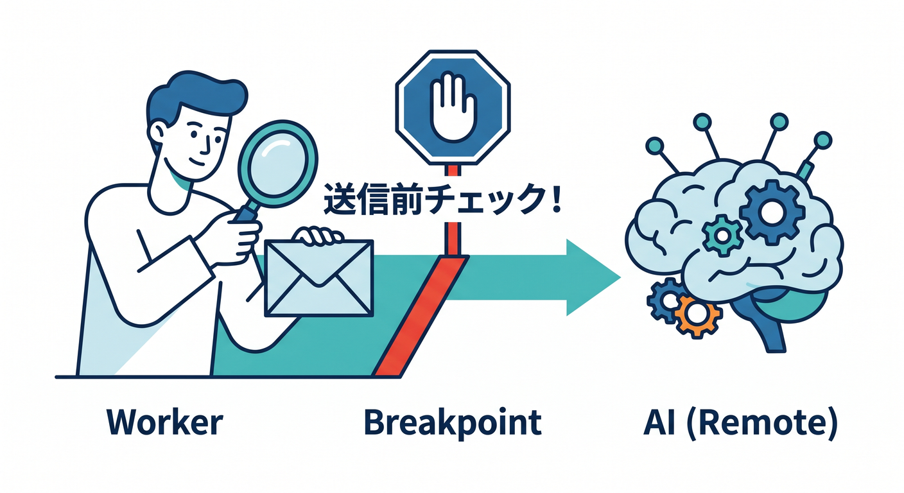
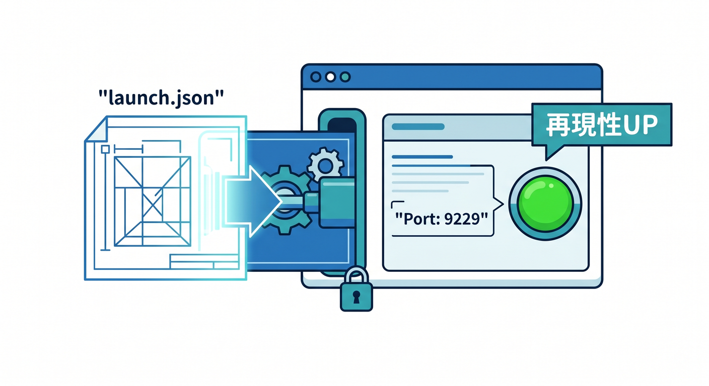
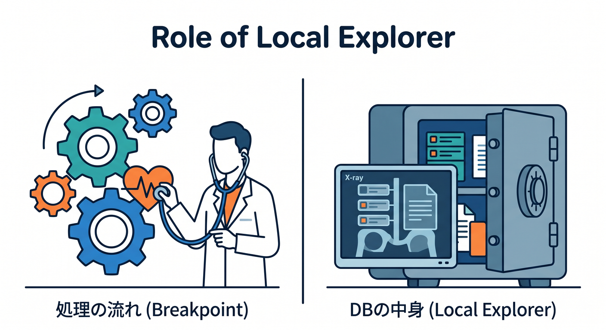
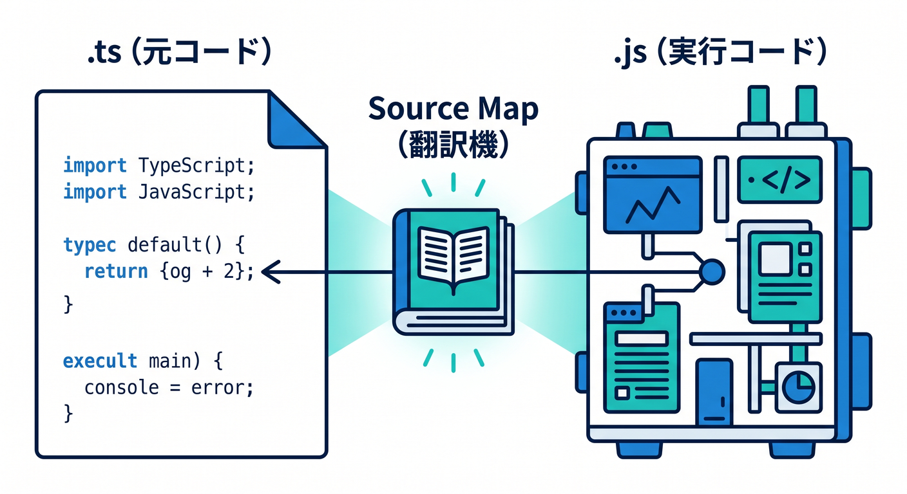

# 第5章　VS Code でブレークポイントデバッグしてみよう 🪲🎯💻✨
この章は、**「`console.log()` だけに頼る段階」から一歩進んで、処理を途中で止めて中身を見る**ための章です 😊
2026年4月15日時点の公式情報では、Cloudflare Workers のローカル開発は `wrangler dev` と Cloudflare Vite plugin の両方で進められ、**VS Code でもブレークポイントデバッグができる**よう整理されています。Cloudflare 公式は、まず **VS Code の JavaScript Debug Terminal** を使う方法を案内し、必要に応じて **`.vscode/launch.json` で接続する方法**も示しています。さらに、ローカル開発では Worker 本体はローカルで動き、bindings は通常ローカルシミュレーションですが、**AI bindings だけは常にリモート実行**です。ここは Cloudflare らしい大事なポイントです 🔍☁️ ([Cloudflare Docs][1])

---

## この章でできるようになること 🎓🌟
この章のゴールは、次の3つです。

1. **VS Code 上で Worker の処理を止められる**
2. **変数の中身・分岐・呼び出し順をその場で確認できる**
3. **AI や外部APIが絡んでも、どこまで正しく進んだかを落ち着いて追える**

Cloudflare 公式でも、ローカル開発時は breakpoints・DevTools・CPU/メモリ観測などの導線が用意されていて、単なる「表示確認」ではなく、**かなり本番に近い感覚で検証できる**ことが強調されています。VS Code 側も、JavaScript / TypeScript を built-in debugger で扱える前提になっていて、Debug Terminal や launch config が標準ルートです 🧭✨ ([Cloudflare Docs][2])

---

## まず知っておきたいこと 🙂📌
ブレークポイントデバッグは、**「その行まで本当に来ているの？」**を確認するための道具です。
初心者のうちは、エラーが出ていないのに結果が変、という状態で迷子になりやすいです。でもブレークポイントを置くと、

* その if 文に入ったのか
* `request.url` は何だったのか
* `env` に必要な binding が見えているか
* AI に送る prompt が想定どおりか

みたいなことを、**実行中のその瞬間の状態で見られる**ようになります。これがすごく大きいです 🫶🔎



特に Cloudflare Workers は、ローカル開発時でも `wrangler dev` / `vite dev` から DevTools や breakpoints が使えます。Cloudflare 公式は、Wrangler でも Vite でも breakpoint debugging をサポートしているとはっきり案内しています。VS Code では、**JavaScript Debug Terminal から起動すると自動接続しやすい**のが今のいちばん楽な入口です。 ([Cloudflare Docs][1])

---

## この章の完成イメージ 🧩🚀
この章では、小さな Worker を使って、次の流れを体験します。

* URL パラメータを読む
* 文字列を加工する
* 条件分岐する
* 必要なら `env.AI.run()` の直前で止める
* 返す JSON を確認する

つまり、**「入力 → 分岐 → 中間値 → 出力」**を目で追う練習です。
派手なアプリを作る章ではなく、**“壊れたときに自分で追いかけられる” 基礎体力をつける章**です 💪🌱

---

## 章の導入：ログとブレークポイントの役割の違い 📝🪲
`console.log()` は便利です。今どきでも普通に使います。
でも、ログだけだと「あとから文字を読む」ことしかできません。

一方、ブレークポイントは、

* その場で止まれる
* 変数を展開して見られる
* Call Stack を見られる
* 次の行へ一歩ずつ進める
* Debug Console で式を試せる

という強みがあります。VS Code 公式も、JavaScript / TypeScript のデバッグでは **breakpoints・call stack・debug console・source maps** が標準機能として使える前提で説明しています。Cloudflare 側も、それを Workers 開発に自然につなげています。 ([Visual Studio Code][3])

---

## 最初に使うのは JavaScript Debug Terminal です 🎯✨
この章の最初の主役は **JavaScript Debug Terminal** です。
理由はシンプルで、**いちばん設定が少なくて、初心者が成功しやすい**からです。

Cloudflare 公式の breakpoints ガイドでは、VS Code の built-in **JavaScript Debug Terminal** を開いて、その中で `wrangler dev` か `vite dev` を実行すれば、VS Code が自動的に Worker に接続し、デバッグセッションを始められると案内しています。しかも、**複数 Worker を同時に動かしていても自動接続しやすい**と説明されています。VS Code 公式でも、JavaScript Debug Terminal は **そのターミナル内で起動した Node.js プロセスを自動的にデバッグする**仕組みとして紹介されています。 ([Cloudflare Docs][1])

Windows では、VS Code で **`Ctrl + Shift + P`** を押してコマンドパレットを開き、**`Debug: Create JavaScript Debug Terminal`** を実行する流れがやりやすいです。VS Code 公式はコマンドパレットからの作成方法を案内しています。 ([Visual Studio Code][3])



---

## まずは最小サンプルを用意しよう 🧪🌼
この章用の練習コードは、こんな小さなもので十分です。

```ts
export interface Env {
  AI: Ai;
}

export default {
  async fetch(request: Request, env: Env): Promise<Response> {
    const url = new URL(request.url);
    const name = url.searchParams.get("name") ?? "guest";
    const mode = url.searchParams.get("mode") ?? "normal";

    const upperName = name.toUpperCase();

    if (mode === "hello") {
      return Response.json({
        ok: true,
        message: `Hello, ${upperName}!`,
        mode,
      });
    }

    if (mode === "ai") {
      const result = await env.AI.run("@cf/meta/llama-3.1-8b-instruct", {
        prompt: `次の名前を短く紹介してください: ${name}`,
      });

      return Response.json({
        ok: true,
        mode,
        result,
      });
    }

    return Response.json({
      ok: true,
      message: `Welcome, ${upperName}!`,
      mode,
    });
  },
};
```

AI binding を使うときは、Cloudflare 公式どおり `wrangler.jsonc` に `ai.binding` を設定し、コード側では `env.AI` として呼び出します。Workers AI binding は Worker から使うための正式な binding で、`env.AI.run()` の形が公式案内です。 ([Cloudflare Docs][4])

設定例はこんな感じです。

```jsonc
{
  "name": "chapter-05-debug",
  "main": "src/index.ts",
  "compatibility_date": "2026-04-15",
  "ai": {
    "binding": "AI"
  }
}
```

---

## 実践1：Debug Terminal から `wrangler dev` を起動する 🟢
やることはとてもシンプルです。

1. VS Code でプロジェクトを開く
2. `Ctrl + Shift + P`
3. `Debug: Create JavaScript Debug Terminal` を実行
4. そのターミナル内で次を実行

```bash
npx wrangler dev
```

Cloudflare 公式は、**JS Debug Terminal の中から `wrangler dev` または `vite dev` を実行する**だけで、VS Code が自動的に接続すると案内しています。VS Code 公式も、このデバッグターミナルは中で起動した Node.js プロセスを自動デバッグすると説明しています。 ([Cloudflare Docs][1])

起動したら、`src/index.ts` のこのあたりにブレークポイントを置きます。

* `const url = new URL(request.url);`
* `const upperName = name.toUpperCase();`
* `if (mode === "ai") {`
* `const result = await env.AI.run(...);`

そのあとブラウザでローカルURLへアクセスします。
Cloudflare の breakpoints ガイドでは、Wrangler のデフォルトURLとして `http://127.0.0.1:8787` を例示しています。 ([Cloudflare Docs][1])

たとえばこんなアクセスです。

```text
http://127.0.0.1:8787/?name=komiyama&mode=hello
```

すると、ブレークポイントで処理が止まります 🎉

---

## 止まったときにどこを見るの？ 👀🧠
VS Code で止まったら、最初は全部を見なくて大丈夫です。
見る場所は次の4つだけで十分です。

## 1. Variables
いちばん大事です。
`request`、`env`、`url`、`name`、`mode`、`upperName` の中身を見ます。

## 2. Call Stack
どの関数から今ここへ来たかを見る場所です。
最初は深追いしなくてOKですが、**「いま自分のコードのどこにいるか」**がわかるだけでも十分価値があります。

## 3. Debug Console
その場で式を試せます。
たとえば `url.pathname` や `name.length` を打って確認できます。

## 4. Step Over / Step Into / Continue
最初は **Step Over** と **Continue** だけ覚えれば大丈夫です。
1行ずつ進めると、分岐の流れがかなり理解しやすくなります 😊

VS Code 公式は、JavaScript / TypeScript の built-in debugging で breakpoints、inspect objects、call stack、Debug Console を使えることを案内しています。Cloudflare の breakpoint debugging は、その流れにそのまま乗れます。 ([Visual Studio Code][5])



---

## 実践2：AI 呼び出しの直前で止める 🤖🪄
この章では、Cloudflare の AI サービスもちゃんと絡めます。
とてもおすすめなのが、**`env.AI.run()` の直前で止める**練習です。

理由は単純で、AI が思った通りに動かないとき、原因が

* prompt が変だったのか
* 分岐に入っていなかったのか
* `name` が空だったのか
* そもそも mode が `"ai"` じゃなかったのか

を切り分けやすいからです。

Cloudflare 公式では、Workers AI は Worker に `AI` binding を追加して `env.AI.run()` で呼び出します。また、ローカル開発の overview では、**bindings は通常ローカルシミュレーションだが AI bindings は常にリモートで動く**と明記されています。つまりこの章では、**Worker の制御フローはローカルで止めつつ、AI 推論は実サービス側へ飛ぶ**という Cloudflare らしい構成を学べます 🤖☁️ ([Cloudflare Docs][6])

ここで確認したいのは次の3点です。

* `mode` は本当に `"ai"` か
* `prompt` に入る文字列は想定どおりか
* `name` に不要な空白や `null` が混ざっていないか

この練習は、あとで AI Gateway と組み合わせるとさらに強くなります。AI Gateway は、AI アプリに対して **analytics / logging / caching / rate limiting / retry / fallback** などを提供する仕組みです。つまり、**VS Code では「コードの流れ」を止めて見て、AI Gateway では「AI リクエストの挙動」をあとから観測する**、という分担ができます 🚦📊 ([Cloudflare Docs][7])



---

## 実践3：`launch.json` 方式も覚えよう ⚙️📎
Debug Terminal がいちばん手軽ですが、教材としては **`.vscode/launch.json` 方式** も教えておくと強いです。
Cloudflare 公式の breakpoints ページでは、Wrangler 用の `launch.json` 例として **port `9229` に attach する構成**が掲載されています。Vite plugin の debugging リファレンスでは、Worker 名つきの **`websocketAddress`** を使う構成が案内されています。 ([Cloudflare Docs][1])

Wrangler の基本例はこんな感じです。

```json
{
  "configurations": [
    {
      "name": "Wrangler",
      "type": "node",
      "request": "attach",
      "port": 9229,
      "cwd": "/",
      "resolveSourceMapLocations": null,
      "attachExistingChildren": false,
      "autoAttachChildProcesses": false,
      "sourceMaps": true
    }
  ]
}
```

この方式のよいところは、**Run and Debug パネルから毎回同じ形で接続しやすい**ことです。
教材としても、「第1回は Debug Terminal、第2回以降は `launch.json`」という進め方にすると自然です 🌷

もし Vite 側で複数 Worker を扱うなら、Cloudflare 公式の Vite debugging リファレンスどおり、Worker 名ごとの attach 設定にしておくと整理しやすいです。 ([Cloudflare Docs][8])



---

## Vite を使う場合の見え方も知っておこう ⚡🌐
この教材は Cloudflare が主役なので、React や軽いフロント連携に進む前提も少し意識しておきます。
Cloudflare Vite plugin の公式 docs では、`vite dev` / `vite preview` 実行時に **`/__debug` ルート**が追加され、そこから Cloudflare 実装の DevTools を開けると案内されています。複数 Worker がある場合は複数タブが開くこともあります。 ([Cloudflare Docs][8])

つまり第5章では、こう整理するとわかりやすいです。

* **Worker 単体の最初の学習** → `wrangler dev` + VS Code Debug Terminal
* **フロント連携を少し含む開発** → `vite dev` + VS Code or `__debug`

この整理だけでも、あとで React を軽く触る章へつながりやすくなります 🌈

---

## Local Explorer を補助輪として使うとかなり楽です 🧰✨
ブレークポイントで変数を見るのは大事です。
でも、KV・R2・D1・Durable Objects みたいな **ローカル binding の中身そのもの** を見たいときは、**Local Explorer** がすごく便利です。

Cloudflare 公式によると、Local Explorer は **ローカル bindings をブラウザで閲覧・編集できるUI** で、`/cdn-cgi/explorer` で開けます。Wrangler でも Vite plugin でも使え、ターミナルで **`e` キー** を押して開くこともできます。最近の前提バージョンとして、Wrangler 4.82.1 以降または最新の Vite plugin 1.32.0+ が示されています。 ([Cloudflare Docs][9])

なので、この章ではこう教えると実務的です。

* **処理の流れを見る** → ブレークポイント
* **ローカルDBやKVの中身を見る** → Local Explorer

この役割分担がわかると、デバッグがかなり快適になります 😊



---

## Source Maps の感覚もこの章で軽く触れておく 📍🧵
TypeScript を書いていると、
「実際には変換後の JavaScript が動いているのに、なぜ `.ts` の行で止まれるの？」
と不思議になりやすいです。

ここで軽く伝えたいのが **source maps** の考え方です。
Cloudflare 公式では、source maps は **変換・バンドル・最小化されたコードを、元のソースに対応づける仕組み** と説明されています。Workers では `upload_source_maps: true` を設定すると、`wrangler deploy` や `wrangler versions deploy` 時に自動生成・アップロードされ、**本番の stack trace を元のコードへ寄せて読める**ようになります。Miniflare もローカルやテスト向けに source maps を出力できます。 ([Cloudflare Docs][10])

この章では深入りしすぎず、次の一言で十分です。

> TypeScript を書いていても、source map があるおかげで、元の `.ts` 感覚で追いやすくなるよ 🌸



---

## `--remote` デバッグの注意点 ⚠️💸
ここは初心者向け教材でも、ちゃんと書いておきたい注意点です。
Cloudflare の breakpoints ガイドでは、**`wrangler dev --remote` で breakpoint debugging をすると CPU time が延びたり、実リソースに触れることで課金や usage に影響する可能性がある**ため、**基本は `--remote` なしのローカル開発が推奨**されています。さらに、`--remote` でデバッグしているときは **minify を有効にしないこと** も注意されています。 ([Cloudflare Docs][1])

この章では、こう教えるのがやさしいです。

* まずは **ローカルだけで止める**
* 本物のリソース確認は必要になってから
* しかもピンポイントでやる

この順番が平和です 🕊️

---

## GitHub Copilot と相性よく進める小ワザ 🤖💬
この章では AI 導入済み前提なので、Copilot の使いどころも自然に混ぜておきます。
Cloudflare 公式の Prompting ページでは、Workers 開発に合わせた AI 活用をかなり前向きに扱っていて、**VS Code を含むエディタから prompt ベースで Workers アプリを作れる**と案内しています。また、**Cloudflare Docs MCP server** や **cloudflare-observability MCP server** を agent に接続すると、Workers の知識取得や logs / exceptions の確認・修正支援に役立つと説明しています。さらに GitHub Copilot 向けには、**プロジェクトルートの `.github/copilot-instructions.md`** に Workers 向けの指示を置く方法も紹介されています。 ([Cloudflare Docs][11])

この章での Copilot の使い方は、次のくらいがちょうどよいです。

* 「この breakpoint で見るべき変数を3つ挙げて」
* 「この if 分岐が通らない原因候補を整理して」
* 「`env.AI.run()` 前で確認すべき値を列挙して」
* 「この `launch.json` の各項目を初心者向けに説明して」

つまり、**修正を丸投げするより、状況整理を手伝わせる**のが学習教材として強いです ✨

---

## この章で入れたい演習課題 🧪🎒
教材としては、演習があると一気に身につきます。
第5章なら、この3本がとてもよいです。

## 演習1：文字列加工の流れを止めて見る
`name=komiyama&mode=hello` を渡して、`name` と `upperName` の違いを確認する。

## 演習2：分岐の入り先を確認する
`mode=hello`、`mode=ai`、指定なし、の3パターンで breakpoint の止まり方がどう変わるかを見る。

## 演習3：AI 呼び出し直前を観察する
`env.AI.run()` の前に breakpoint を置き、prompt 文字列が想定どおりかを確認する。

この3本で、**値を見る・分岐を見る・外部呼び出し前を見る**が一通り体験できます 🤩

---

## つまずきやすいポイント集 😵‍💫➡️🙂
この章では、次の詰まり方がとても多いです。

## 1. ブレークポイントで止まらない
いちばん多いです。
まずは **本当に Debug Terminal から起動したか** を確認します。通常ターミナルで `wrangler dev` を起動しているだけだと、期待どおり自動接続されないことがあります。Cloudflare 公式は JS Debug Terminal 内からの起動を明示しています。 ([Cloudflare Docs][1])

## 2. そもそもその行に到達していない
`if (mode === "ai")` に breakpoint を置いたのに止まらないなら、`mode` が違うだけかもしれません。
こういうときこそ、「もっと手前の行」に置くのがコツです。

## 3. `env.AI` が使えない
AI binding の設定漏れがありがちです。`wrangler.jsonc` に `ai.binding` が必要です。Cloudflare 公式は `env.AI` として binding を追加する設定を示しています。 ([Cloudflare Docs][4])

## 4. ローカルデータの確認がしづらい
変数だけ見ても D1 や KV の中身が把握しにくいときは、Local Explorer を使うと楽です。 ([Cloudflare Docs][9])

## 5. 本番エラーとローカルの見え方が違う
本番の stack trace は source maps を有効にしておくと追いやすくなります。これは次章以降への伏線です。 ([Cloudflare Docs][10])

---

## この章のまとめ 🌸🏁
第5章でいちばん大事なのは、
**「動かして祈る」から、「止めて確認する」へ変わること**です。

Cloudflare の今の公式導線では、Workers は `wrangler dev` や Cloudflare Vite plugin を通じてローカルでかなり本番に近い形で試せて、DevTools と VS Code の両方で breakpoint debugging できます。VS Code では **JavaScript Debug Terminal** がもっとも入りやすく、必要なら **`.vscode/launch.json`** で本格化できます。さらに、Cloudflare らしいポイントとして、**AI bindings はローカルでもリモート推論**なので、`env.AI.run()` の前後を止めて観察する学習がとても実践的です。AI Gateway・Local Explorer・source maps・Copilot までつなげると、ただの「止め方」ではなく、**2026年らしい Cloudflare デバッグ習慣**としてかなり強い章になります 🚀🪲☁️🤖 ([Cloudflare Docs][6])

次は、この第5章をベースにして、**「学習目標・ハンズオン手順・演習・チェックテスト付きの完成教材版」** にそのまま落とし込めます。

[1]: https://developers.cloudflare.com/workers/observability/dev-tools/breakpoints/ "Breakpoints · Cloudflare Workers docs"
[2]: https://developers.cloudflare.com/workers/observability/dev-tools/ "DevTools · Cloudflare Workers docs"
[3]: https://code.visualstudio.com/docs/nodejs/nodejs-debugging "Node.js debugging in VS Code"
[4]: https://developers.cloudflare.com/workers-ai/configuration/bindings/ "Workers Bindings · Cloudflare Workers AI docs"
[5]: https://code.visualstudio.com/docs/languages/javascript?utm_source=chatgpt.com "JavaScript in Visual Studio Code"
[6]: https://developers.cloudflare.com/workers/development-testing/ "Development & testing · Cloudflare Workers docs"
[7]: https://developers.cloudflare.com/ai-gateway/ "Overview · Cloudflare AI Gateway docs"
[8]: https://developers.cloudflare.com/workers/vite-plugin/reference/debugging/ "Debugging · Cloudflare Workers docs"
[9]: https://developers.cloudflare.com/workers/development-testing/local-explorer/ "Local Explorer · Cloudflare Workers docs"
[10]: https://developers.cloudflare.com/workers/observability/source-maps/ "Source maps and stack traces · Cloudflare Workers docs"
[11]: https://developers.cloudflare.com/workers/get-started/prompting/ "Prompting · Cloudflare Workers docs"
