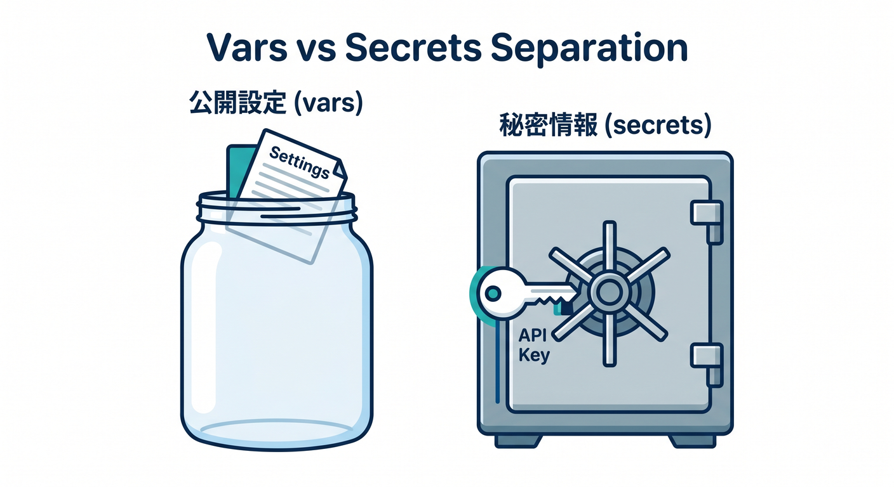
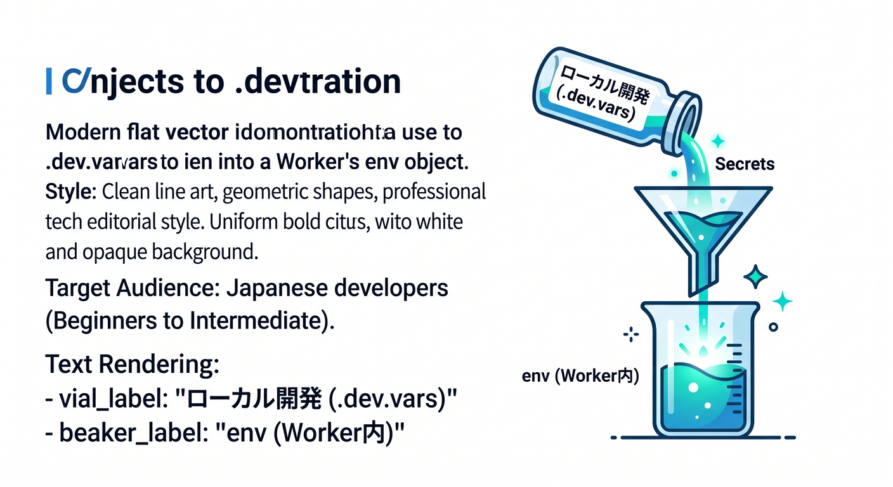
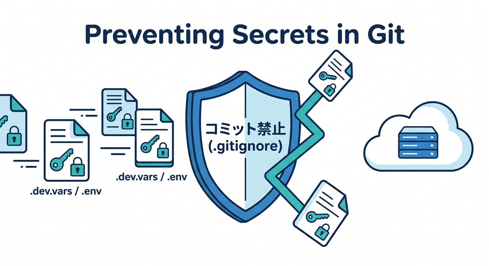
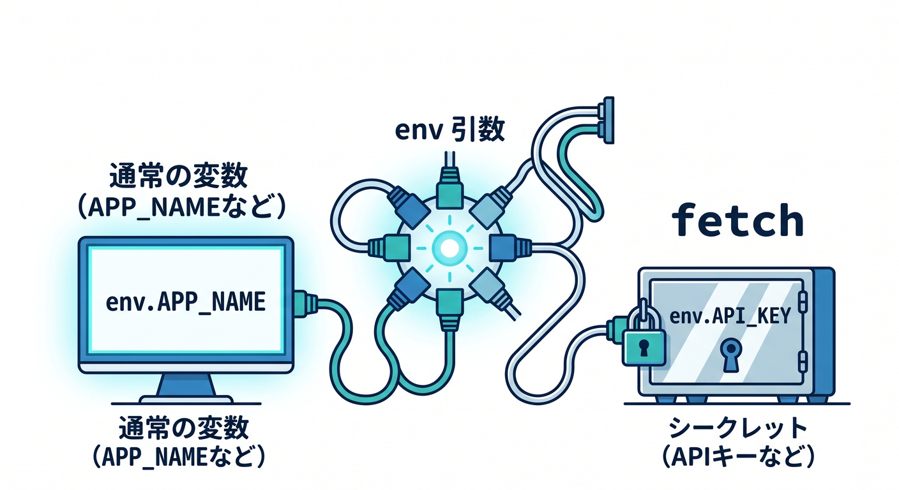
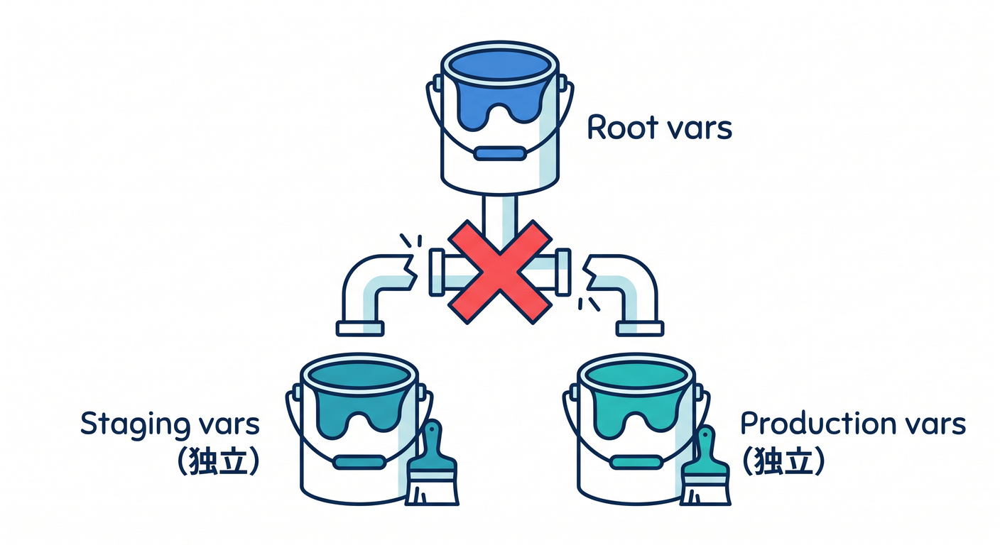
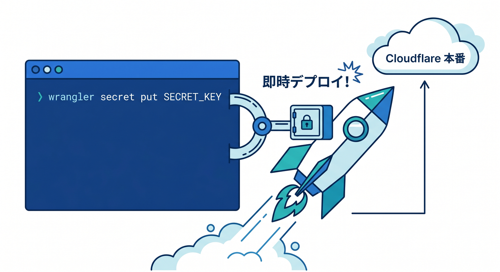
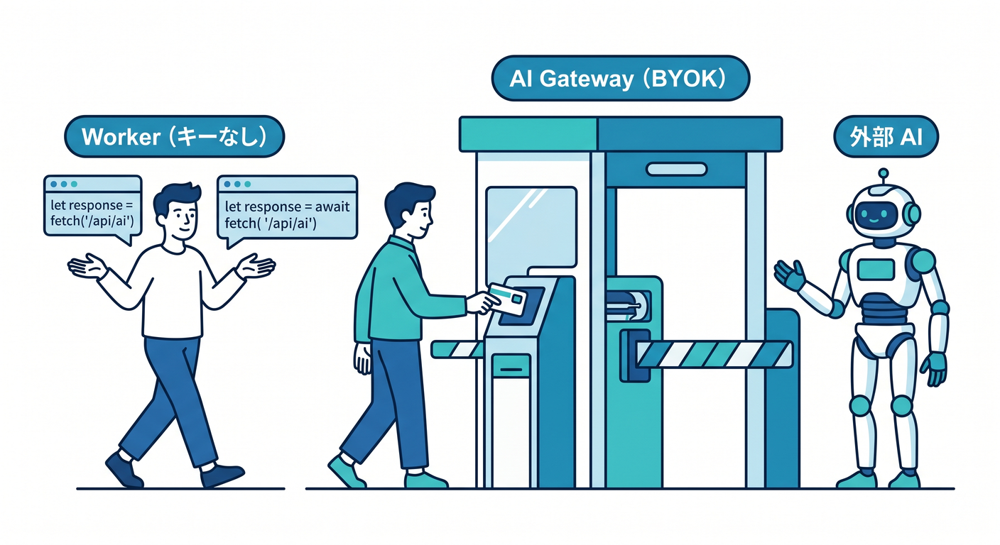

# 第6章　環境変数とローカル secrets を扱おう 🔐🌿☁️
この章のテーマはひとことで言うと、**「どの値を、どこに置くか」を間違えないこと**です 😊
Cloudflare の今の流れでは、設定ファイルは `wrangler.jsonc` が基本で、新しい機能の一部は JSON 設定を前提にしています。さらに、React 系の軽いフロント連携では Cloudflare Vite plugin がすでに GA で、ローカルでも Workers runtime にかなり近い形で動かせます。だからこそ、**設定値・秘密情報・AI連携用の情報を、最初から整理して置く**のがとても大事です。 ([Cloudflare Docs][1])

---

## この章のゴール 🎯
この章を終えるころには、次の4つが自然にできる状態を目指します 🌸

1. **公開してよい設定値**と**秘密にすべき値**を分けられる
2. ローカルでは `.dev.vars` または `.env` を使って安全に試せる
3. 環境ごとに `staging` と `production` を切り替えられる
4. Workers AI や AI Gateway のような AI 機能にも、無理なくつなげられる ([Cloudflare Docs][2])

---

## まず最初に覚えたい結論 ✨
初心者さん向けに、まずはこの整理で十分です 👍

* **公開してもよい設定値**
  → `wrangler.jsonc` の `vars`
* **ローカルだけで使う秘密情報**
  → `.dev.vars` か `.env`
* **本番・ステージングで使う秘密情報**
  → `wrangler secret put`
* **AIプロバイダの鍵をアプリから隠したい**
  → Cloudflare の Secrets Store や AI Gateway の BYOK

Cloudflare 公式も、**機密情報を `vars` に入れないこと**、**ローカルでは `.dev.vars` / `.env` を使うこと**、**本番では secrets を使うこと**をはっきり案内しています。 ([Cloudflare Docs][3])

---

## 1. `vars` と secrets の違いをやさしく整理しよう 🧠
Cloudflare では、Worker の中からはどちらも `env` 経由で見えます。
でも、意味はまったく同じではありません。


* `vars` は、**公開されても困らない設定値**向きです
  例：`APP_NAME`、`APP_ENV`、`FEATURE_FLAG`
* secrets は、**見られると困る値**向きです
  例：APIキー、DBパスワード、外部AIサービスのトークン

公式ドキュメントでも、**secret も実体としては environment variable だが、値が Wrangler やダッシュボードに見えない形で扱われる**と説明されています。つまり、**コードから見ると似ているけれど、保護のされ方が違う**と考えるのがコツです。 ([Cloudflare Docs][4])

---

## 2. いちばん最初に作るべき形 📦
この章では、まずこんな最小構成で進めるのがおすすめです 🌱

### `wrangler.jsonc`
```jsonc
{
  "$schema": "./node_modules/wrangler/config-schema.json",
  "name": "chapter-06-secret-lab",
  "main": "src/index.ts",
  "compatibility_date": "2026-04-15",

  "vars": {
    "APP_NAME": "Secret Lab",
    "APP_ENV": "development"
  },

  "ai": {
    "binding": "AI"
  },

  "secrets": {
    "required": ["WEATHER_API_KEY"]
  }
}
```

この形にしておくと、`APP_NAME` や `APP_ENV` は普通の設定値として扱えますし、`WEATHER_API_KEY` は秘密情報として分離できます。
また、`ai.binding` を入れておくと、あとで Workers AI を `env.AI` から呼びやすくなります。さらに、2026年3月に追加された `secrets.required` を使うと、**必要な secret 名を明示でき、ローカル開発・デプロイ・型生成の基準にもできます**。ただしこの `secrets` 設定は現時点で experimental 扱いです。 ([Cloudflare Docs][1])

---

## 3. ローカル秘密情報は `.dev.vars` か `.env` に置く 🔐
Cloudflare のローカル開発では、`.dev.vars` と `.env` のどちらかを使えます。
でも、**両方を混ぜる前提では考えない**ほうがわかりやすいです 😊

### `.dev.vars`
```dotenv
WEATHER_API_KEY="your-local-key"
```

### `.env`
```dotenv
WEATHER_API_KEY="your-local-key"
```


ここで大事なのは、**`.dev.vars` を置いた場合、`.env` 側の値は `env` オブジェクトに入らない**という点です。
つまり、最初の学習では **「Cloudflare 用なら `.dev.vars` を使う」** と決めてしまうのがかなり安全です。React や Vite の文化で `.env` に慣れている人は、後から使い分けを覚えれば大丈夫です。 ([Cloudflare Docs][2])

---

## 4. Git に入れてはいけないもの 🚫📁
`.dev.vars*` と `.env*` は Git にコミットしないようにします。
Cloudflare 公式も、これらは `.gitignore` に追加するよう案内しています。ここを忘れると、**GitHub に API キーを置いてしまう事故**が起きやすいです 😱 ([Cloudflare Docs][5])


### `.gitignore`
```gitignore
.dev.vars*
.env*
```

---

## 5. Worker 側ではどう読むの？ 👀
Worker からは `env` 経由で読めます。
初心者さんはまず、**「設定値も secret も、読む書き方は似ている」**と覚えればOKです。

### `src/index.ts`
```ts
export interface Env {
  APP_NAME: string;
  APP_ENV: string;
  WEATHER_API_KEY: string;
  AI: Ai;
}

export default {
  async fetch(request: Request, env: Env): Promise<Response> {
    const url = new URL(request.url);

    if (url.pathname === "/check") {
      return Response.json({
        app: env.APP_NAME,
        env: env.APP_ENV,
        hasWeatherKey: Boolean(env.WEATHER_API_KEY)
      });
    }

    if (url.pathname === "/ai") {
      const result = await env.AI.run("@cf/meta/llama-3.1-8b-instruct", {
        prompt: "Cloudflare Workers の env を初心者向けに一言で説明して"
      });

      return Response.json(result);
    }

    return new Response("OK");
  }
} satisfies ExportedHandler<Env>;
```


ここでのポイントは、`APP_NAME` みたいな通常設定も、`WEATHER_API_KEY` のような秘密情報も、実行時には `env` から読めることです。
一方で、AI については `env.AI` のような **binding** でつなぐのが Cloudflare らしい流れです。AI を使うたびに API キーを自前で埋め込む、という発想から少し離れるのがコツです。 ([Cloudflare Docs][4])

---

## 6. 環境ごとの切り替えで混乱しないコツ 🌍
ここは超つまずきポイントです 💡

Cloudflare では `vars` は **non-inheritable** です。
つまり、`staging` や `production` を作ったら、**その環境ごとに必要な値を書き直す**意識が必要です。上位の `vars` が自動で全部引き継がれると思うと、ここで混乱します。 ([Cloudflare Docs][2])


### 例：`wrangler.jsonc`
```jsonc
{
  "$schema": "./node_modules/wrangler/config-schema.json",
  "name": "chapter-06-secret-lab",
  "main": "src/index.ts",
  "compatibility_date": "2026-04-15",

  "vars": {
    "APP_ENV": "development"
  },

  "env": {
    "staging": {
      "vars": {
        "APP_ENV": "staging"
      }
    },
    "production": {
      "vars": {
        "APP_ENV": "production"
      }
    }
  }
}
```

Wrangler では `--env` または `-e` で環境を切り替えます。
たとえばローカル確認なら `npx wrangler dev -e=staging`、デプロイなら `npx wrangler deploy -e=staging` という流れです。 ([Cloudflare Docs][3])

---

## 7. `.dev.vars.staging` と `.env.staging` の違いを理解しよう 🧩
これもかなり大事です。

Cloudflare では、環境別ファイルとして `.dev.vars.staging` や `.env.staging` を使えます。
ただし挙動が少し違います。

* `.dev.vars.staging` があると、**`.dev.vars` は読み込まれません**
* `.env` 系は、**複数ファイルがマージ**されます
* `.env` の優先順位は
  `.env.<environment>.local` → `.env.local` → `.env.<environment>` → `.env`

つまり、**完全に環境を分けたいなら `.dev.vars` 系**、
**共通値を残しつつ一部だけ上書きしたいなら `.env` 系** が向いています。学習初期は `.dev.vars` のほうが事故が少ないです。 ([Cloudflare Docs][3])

---

## 8. `.env` の読み込みを調整する仕組みもある 🛠️
今の Cloudflare では、ローカル開発中の `.env` の読み方を環境変数で制御できます。

* `CLOUDFLARE_LOAD_DEV_VARS_FROM_DOT_ENV="false"`
  → `.env` からローカル変数を読ませない
* `CLOUDFLARE_INCLUDE_PROCESS_ENV="true"`
  → 条件付きで process 環境変数もローカル変数として含める

ただし後者は、`.dev.vars` が無いことなど条件があります。
また、`secrets.required` を使うと、その定義済み secret 名を基準に読み込みや検証を行いやすくなります。Windows の PowerShell では、たとえば次のように設定できます。 ([Cloudflare Docs][5])

```powershell
$env:CLOUDFLARE_LOAD_DEV_VARS_FROM_DOT_ENV="false"
npx wrangler dev
```

---

## 9. 本番の secret は `wrangler secret put` で入れる 🔒
ローカルでは `.dev.vars` で十分ですが、本番やステージングではそれとは別に secret を設定します。
Cloudflare 公式では `wrangler secret put` が基本です。しかもこのコマンドは、**新しい Worker バージョンを作ってそのまま即時デプロイ**します。そこは見落としやすいので要注意です。 ([Cloudflare Docs][4])


例：

```bash
npx wrangler secret put WEATHER_API_KEY
```

運用が少し進んで gradual deployments を使う段階になると、`wrangler versions secret put` も選べます。
でも第6章では、まず **「ローカル secret と、本番 secret は置き場所が違う」** と理解できれば十分です。 ([Cloudflare Docs][4])

---

## 10. AI を絡めると、この章の価値が一気に上がる 🤖✨
Cloudflare の AI 機能を使い始めると、環境変数と secrets の整理がいっそう大事になります。

### Workers AI の場合
Workers AI は Worker から **binding** で呼べます。
つまり `env.AI.run()` を使う流れなら、外部AIサービスみたいに「毎回 API キーを自分でコードへ埋める」発想をかなり減らせます。さらに AI Gateway と組み合わせると、**分析・キャッシュ・セキュリティ**も付けやすいです。 ([Cloudflare Docs][6])

### AI Gateway を binding で使う場合
Cloudflare 公式では、Worker から binding 経由で AI Gateway を使うと、`cf-aig-authorization` ヘッダーを手動で付けなくてよいと説明しています。**binding 経由のリクエストは同一アカウント内で事前認証される**ためです。これは初心者にとってかなりうれしいポイントです。 ([Cloudflare Docs][7])


### 外部AIプロバイダの鍵を隠したい場合
AI Gateway の BYOK を使うと、AI プロバイダの API キーを Cloudflare ダッシュボード側へ安全に保存でき、キーは Secrets Store で扱われます。Cloudflare 自身も、**コードや環境変数からハードコードした API キーを取り除く**流れを案内しています。 ([Cloudflare Docs][8])

---

## 11. React / Vite を使うときの考え方 🌈
この教材は Cloudflare が主役ですが、React と軽く組み合わせるなら Vite plugin の理解もあると楽です。
Cloudflare Vite plugin は workerd にかなり近い形で動作し、Cloudflare environment の選択には `CLOUDFLARE_ENV` を使います。`vite dev` や `vite build` ではこれが効きますが、`vite preview` や `wrangler deploy` に付けても意味はありません。 ([Cloudflare Docs][9])

なので、覚え方はこんな感じで大丈夫です 😊

* **Wrangler で開発**するなら → `--env staging`
* **Vite plugin で開発**するなら → `CLOUDFLARE_ENV=staging`

この切り分けができるだけで、React 側と Cloudflare 側の環境設定がかなり整理されます。 ([Cloudflare Docs][3])

---

## 12. VS Code と GitHub Copilot をどう使うとよい？ 💬🧠
この章では、Copilot には「直してもらう」より、**整理してもらう**使い方が向いています ✨

たとえばこんな聞き方が有効です。

* 「この `wrangler.jsonc` で secret と vars の役割を説明して」
* 「なぜ `env.WEATHER_API_KEY` が undefined になるか候補を3つ出して」
* 「`.dev.vars` と `.env` の違いを初心者向けに要約して」

GitHub 側では、Copilot と MCP の連携が進んでおり、GitHub MCP server は VS Code からリモート構成で使う方法が案内されています。Cloudflare 側も OAuth で接続できる managed remote MCP servers を用意しています。つまり、**2026年の開発体験は、設定理解と AI 補助がかなり近いところまで来ている**と言えます。 ([GitHub Docs][10])

ただし、ここで大事なのはひとつだけです。
**secret の実値そのものを AI チャットへ貼らない**ことです 🙅‍♂️
エラーメッセージや設定構造を見せるのはよいですが、値は伏せて相談する癖をつけましょう。

---

## 13. 初心者がやりがちなミス集 😵‍💫➡️🙂
### ミス1：APIキーを `wrangler.jsonc` の `vars` に書く
これは NG です。`vars` は秘密情報向きではありません。 ([Cloudflare Docs][3])

### ミス2：`.dev.vars` と `.env` を同時に使って混乱する
第6章のうちは、**どちらか片方に寄せる**のがおすすめです。Cloudflare 公式も `.dev.vars` を定義した場合は `.env` が `env` に入らないと案内しています。 ([Cloudflare Docs][2])

### ミス3：`staging` を作ったのに `vars` を書き忘れる
`vars` は non-inheritable なので、自動で全部引き継がれる感覚でいるとハマります。 ([Cloudflare Docs][2])

### ミス4：`wrangler secret put` を「設定だけ」と思ってしまう
実際には新しい Worker バージョンを作って即時デプロイします。 ([Cloudflare Docs][4])

### ミス5：AI Gateway を使うのにヘッダーや認証の責任範囲を混同する
binding 経由なら、`cf-aig-authorization` を毎回手で付けなくてよいケースがあります。 ([Cloudflare Docs][7])

---

## 14. この章の演習課題 ✍️🧪
### 演習1　ローカル secret の確認
`.dev.vars` に `WEATHER_API_KEY="dummy"` を書き、`/check` へアクセスして `hasWeatherKey` が `true` になることを確認する。 ([Cloudflare Docs][5])

### 演習2　環境切り替え
`.dev.vars.staging` を作り、`npx wrangler dev -e=staging` で読み分ける。
`.dev.vars.staging` を作ったら `.dev.vars` が読み込まれないことも確かめる。 ([Cloudflare Docs][3])

### 演習3　AI 連携の入口
`ai.binding` を設定し、`env.AI.run()` で短い文章生成を試す。
「API キーを自前で持たずに AI を呼べる感覚」をつかむ。 ([Cloudflare Docs][1])

### 演習4　デプロイ secret
本番用に `npx wrangler secret put WEATHER_API_KEY` を実行し、ローカル用 secret と本番用 secret が別物であることを理解する。 ([Cloudflare Docs][4])

### 演習5　AI Gateway の発展課題
外部AIプロバイダの鍵をアプリから消し、BYOK で管理する設計を文章で説明する。
「なぜ安全なのか」を自分の言葉でまとめる。 ([Cloudflare Docs][8])

---

## 15. この章のまとめ 🌟
第6章で本当に身につけたいのは、難しい暗号や運用の知識ではありません。
**「この値は公開していい？」「ローカルだけ？」「本番だけ？」「Cloudflare の binding で持てる？」と考える癖**です。これがつくと、外部APIでも、DBでも、Workers AI でも、設定で詰まりにくくなります。 ([Cloudflare Docs][3])

ひとことでまとめると、こうです 🪴

* `vars` は公開してよい設定
* `.dev.vars` / `.env` はローカル秘密情報
* `wrangler secret put` は本番秘密情報
* AI は binding や AI Gateway / BYOK を活かす

ここが整理できると、Cloudflare 学習はかなり気持ちよく進みます 😊

必要なら次に続けて、**この第6章をさらに「学習目標・本文・ハンズオン・確認テスト・提出課題」つきの完全教材フォーマット**へ整えて出します。

[1]: https://developers.cloudflare.com/workers/wrangler/configuration/ "Configuration - Wrangler · Cloudflare Workers docs"
[2]: https://developers.cloudflare.com/workers/configuration/environment-variables/ "Environment variables · Cloudflare Workers docs"
[3]: https://developers.cloudflare.com/workers/wrangler/environments/ "Environments · Cloudflare Workers docs"
[4]: https://developers.cloudflare.com/workers/configuration/secrets/ "Secrets · Cloudflare Workers docs"
[5]: https://developers.cloudflare.com/workers/development-testing/environment-variables/ "Environment variables and secrets · Cloudflare Workers docs"
[6]: https://developers.cloudflare.com/ai-gateway/usage/providers/workersai/ "Workers AI · Cloudflare AI Gateway docs"
[7]: https://developers.cloudflare.com/ai-gateway/configuration/authentication/ "Authenticated Gateway · Cloudflare AI Gateway docs"
[8]: https://developers.cloudflare.com/ai-gateway/configuration/bring-your-own-keys/ "BYOK (Store Keys) · Cloudflare AI Gateway docs"
[9]: https://developers.cloudflare.com/workers/vite-plugin/reference/cloudflare-environments/ "Cloudflare Environments · Cloudflare Workers docs"
[10]: https://docs.github.com/en/copilot/concepts/context/mcp "About Model Context Protocol (MCP) - GitHub Docs"
